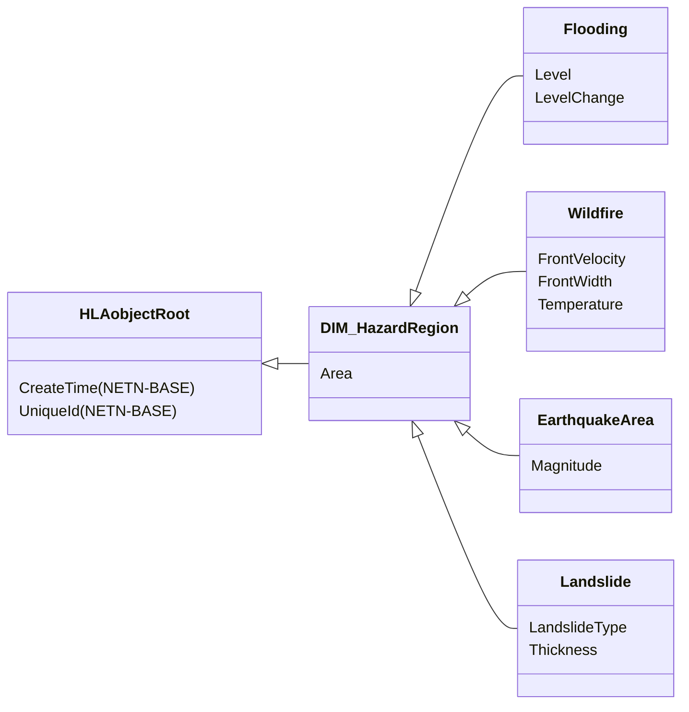
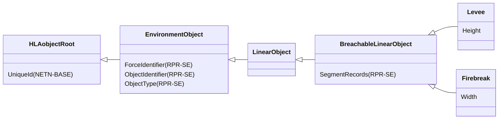
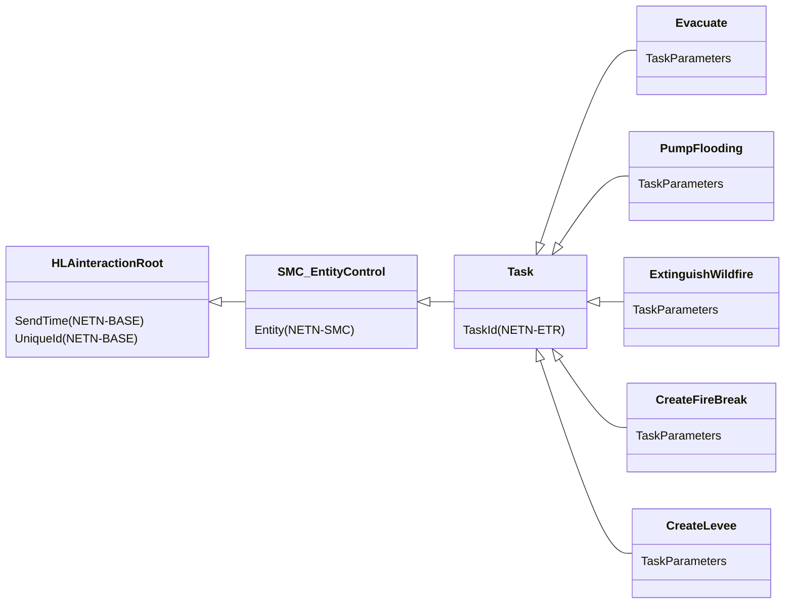
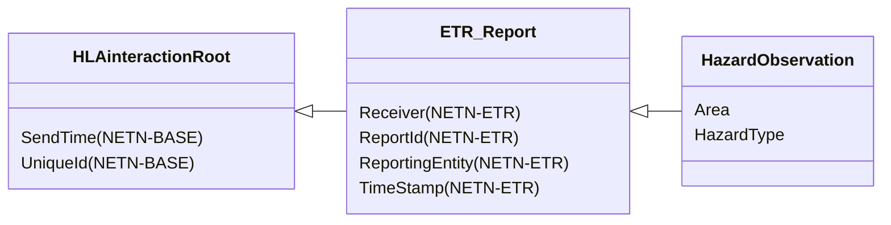
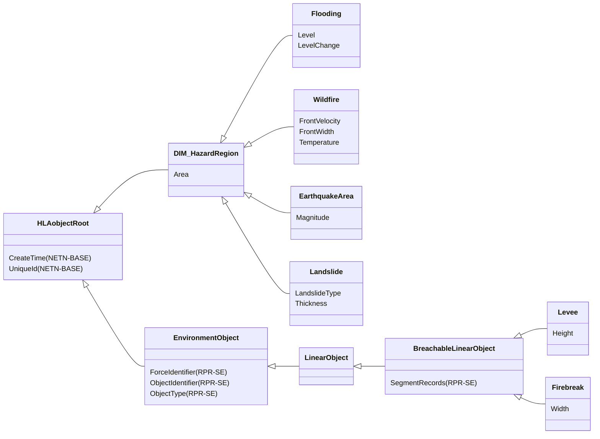
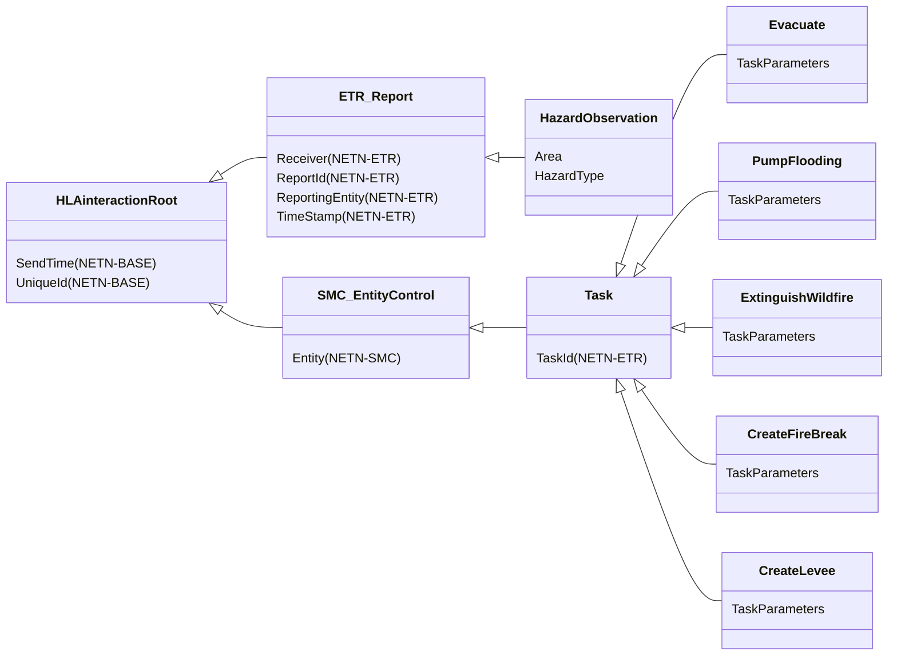

# NETN-DIM
|Version| Date| Dependencies|
|---|---|---|
|1.0|2024-03-05|RPR-SE, NETN-ETR, NETN-BASE|

The NATO Education and Training Network Disaster Module (NETN-DIM) provides a standard interface for representing hazards, e.g. flooding and wildfire, in federated distributed simulation environments.

Hazards such as wildfires, flooding, earthquakes, and landslides have different effects in a synthetic environment and on the simulated entities. Furthermore, hazard observation reporting and activities to mitigate the effects of hazards are important aspects of simulations where hazards are part of the scenario.

## Overview 
 
The NETN-DIM introduces the `DIM_HazardRegion` object class to represent areas affected by different types of disasters 
 

 
The module also extends the RPR-SE `BreachableLinearObject` class by defining `Levee` and `Firebreak` objects for mitigation and the prevention of effects caused by `Flooding` and `Wildfire`, respectively. 
 

 
## Tasking and Reporting 
 
The NETN-DIM module extends the NETN-ETR `Task` and `ETR_Report` interaction classes to provide task control actions for several disaster mitigation actions. 
 

 
A simulated entity observing a hazard uses the NETN-ETR `ETR_Report` subclass `HazardObservation` to send an observation report. 
 

## Object Classes

### DIM_HazardRegion

Use the `DIM_HazardRegion` object to represent a hazard in a synthetic environment.

|Attribute|Datatype|Semantics|
|---|---|---|
|Area|GeodeticPolygon|Required: Geographical boundary of the HazardRegion.|
|CreateTime (NETN-BASE)|EpochTime|Optional: The time in the scenario when the object is created.| 
|UniqueId (NETN-BASE)|UUID|Required. A unique identifier for the object. The Universally Unique Identifier (UUID) is generated or pre-defined.| 

### Flooding

Representation of a flooded area.

|Attribute|Datatype|Semantics|
|---|---|---|
|Area|GeodeticPolygon|Required: Geographical boundary of the HazardRegion.|
|Level|MeterFloat32|Required: FloodingLevel represents the water level of the flooding relative to the Mean Sea Level (MSL).|
|LevelChange|LevelChangeMeterPerSecondFloat32|Optional: The water level change over time.|
|CreateTime (NETN-BASE)|EpochTime|Optional: The time in the scenario when the object is created.| 
|UniqueId (NETN-BASE)|UUID|Required. A unique identifier for the object. The Universally Unique Identifier (UUID) is generated or pre-defined.| 

### Wildfire

Use the `Wildfire` object to represent a wildfire that may spread.

|Attribute|Datatype|Semantics|
|---|---|---|
|Area|GeodeticPolygon|Required: Geographical boundary of the HazardRegion.|
|FrontVelocity|VelocityMeterPerSecondFloat32|Optional: The spread velocity of the front line. The Default = 0.|
|FrontWidth|MeterFloat32|Required: Indicates the thickness of the actual fire ring surrounding a no longer burning region. The assumption is that a fire starts at one or more locations and then spreads in a circular shape with a fire front of a certain thickness and burnt land behind the front line. The Area attribute defines the outer boundary of the overall region, and the front of the flames is assumed to extend from the boundary into the region.|
|Temperature|TemperatureDegreeCelsiusFloat32|Optional: The temperature in the front line.|
|CreateTime (NETN-BASE)|EpochTime|Optional: The time in the scenario when the object is created.| 
|UniqueId (NETN-BASE)|UUID|Required. A unique identifier for the object. The Universally Unique Identifier (UUID) is generated or pre-defined.| 

### EarthquakeArea

Use the `EarhquakeArea` object to represent an area affected by an earthquake.

|Attribute|Datatype|Semantics|
|---|---|---|
|Area|GeodeticPolygon|Required: Geographical boundary of the HazardRegion.|
|Magnitude|RichterScale|Required: Richter magnitude scale.|
|CreateTime (NETN-BASE)|EpochTime|Optional: The time in the scenario when the object is created.| 
|UniqueId (NETN-BASE)|UUID|Required. A unique identifier for the object. The Universally Unique Identifier (UUID) is generated or pre-defined.| 

### Landslide

Use the `Landslide` object to represent a landslide area covered by mud, snow or gravel.

|Attribute|Datatype|Semantics|
|---|---|---|
|Area|GeodeticPolygon|Required: Geographical boundary of the HazardRegion.|
|LandslideType|LandslideTypeEnum|Optional: The type of landslide material. Default = 0.|
|Thickness|MeterFloat32|Required: Thickness in meter.|
|CreateTime (NETN-BASE)|EpochTime|Optional: The time in the scenario when the object is created.| 
|UniqueId (NETN-BASE)|UUID|Required. A unique identifier for the object. The Universally Unique Identifier (UUID) is generated or pre-defined.| 

### Levee

A levee is a wall/separator that protects an area from flooding.

|Attribute|Datatype|Semantics|
|---|---|---|
|Height|MeterFloat32|Required: Max height over Mean-Sea Level that this levee protects against flooding.|
|CreateTime (NETN-BASE)|EpochTime|Optional: The time in the scenario when the object is created.| 
|ForceIdentifier (RPR-SE)|ForceIdentifierEnum8|Required. Identifies the force that created or modified this EnvironmentObject instance| 
|ObjectIdentifier (RPR-SE)|EntityIdentifierStruct|Required. Identifies this EnvironmentObject instance (point, linear or areal)| 
|ObjectType (RPR-SE)|EnvironmentObjectTypeStruct|Required. Identifies the type of this EnvironmentObject instance| 
|SegmentRecords (RPR-SE)|BreachableSegmentStructLengthlessArray|Required. Specifies a breachable linear object| 
|UniqueId (NETN-BASE)|UUID|Required. A unique identifier for the object. The Universally Unique Identifier (UUID) is generated or pre-defined.| 

### Firebreak

A firebreak is a corridor without any burning things. The firebreak should separate the burning part from the not burning part.

|Attribute|Datatype|Semantics|
|---|---|---|
|Width|MeterFloat32|Required: Width of the firebreak.|
|CreateTime (NETN-BASE)|EpochTime|Optional: The time in the scenario when the object is created.| 
|ForceIdentifier (RPR-SE)|ForceIdentifierEnum8|Required. Identifies the force that created or modified this EnvironmentObject instance| 
|ObjectIdentifier (RPR-SE)|EntityIdentifierStruct|Required. Identifies this EnvironmentObject instance (point, linear or areal)| 
|ObjectType (RPR-SE)|EnvironmentObjectTypeStruct|Required. Identifies the type of this EnvironmentObject instance| 
|SegmentRecords (RPR-SE)|BreachableSegmentStructLengthlessArray|Required. Specifies a breachable linear object| 
|UniqueId (NETN-BASE)|UUID|Required. A unique identifier for the object. The Universally Unique Identifier (UUID) is generated or pre-defined.| 

## Interaction Classes

### HazardObservation

Observation of a dangerous area.

|Parameter|Datatype|Semantics|
|---|---|---|
|Area|LocationStructArray|Required: The estimated area affected by the hazard.|
|HazardType|HazardTypeEnum|Required: The type of hazard observed.|
|Receiver (NETN-ETR)|UUID|Optional: The indended receiver of the message if directed to a specific unit or simulated entity. If not provided, the report is modeled as broadcasted on the entity's default C2 or Battle Management System network.| 
|ReportId (NETN-ETR)|UUID|Required: Unique identifier for the report itself.| 
|ReportingEntity (NETN-ETR)|UUID|Required: The entity sending the report.| 
|SendTime (NETN-BASE)|EpochTime|Optional: Scenario time when the interaction was sent. Default is interpreted as the receivers scenario time when the interaction is received. Required for all ETR related interactions.| 
|TimeStamp (NETN-ETR)|EpochTime|Required: The time when the report was created.| 
|UniqueId (NETN-BASE)|UUID|Optional: A unique identifier for the interaction. Required for all ETR related interactions.| 

### Evacuate

A request for evacuation

|Parameter|Datatype|Semantics|
|---|---|---|
|TaskParameters|EvacuateTaskStruct|Required: Task parameters.|
|Entity (NETN-SMC)|UUID|Required: Reference to a simulation entity for which the control action is intended. Required for all ETR related interactions.| 
|SendTime (NETN-BASE)|EpochTime|Optional: Scenario time when the interaction was sent. Default is interpreted as the receivers scenario time when the interaction is received. Required for all ETR related interactions.| 
|TaskId (NETN-ETR)|UUID|Required. Unique identifier for the task.| 
|UniqueId (NETN-BASE)|UUID|Optional: A unique identifier for the interaction. Required for all ETR related interactions.| 

### PumpFlooding

Task an entity to start pumping water out of an area.

|Parameter|Datatype|Semantics|
|---|---|---|
|TaskParameters|PumpFloodingTaskStruct|Required: Task parameters.|
|Entity (NETN-SMC)|UUID|Required: Reference to a simulation entity for which the control action is intended. Required for all ETR related interactions.| 
|SendTime (NETN-BASE)|EpochTime|Optional: Scenario time when the interaction was sent. Default is interpreted as the receivers scenario time when the interaction is received. Required for all ETR related interactions.| 
|TaskId (NETN-ETR)|UUID|Required. Unique identifier for the task.| 
|UniqueId (NETN-BASE)|UUID|Optional: A unique identifier for the interaction. Required for all ETR related interactions.| 

### ExtinguishWildfire

Task an entity to extinguish a wildfire.

|Parameter|Datatype|Semantics|
|---|---|---|
|TaskParameters|ExtinguishWildfireTaskStruct|Required: Task parameters.|
|Entity (NETN-SMC)|UUID|Required: Reference to a simulation entity for which the control action is intended. Required for all ETR related interactions.| 
|SendTime (NETN-BASE)|EpochTime|Optional: Scenario time when the interaction was sent. Default is interpreted as the receivers scenario time when the interaction is received. Required for all ETR related interactions.| 
|TaskId (NETN-ETR)|UUID|Required. Unique identifier for the task.| 
|UniqueId (NETN-BASE)|UUID|Optional: A unique identifier for the interaction. Required for all ETR related interactions.| 

### CreateFireBreak

Use the `CreateFireBreak` task to request an entity to build a firebreak.

|Parameter|Datatype|Semantics|
|---|---|---|
|TaskParameters|CreateFireBreakTaskStruct|Required: Task parameters.|
|Entity (NETN-SMC)|UUID|Required: Reference to a simulation entity for which the control action is intended. Required for all ETR related interactions.| 
|SendTime (NETN-BASE)|EpochTime|Optional: Scenario time when the interaction was sent. Default is interpreted as the receivers scenario time when the interaction is received. Required for all ETR related interactions.| 
|TaskId (NETN-ETR)|UUID|Required. Unique identifier for the task.| 
|UniqueId (NETN-BASE)|UUID|Optional: A unique identifier for the interaction. Required for all ETR related interactions.| 

### CreateLevee

Use the `CreateLevee` task to request an entity to construct a levee.

|Parameter|Datatype|Semantics|
|---|---|---|
|TaskParameters|CreateLeveeTaskStruct|Required: Task parameters.|
|Entity (NETN-SMC)|UUID|Required: Reference to a simulation entity for which the control action is intended. Required for all ETR related interactions.| 
|SendTime (NETN-BASE)|EpochTime|Optional: Scenario time when the interaction was sent. Default is interpreted as the receivers scenario time when the interaction is received. Required for all ETR related interactions.| 
|TaskId (NETN-ETR)|UUID|Required. Unique identifier for the task.| 
|UniqueId (NETN-BASE)|UUID|Optional: A unique identifier for the interaction. Required for all ETR related interactions.| 

## Datatypes

Note that only datatypes defined in this FOM Module are listed below. Please refer to FOM Modules on which this module depends for other referenced datatypes.

### Overview
|Name|Semantics|
|---|---|
|CreateFireBreakTaskStruct|Task-specific data.|
|CreateLeveeTaskStruct|Task-specific data.|
|EntityControlActionEnum|Enumeration of Entity Control Actions. The datatype is expected to be extended in specific modules defining additional actions.|
|EvacuateProgressStruct|Task-specific data.|
|EvacuateTaskStruct|Task-specific data.|
|ExtinguishWildfireTaskStruct|Task-specific data.|
|HazardTypeEnum|Different types of hazards.|
|LandslideTypeEnum|The type of landslide material.|
|LevelChangeMeterPerSecondFloat32|Change of the water level over time.|
|PumpFloodingTaskStruct|Task-specific data.|
|RichterScale|Richter magnitude is measured in energy (ergs): M=log10 (A/A0), where A=amplitude on a seismograph, and A0=1/1,000 millimeters. Each increase of 1 in Richter magnitude represents a 31-fold increase in released energy.|
|TaskDefinitionVariantRecord|Variant record for task definition data.|
|TaskProgressVariantRecord|Variant record for task progress data.|
        
### Simple Datatypes
|Name|Units|Semantics|
|---|---|---|
|LevelChangeMeterPerSecondFloat32|meter per second (m/s)|Change of the water level over time.|
|RichterScale|ergs|Richter magnitude is measured in energy (ergs): M=log10 (A/A0), where A=amplitude on a seismograph, and A0=1/1,000 millimeters. Each increase of 1 in Richter magnitude represents a 31-fold increase in released energy.|
        
### Enumerated Datatypes
|Name|Representation|Semantics|
|---|---|---|
|EntityControlActionEnum|HLAinteger32BE|Enumeration of Entity Control Actions. The datatype is expected to be extended in specific modules defining additional actions.|
|HazardTypeEnum|HLAinteger16BE|Different types of hazards.|
|LandslideTypeEnum|HLAinteger16BE|The type of landslide material.|
        
### Fixed Record Datatypes
|Name|Fields|Semantics|
|---|---|---|
|CreateFireBreakTaskStruct|Duration|Task-specific data.|
|CreateLeveeTaskStruct|Duration|Task-specific data.|
|EvacuateProgressStruct|Amount, Time|Task-specific data.|
|EvacuateTaskStruct|Area, EntityType, Amount, Duration|Task-specific data.|
|ExtinguishWildfireTaskStruct|Wildfire, Duration|Task-specific data.|
|PumpFloodingTaskStruct|Flooding, Duration|Task-specific data.|
        
### Variant Record Datatypes
|Name|Discriminant (Datatype)|Alternatives|Semantics|
|---|---|---|---|
|TaskDefinitionVariantRecord|TaskType (EntityControlActionEnum)|PumpFlooding, ExtinguishWildfire, Evacuate, CreateFireBreak, CreateLevee|Variant record for task definition data.|
|TaskProgressVariantRecord|TaskType (EntityControlActionEnum)|DIM_Duration, DIM_Evacuate|Variant record for task progress data.|
    