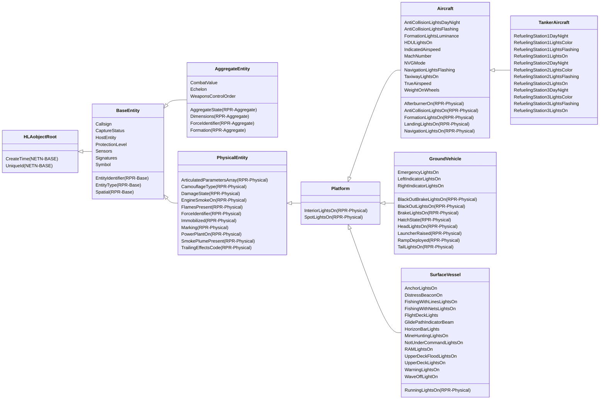

# NETN-ENTITY
|Version| Date| Dependencies|
|---|---|---|
|v3.0|2024-03-09|NETN-BASE, RPR-Base, RPR-Physical, RPR-Aggregate, MIM|

The NETN-ENTITY FOM Module provides a standard interface for representing simulation entities in a federated distributed simulation. The module extends the RPR-FOM standard SISO-STD-001-2015 with additional attributes for simulated physical and aggregated entities.

For backward compatibility, published objects should include all required RPR-FOM attributes.

## Overview

The NETN-ENTITY module extends the RPR-FOM `BaseEntity` object class with optional attributes available for all physical and aggregate entity objects. In addition, the RPR-FOM `AggregateEntity` object class is extended with additional attributes.

The module extends the RPR-FOM Platform, Aircraft, and SurfaceVessel with light-related attributes.

A TankerAircraft object class extends the Aircraft object class as a new subclass.

            

## Object Classes

### BaseEntity

A base class of aggregate and discrete scenario domain participants. The BaseEntity class is characterized by being located at a particular location in space and independently movable, if capable of movement at all. It specifically excludes elements normally considered to be a component of another element. The BaseEntity class is intended to be a container for common attributes for entities of this type. Since it lacks sufficient class specific attributes that are required for simulation purposes, federates cannot publish objects of this class. Certain simulation management federates, e.g. viewers, may subscribe to this class. Simulation federates will normally subscribe to one of the subclasses, to gain the extra information required to properly simulate the entity.

|Attribute|Datatype|Semantics|
|---|---|---|
|Callsign|HLAunicodeString|Optional: The callsign is a unique-designator. Use the RPR-FOM `PhysicalEntity` attribute `Marking` or the `AggregateEntity` attribute `AggregateMarking` as default value. Max length 21 characters.|
|CaptureStatus|CaptureStatusEnum8|Optional: The status of an entity's level of control or influence over its activities. The Default is 0 = Other.|
|HostEntity|UUID|Optional. Reference to the simulation entity this platform is mounted on or embedded in. Default is all zeros.|
|ProtectionLevel|PercentFloat32|Optional. An entity's additional level of protection against the effects of weapons fire. E.g., cover, fortification, etc. Default is 0 = fully affected by weapon fire.|
|Sensors|ArrayOfSensor|Optional: A set of sensors associated with the entity. Default is No sensors = Empty.|
|Signatures|ArrayOfSignature|Optional: A set of signatures to characterize this entity's susceptibility to detection. Default is No Signatures = Empty.|
|Symbol|SymbolStruct|Optional. A symbol identifier and additional amplification. Derive default value based on `EntityType`.|
|CreateTime (NETN-BASE)||| 
|EntityIdentifier (RPR-Base)|EntityIdentifierStruct|The unique identifier for the entity instance.| 
|EntityType (RPR-Base)|EntityTypeStruct|The category of the entity.| 
|Spatial (RPR-Base)|SpatialVariantStruct|Spatial state stored in one variant record attribute.| 
|UniqueId (NETN-BASE)|UUID|Required. A unique identifier for the object. The Universally Unique Identifier (UUID) is generated or pre-defined.| 

### AggregateEntity

A group of one or more separate objects that operate together as part of an organization. These objects may be discrete, may be other aggregate objects, or may be a mixture of both.

|Attribute|Datatype|Semantics|
|---|---|---|
|Callsign|HLAunicodeString|Optional: The callsign is a unique-designator. Use the RPR-FOM `PhysicalEntity` attribute `Marking` or the `AggregateEntity` attribute `AggregateMarking` as default value. Max length 21 characters.|
|CaptureStatus|CaptureStatusEnum8|Optional: The status of an entity's level of control or influence over its activities. The Default is 0 = Other.|
|CombatValue|PercentFloat32|Optional. A summary value of the effectiveness (the level of training, leadership, morale, personnel and equipment operational status). Default is 100%.|
|Echelon|EchelonEnum32|Optional. Use the echelon symbol-modifier to specify the size of the AggregateEntity (level of command). Derive default value based on `EntityType`.|
|HostEntity|UUID|Optional. Reference to the simulation entity this platform is mounted on or embedded in. Default is all zeros.|
|ProtectionLevel|PercentFloat32|Optional. An entity's additional level of protection against the effects of weapons fire. E.g., cover, fortification, etc. Default is 0 = fully affected by weapon fire.|
|Sensors|ArrayOfSensor|Optional: A set of sensors associated with the entity. Default is No sensors = Empty.|
|Signatures|ArrayOfSignature|Optional: A set of signatures to characterize this entity's susceptibility to detection. Default is No Signatures = Empty.|
|Symbol|SymbolStruct|Optional. A symbol identifier and additional amplification. Derive default value based on `EntityType`.|
|WeaponsControlOrder|WeaponControlOrderEnum8|Optional. Describes current Weapon Control Order as Free, Tight, or Hold. Default is 0 = Other.|
|AggregateState (RPR-Aggregate)|AggregateStateEnum8|An indicator of the extent of association of objects form an operating group.| 
|CreateTime (NETN-BASE)||| 
|Dimensions (RPR-Aggregate)|DimensionStruct|The size of the area covered by the units in the aggregate.| 
|EntityIdentifier (RPR-Base)|EntityIdentifierStruct|The unique identifier for the entity instance.| 
|EntityType (RPR-Base)|EntityTypeStruct|The category of the entity.| 
|ForceIdentifier (RPR-Aggregate)|ForceIdentifierEnum8|Optional. The identification of the force that the aggregate belongs to. Default = Other.| 
|Formation (RPR-Aggregate)|FormationEnum32|Optional. The category of positional arrangement of the entities within the aggregate. Default = Other.| 
|Spatial (RPR-Base)|SpatialVariantStruct|Spatial state stored in one variant record attribute.| 
|UniqueId (NETN-BASE)|UUID|Required. A unique identifier for the object. The Universally Unique Identifier (UUID) is generated or pre-defined.| 

### PhysicalEntity

A base class of all discrete platform scenario domain participants.

|Attribute|Datatype|Semantics|
|---|---|---|
|Callsign|HLAunicodeString|Optional: The callsign is a unique-designator. Use the RPR-FOM `PhysicalEntity` attribute `Marking` or the `AggregateEntity` attribute `AggregateMarking` as default value. Max length 21 characters.|
|CaptureStatus|CaptureStatusEnum8|Optional: The status of an entity's level of control or influence over its activities. The Default is 0 = Other.|
|HostEntity|UUID|Optional. Reference to the simulation entity this platform is mounted on or embedded in. Default is all zeros.|
|ProtectionLevel|PercentFloat32|Optional. An entity's additional level of protection against the effects of weapons fire. E.g., cover, fortification, etc. Default is 0 = fully affected by weapon fire.|
|Sensors|ArrayOfSensor|Optional: A set of sensors associated with the entity. Default is No sensors = Empty.|
|Signatures|ArrayOfSignature|Optional: A set of signatures to characterize this entity's susceptibility to detection. Default is No Signatures = Empty.|
|Symbol|SymbolStruct|Optional. A symbol identifier and additional amplification. Derive default value based on `EntityType`.|
|ArticulatedParametersArray (RPR-Physical)|ArticulatedParameterStructLengthlessArray|Optional. Identification of the visible parts, and their states, of the entity which are capable of independent motion. Default = Other.| 
|CamouflageType (RPR-Physical)|CamouflageEnum32|Optional. The type of camouflage in use (if any). Default = Other.| 
|CreateTime (NETN-BASE)||| 
|DamageState (RPR-Physical)|DamageStatusEnum32|Optional. The state of damage of the entity. Default = Other.| 
|EngineSmokeOn (RPR-Physical)|RPRboolean|Optional. Whether the entity's engine is generating smoke or not. Default = Other.| 
|EntityIdentifier (RPR-Base)|EntityIdentifierStruct|The unique identifier for the entity instance.| 
|EntityType (RPR-Base)|EntityTypeStruct|The category of the entity.| 
|FlamesPresent (RPR-Physical)|RPRboolean|Optional. Whether the entity is on fire (with visible flames) or not. Default = Other.| 
|ForceIdentifier (RPR-Physical)|ForceIdentifierEnum8|Optional. The identification of the force that the entity belongs to. Default = Other.| 
|Immobilized (RPR-Physical)|RPRboolean|Optional. Whether the entity is immobilized or not. Default = Other.| 
|Marking (RPR-Physical)|MarkingStruct|Optional. A unique marking or combination of characters used to distinguish the entity from other entities. Default = Other.| 
|PowerPlantOn (RPR-Physical)|RPRboolean|Optional. Whether the entity's power plant is on or not. Default = Other.| 
|SmokePlumePresent (RPR-Physical)|RPRboolean|Optional. Whether the entity is generating smoke or not (intentional or unintentional). Default = Other.| 
|Spatial (RPR-Base)|SpatialVariantStruct|Spatial state stored in one variant record attribute.| 
|TrailingEffectsCode (RPR-Physical)|TrailingEffectsCodeEnum32|Optional. The type and size of any trail that the entity is making. Default = Other.| 
|UniqueId (NETN-BASE)|UUID|Required. A unique identifier for the object. The Universally Unique Identifier (UUID) is generated or pre-defined.| 

### Platform

A physical object under the control of armed forces upon which sensor, communication, or weapon systems may be mounted.

|Attribute|Datatype|Semantics|
|---|---|---|
|Callsign|HLAunicodeString|Optional: The callsign is a unique-designator. Use the RPR-FOM `PhysicalEntity` attribute `Marking` or the `AggregateEntity` attribute `AggregateMarking` as default value. Max length 21 characters.|
|CaptureStatus|CaptureStatusEnum8|Optional: The status of an entity's level of control or influence over its activities. The Default is 0 = Other.|
|HostEntity|UUID|Optional. Reference to the simulation entity this platform is mounted on or embedded in. Default is all zeros.|
|ProtectionLevel|PercentFloat32|Optional. An entity's additional level of protection against the effects of weapons fire. E.g., cover, fortification, etc. Default is 0 = fully affected by weapon fire.|
|Sensors|ArrayOfSensor|Optional: A set of sensors associated with the entity. Default is No sensors = Empty.|
|Signatures|ArrayOfSignature|Optional: A set of signatures to characterize this entity's susceptibility to detection. Default is No Signatures = Empty.|
|Symbol|SymbolStruct|Optional. A symbol identifier and additional amplification. Derive default value based on `EntityType`.|
|ArticulatedParametersArray (RPR-Physical)|ArticulatedParameterStructLengthlessArray|Optional. Identification of the visible parts, and their states, of the entity which are capable of independent motion. Default = Other.| 
|CamouflageType (RPR-Physical)|CamouflageEnum32|Optional. The type of camouflage in use (if any). Default = Other.| 
|CreateTime (NETN-BASE)||| 
|DamageState (RPR-Physical)|DamageStatusEnum32|Optional. The state of damage of the entity. Default = Other.| 
|EngineSmokeOn (RPR-Physical)|RPRboolean|Optional. Whether the entity's engine is generating smoke or not. Default = Other.| 
|EntityIdentifier (RPR-Base)|EntityIdentifierStruct|The unique identifier for the entity instance.| 
|EntityType (RPR-Base)|EntityTypeStruct|The category of the entity.| 
|FlamesPresent (RPR-Physical)|RPRboolean|Optional. Whether the entity is on fire (with visible flames) or not. Default = Other.| 
|ForceIdentifier (RPR-Physical)|ForceIdentifierEnum8|Optional. The identification of the force that the entity belongs to. Default = Other.| 
|Immobilized (RPR-Physical)|RPRboolean|Optional. Whether the entity is immobilized or not. Default = Other.| 
|InteriorLightsOn (RPR-Physical)|RPRboolean|Optional. Whether the entity's internal lights are on or not. Default = False.| 
|Marking (RPR-Physical)|MarkingStruct|Optional. A unique marking or combination of characters used to distinguish the entity from other entities. Default = Other.| 
|PowerPlantOn (RPR-Physical)|RPRboolean|Optional. Whether the entity's power plant is on or not. Default = Other.| 
|SmokePlumePresent (RPR-Physical)|RPRboolean|Optional. Whether the entity is generating smoke or not (intentional or unintentional). Default = Other.| 
|Spatial (RPR-Base)|SpatialVariantStruct|Spatial state stored in one variant record attribute.| 
|SpotLightsOn (RPR-Physical)|RPRboolean|Optional. Whether the entity's spotlights are on or not. Default = False.| 
|TrailingEffectsCode (RPR-Physical)|TrailingEffectsCodeEnum32|Optional. The type and size of any trail that the entity is making. Default = Other.| 
|UniqueId (NETN-BASE)|UUID|Required. A unique identifier for the object. The Universally Unique Identifier (UUID) is generated or pre-defined.| 

### Aircraft

A platform entity that operates mainly in the air, such as aircraft, balloons, etc. This includes the entities when they are on the ground.

|Attribute|Datatype|Semantics|
|---|---|---|
|AntiCollisionLightsDayNight|AppearanceAntiCollisionDayNightEnum8|Optional: Describes the day/night status of the Anti-Collision lights. Default Day=0.|
|AntiCollisionLightsFlashing|AntiCollisionLightFlashingEnum8|Optional: Anti collision light flashing state. Default Steady=0.|
|Callsign|HLAunicodeString|Optional: The callsign is a unique-designator. Use the RPR-FOM `PhysicalEntity` attribute `Marking` or the `AggregateEntity` attribute `AggregateMarking` as default value. Max length 21 characters.|
|CaptureStatus|CaptureStatusEnum8|Optional: The status of an entity's level of control or influence over its activities. The Default is 0 = Other.|
|FormationLightsLuminance|UnsignedInteger8|Optional: Formation lights luminance level. Default = 0.|
|HDULightsOn|RPRboolean|Optional. Whether the HDU Lights are on or not. Hose Drogue Unit (HDU) Lights are used during air-to-air refueling. Default False = 0.|
|HostEntity|UUID|Optional. Reference to the simulation entity this platform is mounted on or embedded in. Default is all zeros.|
|IndicatedAirspeed|VelocityMeterPerSecondFloat32|Optional: The indicated air speed of the aircraft. Default 2.6 m/s|
|MachNumber|MachNumber|Optional: The speed of the aircraft measured in Mach number. Default = 0.1|
|NVGMode|AppearanceNVGModeEnum8|Optional: Describes whether air platform lighting is in covert or overt mode. Default Overt_Lighting = 0.|
|NavigationLightsFlashing|NavigationLightFlashingEnum8|Optional: Navigation lights flashing state. Default Steady=0.|
|ProtectionLevel|PercentFloat32|Optional. An entity's additional level of protection against the effects of weapons fire. E.g., cover, fortification, etc. Default is 0 = fully affected by weapon fire.|
|Sensors|ArrayOfSensor|Optional: A set of sensors associated with the entity. Default is No sensors = Empty.|
|Signatures|ArrayOfSignature|Optional: A set of signatures to characterize this entity's susceptibility to detection. Default is No Signatures = Empty.|
|Symbol|SymbolStruct|Optional. A symbol identifier and additional amplification. Derive default value based on `EntityType`.|
|TaxiwayLightsOn|RPRboolean|Optional: Whether the entity's taxiway lights are on or not. Default False=0.|
|TrueAirspeed|VelocityMeterPerSecondFloat32|Optional: The true air speed of the aircraft. Default = 2.6 m/s|
|WeightOnWheels|RPRboolean|Optional: Describes whether the air platform has weight on its main landing gear. Default True = 1.|
|AfterburnerOn (RPR-Physical)|RPRboolean|Optional. Whether the entity's afterburner is on or not. Default = False.| 
|AntiCollisionLightsOn (RPR-Physical)|RPRboolean|Optional. Whether the entity's anti-collision lights are on or not. Default = False.| 
|ArticulatedParametersArray (RPR-Physical)|ArticulatedParameterStructLengthlessArray|Optional. Identification of the visible parts, and their states, of the entity which are capable of independent motion. Default = Other.| 
|CamouflageType (RPR-Physical)|CamouflageEnum32|Optional. The type of camouflage in use (if any). Default = Other.| 
|CreateTime (NETN-BASE)||| 
|DamageState (RPR-Physical)|DamageStatusEnum32|Optional. The state of damage of the entity. Default = Other.| 
|EngineSmokeOn (RPR-Physical)|RPRboolean|Optional. Whether the entity's engine is generating smoke or not. Default = Other.| 
|EntityIdentifier (RPR-Base)|EntityIdentifierStruct|The unique identifier for the entity instance.| 
|EntityType (RPR-Base)|EntityTypeStruct|The category of the entity.| 
|FlamesPresent (RPR-Physical)|RPRboolean|Optional. Whether the entity is on fire (with visible flames) or not. Default = Other.| 
|ForceIdentifier (RPR-Physical)|ForceIdentifierEnum8|Optional. The identification of the force that the entity belongs to. Default = Other.| 
|FormationLightsOn (RPR-Physical)|RPRboolean|Optional. Whether the entity's formation lights are on or not. Default = False.| 
|Immobilized (RPR-Physical)|RPRboolean|Optional. Whether the entity is immobilized or not. Default = Other.| 
|InteriorLightsOn (RPR-Physical)|RPRboolean|Optional. Whether the entity's internal lights are on or not. Default = False.| 
|LandingLightsOn (RPR-Physical)|RPRboolean|Optional. Whether the entity's landing lights are on or not. Default = False.| 
|Marking (RPR-Physical)|MarkingStruct|Optional. A unique marking or combination of characters used to distinguish the entity from other entities. Default = Other.| 
|NavigationLightsOn (RPR-Physical)|RPRboolean|Optional. Whether the entity's navigation lights are on or not. Default = False.| 
|PowerPlantOn (RPR-Physical)|RPRboolean|Optional. Whether the entity's power plant is on or not. Default = Other.| 
|SmokePlumePresent (RPR-Physical)|RPRboolean|Optional. Whether the entity is generating smoke or not (intentional or unintentional). Default = Other.| 
|Spatial (RPR-Base)|SpatialVariantStruct|Spatial state stored in one variant record attribute.| 
|SpotLightsOn (RPR-Physical)|RPRboolean|Optional. Whether the entity's spotlights are on or not. Default = False.| 
|TrailingEffectsCode (RPR-Physical)|TrailingEffectsCodeEnum32|Optional. The type and size of any trail that the entity is making. Default = Other.| 
|UniqueId (NETN-BASE)|UUID|Required. A unique identifier for the object. The Universally Unique Identifier (UUID) is generated or pre-defined.| 

### TankerAircraft

A tanker aircraft.

|Attribute|Datatype|Semantics|
|---|---|---|
|AntiCollisionLightsDayNight|AppearanceAntiCollisionDayNightEnum8|Optional: Describes the day/night status of the Anti-Collision lights. Default Day=0.|
|AntiCollisionLightsFlashing|AntiCollisionLightFlashingEnum8|Optional: Anti collision light flashing state. Default Steady=0.|
|Callsign|HLAunicodeString|Optional: The callsign is a unique-designator. Use the RPR-FOM `PhysicalEntity` attribute `Marking` or the `AggregateEntity` attribute `AggregateMarking` as default value. Max length 21 characters.|
|CaptureStatus|CaptureStatusEnum8|Optional: The status of an entity's level of control or influence over its activities. The Default is 0 = Other.|
|FormationLightsLuminance|UnsignedInteger8|Optional: Formation lights luminance level. Default = 0.|
|HDULightsOn|RPRboolean|Optional. Whether the HDU Lights are on or not. Hose Drogue Unit (HDU) Lights are used during air-to-air refueling. Default False = 0.|
|HostEntity|UUID|Optional. Reference to the simulation entity this platform is mounted on or embedded in. Default is all zeros.|
|IndicatedAirspeed|VelocityMeterPerSecondFloat32|Optional: The indicated air speed of the aircraft. Default 2.6 m/s|
|MachNumber|MachNumber|Optional: The speed of the aircraft measured in Mach number. Default = 0.1|
|NVGMode|AppearanceNVGModeEnum8|Optional: Describes whether air platform lighting is in covert or overt mode. Default Overt_Lighting = 0.|
|NavigationLightsFlashing|NavigationLightFlashingEnum8|Optional: Navigation lights flashing state. Default Steady=0.|
|ProtectionLevel|PercentFloat32|Optional. An entity's additional level of protection against the effects of weapons fire. E.g., cover, fortification, etc. Default is 0 = fully affected by weapon fire.|
|RefuelingStation1DayNight|RefuelingStationLightDayNightEnum8|Optional: Describes the day/night status of the refueling station lights. Default Day = 0.|
|RefuelingStation1LightsColor|RefuelingStationLightColorEnum8|Optional: Color of the refueling station lights. Default Red = 0.|
|RefuelingStation1LightsFlashing|RPRboolean|Optional: Whether the refueling station lights are flashing. Default Steady = False.|
|RefuelingStation1LightsOn|RPRboolean|Optional: Whether the refueling station lights are on or not. Default Off = False.|
|RefuelingStation2DayNight|RefuelingStationLightDayNightEnum8|Optional: Describes the day/night status of the refueling station lights. Default Day = 0.|
|RefuelingStation2LightsColor|RefuelingStationLightColorEnum8|Optional: Color of the refueling station lights. Default Red = 0.|
|RefuelingStation2LightsFlashing|RPRboolean|Optional: Whether the refueling station lights are flashing. Default Steady = False.|
|RefuelingStation2LightsOn|RPRboolean|Optional: Whether the refueling station lights are on or not. Default Off = False.|
|RefuelingStation3DayNight|RefuelingStationLightDayNightEnum8|Optional: Describes the day/night status of the refueling station lights. Default Day = 0.|
|RefuelingStation3LightsColor|RefuelingStationLightColorEnum8|Optional: Color of the refueling station lights. Default Red = 0.|
|RefuelingStation3LightsFlashing|RPRboolean|Optional: Whether the refueling station lights are flashing. Default Steady = False.|
|RefuelingStation3LightsOn|RPRboolean|Optional: Whether the refueling station lights are on or not. Default Off = False.|
|Sensors|ArrayOfSensor|Optional: A set of sensors associated with the entity. Default is No sensors = Empty.|
|Signatures|ArrayOfSignature|Optional: A set of signatures to characterize this entity's susceptibility to detection. Default is No Signatures = Empty.|
|Symbol|SymbolStruct|Optional. A symbol identifier and additional amplification. Derive default value based on `EntityType`.|
|TaxiwayLightsOn|RPRboolean|Optional: Whether the entity's taxiway lights are on or not. Default False=0.|
|TrueAirspeed|VelocityMeterPerSecondFloat32|Optional: The true air speed of the aircraft. Default = 2.6 m/s|
|WeightOnWheels|RPRboolean|Optional: Describes whether the air platform has weight on its main landing gear. Default True = 1.|
|AfterburnerOn (RPR-Physical)|RPRboolean|Optional. Whether the entity's afterburner is on or not. Default = False.| 
|AntiCollisionLightsOn (RPR-Physical)|RPRboolean|Optional. Whether the entity's anti-collision lights are on or not. Default = False.| 
|ArticulatedParametersArray (RPR-Physical)|ArticulatedParameterStructLengthlessArray|Optional. Identification of the visible parts, and their states, of the entity which are capable of independent motion. Default = Other.| 
|CamouflageType (RPR-Physical)|CamouflageEnum32|Optional. The type of camouflage in use (if any). Default = Other.| 
|CreateTime (NETN-BASE)||| 
|DamageState (RPR-Physical)|DamageStatusEnum32|Optional. The state of damage of the entity. Default = Other.| 
|EngineSmokeOn (RPR-Physical)|RPRboolean|Optional. Whether the entity's engine is generating smoke or not. Default = Other.| 
|EntityIdentifier (RPR-Base)|EntityIdentifierStruct|The unique identifier for the entity instance.| 
|EntityType (RPR-Base)|EntityTypeStruct|The category of the entity.| 
|FlamesPresent (RPR-Physical)|RPRboolean|Optional. Whether the entity is on fire (with visible flames) or not. Default = Other.| 
|ForceIdentifier (RPR-Physical)|ForceIdentifierEnum8|Optional. The identification of the force that the entity belongs to. Default = Other.| 
|FormationLightsOn (RPR-Physical)|RPRboolean|Optional. Whether the entity's formation lights are on or not. Default = False.| 
|Immobilized (RPR-Physical)|RPRboolean|Optional. Whether the entity is immobilized or not. Default = Other.| 
|InteriorLightsOn (RPR-Physical)|RPRboolean|Optional. Whether the entity's internal lights are on or not. Default = False.| 
|LandingLightsOn (RPR-Physical)|RPRboolean|Optional. Whether the entity's landing lights are on or not. Default = False.| 
|Marking (RPR-Physical)|MarkingStruct|Optional. A unique marking or combination of characters used to distinguish the entity from other entities. Default = Other.| 
|NavigationLightsOn (RPR-Physical)|RPRboolean|Optional. Whether the entity's navigation lights are on or not. Default = False.| 
|PowerPlantOn (RPR-Physical)|RPRboolean|Optional. Whether the entity's power plant is on or not. Default = Other.| 
|SmokePlumePresent (RPR-Physical)|RPRboolean|Optional. Whether the entity is generating smoke or not (intentional or unintentional). Default = Other.| 
|Spatial (RPR-Base)|SpatialVariantStruct|Spatial state stored in one variant record attribute.| 
|SpotLightsOn (RPR-Physical)|RPRboolean|Optional. Whether the entity's spotlights are on or not. Default = False.| 
|TrailingEffectsCode (RPR-Physical)|TrailingEffectsCodeEnum32|Optional. The type and size of any trail that the entity is making. Default = Other.| 
|UniqueId (NETN-BASE)|UUID|Required. A unique identifier for the object. The Universally Unique Identifier (UUID) is generated or pre-defined.| 

### GroundVehicle

A platform entity that operates wholly on the surface of the earth.

|Attribute|Datatype|Semantics|
|---|---|---|
|Callsign|HLAunicodeString|Optional: The callsign is a unique-designator. Use the RPR-FOM `PhysicalEntity` attribute `Marking` or the `AggregateEntity` attribute `AggregateMarking` as default value. Max length 21 characters.|
|CaptureStatus|CaptureStatusEnum8|Optional: The status of an entity's level of control or influence over its activities. The Default is 0 = Other.|
|EmergencyLightsOn|RPRboolean|Optional: Whether the entity's emergency lights are on or not. A value of true, indicating that the lights are on, means that the lights begin flashing in accordance with the duty cylce of the model. Default Off = False.|
|HostEntity|UUID|Optional. Reference to the simulation entity this platform is mounted on or embedded in. Default is all zeros.|
|LeftIndicatorLightsOn|RPRboolean|Optional: Whether the entity's left front and left rear indicator lights are on or not.  A value of true, indicating that the lights are on, means that the lights begin flashing in accordance with the duty cylce of the model. Default Off = False.|
|ProtectionLevel|PercentFloat32|Optional. An entity's additional level of protection against the effects of weapons fire. E.g., cover, fortification, etc. Default is 0 = fully affected by weapon fire.|
|RightIndicatorLightsOn|RPRboolean|Optional: Whether the entity's right front and right rear indicator lights are on or not. Default Off = False.|
|Sensors|ArrayOfSensor|Optional: A set of sensors associated with the entity. Default is No sensors = Empty.|
|Signatures|ArrayOfSignature|Optional: A set of signatures to characterize this entity's susceptibility to detection. Default is No Signatures = Empty.|
|Symbol|SymbolStruct|Optional. A symbol identifier and additional amplification. Derive default value based on `EntityType`.|
|ArticulatedParametersArray (RPR-Physical)|ArticulatedParameterStructLengthlessArray|Optional. Identification of the visible parts, and their states, of the entity which are capable of independent motion. Default = Other.| 
|BlackOutBrakeLightsOn (RPR-Physical)|RPRboolean|Optional. Whether the entity's black out brake lights are on or not. Default = False.| 
|BlackOutLightsOn (RPR-Physical)|RPRboolean|Optional. Whether the entity's black out lights are on or not. Default = False.| 
|BrakeLightsOn (RPR-Physical)|RPRboolean|Optional. Whether the entity's brake lights are on or not. Default = False.| 
|CamouflageType (RPR-Physical)|CamouflageEnum32|Optional. The type of camouflage in use (if any). Default = Other.| 
|CreateTime (NETN-BASE)||| 
|DamageState (RPR-Physical)|DamageStatusEnum32|Optional. The state of damage of the entity. Default = Other.| 
|EngineSmokeOn (RPR-Physical)|RPRboolean|Optional. Whether the entity's engine is generating smoke or not. Default = Other.| 
|EntityIdentifier (RPR-Base)|EntityIdentifierStruct|The unique identifier for the entity instance.| 
|EntityType (RPR-Base)|EntityTypeStruct|The category of the entity.| 
|FlamesPresent (RPR-Physical)|RPRboolean|Optional. Whether the entity is on fire (with visible flames) or not. Default = Other.| 
|ForceIdentifier (RPR-Physical)|ForceIdentifierEnum8|Optional. The identification of the force that the entity belongs to. Default = Other.| 
|HatchState (RPR-Physical)|HatchStateEnum32|Optional. The state of the entity's (main) hatch. Default = NotApplicable.| 
|HeadLightsOn (RPR-Physical)|RPRboolean|Optional. Whether the entity's headlights are on or not. Default = False.| 
|Immobilized (RPR-Physical)|RPRboolean|Optional. Whether the entity is immobilized or not. Default = Other.| 
|InteriorLightsOn (RPR-Physical)|RPRboolean|Optional. Whether the entity's internal lights are on or not. Default = False.| 
|LauncherRaised (RPR-Physical)|RPRboolean|Optional. Whether the entity's weapon launcher is in the raised position. Default = False.| 
|Marking (RPR-Physical)|MarkingStruct|Optional. A unique marking or combination of characters used to distinguish the entity from other entities. Default = Other.| 
|PowerPlantOn (RPR-Physical)|RPRboolean|Optional. Whether the entity's power plant is on or not. Default = Other.| 
|RampDeployed (RPR-Physical)|RPRboolean|Optional. Whether the entity has deployed a ramp or not. Default = False.| 
|SmokePlumePresent (RPR-Physical)|RPRboolean|Optional. Whether the entity is generating smoke or not (intentional or unintentional). Default = Other.| 
|Spatial (RPR-Base)|SpatialVariantStruct|Spatial state stored in one variant record attribute.| 
|SpotLightsOn (RPR-Physical)|RPRboolean|Optional. Whether the entity's spotlights are on or not. Default = False.| 
|TailLightsOn (RPR-Physical)|RPRboolean|Optional. Whether the entity's tail lights are on or not. Default = False.| 
|TrailingEffectsCode (RPR-Physical)|TrailingEffectsCodeEnum32|Optional. The type and size of any trail that the entity is making. Default = Other.| 
|UniqueId (NETN-BASE)|UUID|Required. A unique identifier for the object. The Universally Unique Identifier (UUID) is generated or pre-defined.| 

### SurfaceVessel

A platform entity that operates wholly on the surface of the sea.

|Attribute|Datatype|Semantics|
|---|---|---|
|AnchorLightsOn|RPRboolean|Optional: Whether the entitys anchor lights are on or not. Default Off = False.|
|Callsign|HLAunicodeString|Optional: The callsign is a unique-designator. Use the RPR-FOM `PhysicalEntity` attribute `Marking` or the `AggregateEntity` attribute `AggregateMarking` as default value. Max length 21 characters.|
|CaptureStatus|CaptureStatusEnum8|Optional: The status of an entity's level of control or influence over its activities. The Default is 0 = Other.|
|DistressBeaconOn|RPRboolean|Optional: Whether the entitys distress beacon is on or not. Default Off = False.|
|FishingWithLinesLightsOn|RPRboolean|Optional: Whether the entitys fishing lights with lines are on or not. Default Off = False.|
|FishingWithNetsLightsOn|RPRboolean|Optional: Whether the entitys fishing lights with nets are on or not. Default Off = False.|
|FlightDeckLights|SurfaceVesselLightIntensityInteger8|Optional: Indicates the intensity level of the Flight Deck Lights. A value of 0 means the light is off, while a value of 100 means the light is on at full power. Default = 0.|
|GlidePathIndicatorBeam|SurfaceVesselLightIntensityInteger8|Optional: Indicates the intensity level of the GlidePathIndicatorBeam. A value of 0 means the light is off, while a value of 100 means the light is on at full power. Default = 0.|
|HorizonBarLights|SurfaceVesselLightIntensityInteger8|Optional: Indicates the intensity level of the Horizon Bar Lights. A value of 0 means the light is off, while a value of 100 means the light is on at full power. Default = 0.|
|HostEntity|UUID|Optional. Reference to the simulation entity this platform is mounted on or embedded in. Default is all zeros.|
|MineHuntingLightsOn|RPRboolean|Optional: Whether the entitys mine hunting lights are on or not. Default Off = False.|
|NotUnderCommandLightsOn|RPRboolean|Optional: Whether the entitys Not Under Command lights are on or not. Default Off = False.|
|ProtectionLevel|PercentFloat32|Optional. An entity's additional level of protection against the effects of weapons fire. E.g., cover, fortification, etc. Default is 0 = fully affected by weapon fire.|
|RAMLightsOn|RPRboolean|Optional: Whether the entitys Restricted Ability To Manuever (RAM) lights are on or not. Default Off = False.|
|Sensors|ArrayOfSensor|Optional: A set of sensors associated with the entity. Default is No sensors = Empty.|
|Signatures|ArrayOfSignature|Optional: A set of signatures to characterize this entity's susceptibility to detection. Default is No Signatures = Empty.|
|Symbol|SymbolStruct|Optional. A symbol identifier and additional amplification. Derive default value based on `EntityType`.|
|UpperDeckFloodLightsOn|RPRboolean|Optional: Whether the entitys upper deck flood lights are on or not. Default Off = False.|
|UpperDeckLightsOn|RPRboolean|Optional: Whether the entitys upper deck lights are on or not. Default Off = False.|
|WarningLightsOn|RPRboolean|Optional: Whether the entitys warning/safety lights are on or not. Default Off = False.|
|WaveOffLightOn|RPRboolean|Optional: Whether the entitys wave off light is on or not. Default Off = False.|
|ArticulatedParametersArray (RPR-Physical)|ArticulatedParameterStructLengthlessArray|Optional. Identification of the visible parts, and their states, of the entity which are capable of independent motion. Default = Other.| 
|CamouflageType (RPR-Physical)|CamouflageEnum32|Optional. The type of camouflage in use (if any). Default = Other.| 
|CreateTime (NETN-BASE)||| 
|DamageState (RPR-Physical)|DamageStatusEnum32|Optional. The state of damage of the entity. Default = Other.| 
|EngineSmokeOn (RPR-Physical)|RPRboolean|Optional. Whether the entity's engine is generating smoke or not. Default = Other.| 
|EntityIdentifier (RPR-Base)|EntityIdentifierStruct|The unique identifier for the entity instance.| 
|EntityType (RPR-Base)|EntityTypeStruct|The category of the entity.| 
|FlamesPresent (RPR-Physical)|RPRboolean|Optional. Whether the entity is on fire (with visible flames) or not. Default = Other.| 
|ForceIdentifier (RPR-Physical)|ForceIdentifierEnum8|Optional. The identification of the force that the entity belongs to. Default = Other.| 
|Immobilized (RPR-Physical)|RPRboolean|Optional. Whether the entity is immobilized or not. Default = Other.| 
|InteriorLightsOn (RPR-Physical)|RPRboolean|Optional. Whether the entity's internal lights are on or not. Default = False.| 
|Marking (RPR-Physical)|MarkingStruct|Optional. A unique marking or combination of characters used to distinguish the entity from other entities. Default = Other.| 
|PowerPlantOn (RPR-Physical)|RPRboolean|Optional. Whether the entity's power plant is on or not. Default = Other.| 
|RunningLightsOn (RPR-Physical)|RPRboolean|Optional. Whether the entity's running lights are on or not. Default = False.| 
|SmokePlumePresent (RPR-Physical)|RPRboolean|Optional. Whether the entity is generating smoke or not (intentional or unintentional). Default = Other.| 
|Spatial (RPR-Base)|SpatialVariantStruct|Spatial state stored in one variant record attribute.| 
|SpotLightsOn (RPR-Physical)|RPRboolean|Optional. Whether the entity's spotlights are on or not. Default = False.| 
|TrailingEffectsCode (RPR-Physical)|TrailingEffectsCodeEnum32|Optional. The type and size of any trail that the entity is making. Default = Other.| 
|UniqueId (NETN-BASE)|UUID|Required. A unique identifier for the object. The Universally Unique Identifier (UUID) is generated or pre-defined.| 

## Datatypes

Note that only datatypes defined in this FOM Module are listed below. Please refer to FOM Modules on which this module depends for other referenced datatypes.

### Overview
|Name|Semantics|
|---|---|
|AntiCollisionLightFlashingEnum8|The type of the anti-collision light flashing.|
|AppearanceAntiCollisionDayNightEnum8|Appearance-Anti-Collision Day/Night.|
|AppearanceNVGModeEnum8|Appearance-NVG Mode.|
|ArrayOfSensor|Array with definitions of sensors.|
|ArrayOfSignature|A set of signatures to characterize this entity's susceptibility to detection.|
|CaptureStatusEnum8|The status of a simulated entity concerning their control or influence over their activities.|
|MachNumber|Speed/velocity measured in Mach number.|
|NavigationLightFlashingEnum8|The type of the navigation light flashing.|
|RangeFloat32|Range of sensor|
|RefuelingStationLightColorEnum8|The color of the refueling station light.|
|RefuelingStationLightDayNightEnum8|Refueling Station Day/Night.|
|SensorStateEnum32|The emission states of aggregate sensors|
|SensorStruct|Defines a sensor's operational status, damage status, and coverage.|
|SignatureTypeEnum8|Different types of signatures.|
|SignatureVariant|Different types of signatures that describes detectability using different types of sensors, e.g. Direct Visual Optics, Image Intensifiers, Thermal, etc.|
|SurfaceVesselLightIntensityInteger8|Integer in the range from 0-100 to indicate light intensity.|
|WeaponControlOrderEnum8|The enumerations for weapon control|
        
### Simple Datatypes
|Name|Units|Semantics|
|---|---|---|
|MachNumber|Mach number|Speed/velocity measured in Mach number.|
|RangeFloat32|meters|Range of sensor|
|SurfaceVesselLightIntensityInteger8|NA|Integer in the range from 0-100 to indicate light intensity.|
        
### Enumerated Datatypes
|Name|Representation|Semantics|
|---|---|---|
|AntiCollisionLightFlashingEnum8|HLAoctet|The type of the anti-collision light flashing.|
|AppearanceAntiCollisionDayNightEnum8|HLAoctet|Appearance-Anti-Collision Day/Night.|
|AppearanceNVGModeEnum8|HLAoctet|Appearance-NVG Mode.|
|CaptureStatusEnum8|HLAoctet|The status of a simulated entity concerning their control or influence over their activities.|
|NavigationLightFlashingEnum8|HLAoctet|The type of the navigation light flashing.|
|RefuelingStationLightColorEnum8|HLAoctet|The color of the refueling station light.|
|RefuelingStationLightDayNightEnum8|HLAoctet|Refueling Station Day/Night.|
|SensorStateEnum32|HLAinteger32BE|The emission states of aggregate sensors|
|SignatureTypeEnum8|HLAinteger32BE|Different types of signatures.|
|WeaponControlOrderEnum8|HLAoctet|The enumerations for weapon control|
        
### Array Datatypes
|Name|Element Datatype|Semantics|
|---|---|---|
|ArrayOfSensor|SensorStruct|Array with definitions of sensors.|
|ArrayOfSignature|SignatureVariant|A set of signatures to characterize this entity's susceptibility to detection.|
        
### Fixed Record Datatypes
|Name|Fields|Semantics|
|---|---|---|
|SensorStruct|SensorId, SensorType, SensorStateEnum, SensorDamageState, SensorCoverage|Defines a sensor's operational status, damage status, and coverage.|
        
### Variant Record Datatypes
|Name|Discriminant (Datatype)|Alternatives|Semantics|
|---|---|---|---|
|SignatureVariant|Signature (SignatureTypeEnum8)|DVO, I2, Thermal, HUMINT, Electronic|Different types of signatures that describes detectability using different types of sensors, e.g. Direct Visual Optics, Image Intensifiers, Thermal, etc.|
    