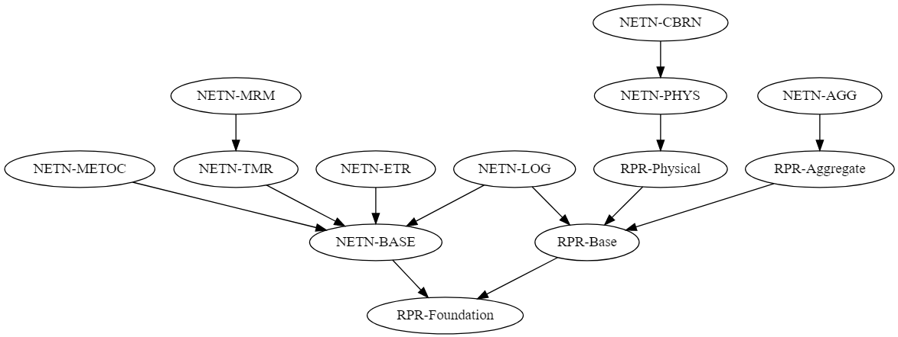

# NETN FOM

Copyright (C) 2019 NATO/OTAN.
This work is licensed under a [Creative Commons Attribution-NoDerivatives 4.0 International License](LICENSE.md).

## Introduction

A **Federation** is a union of essentially independent applications (**Federates**) interoperating using the common infrastructure services accessed through well-defined standard interfaces and governed by common agreements on modelling responsibilities and information exchange. 

**NATO STANAG 4603** mandates the use of IEEE 1516 standards on High-Level Architecture (**HLA**) for federates and federations.  

HLA services are provided by a Run-Time Infrastructure (**RTI**). On the network the RTI acts as a distributed operating system providing the standard HLA interfaces to the federates. Internally the RTI uses distributed algorithms and network protocols to implement all HLA services. 

**Federation architecture** is the style of design and method of integration to create coherent distributed simulation systems based on federates and a common service-oriented infrastructure. 

**Federation design** is detailed specification of a federation that meet requirements for a specific simulation solution used to support simulation based events such as a Computer Assisted eXercises (CAX).

### Purpose

The HLA standard specifies how to document information exchange using a Federation Object Model (**FOM**). Different domains may have different FOMs but can use the same underlying simulation infrastructure standard.

The NETN FOM is defined as the complete set of NETN FOM Modules plus all modules they depend on (e.g. RPR-FOM modules). The modules have inter-dependencies and are designed to maximize re-use and interoperability. All NETN FOM modules are provided as HLA IEEE 1516-2010 OMT Data Interchange Format XML files.

The **NETN Federation Architecture** mandates the use of HLA (in accordance with STANAG 4603) and the use of the NETN FOM. 

### Scope

<!--
# Viz-js.com

digraph G {

	"RPR-Base" -> "RPR-Foundation";
	"NETN-BASE" -> "RPR-Foundation"
	"NETN-LOG" -> "RPR-Base"
	"NETN-LOG" -> "NETN-BASE"
	"RPR-Physical" -> "RPR-Base"
		"RPR-Aggregate" -> "RPR-Base"
	"NETN-Physical" -> "RPR-Physical"
	"NETN-AGG" -> "RPR-Aggregate"
	"NETN-METOC" -> "NETN-BASE"
	"NETN-MRM" -> "NETN-TMR"
	"NETN-TMR" -> "NETN-BASE"
	"NETN-CBRN" -> "NETN-Physical"
	"NETN-ETR" -> "NETN-BASE"
}
-->

Figure: The NETN FOM

|NETN FOM Module|Dependency|Description|
|---|---|---|
|NETN-Base|RPR-FOM Base|NETN common concepts and datatypes.|
|NETN-Physical||Physical platform and entities state.|
|NETN-Aggregate||Simulated Unit state.|
|NETN-ORG||Representation of task organization relationships and status.|
|NETN-LOG||Modelling of Logistics Services across federates.|
|NETN-ETR||Tasking of simulation entities and simulation task reporting.|
|NETN-CBRN||Representation of CBRN triggers, release and events.|
|NETN-METOC||Representation of weather and effects of weather.|
|NETN-AIS||Representation of simulated ship AIS data.|
|NETN-MRM||Multi-Resolution modelling including aggregation and disaggregation patterns.|
|NETN-TMR||Coordinated transfer of modelling responsibilities between federates.|

## Use of NETN FOM modules

A NETN federation design may extend NETN FOM modules (as new modules), include other FOM modules, and/or select to use only a subset of the NETN modules, all depending on the needs and requirements of the federation. 

The basic FOM Module rules as defined in HLA Evolved shall be applied. When extending the FOM with additional modules, the naming of classes, datatypes and other identifiers must be de-conflicted.

Registered objects and interactions are always discovered/received at the most specific subscribed class level. Extending a FOM Module with additional subclasses provides the possibility to add extra attributes/parameters at the more specific class level. Exchange of information using this more specific level can take place between federates publishing and subscribing to this level. However, to become compatible with and receive information from federates only publishing on the more general level, the receiving federate must subscribe to both class levels. Subscribers of the more general class will receive information from publishers of the more specific class level.

Example: A national extension to the NETN FOM Modules subclasses existing NETN object classes and defines additional attributes. National models aware of this extension can publish and subscribe to the more specific level defined in the national FOM module extensions. Other existing federates not aware of the extension can still discover the object and receive updates but only on the level they subscribe to. In order for the national federates to discover and receive information from other federates they need to subscribe to the NETN class level as well as the national extension level. Note that the discovered object and attribute updates will be on the NETN level.