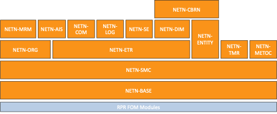

The NATO Education and Training Network Federation Object Model (NETN-FOM).

Copyright (C) 2024 NATO/OTAN.
This work is licensed under a [Creative Commons Attribution-NoDerivatives 4.0 International License](LICENCE.md).

## Introduction

The NATO Education and Training Network Federation Object Model (NETN-FOM) provides a common information exchange data model for developing interoperable federated and distributed simulation systems.

The NETN-FOM has been developed to support the NETN vision and applies to Computer Assisted eXercises (CAX), Distributed Synthetic Training (DST), and distributed modelling and simulation (M&S) in general.
> “To deliver to NATO and Partners a persistent, distributed combined joint training capability able to support training from the operational to the tactical level across the full spectrum of operations, through leveraging existing national expertise and capabilities.” — Original NATO ACT NETN Vision

## Concepts

In the context of distributed simulation, a Federation is a union of independent applications or services (Federates) interoperating using standard infrastructure services accessed through well-defined standard interfaces and governed by common agreements on modelling responsibilities and information exchange. 

High-Level Architecture (HLA) is an international IEEE standard [1] for federated simulation covered by NATO STANAG 4603. HLA defines common services for distributed simulation interoperability and standardized APIs for accessing them. The HLA standard also specifies how to document information exchange data models in a Federation Object Model (FOM). Different domains may have different FOMs but can use the same underlying simulation interoperability services. 

AMSP-04 defines the set of FOM modules that constitute the NETN-FOM. A NETN-Federation is an HLA Federation that uses one or more NETN-FOM modules. An NETN-Federate is an application or service connected to a NETN-Federation and using one or more NETN-FOM modules.

The NETN-FOM focuses on technical interoperability aspects in federated distributed simulation and provides standard patterns of simulation interplay, including initialization, transfer of modelling responsibilities, simulation entity tasking and managing dynamic change of model resolution.

As a reference document, the NETN-FOM does not replace the need for detailed design specifications and agreement documents. However, it provides a standard approach and a solid foundation for addressing interoperability and reuse requirements when integrating heterogeneous services and applications in a federated distributed simulation system.

The NETN-FOM modules have inter-dependencies, and their design maximizes re-use of- and interoperability with legacy systems. The NETN-FOM complements and extends the SISO RPR-FOM.

This AMSP-04 specification provides a summary of all NETN-FOM modules, key design patterns and main concepts. Full online documentation and all related data models and files are published and provided at http://www.github.org/AMSP-04.

## History

In 2006, NATO Allied Command Transformation (ACT) requested NATO Modelling and Simulation Group (NMSG) to explore the concepts of a NATO Education and Training Network capability. An exploratory team (ET-025) analyzed the requirement, and it proposed a technical activity to develop NETN concepts. 

In 2007, the NMSG technical activity MSG-068 NETN started led by NATO Joint Warfare Center (JWC) and with participants from NATO HQ-SACT, NATO Joint Forces Training Center (JFTC), NATO Consultancy, Command and Control Agency (NC3A) and 13 Nations (Australia, Bulgaria, France, Germany, Hungary, Netherlands, Romania, Slovenia, Spain, Sweden, Turkey, UK, USA). MSG-068 assessed the distributed simulation and learning capabilities that could contribute to the development of a NETN capability and drafted standards to enable better re-use and sharing of national Modelling and Simulation systems. The capabilities were demonstrated at I/ITSEC 2010, and the group ended its work in 2011. A NETN Federation Architecture and FOM Design specification (NETN FAFD) was produced which included the NETN-FOM v1.0 published in February 2012. 

In early 2012, the NMSG technical activity MSG-106 “SPHINX” started as a follow-on to MSG-068 but with a slightly broader scope. The technical subgroup of MSG-106 continued to work on the NETN FAFD specification and delivered a draft NETN-FOM v2.0 which included several new FOM modules and other improvements. The updated NETN-FOM was included in the draft Allied Modelling and Simulation Publication (AMSP-04) NATO Education and Training Network Federation Architecture and FOM Design (NETN FAFD).

In late 2014, the NMSG technical activity MSG-134 “NATO Distributed Simulation Architecture & Design, Compliance Testing and Certification” started as a follow-on to MSG-106 to continue maintenance of the NETN FAFD and to work on establishing the NATO HLA certification process as identified in NATO STANAG 4603. The group did not add any new modules to the NETN-FOM, but it assisted in updating the draft AMSP-04 to a final version including an official NETN-FOM v2.0 release. The group ended its work in late 2017, and the AMSP-04 was later promulgated and published by NATO in March 2018 covered by NATO STANREC 4800.

In early 2018, the NMSG technical activity MSG-163 “Evolving NATO Standards for Federated Simulation” started as a follow-on to MSG-134. In late 2020 the group delivered a draft updated AMSP-04 Ed B NETN FAFD document including NETN-FOM v3.0 with new modules and several updates based on NATO and national experiences using the NETN-FOM. AMSP-04 Ed B was promulgated and published in March 2021.

In March 2021, the NMSG technical activity MSG-191 “NATO Standards for Federated Simulation and Services for Integration, Verification and Certification” continued the maintenance of the NETN-FOM and delivered the draft AMSP-04 Ed C NETN-FOM v4.

|Version|Main Change|
|---|---|
|NETN-FOM v4|Major restructuring using HLA4 FOM modelling principles and techniques allowing simplified structure and class merging of attributes/parameters from multiple modules.  New FOM Module NETN-SMC for common service management and control interactions used in various other modules.  New FOM Module NETN-DIM for representation of disaster objects, events and tasks.  Renaming of NETN-Physical to NETN-ENTITY for representation of both platform and aggregate level simulated entities.  Major simplification of NETN-TMR pattern.  Extension of NETN-ETR to include observation reports based on SISO C2SIM report ontology.|
|NETN-FOM v3|New FOM Module NETN-ORG for the representation of Organizations.  New FOM Module NETN-SE to extend RPR-SE  New FOM Module NETN-METOC for the representation of weather  New FOM Module NETN-AIS for the representation of Vessel Traffic Information and Data  New FOM Module NETN-LOG that Merge and remove Logistics FOM Modules NETN-SCP-Base, NETN-Repair, NETN-Transport, NETN-Supply, and NETN-Storage  Renamed LBML module to NETN-ETR (Entity Tasking and Reporting)  Major update of NETN-MRM to simplify aggregation, disaggregation, divide and merge of units.  Exclude FOM Module NETN-HCBML for high-level C-BML Sim-C2 interactions (in anticipation of SISO C2SIM standard).|
|NETN-FOM v2|New FOM Module NETN-Base for standard datatypes.  New FOM Module NETN-Physical extends RPR-Physical.  New FOM Module NETN-CBRN for the representation of CBRN events and effects.  New FOM Module NETN-MRM for aggregation and disaggregation of units.  New FOM Module NETN-TMR for transfer of modelling responsibilities.  New FOM Module NETN-HCBML for high-level C-BML Sim-C2 interactions.  New FOM Module NETN-LLBML for low-level entity tasking and reporting.  Renamed NETN Service Consumer-Provider FOM Module to NETN-SCP-Base.  Replaced NETN Logistics FOM Module with NETN-Repair, NETN-Storage, NETN-Supply and NETN-Transport|
|NETN-FOM v1.0|NETN Service Consumer-Provider  NETN Logistics  NETN Aggregate|

## License
A full on-line documentation and all related data models and files are provided through http://www.github.org/AMSP-04.

All modules of the NETN-FOM are licensed under a Creative Commons Attribution-NoDerivatives 4.0 International License. The licensed work includes all NETN-FOM Modules defined in this document and as provided online through GitHub as HLA OMT XML files, XML Schemas, and all associated documentation.

The licence gives you the right to use and redistribute the NETN-FOM Modules (XML file and Documentation) in their entirety without modification. You are also allowed to develop new FOM Modules (in separate XML files and separate documentation) that build-on/extends the NETN module by reference and including necessary scaffolding classes. You are NOT allowed to modify the FOM Modules or its documentation without prior permission from the NATO Modelling and Simulation Group. 

All updates and versioning of the NETN-FOM are coordinated by the NATO Modelling and Simulation Coordination Office (MSCO), managed by the NATO Modelling and Simulation Group (NMSG) and performed as NATO Science and Technology Organization (STO) technical activities in support of the NMSG Modelling and Simulation Standards Subgroup (MS3).

Feedback on the use of this work, suggestions for improvements and identified issues are welcome and can be provided using the GitHub issue tracking. To engage in the development and update of this FOM Module please contact your national NMSG representative.

# NETN-FOM

The NETN-FOM modules capture different aspects of information that can be exchanged in an NETN federation. A federate should use only the modules it needs and depends on and can be unaware of any other modules used by other federates in a NETN federation.

|Module|Description|
|---|---|
|NETN-BASE|Common definitions of datatypes.
|NETN-SMC|	Base interaction classes for service management and control, including federation, federate and entity control actions.
|NETN-MRM|	Multi-Resolution Modelling including aggregation, disaggregation, divide and merge of simulated aggregated entities.
|NETN-COM|	Representation of logical communication networks and physical network links.
|NETN-METOC|	Representation of environment conditions including weather and primary effects of weather on terrain, water surfaces, atmosphere, and subsurface water conditions.
|NETN-CBRN|	Representation of CBRN release, detection, effects, and protective measures.
|NETN-LOG|	Logistics services representation for modelling supply, repair and transport across federates.
|NETN-TMR|	Transfer of attribute modelling responsibility between federates.
|NETN-SE|	Representation of persistent objects in the synthetic environment.
|NETN-ETR|	Base model for sending simulation control actions to entities represented in a federated distributed simulation.
|NETN-ORG|	Representation of the state of units, including command structure and the relationship between organizations.
|NETN-AIS|	Representation of vessel traffic in a simulation using AIS messages.
|NETN-ENTITY|	Representation of simulated physical and aggregate entities.
|NETN-DIM|	Representation of hazards, e.g. flooding and wildfire, in federated distributed simulation environments.

## Modelling Responsibility

In a federated simulation, each federate is selected to participate in the federation because it has intrinsic capabilities to represent certain aspects of entities, events, and other phenomena in the simulated environment necessary to accomplish the purpose for which the federation exists. 

The federation design and development process allocate, describes, and documents the roles and responsibilities of all federates. The responsibility of modelling certain aspects can only be assigned to a federate with a capability that meets specified requirements. Agreements on how to define the initial and any dynamic transfer of modelling responsibilities are important for all NETN federation designs.

During execution, the modelling responsibilities may change. HLA provides services for managing the transfer of ownership of individual object attributes between federates. 

In the NETN-FOM, the concept of a **primary modelling responsibility** for an entire simulated entity is introduced. Only one federate has the primary modelling responsibility, but the responsibility can be transferred. Primary modelling responsibility is determined by the owner of the NETN-TMR `HLAobjectRoot` attribute `AllocatedFederate`. 

Transfer of primary modelling responsibility is defined in the NETN-TMR module and is also used in NETN initialization patterns.

## Initiallization

The NETN-FOM identifies three methods of initialization and allocation of initial modelling responsibility in a NETN federation.

1. Entities are allocated and registered by a federate based on a loaded Scenario Data File. The NETN-ORG module provides a proposed scenario data format based on the SISO-STD-007-2008 Military Scenario Definition Language (MSDL).
2. Entities are allocated based on published NETN-ORG data and registered by a federate based on data in the federation.
3. Entities are registered by a central federate and then reallocated and transferred using NETN-TMR patterns for triggering transfer.

All methods can be combined. However, the recommended pattern uses centrally managed federate (C) that registers objects (O) and updates the O.`AllocatedFederate` attribute with the name of a federate (F) to which the modelling responsibility is allocated.
 

(F) receives the primary modelling responsibility of (O) only when (F) completes the HLA attribute ownership acquisition of the O.`AllocatedFederate` attribute.

## Entity Control Actions

Several modules in NETN-FOM use NETN-SMC Entity Control Actions which is based on the concept of Primary Modelling Responsibility. A federate with the primary responsibility for an entity (E) shall respond to all NETN-SMC `SMC_EntityControl` actions directed to (E). 

In NETN-FOM v4 the following Entity Control Actions are included.

|Name|Value|Module|
|---|---|---|
|Other|0|NETN-SMC
|MagicMove|10|NETN-ETR
|Detach|18|NETN-ETR
|DirectFire|20|NETN-ETR
|EnterFacility|21|NETN-ETR
|IndirectFire|22|NETN-ETR
|FollowEntity|24|NETN-ETR
|MoveInDirection|25|NETN-ETR
|MoveIntoFormation|26|NETN-ETR
|MoveToLocation|28|NETN-ETR
|MoveByRoute|29|NETN-ETR
|Attach|30|NETN-ETR
|Observe|31|NETN-ETR
|OperateCheckpoint|32|NETN-ETR
|Patrol|33|NETN-ETR
|OperateObservationPost|34|NETN-ETR
|ChangeAltitude|35|NETN-ETR
|ChangeSpeed|36|NETN-ETR
|StopAtSideOfRoad|39|NETN-ETR
|ChangeHeading|40|NETN-ETR
|SetRulesOfEngagement|41|NETN-ETR
|OtherActivity|42|NETN-ETR
|Aggregate|100|NETN-MRM
|Disaggregate|101|NETN-MRM
|Divide|102|NETN-MRM
|Merge|103|NETN-MRM
|DisruptCommunication|200|NETN-COM
|SetTransmitterStatus|201|NETN-COM
|SendSafetyRelatedMessage|300|NETN-AIS
|SendSafetyRelatedBroadcastMessage|301|NETN-AIS
|ClearEngineering|401|NETN-SE
|CreateBreach|402|NETN-SE
|EstablishCheckpoint|403|NETN-SE
|LayMinefield|404|NETN-SE
|CreateObstacle|405|NETN-SE
|EstablishObservationPost|406|NETN-SE
|ApplyIPE|501|NETN-CBRN
|AdministerTreatment|502|NETN-CBRN
|Resupply|601|NETN-LOG
|Repair|602|NETN-LOG
|Transport|603|NETN-LOG
|Reset|604|NETN-LOG
|SetSupplies|605|NETN-LOG
|SetPersonnelStatus|606|NETN-LOG
|SetEquipmentStatus|607|NETN-LOG
|PumpFlooding|701|NETN-DIM
|ExtinguishWildfire|702|NETN-DIM
|Evacuate|703|NETN-DIM
|CreateFireBreak|704|NETN-DIM
|CreateLevee|705|NETN-DIM
|ChangeSuperiorUnit|800|NETN-ORG

# Acronyms

|Abbreviation|Definition|
|---|---|
|ACT|	(NATO) Allied Command Transformation
|AIS|	Automatic Identification System
|AMSP|	(NATO) Allied Modelling and Simulation Publication
|ATON|	Aid to Navigation
|BML|	Battle Management Language
|C2|Command and Control
|C2SIM|	C2 System – Simulation System Interoperation
|CAX|	Computer Assisted eXercise
|CBRN|	Chemical, Biological, Radiological and Nuclear
|CGF|	Computer-Generated Forces
|COLPRO|	Collective Protection
|COM|	Communication
|COTS|	Commercial-off-the-Shelf
|DIM|	Disaster Module
|DSEEP|	Distributed Simulation Engineering and Execution Process
|DST|	Distributed Synthetic Training
|ETR|	Entity Tasking and Reporting
|FAFD|	Federation Architecture and FOM Design
|FOM|	Federation Object Model
|GPS|	Global Positioning System
|GRIM|	(RPR-FOM) Guidance, Rationale, and Interoperability Modalities
|HLA|	High-Level Architecture
|IEEE|	Institute of Electrical and Electronics Engineers
|IPE|	Individual Protective Equipment
|ISO|	International Organization for Standardization
|LOG|	Logistics
|M&S|	Modelling and Simulation
|METOC|	Meteorological and Oceanographic
|MRM|	Multi-Resolution Modelling
|MSDL|	Military Scenario Definition Language
|MSG|	Modelling and Simulation Group
|NATO|	North Atlantic Treaty Organization
|NETN|	NATO Education and Training Network
|NMSG|	NATO Modelling and Simulation Group
|OMT|	(HLA) Object Model Template
|ORBAT|	Order of Battle
|ORG|	Organization
|RPR FOM|	Real-Time Platform Reference (FOM)
|SE|	Synthetic Environment
|SISO|	Simulation Interoperability Standards Organization
|SMC|	Service Management and Control
|STANAG|	(NATO) Standardization Agreement
|STANREC|	(NATO) Standardization Recommendation
|STO|	(NATO) Science and Technology Organization
|TMR|	Transfer of Modelling Responsibility
|UUID|	Universally Unique IDentifier

# References

* SISO, “IEEE 1516-2024: IEEE Standard for High Level Architecture for Modeling and Simulation,” IEEE, 2014.
* SISO, “SISO-STD-001-2015: Standard for Guidance, Rationale, and Interoperability Modalities (GRIM) for the Real-time Platform Reference Federation Object Model (RPR FOM), Version 2.0,” SISO, 2015.
* NMSG, "AMSP-04," [Online]. Available: https://amsp-04.github.io/.
* SISO, “SISO-STD-007-2008: Standard for Military Scenario Definition Language (MSDL) (reaffirmed 11 May 2015),” SISO, 2015.
* SISO, “SISO-STD-001.1-2015: Standard for Real-time Platform Reference Federation Object Model (RPR FOM), Version 2.0 (10 August 2015),” SISO, 2015.
* ISO/IEC, "ISO/IEC 9834-8:2014 Procedures for the operation of object identifier registration authorities Part 8: Generation of universally unique identifiers (UUIDs) and their use in object identifiers," ISO/IEC, 2014.
* SISO, “SISO-STD-019-2020: Standard for Command and Control Systems - Simulation Systems Interoperation,” SISO, 2020.
* ITU, "ITU-R M.1371-5 : Technical characteristics for an automatic identification system using time division multiple access in the VHF maritime mobile frequency band," ITU, 2014.
* NMEA, "NMEA-0183 : Standard for Interfacing Marine Electronic Devices," NMEA, 2023.
* NATO, “NATO Term,” NATO, [Online]. Available: https://nso.nato.int/natoterm/content/nato/pages/home.html.
* SISO, “IEEE 1730-2022: IEEE Recommended Practice for Distributed Simulation Engineering and Execution Process (DSEEP),” IEEE, 2022.
* NATO NSO, "NATO Terminology Database," NATO, [Online]. Available: https://nso.nato.int/natoterm.

