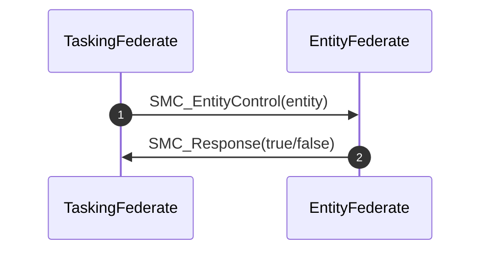
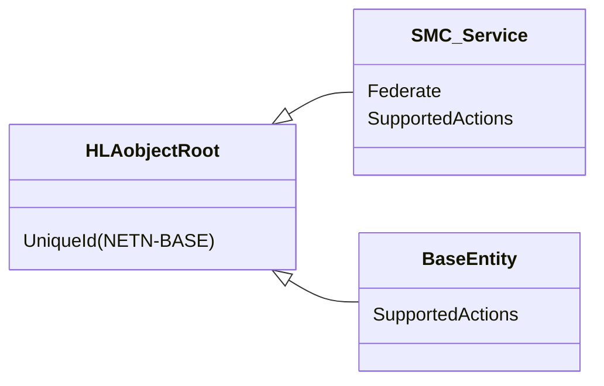
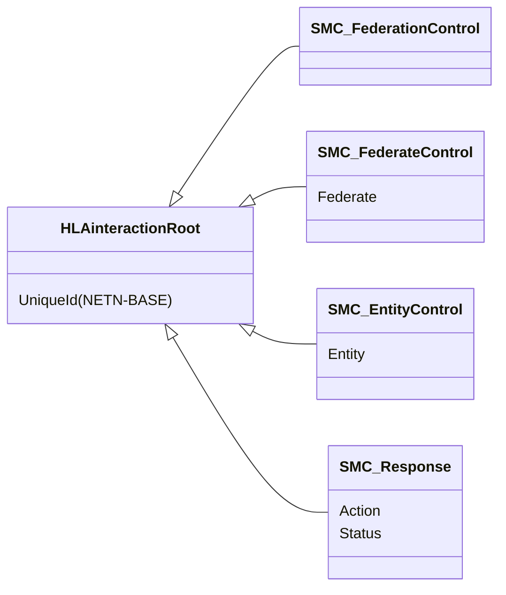

# NETN-SMC
|Version| Date| Dependencies|
|---|---|---|
|1.0|2023-11-20|NETN-BASE|

The NATO Education and Training Service Management and Control (NETN-SMC) module provides a standard way to send control actions in a federated simulation. Control actions are interactions targeting the federation, an individual federate, or an individual simulated entity.

In a federated distributed simulation, the participating systems (federates) provide services to model aspects of the synthetic environment. To simulate model change, these services use operator input, data published in the federation, and the passing of scenario time.

The NETN-SMC module provides methods to interact with services using control actions and defines a Request-Response pattern. The control actions described in this module form the basis for subclassing more specific actions in other FOM modules.

## Overview 
The module defines three (3) basic control actions 
 
* Use the `SMC_FederationControl` for actions intended for all federates in the federation. 
* Use `SMC_FederateControl` for  actions intended for a known federate 
* Use `SMC_EntityControl` for actions related to a specific simulation entity. The interaction is expected to be processed by the federate with the modelling responsibility for the entity. 
 
When sending a `SMC_FederateControl` or `SMC_EntityControl` action, the receiving federate shall respond to the action using a `SMC_Response` interaction to indicate success or failure to accept or achieve the action. 

 
## Federate Control Action

To send a control action to a specific federate, use the `SMC_FederateControl` interaction with a parameter identifying the federate by its name.

If a federate control action is sent to a federate that is not compliant with NETN-SMC, there will be no response, and it will be hard to determine if or when the control action is successfully received. 

Federates publish support actions using the `SMC_Service` object attribute `SupportedActions`. If available, this information shall be used before sending a federate control action to check whether the action is supported.

All NETN-SMC-compliant federates must also respond to all federate control actions using the `SMC_Response` interaction, regardless of whether the action is supported.

## Entity Control Action

To send a control action to a specific simulation entity, use the `SMC_EntityControl` interaction with a parameter identifying the entity by its unique identifier. The federate with the referenced entity's primary modelling responsibility is the receiver and should perform the action.

If the federate with the primary responsibility of the referenced entity is not compliant with NETN-SMC, there will be no response, and it will be hard to determine if or when the control action is successfully received. Therefore, supported actions are published using the `BaseEntity` object class attribute. Before sending a `SMC_EntityControl`, use the `BaseEntity` object attribute `SupportedActions` to determine if the referenced entity supports the action.

## Object Classes

### SMC_Service

Represents a service the referenced federate provides with additional information regarding supported control actions.

|Attribute|Datatype|Semantics|
|---|---|---|
|Federate|FederateName|Required: The federate providing the service.|
|SupportedActions|FederateControlActions|Required: Indicates which SMC control actions are supported by the referenced federate.|
|UniqueId (NETN-BASE)|UUID|Required. A unique identifier for the object. The Universally Unique Identifier (UUID) is generated or pre-defined.| 

### BaseEntity

A base class of aggregate and discrete scenario domain participants. The BaseEntity class is characterized by being located at a particular location in space and independently movable, if capable of movement at all. It specifically excludes elements normally considered to be a component of another element. The BaseEntity class is intended to be a container for common attributes for entities of this type. Since it lacks sufficient class specific attributes that are required for simulation purposes, federates cannot publish objects of this class. Certain simulation management federates, e.g. viewers, may subscribe to this class. Simulation federates will normally subscribe to one of the subclasses, to gain the extra information required to properly simulate the entity.

|Attribute|Datatype|Semantics|
|---|---|---|
|SupportedActions|EntityControlActions|Optional: Indicates what control actions are supported by an individual simulated entity.|
|UniqueId (NETN-BASE)|UUID|Required. A unique identifier for the object. The Universally Unique Identifier (UUID) is generated or pre-defined.| 

## Interaction Classes

### SMC_FederationControl

Base class for all control actions applicable to all federates in the federation. The inherited NETN-BASE `UniqueId` parameter is used to match this interaction with a corresponding `SMC_Response`.

### SMC_FederateControl

Base class for all control actions directed to a specific federate. The inherited NETN-BASE `UniqueId` parameter matches this interaction with a corresponding `SMC_Response`. Before sending this interaction, use the `SMC_Service` object attribute `SupportedActions` to determine if the referenced federate supports the action.

|Parameter|Datatype|Semantics|
|---|---|---|
|Federate|FederateName|Required: The federate intended as the receiver of this control action.|
|UniqueId (NETN-BASE)|UUID|Optional: A unique identifier for the interaction. Required for all SMC related interactions.| 

### SMC_EntityControl

Control action intended for a federate with primary modelling responsibility for the referenced entity. The inherited NETN-BASE `UniqueId` parameter matches this interaction with a corresponding `SMC_Response`. Before sending this interaction, use the NETN-SMC `BaseEntity` object attribute `SupportedActions` to determine if the referenced entity supports the action.

|Parameter|Datatype|Semantics|
|---|---|---|
|Entity|UUID|Required: Reference to a simulation entity for which the control action is intended.|
|UniqueId (NETN-BASE)|UUID|Optional: A unique identifier for the interaction. Required for all SMC related interactions.| 

### SMC_Response

The response indicates whether the related action was accepted or rejected/failed by a federate. A single response per sent action is expected.

|Parameter|Datatype|Semantics|
|---|---|---|
|Action|UUID|Required: Reference to the control action this is a response to. The reference corresponds to the NETN-BASE `UniqueId` parameter of the control action interaction.|
|Status|HLAboolean|Required: Indicates success or failure of a corresponding control action.|
|UniqueId (NETN-BASE)|UUID|Optional: A unique identifier for the interaction. Required for all SMC related interactions.| 

## Datatypes

Note that only datatypes defined in this FOM Module are listed below. Please refer to FOM Modules on which this module depends for other referenced datatypes.

### Overview
|Name|Semantics|
|---|---|
|EntityControlActionEnum|Enumeration of Entity Control Actions. The datatype is expected to be extended in specific modules defining additional actions.|
|EntityControlActions|A set of control actions relevant to individual entities in the simulation.|
|FederateControlActionEnum|Enumeration of Federate Control Actions. The datatype is expected to be extended in specific modules defining additional actions.|
|FederateControlActions|A set of control actions for the federate implementing the service.|
        
### Enumerated Datatypes
|Name|Representation|Semantics|
|---|---|---|
|EntityControlActionEnum|HLAinteger32BE|Enumeration of Entity Control Actions. The datatype is expected to be extended in specific modules defining additional actions.|
|FederateControlActionEnum|HLAinteger32BE|Enumeration of Federate Control Actions. The datatype is expected to be extended in specific modules defining additional actions.|
        
### Array Datatypes
|Name|Element Datatype|Semantics|
|---|---|---|
|EntityControlActions|EntityControlActionEnum|A set of control actions relevant to individual entities in the simulation.|
|FederateControlActions|FederateControlActionEnum|A set of control actions for the federate implementing the service.|
    