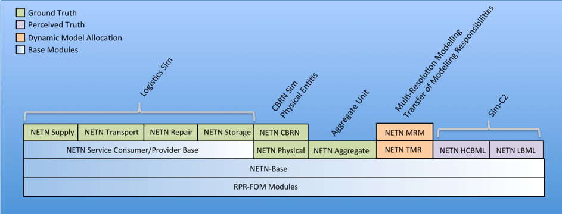

# NETN FOM

The NETN FOM is an identified set of HLA Evolved FOM Modules. The NETN FOM modules are recommended for use when implementing NATO AMSP-04 NETN FAFD compliant distributed simulation. These NETN FOM include reference to other standard FOM modules as well as NETN modules developed by NATO Modelling and Simulation Group (NMSG) Modelling and Simulation Standards Subgroup (MS3).

The modules have inter-dependencies and have been designed to maximize re-use and interoperability with legacy systems using existing standards, and those having requirements for new patterns of simulation interoperability. The NETN FOM is the complete set of NETN modules and all other modules they depend on (e.g. SISO RPR-FOM modules).

The modular concept allows federates to load only those modules necessary for the federation instance. In addition, the modules can be extended with more detailed representation by creating new modules and sub-classing or using information from other modules.

NETN Federations may extend the reference FOM with additional FOM Modules when appropriate. These FOM modules can be used in combination and extended to support NETN federation design. A specific federation may choose to include additional FOM modules, extend the NETN modules and/or select to use only a subset of the provided modules depending on the needs and requirements of the federation. The basic FOM Module rules as defined in HLA Evolved shall be applied. When extending the FOM with additional modules, the naming of classes, datatypes and other identifiers must be de-conflicted.

## Background
In 2006, NATO Allied Command Transformation (ACT) requested NATO Modelling
and Simulation Group (NMSG) to explore the concepts of a NATO Education and Training Network capability. An exploratory team (ET-025) was set up to analyze the requirement and it proposed a technical activity to develop the NETN concepts. 

In 2007, the NMSG technical activity **MSG-068 NETN** was started. The group was led by NATO Joint Warfare Center (JWC) and with participants from NATO HQ-SACT, NATO Joint Forces Training Center (JFTC), NATO Consultancy, Command and Control Agency (NC3A) and 13 Nations (Australia, Bulgaria, France, Germany, Hungary, Netherlands, Romania, Slovenia, Spain, Sweden, Turkey, UK, USA). MSG-068 assessed the distributed simulation and learning capabilities that could contribute to the development of an NETN capability and drafted standards to better enable reuse and sharing of national Modelling and Simulation systems. The capabilities were demonstrated at I/ITSEC 2010 and the group ended its work in 2011. A NETN Federation Architecture and FOM Design specification (NETN FAFD) was produced which included the **NETN-FOM v1.0** published in February 2012. 

In early 2012, the NMSG technical activity **MSG-106 SPHINX** was started as a follow-on to MSG-068 but with a slightly larger scope. The technical subgroup of MSG-106 continued to work on the NETN FAFD specification and delivered a draft NETN-FOM v2.0 which included several new FOM modules and other improvements. The updated FOM was also included in the draft Allied Modelling and Simulation Publication (AMSP-04) NATO Education and Training Network Federation Architecture and FOM Design (NETN FAFD).

In late 2014, the NMSG technical activity **MSG-134 NATO Distributed Simulation Architecture & Design, Compliance Testing and Certification** was started as a follow-on for continued maintenance of the NETN FAFD and to continue work on establishing the NATO HLA certification process identified in STANAG 4603. The group did not add any new modules to the NETN-FOM but it assisted NMSG in updating the draft AMSP-04 to a final version inclduing an official **NETN-FOM v2.0** release. The group ended its work in late 2017 and the AMSP-04 was later promulgted and published by NATO in March 2018 and is covered by NATO STANREC 4800.

In early 2018, the NMSG technical activity **MSG-163 Evolving NATO Standards for Federated Simulation** started as a follow-on to MSG-134. In late 2020 the group will provide a draft updated AMSP-04 Ed B NETN FAFD document including **NETN-FOM v3.0** that incudes both new modules and several updates based on NATO and national experiences using the NETN-FOM.

## NETN FOM Versions

### NETN FOM v1.0
The first version of the NETN FOM developed by MSG-068 was not published as a NATO standard and has been deprecated.

## NETN FOM v2.0 (CURRENT)
The current version of the NETN FOM was published as AMSP-04 in March 2018 and is covered by STANREC 4800. 
The released version of the v 2.0 are available in the master branch of module repositories in https://github.com/AMSP-04 and include the following modules:

* NETN-BASE
* NETN-Physical
* [NETN-Aggregate](https://github.com/AMSP-04/NETN-Aggregate/tree/v1.0.4)
* NETN-TMR
* NETN-MRM
* NETN-CBRN
* NETN-LOG (SCB Base, Supply, Transport, Repair, Storage)
* NETN-LBML
* NETN-HCBML

[Full AMSP-04 documentation](https://nso.nato.int/nso/nsdd/APdetails.html?APNo=2268&LA=EN)

[Download NETN FOM v2.0 Modules](https://github.com/AMSP-04/NETN-FOM/tree/master/modules)

## NETN FOM v3.0 (IN DEVELOPMENT)
The next version of the NETN FOM is currently under development.
Intermediate releases of the NETN Modules in v 3.0 are available in the develop branch of FOM module repositories in https://github.com/AMSP-04 and include the following modules:

* NETN-BASE (Updated)
* NETN-Physical (Updated)
* NETN-Aggregate (Updated)
* NETN-TMR (Updated)
* NETN-MRM (Updated)
* NETN-CBRN (Updated)
* NETN-LOG (Merges SCB Base, Supply, Transport, Repair, Storage)
* NETN-ETR (Replaces NETN-LBML)
* NETN-ORG (New)
* NETN-METOC (New)

