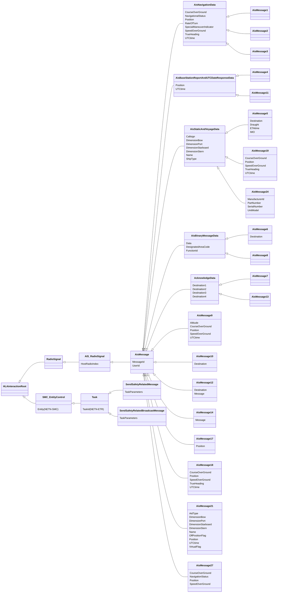

# NETN-AIS
|Version| Date| Dependencies|
|---|---|---|
|2.0|2024-03-10|NETN-BASE, RPR-Communication, NETN-ETR, NETN-ORG, NETN-SMC|

The purpose of the NATO Education and Training Network Automatic Identification System Module (NETN-AIS) is to:     
        
* represent vessel traffic in a simulation using AIS messages to, for example, communicate position status reports of vessels.   
* enable the exchange of AIS messages between HLA Federate Applications in real-time and non-real-time platform-level simulation.   
* allow HLA Federate Applications to use regular HLA interaction classes and parameters to represent vessel information and leave any translations to physical message formats to dedicated gateways.

AIS is a worldwide automated tracking system used for sharing vessel identification and location information by propagating messages between nearby vessels and Vessel Traffic Services stations.

The NETN-AIS module is a simulation-oriented representation of AIS messages. It does not focus on the physical message format defined by the AIS standard ITU-R M.1371-5. However, the module is aligned with this standard to enable easy mapping to and from live message formats.

## Overview 
 
The NETN-AIS module defines most AIS message types defined in ITU-R M.1371-5 [3] except for rarely used message types and message types related to traffic analysis in an AIS network, i.e. 15, 16, 20, 22, 23, 25 and 26. 
 
The most common message types are: 
* Position Report Class A (Message types 1,2, and 3) and 
* Static and Voyage Related Data (Message type 5). 
 
 
 

The NETN-AIS interaction class structure is closely aligned with the message type specification in ITU-R M.1371-5, enabling easy translation to and from commonly used live protocols such as NMEA 0183. 
 
The `AIS_RadioSignal` interaction is a subclass of the RPR-FOM `RadioSignal` interaction and uses the `HostRadioIndex` parameter to reference an RPR-FOM `RadioTransmitter` object instance. 
 
 
 
### AIS messages 
 
The following AIS message types are included: 
 
| Message type | Description | 
| --- | --- | 
| 1 | **Position Report Class A**. This is the Message type for a scheduled position report; it is Class A shipborne mobile equipment. This message transmits information about a ship's navigation: longitude and latitude, time, heading, speed, and the ship's navigation status, e.g., under power, at anchor. It is transmitted every 2 to 10 seconds while underway and every 3 minutes while at anchor. | 
| 2 | Same as 1.| 
| 3 | Same as 1. | 
| 4 | **Base Station Report**. Fixed-location base stations will use this message to report a position and time reference periodically. | 
| 5 | **Static and Voyage-related Data**. This message type is transmitted every 6 minutes and should only be used by Class A shipborne and SAR aircraft AIS stations when reporting static or voyage-related data. | 
| 6 | **Binary Addressed Message**. This message type is an addressed point-to-point message with an unspecified binary payload. | 
| 7 | **Binary Acknowledge**. This message type is a receipt acknowledgement to the senders of a previous message of Message Type 6. Total length varies depending on the number of destination MMSIs included (1..4). | 
| 8 | **Binary Broadcast Message**. This message type is a broadcast message with a binary payload. | 
| 9 | **Standard SAR Aircraft Position Report**. Tracking information for search-and-rescue aircraft. | 
| 10 | **UTC/Date Inquiry**. Request for UTC/Date information from an AIS base station. | 
| 11 | **UTC/Date Response**. This message type is identical to Message Type 4 and has the semantics of a response to an inquiry. It is only transmitted from a mobile station as a result of a UTC request message (Message Type 10). | 
| 12 | **Addressed Safety-Related Message**. This is a point-to-point text message. The payload is interpreted as a six-bit text. | 
| 13 | **Safety-Related Acknowledgement**. This message type is a receipt acknowledgement to senders of previous messages of Message Type 12. | 
| 14 | **Safety-Related Broadcast Message**. This is a broadcast text message. The payload is interpreted as a six-bit text. | 
| 17 | **DGNSS Broadcast Binary Message**. This message type is used to broadcast differential corrections for GPS. The data in the payload is intended to be passed directly to GPS receivers capable of accepting such corrections. | 
| 18 | **Standard Class B CS Position Report**. This is a less detailed report than message types 1-3 for vessels using Class B transmitters. The navigational status and rate of turn are not included in this message type. | 
| 19 | **Extended Class B CS Position Report**. This is a slightly more detailed report than Message Type 18 for vessels using Class B transmitters. The navigational status and rate of turn are not included in this message type. The fields are defined in the common navigation block and the Message Type 5 message. | 
| 21 | **Aid-to-Navigation Report**. Aids for navigation, such as buoys and lighthouses, emit an identification and location message. | 
| 24 | **Static Data Report**. This is the equivalent of Message Type 5 for ships using Class B equipment. It is also used to associate an MMSI with a name on either class A or class B equipment. This message type may be in part A or part B format. According to the standard, parts A and B are expected to be broadcast in adjacent pairs.| 
| 27 | **Long Range AIS Broadcast message**. This message type is primarily intended for long-range detection of AIS Class A equipped vessels (typically by satellite). It has similar content to Messages 1, 2 and 3, but the total number of bits is compressed to allow for increased propagation delays associated with long-range detection. | 
 
 
Many `AisMessage` class parameters are optional with a default value. However, the following parameters should be provided if possible: 
 
* Position: Geodetic Location. 
* UTCtime : Time of the report in UTC. 
 
 
Note that the AIS position defined as a `GeodeticLocation` differs from ITU-R M.1371-5, where Longitude and Latitude are represented in 1/10 000 min and stored in a 28- and 27-bit field, respectively. 
 
#### Encoding of a six-bit character string 
 
Several parameters in AIS use six-bit character strings, e.g., vessel name and callsign. In NETN-AIS, the parameter data type of a six-bit character string is `HLAASCIIstring`. The following table shows the mapping of ASCII characters to the AIS six-bit character. 
 
| six-bit | dec | char | six-bit | dec | char | six-bit | dec | char | six-bit | dec | char | 
| ------ | ---- | ---- | ------ | ---- | ---- | ------ | ---- | ---- | ------ | ---- | ---- | 
| 000000 | 0 | "@" | 010000 | 16 | "P" | 100000 | 32 | " " | 110000 | 48 | "0" | 
| 000001 | 1 | "A" | 010001 | 17 | "Q" | 100001 | 33 | "!" | 110001 | 49 | "1" | 
| 000010 | 2 | "B" | 010010 | 18 | "R" | 100010 | 34 | """ | 110010 | 50 | "2" | 
| 000011 | 3 | "C" | 010011 | 19 | "S" | 100011 | 35 | "\#" | 110011 | 51 | "3" | 
| 000100 | 4 | "D" | 010100 | 20 | "T" | 100100 | 36 | "$" | 110100 | 52 | "4" | 
| 000101 | 5 | "E" | 010101 | 21 | "U" | 100101 | 37 | "%" | 110101 | 53 | "5" | 
| 000110 | 6 | "F" | 010110 | 22 | "V" | 100110 | 38 | "&" | 110110 | 54 | "6" | 
| 000111 | 7 | "G" | 010111 | 23 | "W" | 100111 | 39 | "\'" | 110111 | 55 | "7" | 
| 001000 | 8 | "H" | 011000 | 24 | "X" | 101000 | 40 | "(" | 111000 | 56 | "8" | 
| 001001 | 9 | "I" | 011001 | 25 | "Y" | 101001 | 41 | ")" | 111001 | 56 | "9" | 
| 001010 | 10 | "J" | 011010 | 26 | "Z" | 101010 | 42 | "\*" | 111010 | 58 | ":" | 
| 001011 | 11 | "K" | 011011 | 27 | "[" | 101011 | 43 | "\+" | 111011 | 59 | ";" | 
| 001100 | 12 | "L" | 011100 | 28 | "\" | 101100 | 44 | "," | 111100 | 60 | "<" | 
| 001101 | 13 | "M" | 011101 | 29 | "]" | 101101 | 45 | "-" | 111101 | 61 | "=" | 
| 001110 | 14 | "N" | 011110 | 30 | "\^" | 101110 | 46 | "." | 111110 | 62 | ">" | 
| 001111 | 15 | "O" | 011111 | 31 | "\_" | 101111 | 47 | "/" | 111111 | 63 | "?" | 
 
#### RadioTransmitter 
 
An `AIS_RadioSignal` can be associated with a `RadioTransmitter` object instance. The required attributes of the `RadioTransmitter` object instance can be assigned the following values: 
 
| Attribute | Semantics | Value | 
| --- | --- | --- | 
| Frequency | The center frequency of the radio transmissions is specified in Herz. | `162000000` Hz | 
| FrequencyBandwidth | The bandwidth of the radio transmissions is specified in Hertz. | `25000` Hz | 
| RadioIndex | Specifies the identification number for each radio on a given host. This value shall not change during simulation execution. | Per agreement. If the `RadioTransmitter` is the only radio for the vessel, the index `0` should be used. | 
| RadioSystemType | Entity type of the radio transmitter: Kind, Domain, Country, Category. This value shall not change during simulation execution. Note that no further refinement of the type (subcategory etc.) is defined. The country value `0` should be replaced by the actual value. | `7.3.0.37` | 
| TransmittedPower | The average power being transmitted in units of decibel-milliwatts. | `12.5` watts for class A (`41` dBm), `5` watts for class B/SO (`37` dBm), and `2` watts for class B/CS (`33` dBm). | 
| TransmitterOperationalStatus | On/Off state of the transmitter as an enumeration. | `Off`, `OnButNotTransmitting` or `OnAndTransmitting` | 
| WorldLocation | Location of the antenna in world coordinates. | The vessel position. | 
 
### NETN-ETR extensions 
 
The NETN-AIS FOM module covers the following: 
 
* AIS messages are represented as `AisMessage` interactions extending the RPR-Communication FOM Module `RadioSignal` interaction class. 
* AIS-specific entity tasking interactions that extend the NETN-ETR FOM module `Task` interaction class. 
* AIS stations are represented as `AisEquipmentItem` objects that extend `EquipmentItem` defined in the NETN-ORG FOM module. 
 
 
The NETN-ETR `Task` extensions are summarized in the following table. 
 
| Name | Semantics | 
| --- | --- | 
| SendSafetyRelatedMessage | Task a simulated entity (the source) with sending a safety-related message (AIS message type 12) to another entity (the destination). Both the source and destination must represent an AIS station.| 
| SendSafetyRelatedBroadcastMessage | Task a simulated entity (the source) with sending a safety-related broadcast message (AIS message type 14). The source must represent an AIS station. | 
 
### NETN-ORG extensions 
 
The NETN-ORG `Equipment` extensions are summarized in the following table. 
 
|Name|Semantics| 
|---|---| 
|AIS_Equipment|This class defines attributes for all AIS equipment.| 
|Vessel|This class defines additional attributes for vessel equipment.| 
|SARaircraft|This class defines additional attributes for SAR aircraft equipment.| 
|Basestation|This class defines additional attributes for base station equipment.| 
|AidToNavigation|This class defines additional attributes for aid-to-navigation (ATON) equipment.| 
 
The `AIS_Equipment` defines, amongst others, the `RadioSystemType` of the AIS station. The `RadioSystemType` should be used by the federate to initialize the `RadioTransmitter` object instance. Entity type values that may be used for the `RadioSystemType` are: 
 
- `7.3.0.37.0.0.0` for a default AIS transmitter related to the AIS station 
- `7.3.0.37.1.0.0` for a class A transmitter 
- `7.3.0.37.2.0.0` for a class B/SO (Self-Organizing) transmitter 
- `7.3.0.37.3.0.0` for a class B/CS (Carrier-Sense) transmitter 
 
See Radio Kind in the SISO Enumerations for categories. Adding a subcategory makes it possible to identify the specific type of transmitter. These non-standard subcategory values should be defined as part of the federation agreements. The country code value 0 in this example should be replaced by the appropriate value. 
 
In addition, the NETN-ORG MSDL schema is extended with an AIS schema. This enables persistent storage of AIS-related ORBAT data in the same file as the rest of the ORBAT data.

## Patterns for initialization

The initialization of the NETN-ENTITY Physical Entity `Marking` and `Callsign` attributes for AIS simulation is dependent on the use case. In some cases, these attributes need to be set to specific values, while in other use cases, a specific value is not relevant.

Below are patterns for initializing the `PhysicalEntity` attributes `Marking` and `Callsign`. If a callsign is used, the value should follow the ITU recommendation for callsigns.

### Using NETN-ORG AIS Extension

When using the AIS NETN-ORG extension for initialization, the entity `Marking` and `Callsign` get initial values using the NETN-ORG initialization data.

|  Physical Entity attribute | Initialized with|
| --- | --- |
| `Marking` | NETN-ORG `Equipment.Name`|
| `Callsign`| NETN-ORG `AIS_Equipment.Callsign`|

### Using NETN-ORG

If no NETN-ORG AIS initialization data is available, the NETN-ORG `Equipment.Name` is used as the entity `Callsign` value. The federate owning the `Marking` attribute provides its value.

| NETN Physical Entity attribute | Initialized with|
| --- | --- |
| `Marking` | A marking value provided by the federate owning the `Marking` attribute.|
| `Callsign` | NETN-ORG `Equipment.Name`, an AIS Callsign value |

### Not using NETN-ORG

If no NETN-ORG initialization data is available or used, the `Marking` is set to the AIS MMSI value, and the `Callsign` is set to the associated AIS callsign value. In this pattern, other applications can look up additional AIS Station information based on the received MMSI value (e.g. a configuration file with the additional data). In addition, RPR-FOM-based federates can provide the MMSI value to consumers using the marking attribute.

| NETN Physical Entity attribute | Initialized with |
| --- | --- |
| `Marking`| AIS MMSI value provided by the federate owning the `Marking` attribute. |
| `Callsign` | (1) AIS Callsign value provided by the entity owner, or (2) not used/not published |

## Object Classes

### AIS_Equipment

This class defines additional attributes for AIS equipment. Depending on the kind of AIS equipment, further attributes are added in sub-classes.

|Attribute|Datatype|Semantics|
|---|---|---|
|Callsign|HLAunicodeString|Optional. The callsign of the AIS Station (typically a vessel). The callsign prefix should be in accordance with ITU recommendation for call sign allocation. See https://www.itu.int/en/ITU-R/terrestrial/fmd/Pages/call_sign_series.aspx.|
|MMSI|MMSIInteger32|Optional. The MMSI number (Maritime Mobile Service Identity) of the AIS station.  If the value is not provided then the subscribing federate that is responsible for the modelling of the AIS station shall generate a value. Note that the value of each AIS station must be  unique across all AIS stations in the simulation. Reuse of MMSI numbers if not advised since some systems may retain dead tracks for some time.|
|RadioSystemType|EntityTypeStruct|Optional. The type of transmitter. If the value is not provided then the subscribing federate that is responsible for the modelling of the AIS station shall determine the type of transmitter.|
|TransmitterStatus|TransmitterOperationalStatusEnum8|Optional. The initial status of the AIS Transmitter(s) of the AIS station. If the value is not provided then the value shall be assumed to be ON.|
|EntityType (NETN-ORG)|EntityTypeStruct|Required. SISO-REF-010 code for entity type definitions. If unknown, use 0.0.0.0.0.0.0.| 
|Name (NETN-ORG)|HLAunicodeString|Required. Required. A unique name.| 
|Organization (NETN-ORG)|UUID|Required: A reference to the organization the element is affiliated with.| 
|SuperiorUnit (NETN-ORG)|UUID|Required: A reference to a unit within the organization for which this element is a subunit/equipment or controlled installation.  The default value is all zeros (no aggregate unit).| 
|Symbol (NETN-ORG)|SymbolStruct|Required. Initial symbol identifier and amplification data for this element. In NETN-ORG the symbol identifier acts as a template and may contain wildcard characters '*' to indicate undefined elements of the symbol code.| 
|UniqueId (NETN-BASE)|UUID|Required. A unique identifier for the object. The Universally Unique Identifier (UUID) is generated or pre-defined.| 

### Vessel

This class defines additional attributes for vessel equipment.

|Attribute|Datatype|Semantics|
|---|---|---|
|Callsign|HLAunicodeString|Optional. The callsign of the AIS Station (typically a vessel). The callsign prefix should be in accordance with ITU recommendation for call sign allocation. See https://www.itu.int/en/ITU-R/terrestrial/fmd/Pages/call_sign_series.aspx.|
|DimensionToBow|LengthMeterFloat32|Optional. Distance in meters to bow, in accordance with ITU-R M.1371-5 (02/2014).|
|DimensionToPort|LengthMeterFloat32|Optional. Distance in meters to port, in accordance with ITU-R M.1371-5 (02/2014).|
|DimensionToStarboard|LengthMeterFloat32|Optional. Distance in meters to starboard, in accordance with ITU-R M.1371-5 (02/2014).|
|DimensionToStern|LengthMeterFloat32|Optional. Distance in meters to stern, in accordance with ITU-R M.1371-5 (02/2014).|
|Draught|DraughtMeterFloat32|Optional. Draught, in accordance with ITU-R M.1371-5 (02/2014).|
|IMO|IMOInteger32|Optional. The International Maritime Organization (IMO) number to identify the vessel. If the value is not provided then the subscribing federate that is responsible for the modelling of the vessel shall generate a value.|
|MMSI|MMSIInteger32|Optional. The MMSI number (Maritime Mobile Service Identity) of the AIS station.  If the value is not provided then the subscribing federate that is responsible for the modelling of the AIS station shall generate a value. Note that the value of each AIS station must be  unique across all AIS stations in the simulation. Reuse of MMSI numbers if not advised since some systems may retain dead tracks for some time.|
|RadioSystemType|EntityTypeStruct|Optional. The type of transmitter. If the value is not provided then the subscribing federate that is responsible for the modelling of the AIS station shall determine the type of transmitter.|
|ShipType|ShipTypeEnum8|Optional. The type of vessel.|
|TransmitterStatus|TransmitterOperationalStatusEnum8|Optional. The initial status of the AIS Transmitter(s) of the AIS station. If the value is not provided then the value shall be assumed to be ON.|
|EntityType (NETN-ORG)|EntityTypeStruct|Required. SISO-REF-010 code for entity type definitions. If unknown, use 0.0.0.0.0.0.0.| 
|Name (NETN-ORG)|HLAunicodeString|Required. Required. A unique name.| 
|Organization (NETN-ORG)|UUID|Required: A reference to the organization the element is affiliated with.| 
|SuperiorUnit (NETN-ORG)|UUID|Required: A reference to a unit within the organization for which this element is a subunit/equipment or controlled installation.  The default value is all zeros (no aggregate unit).| 
|Symbol (NETN-ORG)|SymbolStruct|Required. Initial symbol identifier and amplification data for this element. In NETN-ORG the symbol identifier acts as a template and may contain wildcard characters '*' to indicate undefined elements of the symbol code.| 
|UniqueId (NETN-BASE)|UUID|Required. A unique identifier for the object. The Universally Unique Identifier (UUID) is generated or pre-defined.| 

### SARaircraft

This class defines additional attributes for SAR aircraft equipment.

|Attribute|Datatype|Semantics|
|---|---|---|
|Callsign|HLAunicodeString|Optional. The callsign of the AIS Station (typically a vessel). The callsign prefix should be in accordance with ITU recommendation for call sign allocation. See https://www.itu.int/en/ITU-R/terrestrial/fmd/Pages/call_sign_series.aspx.|
|MMSI|MMSIInteger32|Optional. The MMSI number (Maritime Mobile Service Identity) of the AIS station.  If the value is not provided then the subscribing federate that is responsible for the modelling of the AIS station shall generate a value. Note that the value of each AIS station must be  unique across all AIS stations in the simulation. Reuse of MMSI numbers if not advised since some systems may retain dead tracks for some time.|
|RadioSystemType|EntityTypeStruct|Optional. The type of transmitter. If the value is not provided then the subscribing federate that is responsible for the modelling of the AIS station shall determine the type of transmitter.|
|TransmitterStatus|TransmitterOperationalStatusEnum8|Optional. The initial status of the AIS Transmitter(s) of the AIS station. If the value is not provided then the value shall be assumed to be ON.|
|EntityType (NETN-ORG)|EntityTypeStruct|Required. SISO-REF-010 code for entity type definitions. If unknown, use 0.0.0.0.0.0.0.| 
|Name (NETN-ORG)|HLAunicodeString|Required. Required. A unique name.| 
|Organization (NETN-ORG)|UUID|Required: A reference to the organization the element is affiliated with.| 
|SuperiorUnit (NETN-ORG)|UUID|Required: A reference to a unit within the organization for which this element is a subunit/equipment or controlled installation.  The default value is all zeros (no aggregate unit).| 
|Symbol (NETN-ORG)|SymbolStruct|Required. Initial symbol identifier and amplification data for this element. In NETN-ORG the symbol identifier acts as a template and may contain wildcard characters '*' to indicate undefined elements of the symbol code.| 
|UniqueId (NETN-BASE)|UUID|Required. A unique identifier for the object. The Universally Unique Identifier (UUID) is generated or pre-defined.| 

### Basestation

This class defines additional attributes for basestation equipment.

|Attribute|Datatype|Semantics|
|---|---|---|
|Callsign|HLAunicodeString|Optional. The callsign of the AIS Station (typically a vessel). The callsign prefix should be in accordance with ITU recommendation for call sign allocation. See https://www.itu.int/en/ITU-R/terrestrial/fmd/Pages/call_sign_series.aspx.|
|MMSI|MMSIInteger32|Optional. The MMSI number (Maritime Mobile Service Identity) of the AIS station.  If the value is not provided then the subscribing federate that is responsible for the modelling of the AIS station shall generate a value. Note that the value of each AIS station must be  unique across all AIS stations in the simulation. Reuse of MMSI numbers if not advised since some systems may retain dead tracks for some time.|
|RadioSystemType|EntityTypeStruct|Optional. The type of transmitter. If the value is not provided then the subscribing federate that is responsible for the modelling of the AIS station shall determine the type of transmitter.|
|TransmitterStatus|TransmitterOperationalStatusEnum8|Optional. The initial status of the AIS Transmitter(s) of the AIS station. If the value is not provided then the value shall be assumed to be ON.|
|EntityType (NETN-ORG)|EntityTypeStruct|Required. SISO-REF-010 code for entity type definitions. If unknown, use 0.0.0.0.0.0.0.| 
|Name (NETN-ORG)|HLAunicodeString|Required. Required. A unique name.| 
|Organization (NETN-ORG)|UUID|Required: A reference to the organization the element is affiliated with.| 
|SuperiorUnit (NETN-ORG)|UUID|Required: A reference to a unit within the organization for which this element is a subunit/equipment or controlled installation.  The default value is all zeros (no aggregate unit).| 
|Symbol (NETN-ORG)|SymbolStruct|Required. Initial symbol identifier and amplification data for this element. In NETN-ORG the symbol identifier acts as a template and may contain wildcard characters '*' to indicate undefined elements of the symbol code.| 
|UniqueId (NETN-BASE)|UUID|Required. A unique identifier for the object. The Universally Unique Identifier (UUID) is generated or pre-defined.| 

### AidToNavigation

This class defines additional attributes for aid to navigation (ATON) equipment.

|Attribute|Datatype|Semantics|
|---|---|---|
|AidType|AidTypeEnum8|Optional. Type of AtoN.|
|Callsign|HLAunicodeString|Optional. The callsign of the AIS Station (typically a vessel). The callsign prefix should be in accordance with ITU recommendation for call sign allocation. See https://www.itu.int/en/ITU-R/terrestrial/fmd/Pages/call_sign_series.aspx.|
|DimensionToBow|LengthMeterFloat32|Optional. Distance in meters to bow, in accordance with ITU-R M.1371-5 (02/2014).|
|DimensionToPort|LengthMeterFloat32|Optional. Distance in meters to port, in accordance with ITU-R M.1371-5 (02/2014).|
|DimensionToStarboard|LengthMeterFloat32|Optional. Distance in meters to starboard, in accordance with ITU-R M.1371-5 (02/2014).|
|DimensionToStern|LengthMeterFloat32|Optional. Distance in meters to stern, in accordance with ITU-R M.1371-5 (02/2014).|
|MMSI|MMSIInteger32|Optional. The MMSI number (Maritime Mobile Service Identity) of the AIS station.  If the value is not provided then the subscribing federate that is responsible for the modelling of the AIS station shall generate a value. Note that the value of each AIS station must be  unique across all AIS stations in the simulation. Reuse of MMSI numbers if not advised since some systems may retain dead tracks for some time.|
|RadioSystemType|EntityTypeStruct|Optional. The type of transmitter. If the value is not provided then the subscribing federate that is responsible for the modelling of the AIS station shall determine the type of transmitter.|
|TransmitterStatus|TransmitterOperationalStatusEnum8|Optional. The initial status of the AIS Transmitter(s) of the AIS station. If the value is not provided then the value shall be assumed to be ON.|
|EntityType (NETN-ORG)|EntityTypeStruct|Required. SISO-REF-010 code for entity type definitions. If unknown, use 0.0.0.0.0.0.0.| 
|Name (NETN-ORG)|HLAunicodeString|Required. Required. A unique name.| 
|Organization (NETN-ORG)|UUID|Required: A reference to the organization the element is affiliated with.| 
|SuperiorUnit (NETN-ORG)|UUID|Required: A reference to a unit within the organization for which this element is a subunit/equipment or controlled installation.  The default value is all zeros (no aggregate unit).| 
|Symbol (NETN-ORG)|SymbolStruct|Required. Initial symbol identifier and amplification data for this element. In NETN-ORG the symbol identifier acts as a template and may contain wildcard characters '*' to indicate undefined elements of the symbol code.| 
|UniqueId (NETN-BASE)|UUID|Required. A unique identifier for the object. The Universally Unique Identifier (UUID) is generated or pre-defined.| 

## Interaction Classes

### AIS_RadioSignal

This is the root interaction class for all AIS messages. The interaction class contains a reference to the embedded system that represents the AIS transmitter. The embedded system should be modelled as a RadioTransmitter, an RPR-FOM object class that is subclassed from Embedded System.

|Parameter|Datatype|Semantics|
|---|---|---|
|HostRadioIndex|RTIobjectId|Optional (Default: not available). The HostRadioIndex is a unique string that identifies the name of the RadioTransmitter object.|

### AisMessage

Super class for all AIS message types.

|Parameter|Datatype|Semantics|
|---|---|---|
|HostRadioIndex|RTIobjectId|Optional (Default: not available). The HostRadioIndex is a unique string that identifies the name of the RadioTransmitter object.|
|MessageId|MsgIdEnum8|Required. Message type identifier.|
|UserId|MMSIInteger32|Required. The message is from the vessel identified by this MMSI.|

### AisNavigationData

Message Types 1, 2 and 3 share a common reporting structure for navigational data, captured in this class.

|Parameter|Datatype|Semantics|
|---|---|---|
|CourseOverGround|DirectionDegreesFloat32|Optional (Default: not available). Course over the ground.|
|HostRadioIndex|RTIobjectId|Optional (Default: not available). The HostRadioIndex is a unique string that identifies the name of the RadioTransmitter object.|
|MessageId|MsgIdEnum8|Required. Message type identifier.|
|NavigationalStatus|NavigationStatusEnum8|Optional (Default: not defined). Navigational status.|
|Position|GeodeticLocation|Optional (Default: not available). AIS (Lat,Lon) position.|
|RateOfTurn|DegreesPerSecondFloat32|Optional (Default: not available). Rate of turn.|
|SpecialManeuverIndicator|ManeuverIndicatorEnum8|Optional (Default: not available). Maneuver indication.|
|SpeedOverGround|VelocityMeterPerSecondFloat32|Optional (Default: not available). Speed over the ground.|
|TrueHeading|DirectionDegreesFloat32|Optional (Default: not available). True heading.|
|UTCtime|EpochTime|Optional (Default: not available). Time of the report.|
|UserId|MMSIInteger32|Required. The message is from the vessel identified by this MMSI.|

### AisMessage1

Message Type 1: Position Report Class A. 
 
Message type for a scheduled position report; Class A shipborne mobile equipment. This message transmits information pertaining to a ships navigation: Longitude and latitude, time, heading, speed, ships navigation status (under power, at anchor...). This message is transmitted every 2 to 10 seconds while underway, and every 3 minutes while at anchor.

|Parameter|Datatype|Semantics|
|---|---|---|
|CourseOverGround|DirectionDegreesFloat32|Optional (Default: not available). Course over the ground.|
|HostRadioIndex|RTIobjectId|Optional (Default: not available). The HostRadioIndex is a unique string that identifies the name of the RadioTransmitter object.|
|MessageId|MsgIdEnum8|Required. Message type identifier.|
|NavigationalStatus|NavigationStatusEnum8|Optional (Default: not defined). Navigational status.|
|Position|GeodeticLocation|Optional (Default: not available). AIS (Lat,Lon) position.|
|RateOfTurn|DegreesPerSecondFloat32|Optional (Default: not available). Rate of turn.|
|SpecialManeuverIndicator|ManeuverIndicatorEnum8|Optional (Default: not available). Maneuver indication.|
|SpeedOverGround|VelocityMeterPerSecondFloat32|Optional (Default: not available). Speed over the ground.|
|TrueHeading|DirectionDegreesFloat32|Optional (Default: not available). True heading.|
|UTCtime|EpochTime|Optional (Default: not available). Time of the report.|
|UserId|MMSIInteger32|Required. The message is from the vessel identified by this MMSI.|

### AisMessage2

Message Type 2: Position Report Class A. 
 
Message type for an assigned scheduled position report; Class A shipborne mobile equipment. This message transmits information pertaining to a ships navigation: Longitude and latitude, time, heading, speed, ships navigation status (under power, at anchor...). This message is transmitted every 2 to 10 seconds while underway, and every 3 minutes while at anchor.

|Parameter|Datatype|Semantics|
|---|---|---|
|CourseOverGround|DirectionDegreesFloat32|Optional (Default: not available). Course over the ground.|
|HostRadioIndex|RTIobjectId|Optional (Default: not available). The HostRadioIndex is a unique string that identifies the name of the RadioTransmitter object.|
|MessageId|MsgIdEnum8|Required. Message type identifier.|
|NavigationalStatus|NavigationStatusEnum8|Optional (Default: not defined). Navigational status.|
|Position|GeodeticLocation|Optional (Default: not available). AIS (Lat,Lon) position.|
|RateOfTurn|DegreesPerSecondFloat32|Optional (Default: not available). Rate of turn.|
|SpecialManeuverIndicator|ManeuverIndicatorEnum8|Optional (Default: not available). Maneuver indication.|
|SpeedOverGround|VelocityMeterPerSecondFloat32|Optional (Default: not available). Speed over the ground.|
|TrueHeading|DirectionDegreesFloat32|Optional (Default: not available). True heading.|
|UTCtime|EpochTime|Optional (Default: not available). Time of the report.|
|UserId|MMSIInteger32|Required. The message is from the vessel identified by this MMSI.|

### AisMessage3

Message Type 3: Position Report Class A. 
 
Message type for a special position report, response to interrogation; Class A shipborne mobile equipment. This message transmits information pertaining to a ships navigation: Longitude and latitude, time, heading, speed, ships navigation status (under power, at anchor...). This message is transmitted every 2 to 10 seconds while underway, and every 3 minutes while at anchor.

|Parameter|Datatype|Semantics|
|---|---|---|
|CourseOverGround|DirectionDegreesFloat32|Optional (Default: not available). Course over the ground.|
|HostRadioIndex|RTIobjectId|Optional (Default: not available). The HostRadioIndex is a unique string that identifies the name of the RadioTransmitter object.|
|MessageId|MsgIdEnum8|Required. Message type identifier.|
|NavigationalStatus|NavigationStatusEnum8|Optional (Default: not defined). Navigational status.|
|Position|GeodeticLocation|Optional (Default: not available). AIS (Lat,Lon) position.|
|RateOfTurn|DegreesPerSecondFloat32|Optional (Default: not available). Rate of turn.|
|SpecialManeuverIndicator|ManeuverIndicatorEnum8|Optional (Default: not available). Maneuver indication.|
|SpeedOverGround|VelocityMeterPerSecondFloat32|Optional (Default: not available). Speed over the ground.|
|TrueHeading|DirectionDegreesFloat32|Optional (Default: not available). True heading.|
|UTCtime|EpochTime|Optional (Default: not available). Time of the report.|
|UserId|MMSIInteger32|Required. The message is from the vessel identified by this MMSI.|

### AisBaseStationReportAndUTCDateResponseData

Common reporting structure for Message Types 4 and 11 for reporting UTC time and date and, at the same time, position. It is also used by AIS stations for determining if the station is within 120 NM for response to Messages Types 20 and 23.

|Parameter|Datatype|Semantics|
|---|---|---|
|HostRadioIndex|RTIobjectId|Optional (Default: not available). The HostRadioIndex is a unique string that identifies the name of the RadioTransmitter object.|
|MessageId|MsgIdEnum8|Required. Message type identifier.|
|Position|GeodeticLocation|Optional (Default: not available). AIS (Lat,Lon) position.|
|UTCtime|EpochTime|Optional (Default: not available). Time of report.|
|UserId|MMSIInteger32|Required. The message is from the vessel identified by this MMSI.|

### AisMessage4

Message Type 4: Base Station Report. 
 
This message is to be used by fixed-location base stations to periodically report a position and time reference.

|Parameter|Datatype|Semantics|
|---|---|---|
|HostRadioIndex|RTIobjectId|Optional (Default: not available). The HostRadioIndex is a unique string that identifies the name of the RadioTransmitter object.|
|MessageId|MsgIdEnum8|Required. Message type identifier.|
|Position|GeodeticLocation|Optional (Default: not available). AIS (Lat,Lon) position.|
|UTCtime|EpochTime|Optional (Default: not available). Time of report.|
|UserId|MMSIInteger32|Required. The message is from the vessel identified by this MMSI.|

### AisMessage11

Message Type 11: UTC/Date Response. 
 
Identical to Message Type 4, with the semantics of a response to inquiry. This message type is only transmitted from a mobile station as a result of a UTC request message (Message Type 10).

|Parameter|Datatype|Semantics|
|---|---|---|
|HostRadioIndex|RTIobjectId|Optional (Default: not available). The HostRadioIndex is a unique string that identifies the name of the RadioTransmitter object.|
|MessageId|MsgIdEnum8|Required. Message type identifier.|
|Position|GeodeticLocation|Optional (Default: not available). AIS (Lat,Lon) position.|
|UTCtime|EpochTime|Optional (Default: not available). Time of report.|
|UserId|MMSIInteger32|Required. The message is from the vessel identified by this MMSI.|

### AisStaticAndVoyageData

Common Static and Voyage Data for Message Types 5, 19 and 24.

|Parameter|Datatype|Semantics|
|---|---|---|
|Callsign|HLAASCIIstring|Required. 7 six-bit characters for the callsign.|
|DimensionBow|LengthMeterFloat32|Optional (Default: not available). GPS Ant. distance from the bow.|
|DimensionPort|LengthMeterFloat32|Optional (Default: not available). GPS Ant. distance from the port.|
|DimensionStarboard|LengthMeterFloat32|Optional (Default: not available). GPS Ant. distance from starboard.|
|DimensionStern|LengthMeterFloat32|Optional (Default: not available). GPS Ant. distance from the stern.|
|HostRadioIndex|RTIobjectId|Optional (Default: not available). The HostRadioIndex is a unique string that identifies the name of the RadioTransmitter object.|
|MessageId|MsgIdEnum8|Required. Message type identifier.|
|Name|HLAASCIIstring|Required. 20 six-bit characters for the name.|
|ShipType|ShipTypeEnum8|Optional (Default: not available). Ship type.|
|UserId|MMSIInteger32|Required. The message is from the vessel identified by this MMSI.|

### AisMessage5

Message Type 5: Static and Voyage-Related Data. 
 
This message type is transmitted every 6 minutes and should only be used by Class A shipborne and SAR aircraft AIS stations when reporting static or voyage-related data.

|Parameter|Datatype|Semantics|
|---|---|---|
|Callsign|HLAASCIIstring|Required. 7 six-bit characters for the callsign.|
|Destination|HLAASCIIstring|Optional (Default: not available, 20 six-bit "@" value). 20 six-bit characters for the destination. For SAR aircraft, the use of this field may be decided by the responsible administration.|
|DimensionBow|LengthMeterFloat32|Optional (Default: not available). GPS Ant. distance from the bow.|
|DimensionPort|LengthMeterFloat32|Optional (Default: not available). GPS Ant. distance from the port.|
|DimensionStarboard|LengthMeterFloat32|Optional (Default: not available). GPS Ant. distance from starboard.|
|DimensionStern|LengthMeterFloat32|Optional (Default: not available). GPS Ant. distance from the stern.|
|Draught|DraughtMeterFloat32|Optional (Default: not available). Maximum present static draught.|
|ETAtime|EpochTime|Optional (Default: not available). Estimated time of arrival. Not applicable to SAR aircraft.  If a zero value is provided then this shall be interpreted as not available.|
|HostRadioIndex|RTIobjectId|Optional (Default: not available). The HostRadioIndex is a unique string that identifies the name of the RadioTransmitter object.|
|IMO|IMOInteger32|Optional (Default: zero). The IMO ship ID number. Not applicable to SAR aircraft.|
|MessageId|MsgIdEnum8|Required. Message type identifier.|
|Name|HLAASCIIstring|Required. 20 six-bit characters for the name.|
|ShipType|ShipTypeEnum8|Optional (Default: not available). Ship type.|
|UserId|MMSIInteger32|Required. The message is from the vessel identified by this MMSI.|

### AisMessage19

Message Type 19: Extended Class B CS Position Report. 
 
A slightly more detailed report than Message Type 18 for vessels using Class B transmitters. Omits navigational status and rate of turn. Fields are as in the common navigation block and the Message Type 5 message.

|Parameter|Datatype|Semantics|
|---|---|---|
|Callsign|HLAASCIIstring|Required. 7 six-bit characters for the callsign.|
|CourseOverGround|DirectionDegreesFloat32|Optional (Default: not available). Course over the ground.|
|DimensionBow|LengthMeterFloat32|Optional (Default: not available). GPS Ant. distance from the bow.|
|DimensionPort|LengthMeterFloat32|Optional (Default: not available). GPS Ant. distance from the port.|
|DimensionStarboard|LengthMeterFloat32|Optional (Default: not available). GPS Ant. distance from starboard.|
|DimensionStern|LengthMeterFloat32|Optional (Default: not available). GPS Ant. distance from the stern.|
|HostRadioIndex|RTIobjectId|Optional (Default: not available). The HostRadioIndex is a unique string that identifies the name of the RadioTransmitter object.|
|MessageId|MsgIdEnum8|Required. Message type identifier.|
|Name|HLAASCIIstring|Required. 20 six-bit characters for the name.|
|Position|GeodeticLocation|Optional (Default: not available). AIS (Lat,Lon) position.|
|ShipType|ShipTypeEnum8|Optional (Default: not available). Ship type.|
|SpeedOverGround|VelocityMeterPerSecondFloat32|Optional (Default: not available). Speed over the ground.|
|TrueHeading|DirectionDegreesFloat32|Optional (Default: not available). True heading.|
|UTCtime|EpochTime|Optional (Default: not available). Time of the report.|
|UserId|MMSIInteger32|Required. The message is from the vessel identified by this MMSI.|

### AisMessage24

Message Type 24: Static Data Report. 
 
The equivalent of Message Type 5 for ships using Class B equipment. Also used to associate an MMSI with a name on either class A or class B equipment. This message type may be in part A or part B format. According to the standard, parts A and B are expected to be broadcast in adjacent pairs.

|Parameter|Datatype|Semantics|
|---|---|---|
|Callsign|HLAASCIIstring|Required. 7 six-bit characters for the callsign.|
|DimensionBow|LengthMeterFloat32|Optional (Default: not available). GPS Ant. distance from the bow.|
|DimensionPort|LengthMeterFloat32|Optional (Default: not available). GPS Ant. distance from the port.|
|DimensionStarboard|LengthMeterFloat32|Optional (Default: not available). GPS Ant. distance from starboard.|
|DimensionStern|LengthMeterFloat32|Optional (Default: not available). GPS Ant. distance from the stern.|
|HostRadioIndex|RTIobjectId|Optional (Default: not available). The HostRadioIndex is a unique string that identifies the name of the RadioTransmitter object.|
|ManufacturerId|ManufacturerIdArray3|Required. (Part B) 3 six-bit chars.|
|MessageId|MsgIdEnum8|Required. Message type identifier.|
|Name|HLAASCIIstring|Required. 20 six-bit characters for the name.|
|PartNumber|PartNumberEnum8|Required. Part number.|
|SerialNumber|SerialNumberInteger32|Required. (Part B) Serial Number.|
|ShipType|ShipTypeEnum8|Optional (Default: not available). Ship type.|
|UnitModel|UnitModelInteger8|Required. (Part B) Unit Model Code.|
|UserId|MMSIInteger32|Required. The message is from the vessel identified by this MMSI.|

### AisBinaryMessageData

Binary Payload for Message Types 6 and 8. The interpretation of the binary payload is controlled by: 
- The Designated Area Code (DAC), is a jurisdiction code: 366 for the United States. It uses the same encoding as the area designator in MMMSIs; see [ITU-MID]. 1 designates international (ITU) messages. 
- The FID is the Functional ID for a message subtype. In some sources, this is abbreviated FI.

|Parameter|Datatype|Semantics|
|---|---|---|
|Data|BinArray|Required. Binary data up to 920 bits.|
|DesignatedAreaCode|DesignatedAreaCodeInteger32|Required. Designated area code (DAC).|
|FunctionId|FunctionIdInteger32|Required. Functional ID (FID).|
|HostRadioIndex|RTIobjectId|Optional (Default: not available). The HostRadioIndex is a unique string that identifies the name of the RadioTransmitter object.|
|MessageId|MsgIdEnum8|Required. Message type identifier.|
|UserId|MMSIInteger32|Required. The message is from the vessel identified by this MMSI.|

### AisMessage6

Message Type 6: Binary Addressed Message. 
 
This message type is an addressed point-to-point message with a binary payload.

|Parameter|Datatype|Semantics|
|---|---|---|
|Data|BinArray|Required. Binary data up to 920 bits.|
|DesignatedAreaCode|DesignatedAreaCodeInteger32|Required. Designated area code (DAC).|
|Destination|MMSIInteger32|Required. Destination MMSI.|
|FunctionId|FunctionIdInteger32|Required. Functional ID (FID).|
|HostRadioIndex|RTIobjectId|Optional (Default: not available). The HostRadioIndex is a unique string that identifies the name of the RadioTransmitter object.|
|MessageId|MsgIdEnum8|Required. Message type identifier.|
|UserId|MMSIInteger32|Required. The message is from the vessel identified by this MMSI.|

### AisMessage8

Message Type 8: Binary Broadcast Message. 
 
This message type is a broadcast message with a binary payload.

|Parameter|Datatype|Semantics|
|---|---|---|
|Data|BinArray|Required. Binary data up to 920 bits.|
|DesignatedAreaCode|DesignatedAreaCodeInteger32|Required. Designated area code (DAC).|
|FunctionId|FunctionIdInteger32|Required. Functional ID (FID).|
|HostRadioIndex|RTIobjectId|Optional (Default: not available). The HostRadioIndex is a unique string that identifies the name of the RadioTransmitter object.|
|MessageId|MsgIdEnum8|Required. Message type identifier.|
|UserId|MMSIInteger32|Required. The message is from the vessel identified by this MMSI.|

### AcknowledgeData

Acknowledge data for Message Types 7 and 13.

|Parameter|Datatype|Semantics|
|---|---|---|
|Destination1|MMSIInteger32|Required. MMSI number 1.|
|Destination2|MMSIInteger32|Optional (Default: not available). MMSI number 2.|
|Destination3|MMSIInteger32|Optional (Default: not available). MMSI number 3.|
|Destination4|MMSIInteger32|Optional (Default: not available). MMSI number 4.|
|HostRadioIndex|RTIobjectId|Optional (Default: not available). The HostRadioIndex is a unique string that identifies the name of the RadioTransmitter object.|
|MessageId|MsgIdEnum8|Required. Message type identifier.|
|UserId|MMSIInteger32|Required. The message is from the vessel identified by this MMSI.|

### AisMessage7

Message Type 7: Binary Acknowledge. 
 
This message type is a receipt acknowledgement to the senders of a previous messages of Message Type 6. Up to 4 destination MMSIs can be acknowledged in one message.

|Parameter|Datatype|Semantics|
|---|---|---|
|Destination1|MMSIInteger32|Required. MMSI number 1.|
|Destination2|MMSIInteger32|Optional (Default: not available). MMSI number 2.|
|Destination3|MMSIInteger32|Optional (Default: not available). MMSI number 3.|
|Destination4|MMSIInteger32|Optional (Default: not available). MMSI number 4.|
|HostRadioIndex|RTIobjectId|Optional (Default: not available). The HostRadioIndex is a unique string that identifies the name of the RadioTransmitter object.|
|MessageId|MsgIdEnum8|Required. Message type identifier.|
|UserId|MMSIInteger32|Required. The message is from the vessel identified by this MMSI.|

### AisMessage13

Message Type 13: Safety-Related Acknowledgement. 
 
This message type is a receipt acknowledgement to senders of previous messages of Message Type 12.

|Parameter|Datatype|Semantics|
|---|---|---|
|Destination1|MMSIInteger32|Required. MMSI number 1.|
|Destination2|MMSIInteger32|Optional (Default: not available). MMSI number 2.|
|Destination3|MMSIInteger32|Optional (Default: not available). MMSI number 3.|
|Destination4|MMSIInteger32|Optional (Default: not available). MMSI number 4.|
|HostRadioIndex|RTIobjectId|Optional (Default: not available). The HostRadioIndex is a unique string that identifies the name of the RadioTransmitter object.|
|MessageId|MsgIdEnum8|Required. Message type identifier.|
|UserId|MMSIInteger32|Required. The message is from the vessel identified by this MMSI.|

### AisMessage9

Message type 9: Standard SAR Aircraft Position Report. 
 
Tracking information for search-and-rescue aircraft.

|Parameter|Datatype|Semantics|
|---|---|---|
|Altitude|AltitudeMeterFloat64|Optional (Default: not available). Altitude.|
|CourseOverGround|DirectionDegreesFloat32|Optional (Default: not available). Course over the ground.|
|HostRadioIndex|RTIobjectId|Optional (Default: not available). The HostRadioIndex is a unique string that identifies the name of the RadioTransmitter object.|
|MessageId|MsgIdEnum8|Required. Message type identifier.|
|Position|GeodeticLocation|Optional (Default: not available). AIS (Lat,Lon) position.|
|SpeedOverGround|VelocityMeterPerSecondFloat32|Optional (Default: not available). Speed over the ground.|
|UTCtime|EpochTime|Optional (Default: not available). Time of the report.|
|UserId|MMSIInteger32|Required. The message is from the vessel identified by this MMSI.|

### AisMessage10

Message Type 10: UTC/Date Inquiry. 
 
Request for UTC/Date information from an AIS base station.

|Parameter|Datatype|Semantics|
|---|---|---|
|Destination|MMSIInteger32|Required. Destination MMSI.|
|HostRadioIndex|RTIobjectId|Optional (Default: not available). The HostRadioIndex is a unique string that identifies the name of the RadioTransmitter object.|
|MessageId|MsgIdEnum8|Required. Message type identifier.|
|UserId|MMSIInteger32|Required. The message is from the vessel identified by this MMSI.|

### AisMessage12

Type 12: Addressed Safety-Related Message. 
 
This is a point-to-point text message. The payload is interpreted as six-bit text.

|Parameter|Datatype|Semantics|
|---|---|---|
|Destination|MMSIInteger32|Required. Destination MMSI.|
|HostRadioIndex|RTIobjectId|Optional (Default: not available). The HostRadioIndex is a unique string that identifies the name of the RadioTransmitter object.|
|Message|HLAASCIIstring|Required. 1-156 chars of six-bit text.|
|MessageId|MsgIdEnum8|Required. Message type identifier.|
|UserId|MMSIInteger32|Required. The message is from the vessel identified by this MMSI.|

### AisMessage14

Type 14: Safety-Related Broadcast Message. 
 
This is a broadcast text message. The payload is interpreted as six-bit text.

|Parameter|Datatype|Semantics|
|---|---|---|
|HostRadioIndex|RTIobjectId|Optional (Default: not available). The HostRadioIndex is a unique string that identifies the name of the RadioTransmitter object.|
|Message|HLAASCIIstring|Required. 1-161 chars of six-bit text.|
|MessageId|MsgIdEnum8|Required. Message type identifier.|
|UserId|MMSIInteger32|Required. The message is from the vessel identified by this MMSI.|

### AisMessage17

Message Type 17: DGNSS Broadcast Binary Message. 
 
This message type is used to broadcast differential corrections for GPS.

|Parameter|Datatype|Semantics|
|---|---|---|
|HostRadioIndex|RTIobjectId|Optional (Default: not available). The HostRadioIndex is a unique string that identifies the name of the RadioTransmitter object.|
|MessageId|MsgIdEnum8|Required. Message type identifier.|
|Position|GeodeticLocation|Optional (Default: not available). Position data.|
|UserId|MMSIInteger32|Required. The message is from the vessel identified by this MMSI.|

### AisMessage18

Message Type 18: Standard Class B CS Position Report. 
 
A less detailed report than message types 1-3 for vessels using Class B transmitters. Omits navigational status and rate of turn.

|Parameter|Datatype|Semantics|
|---|---|---|
|CourseOverGround|DirectionDegreesFloat32|Optional (Default: not available). Course over the ground.|
|HostRadioIndex|RTIobjectId|Optional (Default: not available). The HostRadioIndex is a unique string that identifies the name of the RadioTransmitter object.|
|MessageId|MsgIdEnum8|Required. Message type identifier.|
|Position|GeodeticLocation|Optional (Default: not available). AIS (Lat,Lon) position.|
|SpeedOverGround|VelocityMeterPerSecondFloat32|Optional (Default: not available). Speed over the ground.|
|TrueHeading|DirectionDegreesFloat32|Optional (Default: not available). True heading.|
|UTCtime|EpochTime|Optional (Default: not available). Time of the report.|
|UserId|MMSIInteger32|Required. The message is from the vessel identified by this MMSI.|

### AisMessage21

Message Type 21: Aid-to-Navigation Report. 
 
Identification and location message to be emitted by aids to navigation such as buoys and lighthouses.

|Parameter|Datatype|Semantics|
|---|---|---|
|AidType|AidTypeEnum8|Optional (Default: not specified). Type of aid.|
|DimensionBow|LengthMeterFloat32|Optional (Default: not available). Distance from the bow.|
|DimensionPort|LengthMeterFloat32|Optional (Default: not available). Distance from the port.|
|DimensionStarboard|LengthMeterFloat32|Optional (Default: not available). Distance from starboard.|
|DimensionStern|LengthMeterFloat32|Optional (Default: not available). Distance from the stern.|
|HostRadioIndex|RTIobjectId|Optional (Default: not available). The HostRadioIndex is a unique string that identifies the name of the RadioTransmitter object.|
|MessageId|MsgIdEnum8|Required. Message type identifier.|
|Name|HLAASCIIstring|Optional (Default: 34 six-bit @ characters). Up to max 34 six-bit characters for the name of the aid.|
|OffPositionFlag|HLAboolean|Optional (Default: false). Off-Position Indicator. The Off-Position Indicator is for floating Aids-to-Navigation only: false means on position; true means off position. Only valid if UTCsecond is available.|
|Position|GeodeticLocation|Optional (Default: not available). AIS (Lat,Lon) position.|
|UTCtime|EpochTime|Optional (Default: not available). Time of the report.|
|UserId|MMSIInteger32|Required. The message is from the vessel identified by this MMSI.|
|VirtualFlag|HLAboolean|Optional (Default: false). Virtual-aid flag. The Virtual Aid flag is interpreted as follows: false = real Aid to Navigation at the indicated position; true = virtual Aid to Navigation simulated by nearby AIS station.|

### AisMessage27

Message Type 27: Long Range AIS Broadcast message. 
 
This message type is primarily intended for long-range detection of vessels equipped with AIS Class A (typically by satellite). This message has similar content to Messages 1, 2 and 3, but the total number of bits has been compressed to allow for increased propagation delays associated with long-range detection.

|Parameter|Datatype|Semantics|
|---|---|---|
|CourseOverGround|DirectionDegreesFloat32|Optional (Default: not available). Course over the ground.|
|HostRadioIndex|RTIobjectId|Optional (Default: not available). The HostRadioIndex is a unique string that identifies the name of the RadioTransmitter object.|
|MessageId|MsgIdEnum8|Required. Message type identifier.|
|NavigationStatus|NavigationStatusEnum8|Optional (Default: not defined). Navigational status.|
|Position|GeodeticLocation|Optional (Default: not available). AIS (Lat,Lon) position.|
|SpeedOverGround|VelocityMeterPerSecondFloat32|Optional (Default: not available). Speed over the ground.|
|UserId|MMSIInteger32|Required. The message is from the vessel identified by this MMSI.|

### SendSafetyRelatedMessage

Tasks entity (the source) to send a safety-related message (AIS message type 12) to another entity (the destination). 
 
Both source and destination must represent an AIS station (vessel, SAR aircraft, etc).

|Parameter|Datatype|Semantics|
|---|---|---|
|TaskParameters|SendSafetyRelatedMessageTaskStruct|Required: Task parameters|
|Entity (NETN-SMC)|UUID|Required: Reference to a simulation entity for which the control action is intended.| 
|TaskId (NETN-ETR)|UUID|Required. Unique identifier for the task.| 

### SendSafetyRelatedBroadcastMessage

Tasks entity (the source) to send a safety-related broadcast message (AIS message type 14). 
 
The source must represent an AIS station (vessel, SAR aircraft, etc).

|Parameter|Datatype|Semantics|
|---|---|---|
|TaskParameters|SendSafetyRelatedBroadcastMessageTaskStruct|Required: Task Parameters|
|Entity (NETN-SMC)|UUID|Required: Reference to a simulation entity for which the control action is intended.| 
|TaskId (NETN-ETR)|UUID|Required. Unique identifier for the task.| 

## Datatypes

Note that only datatypes defined in this FOM Module are listed below. Please refer to FOM Modules on which this module depends for other referenced datatypes.

### Overview
|Name|Semantics|
|---|---|
|AidTypeEnum8|Enumeration value for the aid type. According to [IALA], the aid type field has values 1-15 for fixed and 16-31 for floating aids to navigation.|
|BinArray|Binary data.|
|DegreesPerSecondFloat32|The turn rate in decimal degrees per second, where: (a) zero value: not turning; (b) positive value: turning right; (c) negative value: turning left.|
|DesignatedAreaCodeInteger32|A 10-bit value. Designated area code (DAC).|
|DraughtMeterFloat32|The vertical distance between the waterline and the bottom of the hull (keel) including the thickness of the hull; Draught determines the minimum depth of water a ship or boat can safely navigate.|
|EntityControlActionEnum|Enumeration of Entity Control Actions. The datatype is expected to be extended in specific modules defining additional actions.|
|FunctionIdInteger32|A 6-bit value. Functional ID (FID).|
|IMOInteger32|A 30-bit value. The International Maritime Organization (IMO) number is a unique identifier for vessels. See https://www.itu.int/en/ITU-R. The IMO number is made of the three letters "IMO" followed by a seven-digit number. This number consists of a six-digit sequential unique number followed by a check digit. The integrity of an IMO number can be verified using its check digit. This is done by multiplying each of the first six digits by a factor of 2 to 7 corresponding to their position from right to left. The rightmost digit of this sum is the check digit. For example, for IMO 9074729: (97) + (06) + (75) + (44) + (73) + (22) = 139. This attribute represents the 7 digits value of the IMO number. The value shall be zero for not available (default). The value shall also be zero for inland vessels.|
|MMSIInteger32|A 30-bit value. The MMSI number (Maritime Mobile Service Identity) is a unique nine-digit number for identifying an AIS station.|
|ManeuverIndicatorEnum8|Enumeration value to indicate a maneuver.|
|ManufacturerIdArray3|The manufacturer's mnemonic code consists of three 6-bit ASCII characters.|
|MsgIdEnum8|Enumeration value for the message type.|
|NavigationStatusEnum8|Enumeration value to indicate the navigational status.|
|PartNumberEnum8|Identifier for the message part number.|
|SendSafetyRelatedBroadcastMessageTaskStruct|Task-specific data for SendSafetyRelatedBroadcastMessage task.|
|SendSafetyRelatedMessageTaskStruct|Task-specific data for SendSafetyRelatedMessage task.|
|SerialNumberInteger32|A 2-bit value. (Part B) Serial Number.|
|ShipTypeEnum8|ITU-R M.1371-5 (02/2014) Vessel Types.|
|TaskDefinitionVariantRecord|Variant record for task definition data.|
|TaskProgressVariantRecord|Variant record for task progress data.|
|UnitModelInteger8|A 4-bit value. (Part B) Unit Model Code.|
        
### Simple Datatypes
|Name|Units|Semantics|
|---|---|---|
|DegreesPerSecondFloat32|Degrees/second|The turn rate in decimal degrees per second, where: (a) zero value: not turning; (b) positive value: turning right; (c) negative value: turning left.|
|DesignatedAreaCodeInteger32|NA|A 10-bit value. Designated area code (DAC).|
|DraughtMeterFloat32|Meter|The vertical distance between the waterline and the bottom of the hull (keel) including the thickness of the hull; Draught determines the minimum depth of water a ship or boat can safely navigate.|
|FunctionIdInteger32|NA|A 6-bit value. Functional ID (FID).|
|IMOInteger32|NA|A 30-bit value. The International Maritime Organization (IMO) number is a unique identifier for vessels. See https://www.itu.int/en/ITU-R. The IMO number is made of the three letters "IMO" followed by a seven-digit number. This number consists of a six-digit sequential unique number followed by a check digit. The integrity of an IMO number can be verified using its check digit. This is done by multiplying each of the first six digits by a factor of 2 to 7 corresponding to their position from right to left. The rightmost digit of this sum is the check digit. For example, for IMO 9074729: (97) + (06) + (75) + (44) + (73) + (22) = 139. This attribute represents the 7 digits value of the IMO number. The value shall be zero for not available (default). The value shall also be zero for inland vessels.|
|MMSIInteger32|NA|A 30-bit value. The MMSI number (Maritime Mobile Service Identity) is a unique nine-digit number for identifying an AIS station.|
|SerialNumberInteger32|NA|A 2-bit value. (Part B) Serial Number.|
|UnitModelInteger8|NA|A 4-bit value. (Part B) Unit Model Code.|
        
### Enumerated Datatypes
|Name|Representation|Semantics|
|---|---|---|
|AidTypeEnum8|HLAoctet|Enumeration value for the aid type. According to [IALA], the aid type field has values 1-15 for fixed and 16-31 for floating aids to navigation.|
|EntityControlActionEnum|HLAinteger32BE|Enumeration of Entity Control Actions. The datatype is expected to be extended in specific modules defining additional actions.|
|ManeuverIndicatorEnum8|HLAoctet|Enumeration value to indicate a maneuver.|
|MsgIdEnum8|HLAoctet|Enumeration value for the message type.|
|NavigationStatusEnum8|HLAoctet|Enumeration value to indicate the navigational status.|
|PartNumberEnum8|HLAoctet|Identifier for the message part number.|
|ShipTypeEnum8|HLAoctet|ITU-R M.1371-5 (02/2014) Vessel Types.|
        
### Array Datatypes
|Name|Element Datatype|Semantics|
|---|---|---|
|BinArray|HLAboolean|Binary data.|
|ManufacturerIdArray3|HLAASCIIchar|The manufacturer's mnemonic code consists of three 6-bit ASCII characters.|
        
### Fixed Record Datatypes
|Name|Fields|Semantics|
|---|---|---|
|SendSafetyRelatedBroadcastMessageTaskStruct|Message|Task-specific data for SendSafetyRelatedBroadcastMessage task.|
|SendSafetyRelatedMessageTaskStruct|ReceivingEntity, Message|Task-specific data for SendSafetyRelatedMessage task.|
        
### Variant Record Datatypes
|Name|Discriminant (Datatype)|Alternatives|Semantics|
|---|---|---|---|
|TaskDefinitionVariantRecord|TaskType (EntityControlActionEnum)|SendSafetyRelatedtMessage, SendSafetyRelatedBroadcastMessage|Variant record for task definition data.|
|TaskProgressVariantRecord|TaskType (EntityControlActionEnum)||Variant record for task progress data.|
    