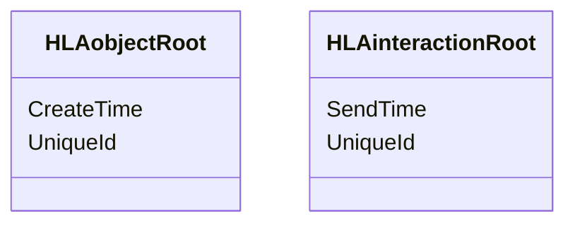
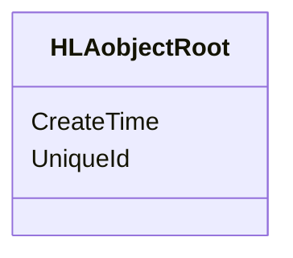
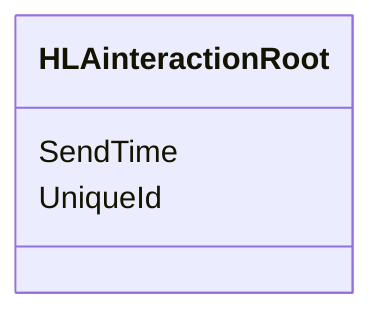

# NETN-BASE
|Version| Date| Dependencies|
|---|---|---|
|3.0|2024-03-10|RPR-Base|

The NATO Education and Training Network Base (NETN-BASE) Module provides standard definitions of datatypes used by NETN modules. It depends on the RPR-BASE Module.

## Overview
               
NETN-BASE defines attributes and parameters for the HLA object and interaction root classes. These attributes and parameters are available for all object and interaction classes in all NETN-FOM modules.
 

                                

## Identifiers
                
The NETN-FOM uses Universally Unique Identifiers (UUID) as defined in ISO/IEC 9834-8:2014.

An NETN-federate shall publish the `UniqueId` attribute for all objects it creates in the federation. The value of this attribute can either be predefined, e.g., based on scenario data or generated using standard methods for generating UUID. It is the responsibility of the federate to update the attributes to ensure uniqueness in the federation. 

A non-NETN federate does not publish the `UniqueId` attribute. Therefore, it becomes unowned and available for acquisition for objects registered by non-NETN federates. In a NETN federation, the ownership of all unowned required attributes, such as `UniqueId`, shall be acquired and published by a NETN federate.

The NETN-FOM also uses UUID to reference objects and relies on federates to resolve references.

Other unique identifiers may be required for compatibility with RPR-FOM, e.g., the `EntityIdentifier` attribute for the RPR-FOM `BaseEntity` object class.

The NETN-BASE also defines an optional `UniqueId` parameter for the `HLAinteractionRoot` interaction class. This parameter's primary purpose is to allow subsequent interactions, e.g., acknowledgements, to reference a previously sent interaction. 
    
## Time 
    
Logical time (or Simulation Time) coordinates and synchronizes data exchange in a distributed simulation. HLA time management services can control the advancement of logical time. To pace logical time, use wall-clock time to manage a real-time or scaled real-time simulation. The RPR-FOM handles synchronization by timestamping each update and relying on synchronized system clocks to advance time. Logical time representation and the methods for synchronizing the advancing of time in a distributed simulation can vary between different federations. The NETN-FOM does not specify or require any specific method for synchronizing logical time. Use federation agreements to clarify the synchronization method.

Scenario time is displayed to simulation operators working with the actual scenario. Scenario time can be linked to the pace of logical time advancement but is an independent representation. For example, during simulation, the logical time is strictly increasing (much like wall-clock time) and can never move backwards. However, scenario time may move forward or backwards.

In NETN, the scenario time is defined as seconds since Epoch, where Epoch is defined in federation agreements, e.g. January 1, 1970, 00:00:00 UTC.

The NETN-BASE module defines the optional HLAobjectRoot attribute `CreateTime` for timestamping objects with the scenario time corresponding to the time the object was created in the federation. Similarly, the optional HLAinteractionRoot parameter `SendTime` represents the time in the scenario when the interaction was sent.
                

## Object Classes

### HLAobjectRoot

|Attribute|Datatype|Semantics|
|---|---|---|
|CreateTime|EpochTime|Optional: The time in the scenario when the object is created.|
|UniqueId|UUID|Required. A unique identifier for the object. The Universally Unique Identifier (UUID) is generated or pre-defined.|

## Interaction Classes

### HLAinteractionRoot

|Parameter|Datatype|Semantics|
|---|---|---|
|SendTime|EpochTime|Optional: Scenario time when the interaction was sent. Default is interpreted as the receivers scenario time when the interaction is received.|
|UniqueId|UUID|Optional: A unique identifier for the interaction.|

## Datatypes

Note that only datatypes defined in this FOM Module are listed below. Please refer to FOM Modules on which this module depends for other referenced datatypes.

### Overview
|Name|Semantics|
|---|---|
|ActiveStatusEnum8|A state which indicates the status of an object concerning its participation in the simulation. An object in an inactive state is not simulated and does not interact with other objects.|
|AggregateMissionEnum16|Represents the general class or nature of activity related to a simulated entity's mission.|
|AggregateStateFormationEnum32|Aggregate State-Formation [UID 205]|
|AltitudeMeterFloat64|Represents altitude relative to Mean Sea Level (MSL).|
|ArrayOfResourceStatus|The array of health states for a named resource.|
|ArrayOfSupplyStatus|A list of supply types and their quantity.|
|ArrayOfUuid|An array of Unique Identifiers expressed as UUIDs.|
|Callsign|An identifier for a simulated entity. Callsigns should be unique in the context in which they are used but are not required to be globally unique.|
|DamageStatusEnhancedEnum32|The damage status of an object.|
|DamageStatusEnum32|Damaged appearance|
|DirectionDegreesFloat32|The direction is measured clockwise relative to the true north. Calculate values outside the range [0, 360) as modulo 360.|
|EchelonEnum32|The echelon level of a unit.|
|EpochTime|Scenario time is seconds since Epoch, where Epoch, e.g. is January 1, 1970, 00:00:00 UTC or otherwise defined in federation agreements.|
|EquipmentSymbolAmplificationStruct|Text amplifiers for Equipment symbols.|
|FederateName|The name of a federate participating in an HLA federation. The value of this attribute corresponds to the `HLAfederateName` attribute of the MIM object class `HLAfederate`.|
|GeodeticCircle|A geodetic point and radius specifying a circle on the earth's surface (WGS84) where the radius is a great circle distance on the surface.|
|GeodeticLocation|A geodetic point, specified by latitude and longitude, with unspecified altitude. WGS84|
|GeodeticPath|A sequence of geodetic points defining a path.|
|GeodeticPoint|A geodetic point is specified by latitude, longitude and altitude.|
|GeodeticPolygon|A sequence of geodetic locations defines a geographical area bounded by a closed path where the first and last locations in the sequence are connected. Each point is a geodetic coordinate in WGS84 on the earth's surface, and each segment is a great circle between locations.|
|GeodeticQuadrangle|A latitude-longitude quadrangle is a region bounded by two meridians and two parallels.|
|HostilityStatusCodeEnum32|The value represents the perceived hostility status.|
|InstallationSymbolAmplificationStruct|Text amplifiers for Installation symbols.|
|LatitudeFloat64|An angular measurement that specifies the north–south position of a point on the surface. Latitude is an angle that ranges from –90 degrees at the south pole to 90 degrees at the north pole, with 0 at the Equator.|
|LocationStruct|The location of a point in space. Unless specified otherwise for the attribute, parameter, or datatype field using this datatype, the location is in the world coordinate system, as specified in IEEE Std 1278.1-2012 section 1.6.3.|
|LocationStructArray|Dynamic array of LocationStruct elements, may also contain no elements.|
|LongitudeFloat64|An angular measurement that specifies the east–west position of a point on the surface. Longitude is an angle that ranges from –180 degrees to +180 degrees, with 0 at the prime meridian.|
|MassConcentrationFloat32|The concentration of a substance.|
|MassDensityFloat32|The density of a substance.|
|QuantityFloat64|A generic floating-point quantity.|
|QuantityInt32|A generic discrete quantity.|
|ResourceStatusStruct|The name of a resource and the number of instances of that resource by health status.|
|SupplyStatusStruct|Represents a single supply type and the quantity being offered or requested.|
|SymbolAmplificationVariant|Different symbol amplification data for different types of symbols.|
|SymbolIdentifier|A symbol identifier is represented as a string. The identifier uses a URI notation (uri:xxxxxxxxxx) where the URI moniker specifies the symbology standard, e.g. app6a, app6b, app6c, 2525b, 2525c, 2525d. If not provided, the federation agreement defines the default symbol standard.|
|SymbolStruct|Symbol Id and additional symbol amplification data.|
|SymbolTypeEnum|Type of symbol.|
|TimeMillisecondInt64|A generic representation of milliseconds.|
|TransmitterOperationalStatusEnum8|The current operational state of a radio transmitter.|
|UUID|RFC 4122, section 4.1.2 using 16 bytes. Also referred to as Variant 1 or RFC 4122/DCE 1.1 UUIDs. For example, 00112233-4455-8877-6699-aabbccddeeff is encoded as the bytes 00 11 22 33 44 55 88 77 66 99 aa bb cc dd ee ff.|
|UnitSymbolAmplificationStruct|Text amplifiers for Unit symbols.|
        
### Simple Datatypes
|Name|Units|Semantics|
|---|---|---|
|AltitudeMeterFloat64|Meter|Represents altitude relative to Mean Sea Level (MSL).|
|DirectionDegreesFloat32|Degree|The direction is measured clockwise relative to the true north. Calculate values outside the range [0, 360) as modulo 360.|
|EpochTime|seconds|Scenario time is seconds since Epoch, where Epoch, e.g. is January 1, 1970, 00:00:00 UTC or otherwise defined in federation agreements.|
|LatitudeFloat64|Degree|An angular measurement that specifies the north–south position of a point on the surface. Latitude is an angle that ranges from –90 degrees at the south pole to 90 degrees at the north pole, with 0 at the Equator.|
|LongitudeFloat64|Degree|An angular measurement that specifies the east–west position of a point on the surface. Longitude is an angle that ranges from –180 degrees to +180 degrees, with 0 at the prime meridian.|
|MassConcentrationFloat32|kg/m3|The concentration of a substance.|
|MassDensityFloat32|kg/m3|The density of a substance.|
|QuantityFloat64|NA|A generic floating-point quantity.|
|QuantityInt32|NA|A generic discrete quantity.|
|TimeMillisecondInt64|Millisecond (ms)|A generic representation of milliseconds.|
        
### Enumerated Datatypes
|Name|Representation|Semantics|
|---|---|---|
|ActiveStatusEnum8|HLAoctet|A state which indicates the status of an object concerning its participation in the simulation. An object in an inactive state is not simulated and does not interact with other objects.|
|AggregateMissionEnum16|HLAinteger16BE|Represents the general class or nature of activity related to a simulated entity's mission.|
|AggregateStateFormationEnum32|RPRunsignedInteger32BE|Aggregate State-Formation [UID 205]|
|DamageStatusEnhancedEnum32|HLAinteger32BE|The damage status of an object.|
|DamageStatusEnum32|RPRunsignedInteger32BE|Damaged appearance|
|EchelonEnum32|HLAinteger32BE|The echelon level of a unit.|
|HostilityStatusCodeEnum32|HLAinteger32BE|The value represents the perceived hostility status.|
|SymbolTypeEnum|HLAinteger32BE|Type of symbol.|
|TransmitterOperationalStatusEnum8|HLAoctet|The current operational state of a radio transmitter.|
        
### Array Datatypes
|Name|Element Datatype|Semantics|
|---|---|---|
|ArrayOfResourceStatus|ResourceStatusStruct|The array of health states for a named resource.|
|ArrayOfSupplyStatus|SupplyStatusStruct|A list of supply types and their quantity.|
|ArrayOfUuid|UUID|An array of Unique Identifiers expressed as UUIDs.|
|Callsign|HLAunicodeChar|An identifier for a simulated entity. Callsigns should be unique in the context in which they are used but are not required to be globally unique.|
|FederateName|HLAunicodeChar|The name of a federate participating in an HLA federation. The value of this attribute corresponds to the `HLAfederateName` attribute of the MIM object class `HLAfederate`.|
|GeodeticPath|GeodeticPoint|A sequence of geodetic points defining a path.|
|GeodeticPolygon|GeodeticLocation|A sequence of geodetic locations defines a geographical area bounded by a closed path where the first and last locations in the sequence are connected. Each point is a geodetic coordinate in WGS84 on the earth's surface, and each segment is a great circle between locations.|
|LocationStructArray|LocationStruct|Dynamic array of LocationStruct elements, may also contain no elements.|
|SymbolIdentifier|HLAunicodeChar|A symbol identifier is represented as a string. The identifier uses a URI notation (uri:xxxxxxxxxx) where the URI moniker specifies the symbology standard, e.g. app6a, app6b, app6c, 2525b, 2525c, 2525d. If not provided, the federation agreement defines the default symbol standard.|
|UUID|HLAbyte|RFC 4122, section 4.1.2 using 16 bytes. Also referred to as Variant 1 or RFC 4122/DCE 1.1 UUIDs. For example, 00112233-4455-8877-6699-aabbccddeeff is encoded as the bytes 00 11 22 33 44 55 88 77 66 99 aa bb cc dd ee ff.|
        
### Fixed Record Datatypes
|Name|Fields|Semantics|
|---|---|---|
|EquipmentSymbolAmplificationStruct|Quantity, StaffComments, AdditionalInformation, EvaluationRating, SignatureEquipment, Hostile, IFF_SIF_AIS, UniqueDesignation, EquipmentType, EngagementBarText|Text amplifiers for Equipment symbols.|
|GeodeticCircle|CenterPoint, Radius|A geodetic point and radius specifying a circle on the earth's surface (WGS84) where the radius is a great circle distance on the surface.|
|GeodeticLocation|Latitude, Longitude|A geodetic point, specified by latitude and longitude, with unspecified altitude. WGS84|
|GeodeticPoint|Latitude, Longitude, Altitude|A geodetic point is specified by latitude, longitude and altitude.|
|GeodeticQuadrangle|Point1, Point2|A latitude-longitude quadrangle is a region bounded by two meridians and two parallels.|
|InstallationSymbolAmplificationStruct|StaffComments, AdditionalInformation, EvaluationRating, CombatEffectiveness, IFF_SIF_AIS, UniqueDesignation, EngagementBarText|Text amplifiers for Installation symbols.|
|LocationStruct|X, Y, Z|The location of a point in space. Unless specified otherwise for the attribute, parameter, or datatype field using this datatype, the location is in the world coordinate system, as specified in IEEE Std 1278.1-2012 section 1.6.3.|
|ResourceStatusStruct|NumberHealthyOrIntact, NumberSlightlyDamaged, NumberModeratelyDamaged, NumberSignificantlyDamaged, NumberDestroyed, ResourceName, ResourceType|The name of a resource and the number of instances of that resource by health status.|
|SupplyStatusStruct|SupplyType, Quantity|Represents a single supply type and the quantity being offered or requested.|
|SymbolStruct|Id, Amplification|Symbol Id and additional symbol amplification data.|
|UnitSymbolAmplificationStruct|StaffComments, AdditionalInformation, EvaluationRating, CombatEffectiveness, HigherFormation, IFF_SIF_AIS, UniqueDesignation, SpecialHeadquarters, EngagementBarText|Text amplifiers for Unit symbols.|
        
### Variant Record Datatypes
|Name|Discriminant (Datatype)|Alternatives|Semantics|
|---|---|---|---|
|SymbolAmplificationVariant|SymbolType (SymbolTypeEnum)|UnitSymbol, EquipmentSymbol, InstallationSymbol|Different symbol amplification data for different types of symbols.|
    