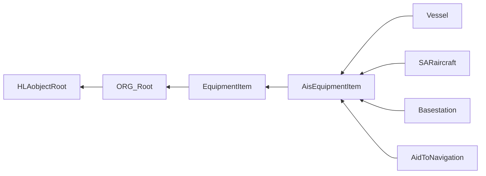
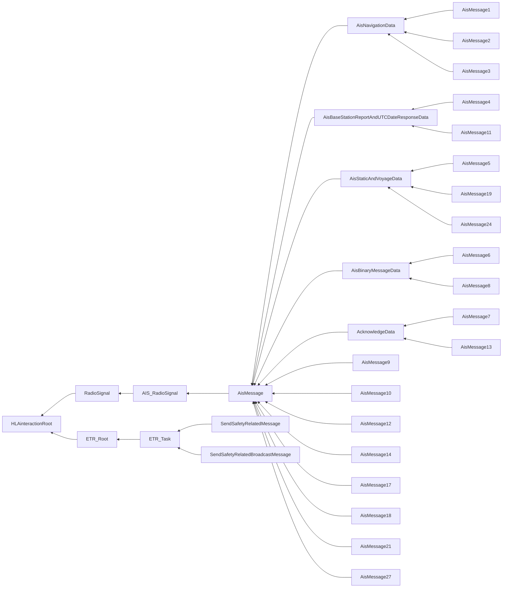

# NETN-AIS
|Version| Date| Dependencies|
|---|---|---|
|1.1|2023-03-25|NETN-BASE, RPR-Communication, NETN-ORG, NETN-ETR|

The purpose of the NATO Education and Training Network (NETN) Automatic Identification System (AIS) Module is to:     
        
* represent vessel traffic in a simulation using AIS messages to for example communicate position status reports of vessels   
* enable the exchange of AIS messages between HLA Federate Applications in both a real-time and non-real-time platform-level simulation   
* allow HLA Federate Applications to use regular HLA interaction classes and parameters to represent vessel information, and leave the translation to the physical message format in ITU-R M.1371-5 to for example dedicated gateways.  

The NETN-AIS FOM module defines most of the AIS message types, whose content can be interpreted by applications without extensive knowledge of the ITU-R M.1371-5 standard and the message format defined by that standard. 

The Automatic Identification System (AIS) is a worldwide automated tracking system used on vessels and by Vessel Traffic Services (VTS) for identifying and locating vessels by electronically exchanging messages with other nearby vessels and VTS stations. 27 message types are defined in ITU-R M.1371-5 Annex 8 (see https://www.itu.int). The most commonly used message types are the Position Report Class A (Message types 1,2, and 3) and the Static and Voyage Related Data (Message type 5). And a commonly used live protocol to exchange AIS messages is NMEA-0183. This is an electrical and data specification for communication between marine electronics (see https://www.nmea.org).

The NETN-AIS FOM module defines all of the messages types specified in ITU-R M.1371-5 Annex 8, except for rarely used message types or message types that are more related to traffic analysis in an AIS network (i.e. 15, 16, 20, 22, 23, 25 and 26). The FOM class structure is closely aligned with the message type specification in ITU-R M.1371-5 Annex 8, enabling easy translation to/from NMEA 0183. The message types are modelled as interaction classes and most of the class parameters are optional. The root class `AisMessage` is integrated with the RPR-FOM by subclassing `RadioSignal`, using the concept of `HostRadioIndex` to refer to the `RadioTransmitter` object instance on board the vessel.

The NETN-AIS FOM module content is based on ITU-R M.1371-5, Technical characteristics for an automatic identification system using time division multiple access in the VHF maritime mobile frequency band (https://www.itu.int).

The NETN-AIS FOM module is simulation oriented and does not focus on the physical message format as defined by ITU-R M.1371-5. However, the FOM is aligned well with ITU-R M.1371-5, enabling relatively easy mapping to/from the message format defined in ITU-R M.1371-5.

## Overview

The NETN-AIS FOM module covers the following:

* AIS messages are represented as `AisMessage` interactions extending the RPR-Communication FOM Module `RadioSignal` interaction class.
* AIS-specific entity tasking interactions that extend the NETN-ETR FOM module `ETR_Task` interaction class.
* AIS stations are represented as `AisEquipmentItem` objects that extend `EquipmentItem` defined in the NETN-ORG FOM module.

### AIS messages

The following AIS message types are included:

| Message type | Description |
| --- | --- |
| 1 | **Position Report Class A**. Message type for a scheduled position report; Class A shipborne mobile equipment. This message transmits information about the navigation of a ship: Longitude and latitude, time, heading, speed, ships navigation status, e.g. under power, at anchor. This message is transmitted every 2 to 10 seconds while underway, and every 3 minutes while at anchor. |
| 2 | Idem. |
| 3 | Idem. |
| 4 | **Base Station Report**. This message is to be used by fixed-location base stations to report a position and time reference periodically. |
| 5 | **Static and Voyage Related Data**. This message type is transmitted every 6 minutes and should only be used by Class A shipborne and SAR aircraft AIS stations when reporting static or voyage related data. |
| 6 | **Binary Addressed Message**. This message type is an addressed point-to-point message with an unspecified binary payload. |
| 7 | **Binary Acknowledge**. This message type is a receipt acknowledgement to the senders of a previous message of Message Type 6. Total length varies depending on the number of destination MMSIs included (1..4). |
| 8 | **Binary Broadcast Message**. This message type is a broadcast message with a binary payload. |
| 9 | **Standard SAR Aircraft Position Report**. Tracking information for search-and-rescue aircraft. |
| 10 | **UTC/Date Inquiry**. Request for UTC/Date information from an AIS base station. |
| 11 | **UTC/Date Response**. Identical to Message Type 4, with the semantics of a response to an inquiry. This message type is only transmitted from a mobile station as a result of a UTC request message (Message Type 10). |
| 12 | **Addressed Safety-Related Message**. This is a point-to-point text message. The payload is interpreted as a six-bit text. |
| 13 | **Safety-Related Acknowledgement**. This message type is a receipt acknowledgement to senders of previous messages of Message Type 12. |
| 14 | **Safety-Related Broadcast Message**. This is a broadcast text message. The payload is interpreted as a six-bit text. |
| 17 | **DGNSS Broadcast Binary Message**. This message type is used to broadcast differential corrections for GPS. The data in the payload is intended to be passed directly to GPS receivers capable of accepting such corrections. |
| 18 | **Standard Class B CS Position Report**. A less detailed report than message types 1-3 for vessels using Class B transmitters. The navigational status and rate of turn is not included in this message type. |
| 19 | **Extended Class B CS Position Report**. A slightly more detailed report than Message Type 18 for vessels using Class B transmitters. The navigational status and rate of turn is not included in this message type. The fields are as defined in the common navigation block and the Message Type 5 message. |
| 21 | **Aid-to-Navigation Report**. Identification and location message to be emitted by aids to navigation such as buoys and lighthouses. |
| 24 | **Static Data Report**. The equivalent of Message Type 5 for ships using Class B equipment. They are also used to associate an MMSI with a name on either class A or class B equipment. This message type may be in part A or part B format. According to the standard, parts A and B are expected to be broadcast in adjacent pairs. |
| 27 | **Long Range AIS Broadcast message**. This message type is primarily intended for long-range detection of AIS Class A equipped vessels (typically by satellite). This message has similar content to Messages 1, 2 and 3, but the total number of bits is compressed to allow for increased propagation delays associated with long-range detection. |

Many of the `AisMessage` class parameters are optional. For each optional parameter, a default value is defined that can be assumed by the receiving HLA federate if no parameter value is provided.

To include a minimum amount of navigation data in the message and make the message useful, the following optional parameters should be provided:

|Parameter|Semantics|
|---|---|
|Position|Optional (Default: not available). AIS (Lat,Lon) position.|
|UTCtime|Optional (Default: not available). Time of report.|

Note that the AIS position in the NETN-AIS FOM module is defined as a `GeodeticLocation` datatype. This is different from ITU-R M.1371-5, where Longitude and Latitude are represented in 1/10 000 min and stored in a 28 and 27-bit field, respectively. However, the class and parameter structure is such that the mapping between the NETN-AIS FOM and ITU-R M.1371-5 is straightforward.

#### Encoding of a six-bit character string

Several parameters are typed as six-bit character strings—for example, vessel name and callsign. The parameter data type of a six-bit character string is `HLAASCIIstring`, and the following table shows the ASCII character to be used for each six-bit character.

| six-bit | dec | char | six-bit | dec | char | six-bit | dec | char | six-bit | dec | char |
| ------ | ---- | ---- | ------ | ---- | ---- | ------ | ---- | ---- | ------ | ---- | ---- |
| 000000 | 0 | "@" | 010000 | 16 | "P" | 100000 | 32 | " " | 110000 | 48 | "0" |
| 000001 | 1 | "A" | 010001 | 17 | "Q" | 100001 | 33 | "!" | 110001 | 49 | "1" |
| 000010 | 2 | "B" | 010010 | 18 | "R" | 100010 | 34 | """ | 110010 | 50 | "2" |
| 000011 | 3 | "C" | 010011 | 19 | "S" | 100011 | 35 | "\#" | 110011 | 51 | "3" |
| 000100 | 4 | "D" | 010100 | 20 | "T" | 100100 | 36 | "$" | 110100 | 52 | "4" |
| 000101 | 5 | "E" | 010101 | 21 | "U" | 100101 | 37 | "%" | 110101 | 53 | "5" |
| 000110 | 6 | "F" | 010110 | 22 | "V" | 100110 | 38 | "&" | 110110 | 54 | "6" |
| 000111 | 7 | "G" | 010111 | 23 | "W" | 100111 | 39 | "\'" | 110111 | 55 | "7" |
| 001000 | 8 | "H" | 011000 | 24 | "X" | 101000 | 40 | "(" | 111000 | 56 | "8" |
| 001001 | 9 | "I" | 011001 | 25 | "Y" | 101001 | 41 | ")" | 111001 | 56 | "9" |
| 001010 | 10 | "J" | 011010 | 26 | "Z" | 101010 | 42 | "\*" | 111010 | 58 | ":" |
| 001011 | 11 | "K" | 011011 | 27 | "[" | 101011 | 43 | "\+" | 111011 | 59 | ";" |
| 001100 | 12 | "L" | 011100 | 28 | "\" | 101100 | 44 | "," | 111100 | 60 | "<" |
| 001101 | 13 | "M" | 011101 | 29 | "]" | 101101 | 45 | "-" | 111101 | 61 | "=" |
| 001110 | 14 | "N" | 011110 | 30 | "\^" | 101110 | 46 | "." | 111110 | 62 | ">" |
| 001111 | 15 | "O" | 011111 | 31 | "\_" | 101111 | 47 | "/" | 111111 | 63 | "?" |

#### RadioTransmitter

An AIS Radio Signal can be associated with a `RadioTransmitter` object instance. The required attributes of the `RadioTransmitter` object instance can be assigned the following values:

| Attribute | Semantics | Value |
| --- | --- | --- |
| Frequency | Center frequency of the radio transmissions, specified in Herz. | `162000000` Hz |
| FrequencyBandwidth | Bandpass of the radio transmissions, specified in Hertz. | `25000` Hz |
| RadioIndex | Specifies the identification number for each radio on a given host. This value shall not change during simulation execution. | Per agreement. If the `RadioTransmitter` is the only radio for the vessel, the index `0` should be used. |
| RadioSystemType | Entity type of the radio transmitter: Kind, Domain, Country, Category. This value shall not change during simulation execution. Note that no further refinement of the type (subcategory etc.) is defined. The country value `0` should be replaced by the actual value. | `7.3.0.37` |
| TransmittedPower | The average power being transmitted in units of decibel-milliwatts. | `12.5` watt for class A (`41` dBm), `5` watt for class B/SO (`37` dBm), and `2` watt for class B/CS (`33` dBm). |
| TransmitterOperationalStatus | On/Off state of the transmitter as an enumeration. | `Off`, `OnButNotTransmitting` or `OnAndTransmitting` |
| WorldLocation | Location of the antenna in world coordinates. | The vessel position. |

### NETN-ETR extensions

The NETN-ETR `ETR_Task` extensions are summarized in the following table.

| Name | Semantics |
| --- | --- |
| SendSafetyRelatedMessage | Tasks entity (the source) to send a safety related message (AIS message type 12) to another entity (the destination). Both source and destination must represent an AIS station (vessel, SAR aircraft, etc). |
| SendSafetyRelatedBroadcastMessage | Tasks entity (the source) to send a safety related broadcast message (AIS message type 14). The source must represent an AIS station (vessel, SAR aircraft, etc). |

### NETN-ORG extensions

The NETN-ORG `EquipmentItem` extensions are summarized in the following table.

|Name|Semantics|
|---|---|
|AisEquipmentItem|This class defines additional attributes for AIS equipment. Depending on the kind of AIS equipment, further attributes are added in sub-classes.|
|Vessel|This class defines additional attributes for vessel equipment.|
|SARaircraft|This class defines additional attributes for SAR aircraft equipment.|
|Basestation|This class defines additional attributes for basestation equipment.|
|AidToNavigation|This class defines additional attributes for aid to navigation (ATON) equipment.|

The `AisEquipmentItem` defines, amongst others, the `RadioSystemType` of the AIS station. The `RadioSystemType` should be used by the federate to initialize the `RadioTransmitter` object instance. Entity type values that may be used for the `RadioSystemType` are:

- `7.3.0.37.0.0.0` for a default AIS transmitter that relates to the AIS station modelled
- `7.3.0.37.1.0.0` for a class A transmitter
- `7.3.0.37.2.0.0` for a class B/SO (Self-Organizing) transmitter
- `7.3.0.37.3.0.0` for a class B/CS (Carrier-Sense) transmitter

See Radio Kind in the SISO Enumerations, [UID 22] for categories. By adding a subcategory (i.e. `1`,`2`, etc., not defined in the SISO Enumerations), it is possible to identify the specific type of transmitter, namely class A, B/SO, or B/CS in this example. These non-standard subcategory values should be defined as part of the federation agreements. The country code value `0` in this example should be replaced by the appropriate value.

In addition, the NETN-ORG MSDL schema is extended with an AIS schema. This enables persistent storage of AIS-related ORBAT data in the same file as the rest of the ORBAT data.

## Object Classes

Note that inherited and dependency attributes are not included in the description of object classes.

### AisEquipmentItem

This class defines additional attributes for AIS equipment. Depending on the kind of AIS equipment, further attributes are added in sub-classes.

|Attribute|Datatype|Semantics|
|---|---|---|
|MMSI|MMSIType|Optional. The MMSI number (Maritime Mobile Service Identity) of the AIS station.  If the value is not provided then the subscribing federate that is responsible for the modelling of the AIS station shall generate a value. Note that the value of each AIS station must be  unique across all AIS stations in the simulation. Reuse of MMSI numbers if not advised since some systems may retain dead tracks for some time.|
|TransmitterStatus|TransmitterOperationalStatusEnum8|Optional. The initial status of the AIS Transmitter(s) of the AIS station. If the value is not provided then the value shall be assumed to be ON.|
|RadioSystemType|EntityTypeStruct|Optional. The type of transmitter. If the value is not provided then the subscribing federate that is responsible for the modelling of the AIS station shall determine the type of transmitter.|

### Vessel

This class defines additional attributes for vessel equipment.

|Attribute|Datatype|Semantics|
|---|---|---|
|IMO|IMOType|Optional. The International Maritime Organization (IMO) number to identify the vessel. If the value is not provided then the subscribing federate that is responsible for the modelling of the vessel shall generate a value.|

### SARaircraft

This class defines additional attributes for SAR aircraft equipment.

### Basestation

This class defines additional attributes for basestation equipment.

### AidToNavigation

This class defines additional attributes for aid to navigation (ATON) equipment.

## Interaction Classes

Note that inherited and dependency parameters are not included in the description of interaction classes.

### AIS_RadioSignal

This is the root interaction class for all AIS messages. The interaction class contains a reference to the embedded system that represents the AIS transmitter. The embedded system should be modelled as a RadioTransmitter, an RPR-FOM object class that is subclassed from Embedded System.

|Parameter|Datatype|Semantics|
|---|---|---|
|HostRadioIndex|RTIobjectId|Optional (Default: not available). The HostRadioIndex is a unique string that identifies the name of the RadioTransmitter object.|

### AisMessage

Super class for all AIS message types.

|Parameter|Datatype|Semantics|
|---|---|---|
|MessageId|MsgIdEnumType|Required. Message type identifier.|
|UserId|MMSIType|Required. The message is from the vessel identified by this MMSI.|

### AisNavigationData

Message Types 1, 2 and 3 share a common reporting structure for navigational data, captured in this class.

|Parameter|Datatype|Semantics|
|---|---|---|
|NavigationalStatus|NavigationStatusEnumType|Optional (Default: not defined). Navigational status.|
|RateOfTurn|DegreesPerSecondFloat32|Optional (Default: not available). Rate of turn.|
|SpeedOverGround|VelocityMeterPerSecondFloat32|Optional (Default: not available). Speed over the ground.|
|Position|GeodeticLocation|Optional (Default: not available). AIS (Lat,Lon) position.|
|CourseOverGround|DirectionDegreesFloat32|Optional (Default: not available). Course over the ground.|
|TrueHeading|DirectionDegreesFloat32|Optional (Default: not available). True heading.|
|UTCtime|EpochTimeSecInt64|Optional (Default: not available). Time of the report.|
|SpecialManeuverIndicator|ManeuverIndicatorEnumType|Optional (Default: not available). Maneuver indication.|

### AisMessage1

Message Type 1: Position Report Class A. 
 
Message type for a scheduled position report; Class A shipborne mobile equipment. This message transmits information pertaining to a ships navigation: Longitude and latitude, time, heading, speed, ships navigation status (under power, at anchor...). This message is transmitted every 2 to 10 seconds while underway, and every 3 minutes while at anchor.

### AisMessage2

Message Type 2: Position Report Class A. 
 
Message type for an assigned scheduled position report; Class A shipborne mobile equipment. This message transmits information pertaining to a ships navigation: Longitude and latitude, time, heading, speed, ships navigation status (under power, at anchor...). This message is transmitted every 2 to 10 seconds while underway, and every 3 minutes while at anchor.

### AisMessage3

Message Type 3: Position Report Class A. 
 
Message type for a special position report, response to interrogation; Class A shipborne mobile equipment. This message transmits information pertaining to a ships navigation: Longitude and latitude, time, heading, speed, ships navigation status (under power, at anchor...). This message is transmitted every 2 to 10 seconds while underway, and every 3 minutes while at anchor.

### AisBaseStationReportAndUTCDateResponseData

Common reporting structure for Message Types 4 and 11 for reporting UTC time and date and, at the same time, position. It is also used by AIS stations for determining if the station is within 120 NM for response to Messages Types 20 and 23.

|Parameter|Datatype|Semantics|
|---|---|---|
|UTCtime|EpochTimeSecInt64|Optional (Default: not available). Time of report.|
|Position|GeodeticLocation|Optional (Default: not available). AIS (Lat,Lon) position.|

### AisMessage4

Message Type 4: Base Station Report. 
 
This message is to be used by fixed-location base stations to periodically report a position and time reference.

### AisMessage11

Message Type 11: UTC/Date Response. 
 
Identical to Message Type 4, with the semantics of a response to inquiry. This message type is only transmitted from a mobile station as a result of a UTC request message (Message Type 10).

### AisStaticAndVoyageData

Common Static and Voyage Data for Message Types 5, 19 and 24.

|Parameter|Datatype|Semantics|
|---|---|---|
|Callsign|HLAASCIIstring|Required. 7 six-bit characters for the callsign.|
|Name|HLAASCIIstring|Required. 20 six-bit characters for the name.|
|ShipType|ShipTypeType|Optional (Default: not available). Ship type.|
|DimensionBow|LengthMeterFloat32|Optional (Default: not available). GPS Ant. distance from the bow.|
|DimensionStern|LengthMeterFloat32|Optional (Default: not available). GPS Ant. distance from the stern.|
|DimensionPort|LengthMeterFloat32|Optional (Default: not available). GPS Ant. distance from the port.|
|DimensionStarboard|LengthMeterFloat32|Optional (Default: not available). GPS Ant. distance from starboard.|

### AisMessage5

Message Type 5: Static and Voyage-Related Data. 
 
This message type is transmitted every 6 minutes and should only be used by Class A shipborne and SAR aircraft AIS stations when reporting static or voyage-related data.

|Parameter|Datatype|Semantics|
|---|---|---|
|IMO|IMOType|Optional (Default: zero). The IMO ship ID number. Not applicable to SAR aircraft.|
|ETAtime|EpochTimeSecInt64|Optional (Default: not available). Estimated time of arrival. Not applicable to SAR aircraft.  If a zero value is provided then this shall be interpreted as not available.|
|Draught|DraughtMeterFloat32|Optional (Default: not available). Maximum present static draught.|
|Destination|HLAASCIIstring|Optional (Default: not available, 20 six-bit "@" value). 20 six-bit characters for the destination. For SAR aircraft, the use of this field may be decided by the responsible administration.|

### AisMessage19

Message Type 19: Extended Class B CS Position Report. 
 
A slightly more detailed report than Message Type 18 for vessels using Class B transmitters. Omits navigational status and rate of turn. Fields are as in the common navigation block and the Message Type 5 message.

|Parameter|Datatype|Semantics|
|---|---|---|
|SpeedOverGround|VelocityMeterPerSecondFloat32|Optional (Default: not available). Speed over the ground.|
|Position|GeodeticLocation|Optional (Default: not available). AIS (Lat,Lon) position.|
|CourseOverGround|DirectionDegreesFloat32|Optional (Default: not available). Course over the ground.|
|TrueHeading|DirectionDegreesFloat32|Optional (Default: not available). True heading.|
|UTCtime|EpochTimeSecInt64|Optional (Default: not available). Time of the report.|

### AisMessage24

Message Type 24: Static Data Report. 
 
The equivalent of Message Type 5 for ships using Class B equipment. Also used to associate an MMSI with a name on either class A or class B equipment. This message type may be in part A or part B format. According to the standard, parts A and B are expected to be broadcast in adjacent pairs.

|Parameter|Datatype|Semantics|
|---|---|---|
|PartNumber|PartNumberEnumType|Required. Part number.|
|ManufacturerId|ManufacturerIdType|Required. (Part B) 3 six-bit chars.|
|UnitModel|UnitModelType|Required. (Part B) Unit Model Code.|
|SerialNumber|SerialNumberType|Required. (Part B) Serial Number.|

### AisBinaryMessageData

Binary Payload for Message Types 6 and 8. The interpretation of the binary payload is controlled by: 
- The Designated Area Code (DAC), is a jurisdiction code: 366 for the United States. It uses the same encoding as the area designator in MMMSIs; see [ITU-MID]. 1 designates international (ITU) messages. 
- The FID is the Functional ID for a message subtype. In some sources, this is abbreviated FI.

|Parameter|Datatype|Semantics|
|---|---|---|
|DesignatedAreaCode|DesignatedAreaCodeType|Required. Designated area code (DAC).|
|FunctionId|FunctionIdType|Required. Functional ID (FID).|
|Data|BinArrayType|Required. Binary data up to 920 bits.|

### AisMessage6

Message Type 6: Binary Addressed Message. 
 
This message type is an addressed point-to-point message with a binary payload.

|Parameter|Datatype|Semantics|
|---|---|---|
|Destination|MMSIType|Required. Destination MMSI.|

### AisMessage8

Message Type 8: Binary Broadcast Message. 
 
This message type is a broadcast message with a binary payload.

### AcknowledgeData

Acknowledge data for Message Types 7 and 13.

|Parameter|Datatype|Semantics|
|---|---|---|
|Destination1|MMSIType|Required. MMSI number 1.|
|Destination2|MMSIType|Optional (Default: not available). MMSI number 2.|
|Destination3|MMSIType|Optional (Default: not available). MMSI number 3.|
|Destination4|MMSIType|Optional (Default: not available). MMSI number 4.|

### AisMessage7

Message Type 7: Binary Acknowledge. 
 
This message type is a receipt acknowledgement to the senders of a previous messages of Message Type 6. Up to 4 destination MMSIs can be acknowledged in one message.

### AisMessage13

Message Type 13: Safety-Related Acknowledgement. 
 
This message type is a receipt acknowledgement to senders of previous messages of Message Type 12.

### AisMessage9

Message type 9: Standard SAR Aircraft Position Report. 
 
Tracking information for search-and-rescue aircraft.

|Parameter|Datatype|Semantics|
|---|---|---|
|Altitude|AltitudeMeterFloat64|Optional (Default: not available). Altitude.|
|SpeedOverGround|VelocityMeterPerSecondFloat32|Optional (Default: not available). Speed over the ground.|
|Position|GeodeticLocation|Optional (Default: not available). AIS (Lat,Lon) position.|
|CourseOverGround|DirectionDegreesFloat32|Optional (Default: not available). Course over the ground.|
|UTCtime|EpochTimeSecInt64|Optional (Default: not available). Time of the report.|

### AisMessage10

Message Type 10: UTC/Date Inquiry. 
 
Request for UTC/Date information from an AIS base station.

|Parameter|Datatype|Semantics|
|---|---|---|
|Destination|MMSIType|Required. Destination MMSI.|

### AisMessage12

Type 12: Addressed Safety-Related Message. 
 
This is a point-to-point text message. The payload is interpreted as six-bit text.

|Parameter|Datatype|Semantics|
|---|---|---|
|Destination|MMSIType|Required. Destination MMSI.|
|Message|HLAASCIIstring|Required. 1-156 chars of six-bit text.|

### AisMessage14

Type 14: Safety-Related Broadcast Message. 
 
This is a broadcast text message. The payload is interpreted as six-bit text.

|Parameter|Datatype|Semantics|
|---|---|---|
|Message|HLAASCIIstring|Required. 1-161 chars of six-bit text.|

### AisMessage17

Message Type 17: DGNSS Broadcast Binary Message. 
 
This message type is used to broadcast differential corrections for GPS.

|Parameter|Datatype|Semantics|
|---|---|---|
|Position|GeodeticLocation|Optional (Default: not available). Position data.|

### AisMessage18

Message Type 18: Standard Class B CS Position Report. 
 
A less detailed report than message types 1-3 for vessels using Class B transmitters. Omits navigational status and rate of turn.

|Parameter|Datatype|Semantics|
|---|---|---|
|SpeedOverGround|VelocityMeterPerSecondFloat32|Optional (Default: not available). Speed over the ground.|
|Position|GeodeticLocation|Optional (Default: not available). AIS (Lat,Lon) position.|
|CourseOverGround|DirectionDegreesFloat32|Optional (Default: not available). Course over the ground.|
|TrueHeading|DirectionDegreesFloat32|Optional (Default: not available). True heading.|
|UTCtime|EpochTimeSecInt64|Optional (Default: not available). Time of the report.|

### AisMessage21

Message Type 21: Aid-to-Navigation Report. 
 
Identification and location message to be emitted by aids to navigation such as buoys and lighthouses.

|Parameter|Datatype|Semantics|
|---|---|---|
|AidType|AidTypeEnumType|Optional (Default: not specified). Type of aid.|
|Name|HLAASCIIstring|Optional (Default: 34 six-bit @ characters). Up to max 34 six-bit characters for the name of the aid.|
|Position|GeodeticLocation|Optional (Default: not available). AIS (Lat,Lon) position.|
|DimensionBow|LengthMeterFloat32|Optional (Default: not available). Distance from the bow.|
|DimensionStern|LengthMeterFloat32|Optional (Default: not available). Distance from the stern.|
|DimensionPort|LengthMeterFloat32|Optional (Default: not available). Distance from the port.|
|DimensionStarboard|LengthMeterFloat32|Optional (Default: not available). Distance from starboard.|
|UTCtime|EpochTimeSecInt64|Optional (Default: not available). Time of the report.|
|OffPositionFlag|HLAboolean|Optional (Default: false). Off-Position Indicator. The Off-Position Indicator is for floating Aids-to-Navigation only: false means on position; true means off position. Only valid if UTCsecond is available.|
|VirtualFlag|HLAboolean|Optional (Default: false). Virtual-aid flag. The Virtual Aid flag is interpreted as follows: false = real Aid to Navigation at the indicated position; true = virtual Aid to Navigation simulated by nearby AIS station.|

### AisMessage27

Message Type 27: Long Range AIS Broadcast message. 
 
This message type is primarily intended for long-range detection of vessels equipped with AIS Class A (typically by satellite). This message has similar content to Messages 1, 2 and 3, but the total number of bits has been compressed to allow for increased propagation delays associated with long-range detection.

|Parameter|Datatype|Semantics|
|---|---|---|
|NavigationStatus|NavigationStatusEnumType|Optional (Default: not defined). Navigational status.|
|Position|GeodeticLocation|Optional (Default: not available). AIS (Lat,Lon) position.|
|SpeedOverGround|VelocityMeterPerSecondFloat32|Optional (Default: not available). Speed over the ground.|
|CourseOverGround|DirectionDegreesFloat32|Optional (Default: not available). Course over the ground.|

### SendSafetyRelatedMessage

Tasks entity (the source) to send a safety-related message (AIS message type 12) to another entity (the destination). 
 
Both source and destination must represent an AIS station (vessel, SAR aircraft, etc).

|Parameter|Datatype|Semantics|
|---|---|---|
|Entity|UUID|Required. The entity that represents the destination. This must be an AIS station.|
|Message|HLAASCIIstring|Required. 1-156 chars of six-bit text.|

### SendSafetyRelatedBroadcastMessage

Tasks entity (the source) to send a safety-related broadcast message (AIS message type 14). 
 
The source must represent an AIS station (vessel, SAR aircraft, etc).

|Parameter|Datatype|Semantics|
|---|---|---|
|Message|HLAASCIIstring|Required. 1-161 chars of six-bit text.|

## Datatypes

Note that only datatypes defined in this FOM Module are listed below. Please refer to FOM Modules on which this module depends for other referenced datatypes.

### Overview
|Name|Semantics|
|---|---|
|AidTypeEnumType|Enumeration value for the aid type. According to [IALA], the aid type field has values 1-15 for fixed and 16-31 for floating aids to navigation.|
|BinArrayType|Binary data.|
|DegreesPerSecondFloat32|The turn rate in degrees per second, where: (a) zero value: not turning; (b) positive value: turning right; (c) negative value: turning left.|
|DesignatedAreaCodeType|A 10-bit value. Designated area code (DAC).|
|DraughtMeterFloat32|The vertical distance between the waterline and the bottom of the hull (keel) including the thickness of the hull; Draught determines the minimum depth of water a ship or boat can safely navigate.|
|FunctionIdType|A 6-bit value. Functional ID (FID).|
|IMOType|A 30-bit value. The International Maritime Organization (IMO) number is a unique identifier for vessels. See https://www.itu.int/en/ITU-R. The IMO number is made of the three letters "IMO" followed by a seven-digit number. This number consists of a six-digit sequential unique number followed by a check digit. The integrity of an IMO number can be verified using its check digit. This is done by multiplying each of the first six digits by a factor of 2 to 7 corresponding to their position from right to left. The rightmost digit of this sum is the check digit. For example, for IMO 9074729: (9×7) + (0×6) + (7×5) + (4×4) + (7×3) + (2×2) = 139. This attribute represents the 7 digits value of the IMO number. The value shall be zero for not available (default). The value shall also be zero for inland vessels.|
|MMSIType|A 30-bit value. The MMSI number (Maritime Mobile Service Identity) is a unique nine-digit number for identifying an AIS station.|
|ManeuverIndicatorEnumType|Enumeration value to indicate a maneuver.|
|ManufacturerIdType|The manufacturer's mnemonic code consists of three 6-bit ASCII characters.|
|MsgIdEnumType|Enumeration value for the message type.|
|NavigationStatusEnumType|Enumeration value to indicate the navigational status.|
|PartNumberEnumType|Identifier for the message part number.|
|SerialNumberType|A 2-bit value. (Part B) Serial Number.|
|ShipTypeType|An 8-bit value. The type of ship and cargo. See https://www.itu.int/en/ITU-R.|
|UnitModelType|A 4-bit value. (Part B) Unit Model Code.|
        
### Simple Datatypes
|Name|Units|Semantics|
|---|---|---|
|DegreesPerSecondFloat32|Degrees/second|The turn rate in degrees per second, where: (a) zero value: not turning; (b) positive value: turning right; (c) negative value: turning left.|
|DesignatedAreaCodeType|NA|A 10-bit value. Designated area code (DAC).|
|DraughtMeterFloat32|Meter|The vertical distance between the waterline and the bottom of the hull (keel) including the thickness of the hull; Draught determines the minimum depth of water a ship or boat can safely navigate.|
|FunctionIdType|NA|A 6-bit value. Functional ID (FID).|
|IMOType|NA|A 30-bit value. The International Maritime Organization (IMO) number is a unique identifier for vessels. See https://www.itu.int/en/ITU-R. The IMO number is made of the three letters "IMO" followed by a seven-digit number. This number consists of a six-digit sequential unique number followed by a check digit. The integrity of an IMO number can be verified using its check digit. This is done by multiplying each of the first six digits by a factor of 2 to 7 corresponding to their position from right to left. The rightmost digit of this sum is the check digit. For example, for IMO 9074729: (9×7) + (0×6) + (7×5) + (4×4) + (7×3) + (2×2) = 139. This attribute represents the 7 digits value of the IMO number. The value shall be zero for not available (default). The value shall also be zero for inland vessels.|
|MMSIType|NA|A 30-bit value. The MMSI number (Maritime Mobile Service Identity) is a unique nine-digit number for identifying an AIS station.|
|SerialNumberType|NA|A 2-bit value. (Part B) Serial Number.|
|ShipTypeType|NA|An 8-bit value. The type of ship and cargo. See https://www.itu.int/en/ITU-R.|
|UnitModelType|NA|A 4-bit value. (Part B) Unit Model Code.|
        
### Enumerated Datatypes
|Name|Representation|Semantics|
|---|---|---|
|AidTypeEnumType|HLAoctet|Enumeration value for the aid type. According to [IALA], the aid type field has values 1-15 for fixed and 16-31 for floating aids to navigation.|
|ManeuverIndicatorEnumType|HLAoctet|Enumeration value to indicate a maneuver.|
|MsgIdEnumType|HLAoctet|Enumeration value for the message type.|
|NavigationStatusEnumType|HLAoctet|Enumeration value to indicate the navigational status.|
|PartNumberEnumType|HLAoctet|Identifier for the message part number.|
        
### Array Datatypes
|Name|Element Datatype|Semantics|
|---|---|---|
|BinArrayType|HLAboolean|Binary data.|
|ManufacturerIdType|HLAASCIIchar|The manufacturer's mnemonic code consists of three 6-bit ASCII characters.|
    
