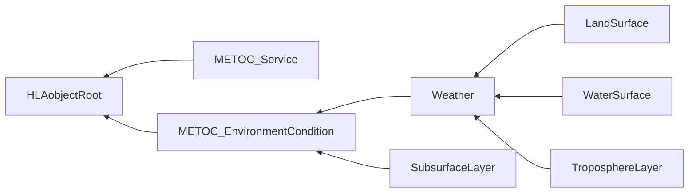
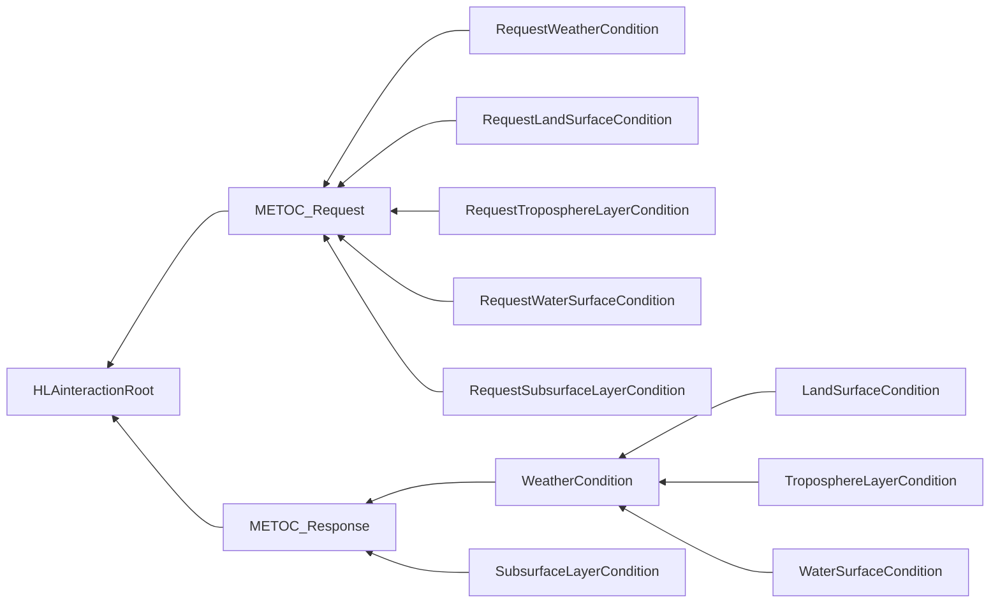

# NETN-METOC
|Version| Date| Dependencies|
|---|---|---|
|2.0|2023-04-13|NETN-BASE|

The purpose of the NATO Education and Training Network (NETN) Meteorological and Oceanographic (METOC) Module is to provide a standard way to exchange data related to weather conditions and the primary effects of weather on terrain and water surfaces in the atmosphere and subsurface water conditions. The main objective is to provide a reference model that represents a common core subset of METOC-related aspects and to allow the extension of the module to incorporate additional detail if required. Therefore, the NETN-METOC module is a reference FOM module where extensions are allowed and encouraged to meet federation-specific requirements fully.

This module specifies how to represent METOC-related data in a federated distributed simulation. The specification is based on IEEE 1516 High Level Architecture (HLA) Object Model Template (OMT) and supports interoperability in a federated simulation (federation) based on HLA.

Current weather conditions impact simulations such as platforms and sensors on the ground, sea, underwater and in the air. A correlated representation of these conditions is key to meeting interoperability and model requirements in a federated distributed simulation. Different simulations require different fidelity of weather conditions concerning data resolution and accuracy. The NETN-METOC focus on representing weather conditions for related surfaces and layers. The main difference is that a surface condition does not have a volume and only represents the conditions directly related to the surface of a piece of terrain or water. The layer conditions represent a volume of water or air with height/depth from surface and layer thickness. Environmental conditions have explicit locations or positions related to other simulated entities and objects in the synthetic environment.

NETN-METOC covers the most common levels of representation required by a large set of existing simulators.

## Overview 
 
Environment Conditions are either surface-based (land or water) or a layer (above terrain or below the water surface) and include either weather attributes or sub-surface (Water) attributes. 
 
* Tropospheric Layer Conditions cover the following aspects: Temperature, Winds, Precipitation, Haze, Humidity, Barometric Pressure, Visibility Range and Clouds. 
 
* Water Layer Conditions cover the following aspects: Temperature, Salinity, and Currents. 
 
* Land Surface Conditions cover the following aspects: Temperature, Winds, Precipitation, Haze, Humidity, Barometric Pressure, Visibility Range, Snow Condition, Moisture and Ice Condition 
 
* Water Surface Conditions cover the following aspects: Temperature, Winds, Precipitation, Haze, Humidity, Barometric Pressure, Visibility Range, Sea State, Salinity, Tide, Ice Conditions, Currents, Waves and Swell. 
 
* Subsurface Layer Conditions cover the following aspects: Temperature, Current, Salinity and BottomType. 
 
To exchange Environment Conditions, the NETN-METOC offers two methods of interaction. 
 
1. Pull: Request and Response pattern for Environment Conditions based on HLA Interaction Classes. 
2. Push: Request for Continuous updates of Environment Condition based on HLA Interactions and then updates of HLA Object instance attributes. 
 
One or both methods may be suitable depending on federation design and agreements. 
 
### Environment Condition 
 
Environment Conditions can be modelled by any federate to represent METOC data. Multiple overlapping `METOC_EnvironmentCondition` objects may exist, and subscribing federates should apply merge rules to calculate the resulting environment conditions. A METOC server may subscribe to multiple `METOC_EnvironmentCondition` objects and deliver correlated METOC data using a Request and Response pattern implemented as HLA interactions. 
 
Environment conditions are always related to either the entire synthetic environment (global), a static or dynamic location, a region or a layer. An environmental condition can be related to: 
* Specific geographical location 
* Specific geographical region 
* A specific simulated entity position 
* A volume of air 
* A body of water 
* A feature identified in a terrain database using Geography Markup Language (GML) identifiers 
 
#### Overlapping Environment Conditions 
If `METOC_EnvironmentCondition` with overlapping regions/locations exist, the following rules apply: 
 
* Wind Speed, Wind Direction, Precipitation Intensity, Temperature, Humidity, BarometricPressure, Snow Depth, and Snow Density are calculated as the average in the overlapping `METOC_EnvironmentCondition` 
* Visibility is calculated as the minimum visibility distance of the overlapping `METOC_EnvironmentCondition`. 
* Conflicting precipitation types are resolved according to the following precedence: Snow, Hail, Rain, and No Precipitation. E.g. If there is one overlapping `METOC_EnvironmentCondition` with Snow, the result is always Snow. 
* For the same Haze-type, the average density should be used. Multiple overlapping `METOC_EnvironmentCondition` with different Haze-type can exist. 
* Moisture is calculated as the highest enumerated value making the resulting value the one with the most moisture. 
* LandSurface ice condition is calculated as the highest enumerated value making the resulting value the one with the most severe ice condition. 
 
### Service 
 
A simulation capable of modelling environment conditions in the federated distributed environment registers a `METOC_Service` object instance and publishes information that specifies the source and type of the METOC data available. All METOC data in the federation refers to the producing `METOC_Service`, and requests for METOC data reference a specific service. 
 
Multiple METOC service providers may exist in a federation.

## Object Classes

Note that inherited and dependency attributes are not included in the description of object classes.

### METOC_Service

The available METOC services are objects in the federation.

|Attribute|Datatype|Semantics|
|---|---|---|
|Name|HLAunicodeString|Optional. Name of the METOC Service.|
|ModelType|WeatherModelTypeEnum32|Required. Type of METOC model provided by the service. Specifies whether the service delivers Simulated, Real (Historical), Live (Current) or Standard model data.|

### METOC_EnvironmentCondition

Root class for all types of environment condition objects. 
 
The `GeoReference` attribute defines the region where the EnvironmentCondition applies. 
 
If `GeoReference` is a geographical area, and the subclass in question has a surface (water/land), the environmental condition applies only within that area of the surface. 
 
If `GeoReference` is a geographical area, and the environmental condition defines a Layer attribute, it applies only within the volume bounded by the layer and the body described by projecting each point of the area along a line through the centre of the Earth. 
 
If `GeoReference` is an `RPREntityReference`, a NETNEntityReference or a GMLFeatureReference, the environment condition applies only to the immediate vicinity of the referenced entity/feature and any layer attribute is ignored. 
 
If not provided, the environment condition is considered global, only restricted by the semantics of its particular subclass.

|Attribute|Datatype|Semantics|
|---|---|---|
|GeoReference|GeoReferenceVariant|Optional. A geographical location, region, feature or simulated object.|
|Service|UUID|Optional. Identifies the METOC Service which produced the Environment Condition object.|

### Weather

The `Weather` object class represents typical weather-related attributes such as temperature, wind and precipitation but also details regarding barometric pressure, humidity, visual range and haze conditions.

|Attribute|Datatype|Semantics|
|---|---|---|
|Temperature|TemperatureDegreeCelsiusFloat32|Optional. The temperature in the region/location. Use the average temperature if overlapping weather regions/locations exist.|
|Wind|WindStruct|Optional. Wind speed and direction in the region/location. Use the average wind speed if overlapping weather regions/locations exist.|
|Precipitation|PrecipitationStruct|Optional. Current precipitation type and intensity in the region/location. The default is No Precipitation. Use the average intensity of overlapping weather regions/locations. Resolve conflicting precipitation types according to the following precedence: Snow, Hail, Rain, and No Precipitation. E.g. If there is one overlapping environment condition with Snow, the result is always Snow.|
|Haze|HazeStruct|Optional. Current Haze-type and density in the region/location specified by the Environment Condition. The default is No Haze. Use the average density for overlapping regions/locations with the same haze type.|
|Humidity|PercentFloat32|Optional. The humidity in the region/location. The default is 75% (Normal value). Use the average humidity if overlapping regions/locations exist.|
|BarometricPressure|AtmosphericPressureFloat32|Optional. The barometric pressure in millibar or hectopascal (1 mbar = 1hPa) in the region/location. Use the average barometric pressure if overlapping regions/locations exist.|
|VisibilityRange|MeterFloat32|Optional. The distance at which the human eye in the region/location can discern an object or light. Use the minimum distance if overlapping regions/locations exist.|

### LandSurface

The environmental conditions related to a land surface include inherited attributes such as temperature, wind and precipitation and add additional detail regarding the land surface's snow, moisture, and ice conditions.

|Attribute|Datatype|Semantics|
|---|---|---|
|Snow|SnowStruct|Optional. Current snow depth and density in the region/location. The default is no snow. Use the average snow depth and density if overlapping regions/locations exist.|
|Moisture|SurfaceMoistureEnum16|Optional. Surface moisture in the region/location. The default is 0 (Dry). Use the highest enumerated value (most moisture) if overlapping regions/locations exist.|
|IceCondition|RoadIceConditionEnum16|Optional. Surface ice condition in the region/location. The default is no ice. Use the highest enumerated value (most severe ice condition) if overlapping regions/locations exist.|

### WaterSurface

The `WaterSurface` object specifies the sea surface condition in the specified region.

|Attribute|Datatype|Semantics|
|---|---|---|
|SeaState|SeaStateEnum16|Optional. State of the sea surface. The default is Calm_glassy. Use the last updated value if overlapping regions/locations exist.|
|Salinity|PercentFloat32|Optional. The salinity of seawater on the practical salinity scale 1978 (PSS-78). The default value is 35 (equivalent to 35 parts per thousand). Use the average salinity if overlapping regions/locations.|
|Tide|MeterFloat32|Optional. The surface height of the current tide relative to MSL. The default is 0. Use the average Tide value if overlapping regions/locations exist.|
|Ice|IceStruct|Optional. Ice condition on the surface. The default is no ice. Use the latest updated value if overlapping regions/locations exist.|
|Current|CurrentStruct|Optional. Current on the water surface. The default is no current. Ignored if the surface has 100% Ice coverage. Use the average current direction and speed if overlapping regions/locations exist.|
|Wave|WaveStruct|Optional. Waves on the water's surface. The default is no waves. Ignored if the surface has 100% Ice coverage. Use the latest updated value if overlapping regions/locations exist.|
|Swell|WaveStruct|Optional. Swell of the body of water. The default is no Swell. Ignored if the surface has 100% Ice coverage. Use the latest updated value if overlapping regions/locations exist.|

### TroposphereLayer

The `TroposphereLayer` associates weather and cloud coverage with a specific layer in the troposphere.

|Attribute|Datatype|Semantics|
|---|---|---|
|Layer|LayerStruct|Optional. The volume of the atmosphere extends from a base altitude and upwards (see LayerStruct). Ignore any portion of the layer extending below sea level. The default is a mean sea level base and an infinite layer thickness.|
|Cloud|CloudStruct|Optional. Data about Clouds in the Atmospheric layer. The default is no clouds. Use the latest updated value if overlapping layers exist.|

### SubsurfaceLayer

The environmental condition of a subsurface water layer.

|Attribute|Datatype|Semantics|
|---|---|---|
|Temperature|TemperatureDegreeCelsiusFloat32|Optional. The temperature in the region/location. Use the average temperature if overlapping layers exist.|
|Layer|LayerStruct|Optional. A body of water extends upwards from a (negative) base altitude (see LayerStruct). Ignore any portion of the layer extending above sea level. The default value is the volume between the sea floor and the surface.|
|Current|CurrentStruct|Optional. Describes current in the water layer. The default is no current. Use the average current direction and speed if overlapping layers exist.|
|Salinity|SalinityFloat32|Optional. The salinity of seawater on the practical salinity scale 1978 (PSS-78). The default value is 35 (equivalent to 35 parts per thousand). Use the average salinity if overlapping layers exist.|
|BottomType|SedimentTypeEnum32|Optional. Type of sediment on the sea floor. The default is `NoSediment`. Use the latest if overlapping layers exist.|

## Interaction Classes

Note that inherited and dependency parameters are not included in the description of interaction classes.

### METOC_Request

A request to a specified METOC Service to provide METOC data for a specific geographical reference. The request can result in either a response interaction including the requested data or registration of an EnvironmentCondition object for continuous updates.

|Parameter|Datatype|Semantics|
|---|---|---|
|Service|UUID|Required: Reference to the METOC Service providing the METOC data.|
|GeoReference|GeoReferenceVariant|Optional. Geographical reference. If not provided, the request is for a global environmental condition.|
|UpdateAsObject|HLAboolean|Optional. Indicates if the service is requested to represent the environmental condition as an EnvironmentCondition object instance. The default is False.|

### RequestWeatherCondition

Request for general weather data.

### RequestLandSurfaceCondition

Request for land surface condition data.

### RequestTroposphereLayerCondition

Request for tropospheric environment condition data.

|Parameter|Datatype|Semantics|
|---|---|---|
|Layer|LayerStruct|Optional. A description of a layer for the request of layered conditions troposphere environment condition. Default is the entire volume of air in the identified layer.|

### RequestWaterSurfaceCondition

Request for water surface condition data.

### RequestSubsurfaceLayerCondition

Request for sub-surface condition data.

|Parameter|Datatype|Semantics|
|---|---|---|
|Layer|LayerStruct|Optional. A description of a layer for the request of layered subsurface environment conditions. Default is the entire body of water in the identified layer.|

### METOC_Response

A response to a request for METOC data.

|Parameter|Datatype|Semantics|
|---|---|---|
|Request|UUID|Required: Reference to the corresponding request interaction.|
|Status|HLAboolean|Required: Specifies the result of the request action. TRUE indicates success.|
|GeoReference|GeoReferenceVariant|GeoReferenceVariant|Optional. Geographical reference. The default is global.|
|EnvironmentObject|UUID|Optional. Reference to an existing environment condition if the corresponding request includes UpdateAsObject set to true.|

### WeatherCondition

Response with the general weather condition data.

|Parameter|Datatype|Semantics|
|---|---|---|
|Temperature|TemperatureDegreeCelsiusFloat32|Optional. The average temperature in the region/location.|
|Wind|WindStruct|Optional. The average wind speed and direction in the region/location.|
|Precipitation|PrecipitationStruct|Optional. The average precipitation intensity in the region/location.|
|Haze|HazeStruct|Optional. The average haze density in the region/location,|
|Humidity|PercentFloat32|Optional. The average humidity in the region/location.|
|BarometricPressure|AtmosphericPressureFloat32|Optional. The average barometric pressure in millibar or hectopascal (1 mbar = 1hPa) in the region/location.|
|VisibilityRange|MeterFloat32|Optional. The average distance at which the human eye in the region/location discerns an object or light.|

### LandSurfaceCondition

Response with the condition for the land surface.

|Parameter|Datatype|Semantics|
|---|---|---|
|Snow|SnowStruct|Optional. Average snow depth and density in the region/location.|
|Moisture|SurfaceMoistureEnum16|Optional. Maximum surface moisture in the region/location.|
|IceCondition|RoadIceConditionEnum16|Optional. The most severe ice conditions in the region/location.|

### TroposphereLayerCondition

Response specifying the environmental condition in a volume of air.

|Parameter|Datatype|Semantics|
|---|---|---|
|Cloud|CloudStruct|Optional. Cloud cover.|

### WaterSurfaceCondition

Response specifying the environmental condition in a volume of air.

|Parameter|Datatype|Semantics|
|---|---|---|
|SeaState|SeaStateEnum16|Optional. Sea state data.|
|Salinity|PercentFloat32|Optional. Salinity in the surface water.|
|Tide|MeterFloat32|Optional. The height relative to the MSL.|
|Ice|IceStruct|Optional. Ice conditions on the water surface.|
|Current|CurrentStruct|Optional. Surface water Current direction and speed. N/A if Ice|
|Wave|WaveStruct|Optional. Surface Wave data. N/A if Ice|
|Swell|WaveStruct|Optional. Surface water Swell data. N/A if Ice|

### SubsurfaceLayerCondition

Response specifying the subsurface body of water condition data.

|Parameter|Datatype|Semantics|
|---|---|---|
|Temperature|TemperatureDegreeCelsiusFloat32|Optional. The average temperature in the body of water.|
|Current|CurrentStruct|Optional. The average current direction and speed in the body of water.|
|Salinity|SalinityFloat32|Optional. The average salinity in the body of water.|
|BottomType|SedimentTypeEnum32|Optional. The type of sediment on the sea floor. The default is 0 (NoSediment).|

## Datatypes

Note that only datatypes defined in this FOM Module are listed below. Please refer to FOM Modules on which this module depends for other referenced datatypes.

### Overview
|Name|Semantics|
|---|---|
|AtmosphericPressureFloat32|Pressure measured in Millibar or Hecto Pascal. 1 mbar = 1 hPa|
|CloudStruct|The cloud layer type, coverage and density.|
|CloudTypeEnum32|Classification of different types of clouds.|
|CurrentStruct|Water current direction and speed.|
|GMLidentifier|GML Feature ID.|
|GeoLocationTypeEnum32|Specifies different ways to reference geographical locations.|
|GeoReferenceVariant|The area affected by an environmental condition can be expressed as: * a location on the Earth's surface represented by a Point, * an area on the Earth's surface, represented by a Quadrangle, GeodeticPolygon, or GeodeticCircle, order * a reference to some other object/data.|
|HazeStruct|Type and density of haze material.|
|HazeTypeEnum32|Type of visibility obstruction.|
|IceStruct|Ice type, thickness and coverage on water surface.|
|IceTypeEnum16|Type of Ice.|
|LayerStruct|A layer of the Earth's environment expressed as a base altitude and a thickness.|
|PrecipitationIntensityFloat32|Light rain — when the precipitation rate is < 2.5 mm (0.098 in) per hour. Moderate rain — when the precipitation rate is between 2.5 mm (0.098 in) - 7.6 mm (0.30 in) or 10 mm (0.39 in) per hour. Heavy rain — when the precipitation rate is > 7.6 mm (0.30 in) per hour, or between 10 mm (0.39 in) and 50 mm (2.0 in) per hour. Violent rain — when the precipitation rate is > 50 mm (2.0 in) per hour.|
|PrecipitationStruct|Type and intensity of precipitation.|
|PrecipitationTypeEnum32|Type of precipitation.|
|RoadIceConditionEnum16|Ice condition for roads.|
|SalinityFloat32|Practical Salinity Unit (PSU) measured in g/kg.|
|SeaStateEnum16|State of the sea measured in Douglas Sea Scale.|
|SedimentTypeEnum32|The type of sediment on the sea floor.|
|SnowStruct|Depth and density of snow cover.|
|SurfaceMoistureEnum16|Road surface wetness or soil moisture.|
|WaveStruct|Water surface wave conditions and direction.|
|WeatherModelTypeEnum32|Type of weather model used by a METOC service.|
|WindStruct|Wind direction and speeds.|
        
### Simple Datatypes
|Name|Units|Semantics|
|---|---|---|
|AtmosphericPressureFloat32|hPa|Pressure measured in Millibar or Hecto Pascal. 1 mbar = 1 hPa|
|PrecipitationIntensityFloat32|mm/hour|Light rain — when the precipitation rate is < 2.5 mm (0.098 in) per hour. Moderate rain — when the precipitation rate is between 2.5 mm (0.098 in) - 7.6 mm (0.30 in) or 10 mm (0.39 in) per hour. Heavy rain — when the precipitation rate is > 7.6 mm (0.30 in) per hour, or between 10 mm (0.39 in) and 50 mm (2.0 in) per hour. Violent rain — when the precipitation rate is > 50 mm (2.0 in) per hour.|
|SalinityFloat32|PSU|Practical Salinity Unit (PSU) measured in g/kg.|
        
### Enumerated Datatypes
|Name|Representation|Semantics|
|---|---|---|
|CloudTypeEnum32|HLAinteger32BE|Classification of different types of clouds.|
|GeoLocationTypeEnum32|HLAinteger32BE|Specifies different ways to reference geographical locations.|
|HazeTypeEnum32|HLAinteger32BE|Type of visibility obstruction.|
|IceTypeEnum16|HLAinteger16BE|Type of Ice.|
|PrecipitationTypeEnum32|HLAinteger32BE|Type of precipitation.|
|RoadIceConditionEnum16|HLAinteger16BE|Ice condition for roads.|
|SeaStateEnum16|HLAinteger16BE|State of the sea measured in Douglas Sea Scale.|
|SedimentTypeEnum32|HLAinteger32BE|The type of sediment on the sea floor.|
|SurfaceMoistureEnum16|HLAinteger16BE|Road surface wetness or soil moisture.|
|WeatherModelTypeEnum32|HLAinteger32BE|Type of weather model used by a METOC service.|
        
### Array Datatypes
|Name|Element Datatype|Semantics|
|---|---|---|
|GMLidentifier|HLAunicodeChar|GML Feature ID.|
        
### Fixed Record Datatypes
|Name|Fields|Semantics|
|---|---|---|
|CloudStruct|Type, Coverage, Density|The cloud layer type, coverage and density.|
|CurrentStruct|Direction, Speed|Water current direction and speed.|
|HazeStruct|Type, Density|Type and density of haze material.|
|IceStruct|Type, Thickness, Coverage|Ice type, thickness and coverage on water surface.|
|LayerStruct|Base, Thickness|A layer of the Earth's environment expressed as a base altitude and a thickness.|
|PrecipitationStruct|Type, Intensity|Type and intensity of precipitation.|
|SnowStruct|Depth, Density|Depth and density of snow cover.|
|WaveStruct|Length, Height, Period, Direction|Water surface wave conditions and direction.|
|WindStruct|Direction, HorizontalSpeed, VerticalSpeed|Wind direction and speeds.|
        
### Variant Record Datatypes
|Name|Discriminant (Datatype)|Alternatives|Semantics|
|---|---|---|---|
|GeoReferenceVariant|GeoReferenceType (GeoLocationTypeEnum32)|GeodeticLocation, GeodeticCircle, GeodeticQuadrangle, GeodeticPolygon, UUID, RPREntityReference, GMLFeatureReference|The area affected by an environmental condition can be expressed as: * a location on the Earth's surface represented by a Point, * an area on the Earth's surface, represented by a Quadrangle, GeodeticPolygon, or GeodeticCircle, order * a reference to some other object/data.|
    