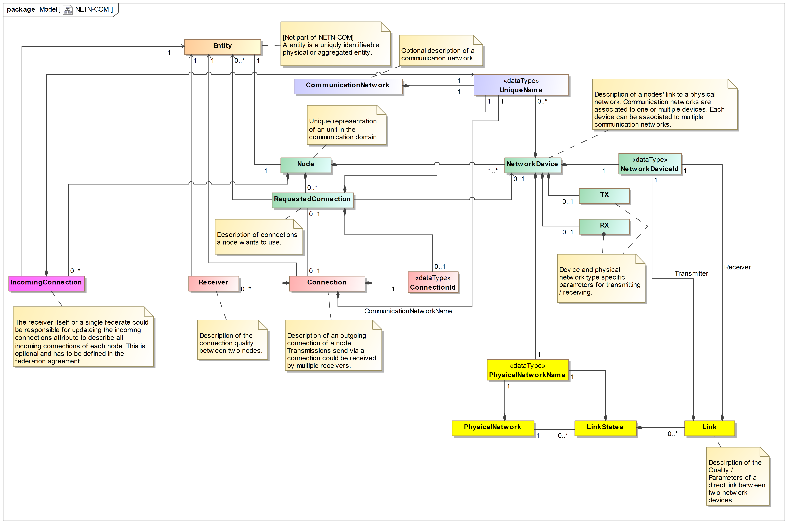
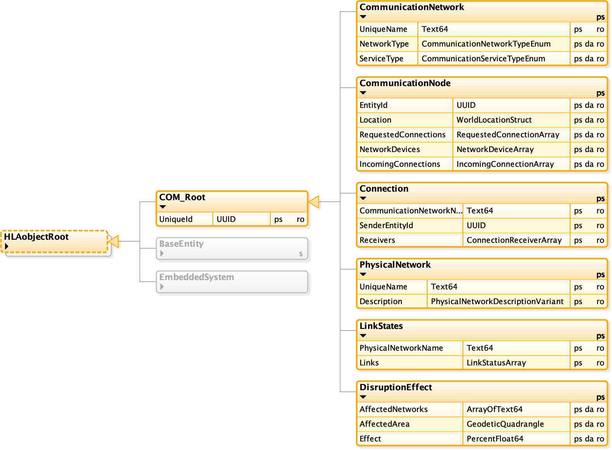

# NETN-COM
NATO Education and Training Network (NETN) Communication (COM) Module. 
        
This module is a specification of how to represent Communication Networks and related connectivity data to be shared among participants in a federated distributed simulation. The specification is based on IEEE 1516 High Level Architecture (HLA) Object Model Template (OMT) and primarily intended to support interoperability in a federated simulation (federation) based on HLA. An HLA OMT based Federation Object Model (FOM) is used to specify types of data and how it is encoded on the network. The NETN COM FOM module is available as an XML file for use in HLA based federations.
        

## Purpose
The purpose of the NETN COM module is to provide a standard way to exchange data related to Communication Networks and Physical Networks. The main objective is to provide a generic model that represents the status of connections in a communication network and links in a physical network.
The Communication Networks can be set up to use radios, ethernet, satellite communication or laser-based links, transmitting from point to point or routing through the network.

## Introduction
The NETN-COM module distinguishes between three layers of networks.

1. **Application Layer:** This is the topmost layer and corresponds to OSI layers 5-7. This layer implemented by simulations internally and has no specific representation in the NETN-COM object model except the optional `CommunicationNetwork` object. Applications use communication networks to exchange data via connections. 
2. **Connection Layer:** This layer corresponds to OSI layers 3-4 and describes the connections associated with communication networks. `CommunicationNode` objects are associated with simulated entities and connected to form an information-sharing space.
3. **Link Layer:** This layer corresponds to OSI layers 1-2 and is used to define the link quality parameters between nodes to form a physical network.

The following definition of terms are used in the NETN-FOM module:

* **Entity:** A entity is either a simulated physical or an aggregated entity.
* **Communication network:** A group of communication nodes exchanging messages using a uniquely named logical network which is independent of the physical network implementation. A communication network is the foundation of a shared information space.
* **Communication node:** The representation of the interface of a simulated entity to logical communication networks. A communication node describes the relationship between an entity to all communication networks it uses and the network devices used to establish a connection to other communication nodes.
* **Connection:** A connection describes the relationship of at least two communication nodes in a communication network.
* **Network device:** The technical device (e.g. radio or ethernet) connecting an entity to a physical network to participate in one or more communication networks.
* **Physical network:** The physical medium used to implement the connection between nodes.
* **Link:** The physical connection between two nodes of a physical network. A link describes the relationship between a transmitting and a receiving network device.

Figure. Concept Relationships

By separating the representation of the physical- and communication network layers, different simulations can be used to model the system on different levels, e.g. radio signal propagation simulations for the link layer and an ad hoc network routing simulation on the connection layer.

The model does not require all levels and networks to be represented in the federation. Which objects are needed depends on the federation design and allocation of modelling responsibilities. E.g. at the application layer, only the connection information needs to be published.

Figure. Object Classes

The application layer should only use the `CommunicationNode` and `Connection` objects to determine if data can be sent or received. If no `Connection` object exists or if the `Receivers` attribute is empty, the sender can drop the data entirely. A receiver should drop any incoming messages if not included in the `Receivers` attribute of the corresponding `Connection` object. If the `IncommingConnections` attribute of a `CommunicationNode` is calculated for a receiver, it can be used to determine if incoming data should be dropped or not.

## Communication Networks
The `CommunicationNetwork` class specifies details about the type of and service used by a logical communication network. This corresponds to the CommunicationNet-Elements of MSDL Units and Equipment Items. 
Instances of this object class should be considered as optional. No federate should rely on this data to work with communication networks.

|Attribute|Description|
|---|---|
|UniqueId (Inherited)|**Required.** Unique identifer for all NETN-COM object classes.|
|UniqueName|**Required.** Unique communication network name. Unique in the context of communication networks.|
|NetworkType|**Optional.** The communication network type of use.|
|ServiceType|**Optional.** The type of service used on the communication network.|
  
## Communication Nodes

A `CommunicationNode` is the representation of the interface of a simulated entity to logical communication networks. The location of the `CommunicationNode` is derived from the referenced entity or specified explicitly if the referenced entity is not registered in the federation.

Each potential connection is described in terms of requested connections (the equivalent to the information provided by MSDL). `Connection` objects represent the availability of a connection and its receivers. It is up to a communication simulation to create `Connection` objects for the requested connections based on the network devices of the `CommunicationNode`, the physical network and the link quality between network devices. Depending on the federation design and agreements, the explicit representation of the physical layer objects, `PhysicalNetwork` and `LinkStates`, is optional.

|Attribute|Description|
|---|---|
|UniqueId (Inherited)|**Required.** Unique identifer for all NETN-COM object classes.|
|EntityId|**Required.** Reference by UUID to an object instance of one of the following classes: (1) NETN-MRM Aggregate Entity, (2) NETN-Physical extensions of RPR Platforms and Lifeform object classes. If the referenced entity exists in the federation, the location of the node is derived from the location of the entity. If the referenced entity does not exist in the federation, the location of the node is defined by the Location attribute. |
|Location|**Optional.** Specifies the location of the CommunicationNode in case the entity referenced by EntityId is not registered in the federation. If the entity referenced by EntityId exists in the federation, the location of the communication node is derived from that entity and the value of the Location attribute shall be ignored.|
|RequestedConnections|**Required.** Possible (requested) connections for the communication node. |
|NetworkDevices|**Required.** Available network devices defining the association of a communication network (connection layer) with a physical network (link layer). Each network device can be associated with several communication networks but only to one physical network. Each network device also describes the transmitter and receiver capabilities.|
|IncomingConnections|**Optional.** Description of all incoming connections to the receiving entity.|

A requested connection is used to describes the characteristics of a possible connections to a communication network. For the types of connections where data is intended to be transmitted, a connection identifier can be provided that can be used to create a `Connection` object instance. 

Unless a network device is explicitly specified, all suitable devices associated with the communication network of the requested connection shall be used. 

Depending on the type of the requested connection the use of the associated network device parameters differs:

* **Broadcast Transceiver**: A combination of Broadcast Transmitter and Receiver
* **Broadcast Transmitter**:
  * If TX is specified for a network device, connections are established to all receiving entities reachable depending on the physical network description (ranges, max hops, etc.). Data is sent to all (directly linked) receivers simultaneously.
  * A Connection instance should be created.
  * The DestinationEntityArray is ignored.
* **Broadcast Receiver**:
  * If RX is specified for a network device the connections listens to all incoming messages. 
  * The DestinationEntityArray is ignored.
* **Peer-To-Peer**:
  * If TX is specified for a network device connections are established to all reachable specified destination entities.
  * If RX is specified for a network device the connections listens to all incoming messages which are sent to the own entity.
  * It is assumed that the communication is bidirectional and should use the same route in both directions. The connection must be defined at the receiver as well.
  * If DestinationEntityArray is empty messages will be sent to all reachable participants of the communication network. It is strongly recommended to define a limited set of destinations wherever possible.
  * It is assumed that messages are transmitted sequentially to all receivers defined as a destination. (Be aware: this does not include intercepting devices)
  * Any max. hop count / TTL parameter of the physical network is ignored.
* **Unidirectional**: Like Peer-To-Peer but no connection back to the source with the same route is expected. 
* **Multicast**:
  * The connection logic is similar to unidirectional connections.
  * Data is sent to all receivers simultaneously.
  * The DestinationEntityArray is ignored.
* **Intercepting connections**: 
  * These are special connections not related to specific destination entities but intercept all type of connections that are reachable by the corresponding device. In case of broadcasts this corresponds to a broadcast receiver, otherwise this means the connection is routed through the corresponding device.
  * The DestinationEntityArray is ignored.

Before any data can be sent using a connection, it must have been requested, and the corresponding `Connection` object instance must exist in the federation.

## Connections

A connection object describes the communication capability of each entity to all other entities with respect to a communication network. The `Connection` object is created for each requested connection if there is at least one reachable receiver. The federation agreement defines which system is responsible for creating and maintaining the connection instance. The connection describes the connectivity but not the routes through a physical network defined by links between nodes. 

|Attribute|Description|
|---|---|
|UniqueId (Inherited)|**Required.** Unique identifer for all NETN-COM object classes.|
|CommunicationNetworkName|**Required.** A reference to the communication network this connection belongs to.|
|SenderEntityId|**Required.** A reference to the entity sending data using this connection.|
|Receivers|**Required.** Characteristics of the connections to individual receiving entities.|

## Physical Networks

The `PhysicalNetwork` object class represents type-specific parameters/constraints for a physical network. Physical networks are simulated by LinkState objects and do not require that an instance of PhysicalNetwork exist in the federation. 

|Attribute|Description|
|---|---|
|UniqueId (Inherited)|**Required.** Unique identifer for all NETN-COM object classes.|
|UniqueName|**Required.** Unique physical network name. Uniqueness in the context of physical networks.|
|Description|**Required.** Characteristics of the physical network.|

## Link States

A `LinkStates` object describes the presence and quality of a set of direct links between nodes on a physical level. Links are defined between a transmitting and receiving device. 

Bidirectional links assume identical link quality in both directions. Otherwise, two unidirectional links should be described. 

Each `LinkStates` instance is associated with one physical network. To support load balancing in link quality simulation, multiple `LinkStates` instances can be associated with the same physical network as long as they do not contain duplicated link-state information.

A link should not be contained in more than one `LinkStates` object. If a link is not contained in any instance, it is not present, and it means it could not be established.

The link states provide information that can be used to calculate connections.

|Attribute|Description|
|---|---|
|UniqueId (Inherited)|**Required.** Unique identifer for all NETN-COM object classes.|
|PhysicalNetworkName|**Required.** Reference to physical network by its unique name.|
|Links|**Required.** Status of a set of physical network links.|

## Disruption Effects

The `DisruptionEffect` object class is used to represent the disruption of connections between communication nodes in an affected area. Communication models can subscribe to disruption-effect objects and use the information to simulate the effect of disruption on communication nodes, connections and link states.

|Attribute|Description|
|---|---|
|UniqueId (Inherited)|**Required.** Unique identifer for all NETN-COM object classes.|
|AffectedNetworks|**Optional.** Names of all affected communication networks. If not provided all networks in the specified area are affected.|
|AffectedArea|**Optional.** Area affected by disruption. If not provided the default is a global disruption and all connections are affected.|
|Effect|**Required.** Level of disruption in percent. 100% equals No connectivity and 0% no disruption effect. The level of disruption can vary over time.|
