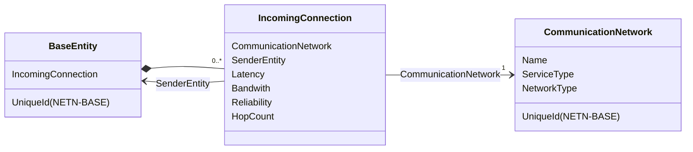
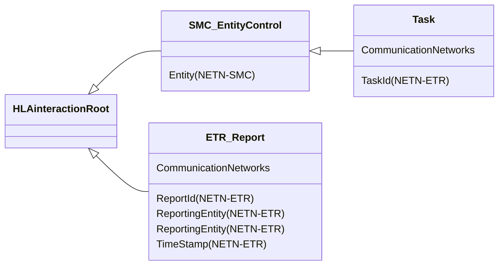
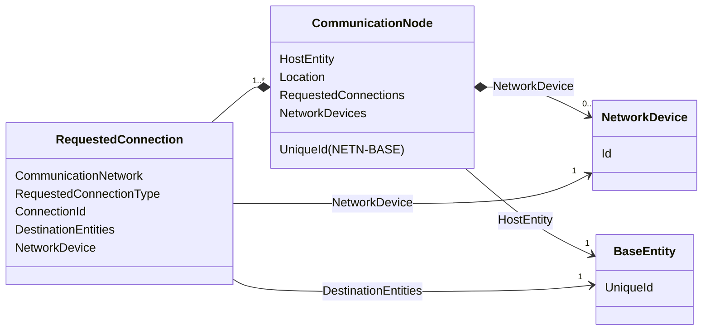
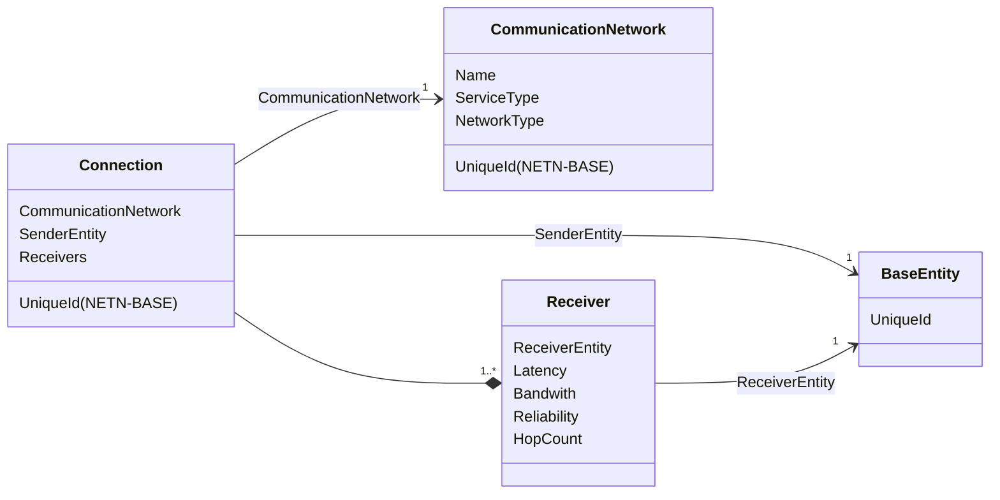
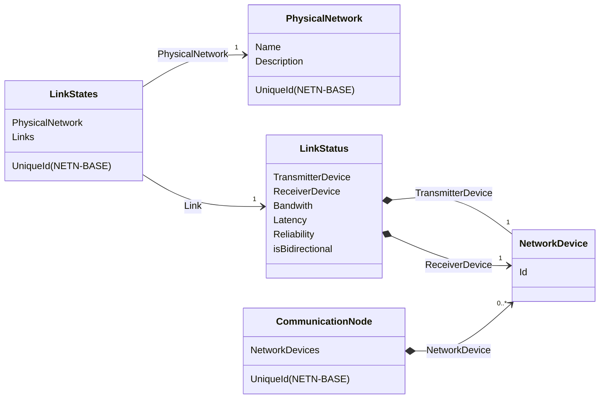
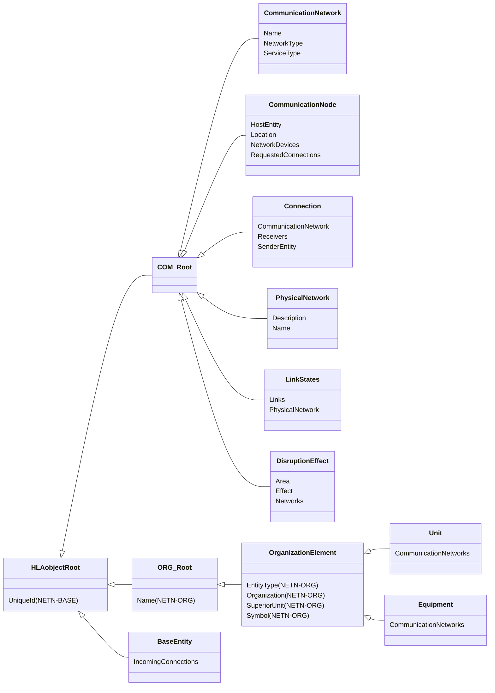
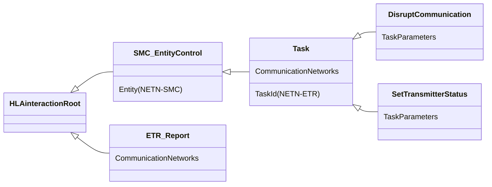

# NETN-COM
|Version| Date| Dependencies|
|---|---|---|
|2.0|2024-03-18|NETN-BASE, NETN-ETR, NETN-ORG|

The purpose of the NATO Education and Training Network Communication Network Module (NETN-COM) is to provide a standard way to exchange data related to the status of connections in a communication network and links in a physical network.

The communication networks can be modelled using radios, ethernet, satellite communication or laser-based links, transmitting from point to point or routing through the network. 

## Overview 
 
The NETN-COM module distinguishes between three layers of networks. 
* **Application Layer** - This is the topmost layer corresponding to OSI layers 5-7. It is represented in the NETN-COM object model by the `CommunicationNetwork` object and the `IncomingConnections` attribute, which extends the RPR-FOM `BaseEntity` object class. The NETN-COM also defines extensions to the NETN-ETR `Task` and `ETR_Report` interaction classes to associate communication networks with these messages. Receivers use the  `IncomingConnections` attribute to determine whether the message can be delivered. 
* **Connection Layer** - This layer corresponds to OSI layers 3-4 and describes the connections associated with communication networks. `CommunicationNode` objects are associated with simulated entities and connected to form an information-sharing space. 
* **Link Layer** - This layer corresponds to OSI layers 1-2 and defines the link quality parameters between nodes to form a physical network. 
 
 
By separating the representation of the application, connection, and physical link layers, different simulations can model the system on different levels, e.g. radio signal propagation simulations for the link layer and an ad hoc network routing simulation for the connection layer. 
 
The model does not require all levels and networks to be represented in the federation. Which objects are needed depends on the federation design and allocation of modelling responsibilities. 
 
 
## Application Layer 
 
A `CommunicationNetwork` is a logical network grouping simulated entities, independent of any physical network implementation. When messages are sent through a network, all entities belonging to it are potential receivers of the message. 
 
To determine whether a message is received, each simulated entity can use data related to its `IncomingConnections`. This attribute describes all connections for all communication networks associated with the simulated entity. Each connection specifies the `SenderEntity` and quality parameters, e.g., latency and bandwidth, that allow the receiver to calculate block, drop and degradation effects. 
 
The `IncomingConnections` attribute can be published by other simulations that model communication at the connection- and physical level. 
 

 
 
The NETN-COM module currently supports sending messages with associated `CommunicationNetwork` information using NETN-ETR `Task` and `ETR_Report` interactions. 
 
 

 
 
 
## Connection Layer 
 
The `CommunicationNode` represents a node in a logical communication network. Each node publishes `RequestedConnections` to describe all desired connectivity between nodes in the network. Each node is also associated with a simulated entity and available network devices. 
 

 
A `Connection` may be established based on the `RequestedConnection` and available devices. Each `Connection` can be modelled as an individual object with details of the connection quality for each potential receiver. 
 
 

 
 
 
## Physical Layer 
 
The physical layer models the `PhysicalNetwork` that implements the `LinkStates` between Network Devices. This is required to establish the connectivity needed to create a `Connection` between `CommunicationNode`. 
 
 
 

 
A Network Device is a technical device, e.g., radio or ethernet, connecting a `CommunicationNode` to a physical network. The `LinkStates` provide all link status data related to a `PhysicalNetwork`. The link describes the relationship between a transmitting and a receiving network device. Network devices are not modelled as objects in NETN-COM. 
 
## Additional Object Classes 
 
In addition to representing the three layers of networks, the NETN-COM defines an object for representing areas of communication disruption. The object is intended to affect the quality of incoming connections of simulated entities. 
 
The NETN-COM also provide attribute extensions for the NETN-ORG classes Unit and Equipment.

## Object Classes

### COM_Root

Abstract root class for all NETN-COM objects.

### CommunicationNetwork

The `CommunicationNetwork` class specifies details about the type of service used by a logical communication network. This corresponds to the CommunicationNet-Elements of MSDL Units and Equipments. 
Instances of this object class should be considered optional. No federate should rely on this data to work with communication networks.

|Attribute|Datatype|Semantics|
|---|---|---|
|Name|HLAunicodeString|Required. Communication network name. Unique in the context of communication networks.|
|NetworkType|CommunicationNetworkTypeEnum|Optional. The communication network type of use.|
|ServiceType|CommunicationServiceTypeEnum|Optional. The type of service used on the communication network.|
|UniqueId (NETN-BASE)|UUID|Required. A unique identifier for the object. The Universally Unique Identifier (UUID) is generated or pre-defined.| 

### CommunicationNode

A `CommunicationNode` is the representation of the interface of a simulated entity to logical communication networks. The location of the `CommunicationNode` is derived from the referenced entity or specified explicitly (if the referenced entity is not registered in the federation). 
 
Each potential connection is described in terms of requested connections (the equivalent to the information provided by MSDL). `Connection` objects represent the availability of a connection and its receivers. It is up to a communication simulation to create `Connection` objects for the requested connections based on the network devices of the `CommunicationNode`, the physical network and the link quality between network devices. Depending on the federation design and agreements, the explicit representation of the physical layer objects, `PhysicalNetwork` and `LinkStates`, is optional. 
 
A requested connection is used to describe the characteristics of a possible connection to a communication network. For the types of connections where data is intended to be transmitted, a connection identifier can be provided that can be used to create a `Connection` object instance. 
 
Unless a network device is explicitly specified, all suitable devices associated with the communication network of the requested connection shall be used. 
 
Depending on the type of the requested connection the use of the associated network device parameters differs: 
 
* **Broadcast Transceiver**: A combination of Broadcast Transmitter and Receiver 
* **Broadcast Transmitter**: 
* If TX is specified for a network device, connections are established to all receiving entities reachable depending on the physical network description (ranges, max hops, etc.). Data is sent to all (directly linked) receivers simultaneously. 
* A Connection instance should be created. 
* The DestinationEntityArray is ignored. 
* **Broadcast Receiver**: 
* If RX is specified for a network device, the connections listen to all incoming messages. 
* The DestinationEntityArray is ignored. 
* **Peer-To-Peer**: 
* If TX is specified for a network device connections are established to all reachable specified destination entities. 
* If RX is specified for a network device, the connections listen to all incoming messages which are sent to the entity. 
* It is assumed that the communication is bidirectional and should use the same route in both directions. The connection must be defined at the receiver as well. 
* If DestinationEntityArray is empty messages will be sent to all reachable participants of the communication network. It is strongly recommended to define a limited set of destinations wherever possible. 
* It is assumed that messages are transmitted sequentially to all receivers defined as a destination. (Be aware: this does not include intercepting devices) 
* Any max. hop count / TTL parameter of the physical network is ignored. 
* **Unidirectional**: Like Peer-To-Peer but no connection back to the source with the same route is expected. 
* **Multicast**: 
* The connection logic is similar to unidirectional connections. 
* Data is sent to all receivers simultaneously. 
* The DestinationEntityArray is ignored. 
* **Intercepting connections**: 
* These are special connections not related to specific destination entities but intercept all types of connections that are reachable by the corresponding device. In the case of broadcasts, this corresponds to a broadcast receiver, otherwise, this means the connection is routed through the corresponding device. 
* The DestinationEntityArray is ignored.

|Attribute|Datatype|Semantics|
|---|---|---|
|HostEntity|UUID|Optional. Reference to a simulation entity. If the referenced entity exists in the federation, the location of the node is derived from the location of the entity.  If the referenced entity does not exist in the federation, the location of the node is defined by the Location attribute.|
|Location|LocationStruct|Optional. Specifies the location of the `CommunicationNode` in case the entity referenced by `HostEntity` is not registered in the federation. If the referenced entity exists in the federation, the location of the communication node is derived from that entity and the value of the Location attribute shall be ignored.|
|NetworkDevices|NetworkDeviceArray|Required. Available network devices define the association of a communication network (connection layer) with a physical network (link layer). Each network device can be associated with several communication networks but only one physical network. Each network device also describes the transmitter and receiver capabilities.|
|RequestedConnections|RequestedConnectionArray|Required. Possible (requested) connections for the communication node.|
|UniqueId (NETN-BASE)|UUID|Required. A unique identifier for the object. The Universally Unique Identifier (UUID) is generated or pre-defined.| 

### Connection

A connection object describes the communication capability of each entity to all other entities for a communication network. The `Connection` object is created for each requested connection if there is at least one reachable receiver. The federation agreement defines which system is responsible for creating and maintaining the connection instance. The connection describes the connectivity but not the routes through a physical network defined by links between nodes.

|Attribute|Datatype|Semantics|
|---|---|---|
|CommunicationNetwork|UUID|Required. A reference to the communication network this connection belongs to.|
|Receivers|ConnectionReceiverArray|Required. Characteristics of the connections to individual receiving entities.|
|SenderEntity|UUID|Required. A reference to the entity sending data using this connection.|
|UniqueId (NETN-BASE)|UUID|Required. A unique identifier for the object. The Universally Unique Identifier (UUID) is generated or pre-defined.| 

### PhysicalNetwork

The `PhysicalNetwork` object class represents type-specific parameters/constraints for a physical network. Physical networks are simulated by `LinkState` objects and do not require that an instance of PhysicalNetwork exist in the federation.

|Attribute|Datatype|Semantics|
|---|---|---|
|Description|PhysicalNetworkDescriptionVariant|Required. Characteristics of the physical network.|
|Name|HLAunicodeString|Required. Unique physical network name. Uniqueness in the context of physical networks.|
|UniqueId (NETN-BASE)|UUID|Required. A unique identifier for the object. The Universally Unique Identifier (UUID) is generated or pre-defined.| 

### LinkStates

A `LinkStates` object describes the presence and quality of a set of direct links between nodes on a physical level. Links are defined between a transmitting and receiving device. 
 
Bidirectional links assume identical link quality in both directions. Otherwise, two unidirectional links should be described. 
 
Each `LinkStates` instance is associated with one physical network. To support load balancing in link quality simulation, multiple `LinkStates` instances can be associated with the same physical network as long as they do not contain duplicated link-state information. 
 
A link should not be contained in more than one `LinkStates` object. If a link is not contained in any instance, it is not present, and it means it could not be established. 
 
The `LinkStates` provides information that can be used to calculate connections.

|Attribute|Datatype|Semantics|
|---|---|---|
|Links|LinkStatusArray|Required. Status of a set of physical network links.|
|PhysicalNetwork|UUID|Required. Reference to a physical network.|
|UniqueId (NETN-BASE)|UUID|Required. A unique identifier for the object. The Universally Unique Identifier (UUID) is generated or pre-defined.| 

### DisruptionEffect

The `DisruptionEffect` object class is used to represent the disruption of connections between communication nodes in an affected area. Communication models can subscribe to disruption-effect objects and use the information to simulate the effect of disruption on communication nodes, connections and link states.

|Attribute|Datatype|Semantics|
|---|---|---|
|Area|LocationStructArray|Optional. The area affected by the disruption. If not provided the default is a global disruption and all connections are affected.|
|Effect|PercentFloat32|Required. Level of disruption. 100% equals No connectivity and 0% no disruption effect. The level of disruption can vary over time.|
|Networks|ArrayOfUuid|Optional. Reference to all affected physical and communication networks. If not provided all networks in the specified area are affected.|
|UniqueId (NETN-BASE)|UUID|Required. A unique identifier for the object. The Universally Unique Identifier (UUID) is generated or pre-defined.| 

### Unit

A unit represents an element at a specified level in the organization. An organizational unit can contain subunits and can belong to a superior unit. A unit consists of equipment, personnel and supplies; these holdings can belong directly to the unit or indirectly as a holding of a subunit.

|Attribute|Datatype|Semantics|
|---|---|---|
|CommunicationNetworks|ArrayOfCommunicationNetworks|Optional: A list of communication networks available for the unit.|
|EntityType (NETN-ORG)|EntityTypeStruct|Required. SISO-REF-010 code for entity type definitions. If unknown, use 0.0.0.0.0.0.0.| 
|Name (NETN-ORG)|HLAunicodeString|Required. Required. A unique name.| 
|Organization (NETN-ORG)|UUID|Required: A reference to the organization the element is affiliated with.| 
|SuperiorUnit (NETN-ORG)|UUID|Required: A reference to a unit within the organization for which this element is a subunit/equipment or controlled installation.  The default value is all zeros (no aggregate unit).| 
|Symbol (NETN-ORG)|SymbolStruct|Required. Initial symbol identifier and amplification data for this element. In NETN-ORG the symbol identifier acts as a template and may contain wildcard characters '*' to indicate undefined elements of the symbol code.| 
|UniqueId (NETN-BASE)|UUID|Required. A unique identifier for the object. The Universally Unique Identifier (UUID) is generated or pre-defined.| 

### Equipment

An equipment represents individual physical items defined specifically and apart from any holdings defined for the `HostUnit`. Equipment includes platforms, munition and sensors object.

|Attribute|Datatype|Semantics|
|---|---|---|
|CommunicationNetworks|ArrayOfCommunicationNetworks|Optional: A list of communication networks available for the unit.|
|EntityType (NETN-ORG)|EntityTypeStruct|Required. SISO-REF-010 code for entity type definitions. If unknown, use 0.0.0.0.0.0.0.| 
|Name (NETN-ORG)|HLAunicodeString|Required. Required. A unique name.| 
|Organization (NETN-ORG)|UUID|Required: A reference to the organization the element is affiliated with.| 
|SuperiorUnit (NETN-ORG)|UUID|Required: A reference to a unit within the organization for which this element is a subunit/equipment or controlled installation.  The default value is all zeros (no aggregate unit).| 
|Symbol (NETN-ORG)|SymbolStruct|Required. Initial symbol identifier and amplification data for this element. In NETN-ORG the symbol identifier acts as a template and may contain wildcard characters '*' to indicate undefined elements of the symbol code.| 
|UniqueId (NETN-BASE)|UUID|Required. A unique identifier for the object. The Universally Unique Identifier (UUID) is generated or pre-defined.| 

### BaseEntity

A base class of aggregate and discrete scenario domain participants. The BaseEntity class is characterized by being located at a particular location in space and independently movable, if capable of movement at all. It specifically excludes elements normally considered to be a component of another element. The BaseEntity class is intended to be a container for common attributes for entities of this type. Since it lacks sufficient class specific attributes that are required for simulation purposes, federates cannot publish objects of this class. Certain simulation management federates, e.g. viewers, may subscribe to this class. Simulation federates will normally subscribe to one of the subclasses, to gain the extra information required to properly simulate the entity.

|Attribute|Datatype|Semantics|
|---|---|---|
|IncomingConnections|IncomingConnectionArray|Optional. All incoming communication connections to the receiving simulated entity. Any messages sent on a CommunicationNetwork with a Connection of sufficient quality should be received by this entity and processed if the entity is the intended recipient.|
|UniqueId (NETN-BASE)|UUID|Required. A unique identifier for the object. The Universally Unique Identifier (UUID) is generated or pre-defined.| 

## Interaction Classes

### Task

Requests a simulated entity to perform some task based on a task description. If accepted, the federate application modelling the behaviour will execute the task per task parameters and scheduling. A request task is acknowledged using a `TaskStatusUpdate` response interaction. Resending a `RequestTask` with the same `TaskId` as a previously sent interaction is equivalent to cancelling and sending a new task.

|Parameter|Datatype|Semantics|
|---|---|---|
|CommunicationNetworks|CommunicationNetworkArray|Optional. Reference to communication networks (NETN-COM) used to transfer tasking messages. If not provided, the task transmission should not be modelled and federates should receive and act on the task messages directly.|
|Entity (NETN-SMC)|UUID|Required: Reference to a simulation entity for which the control action is intended.| 
|TaskId (NETN-ETR)|UUID|Required. Unique identifier for the task.| 

### DisruptCommunication

Tasking of an entity to introduce a communication network disruption.

|Parameter|Datatype|Semantics|
|---|---|---|
|CommunicationNetworks|CommunicationNetworkArray|Optional. Reference to communication networks (NETN-COM) used to transfer tasking messages. If not provided, the task transmission should not be modelled and federates should receive and act on the task messages directly.|
|TaskParameters|DisruptCommunicationTaskStruct|Required: Task parameters.|
|Entity (NETN-SMC)|UUID|Required: Reference to a simulation entity for which the control action is intended.| 
|TaskId (NETN-ETR)|UUID|Required. Unique identifier for the task.| 

### SetTransmitterStatus

Tasking of an entity to switch on/off all of its transmitters.

|Parameter|Datatype|Semantics|
|---|---|---|
|CommunicationNetworks|CommunicationNetworkArray|Optional. Reference to communication networks (NETN-COM) used to transfer tasking messages. If not provided, the task transmission should not be modelled and federates should receive and act on the task messages directly.|
|TaskParameters|SetTransmitterStatusTaskStruct|Required: Task parameters.|
|Entity (NETN-SMC)|UUID|Required: Reference to a simulation entity for which the control action is intended.| 
|TaskId (NETN-ETR)|UUID|Required. Unique identifier for the task.| 

### ETR_Report

A base interaction class for more specialized report interaction classes. The inherited parameter `Time is required.`

|Parameter|Datatype|Semantics|
|---|---|---|
|CommunicationNetworks|CommunicationNetworkArray|Optional. Reference to communication networks (NETN-COM) used to transfer report messages. If not provided, the report transmission should not be modelled and federates should receive and act on the task messages directly.|

## Datatypes

Note that only datatypes defined in this FOM Module are listed below. Please refer to FOM Modules on which this module depends for other referenced datatypes.

### Overview
|Name|Semantics|
|---|---|
|ArrayOfCommunicationNetworks|References to communication networks.|
|BitsPerSecond|Data transfer rate.|
|CommunicationNetworkArray|References to a set of communication networks.|
|CommunicationNetworkTypeEnum|The type of communication network.|
|CommunicationServiceTypeEnum|The type of service used on a communication network. Service types as defined in MSDL. DATTRF: Data transfer FAX: Facsimile IFF: Identify Friend or Foe IMAGE: Image MCI: Multilateral Interoperability Programme (MIP) Common Interface Service MHS: Message Handling Service TDL: Tactical Data Link VIDSVC: Video Service VOCSVC: Voice Service NOS: Not Otherwise Specified|
|ConnectionReceiverArray|Connection characteristics for a number of receivers.|
|ConnectionReceiverStruct|Characteristics of a connection to a receiver.|
|ConnectionTypeEnum|The type of connection.|
|DisruptCommunicationTaskStruct|Task specific data for DisruptCommuncation|
|EntityControlActionEnum|Enumeration of Entity Control Actions. The datatype is expected to be extended in specific modules defining additional actions.|
|IncomingConnectionArray|A set of incoming connections.|
|IncomingConnectionStruct|Characteristics of a specific incoming connection.|
|LinkStatusArray|The status of physical network links.|
|LinkStatusStruct|Status of a physical network link.|
|NetworkDeviceArray|A set of network devices.|
|NetworkDeviceEmptyCharactersticsStruct|Empty placeholder for future network device characteristics.|
|NetworkDeviceGenericTransmitterCharacteristicsStruct|Generic description of network device transmitter.|
|NetworkDeviceReceiverCharacteristicsVariant|Characteristics of a network device receiver.|
|NetworkDeviceStruct|Describes the type and capability of a network device. Each device must have at least a transmitter (TX) or receiver (RX). Transceivers should define both.|
|NetworkDeviceTransmitterCharacteristicsVariant|Characteristics of network device transmitter.|
|PhysicalGenericNetworkStruct|Characteristics of a generic physical network.|
|PhysicalNetworkDescriptionVariant|Characteristics of physical networks depend on their type.|
|PhysicalNetworkTypeEnum|The type of a physical network.|
|PhysicalUndefinedNetworkStruct|(Empty) Characteristics of an undefined physical network.|
|RequestedConnection|Characterisation of a requested connection.|
|RequestedConnectionArray|Characterisation of a set of requested connections.|
|SetTransmitterStatusTaskStruct|Task specific data for SetTransmitterStatus.|
|TaskDefinitionVariantRecord|Variant record for task definition data.|
|TaskProgressVariantRecord|Variant record for task progress data.|
        
### Simple Datatypes
|Name|Units|Semantics|
|---|---|---|
|BitsPerSecond|NA|Data transfer rate.|
        
### Enumerated Datatypes
|Name|Representation|Semantics|
|---|---|---|
|CommunicationNetworkTypeEnum|HLAoctet|The type of communication network.|
|CommunicationServiceTypeEnum|HLAoctet|The type of service used on a communication network. Service types as defined in MSDL. DATTRF: Data transfer FAX: Facsimile IFF: Identify Friend or Foe IMAGE: Image MCI: Multilateral Interoperability Programme (MIP) Common Interface Service MHS: Message Handling Service TDL: Tactical Data Link VIDSVC: Video Service VOCSVC: Voice Service NOS: Not Otherwise Specified|
|ConnectionTypeEnum|HLAoctet|The type of connection.|
|EntityControlActionEnum|HLAinteger32BE|Enumeration of Entity Control Actions. The datatype is expected to be extended in specific modules defining additional actions.|
|PhysicalNetworkTypeEnum|HLAoctet|The type of a physical network.|
        
### Array Datatypes
|Name|Element Datatype|Semantics|
|---|---|---|
|ArrayOfCommunicationNetworks|UUID|References to communication networks.|
|CommunicationNetworkArray|ArrayOfUuid|References to a set of communication networks.|
|ConnectionReceiverArray|ConnectionReceiverStruct|Connection characteristics for a number of receivers.|
|IncomingConnectionArray|IncomingConnectionStruct|A set of incoming connections.|
|LinkStatusArray|LinkStatusStruct|The status of physical network links.|
|NetworkDeviceArray|NetworkDeviceStruct|A set of network devices.|
|RequestedConnectionArray|RequestedConnection|Characterisation of a set of requested connections.|
        
### Fixed Record Datatypes
|Name|Fields|Semantics|
|---|---|---|
|ConnectionReceiverStruct|ReceiverEntity, Latency, Bandwidth, Reliability, HopCount|Characteristics of a connection to a receiver.|
|DisruptCommunicationTaskStruct|Network, Area, DisruptionEnabled|Task specific data for DisruptCommuncation|
|IncomingConnectionStruct|CommunicationNetwork, SendingEntity, Latency, Bandwidth, Reliability, HopCount|Characteristics of a specific incoming connection.|
|LinkStatusStruct|TransmitterDevice, ReceiverDevice, Latency, Bandwidth, Reliability, IsBidirectional|Status of a physical network link.|
|NetworkDeviceEmptyCharactersticsStruct||Empty placeholder for future network device characteristics.|
|NetworkDeviceGenericTransmitterCharacteristicsStruct|MaxLinkRange|Generic description of network device transmitter.|
|NetworkDeviceStruct|NetworkDeviceId, NetworkDeviceModel, CommunicationNetworks, PhysicalNetwork, TX, RX, IsRelay|Describes the type and capability of a network device. Each device must have at least a transmitter (TX) or receiver (RX). Transceivers should define both.|
|PhysicalGenericNetworkStruct|MaxHopCount, DefaultMaxLinkRange, Latency, Bandwidth, Reliability|Characteristics of a generic physical network.|
|PhysicalUndefinedNetworkStruct||(Empty) Characteristics of an undefined physical network.|
|RequestedConnection|CommunicationNetwork, RequestedConnectionType, ConnectionId, DestinationEntities, NetworkDevice|Characterisation of a requested connection.|
|SetTransmitterStatusTaskStruct|Status|Task specific data for SetTransmitterStatus.|
        
### Variant Record Datatypes
|Name|Discriminant (Datatype)|Alternatives|Semantics|
|---|---|---|---|
|NetworkDeviceReceiverCharacteristicsVariant|Type (PhysicalNetworkTypeEnum)|NoNetwork, Undefined, Generic|Characteristics of a network device receiver.|
|NetworkDeviceTransmitterCharacteristicsVariant|Type (PhysicalNetworkTypeEnum)|NoNetwork, Undefined, Generic|Characteristics of network device transmitter.|
|PhysicalNetworkDescriptionVariant|Type (PhysicalNetworkTypeEnum)|Undefined, Generic|Characteristics of physical networks depend on their type.|
|TaskDefinitionVariantRecord|TaskType (EntityControlActionEnum)|DisruptCommunication, SetTransmitterStatus|Variant record for task definition data.|
|TaskProgressVariantRecord|TaskType (EntityControlActionEnum)|COM_ElapsedTime|Variant record for task progress data.|
    