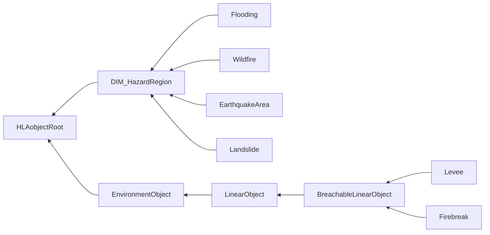
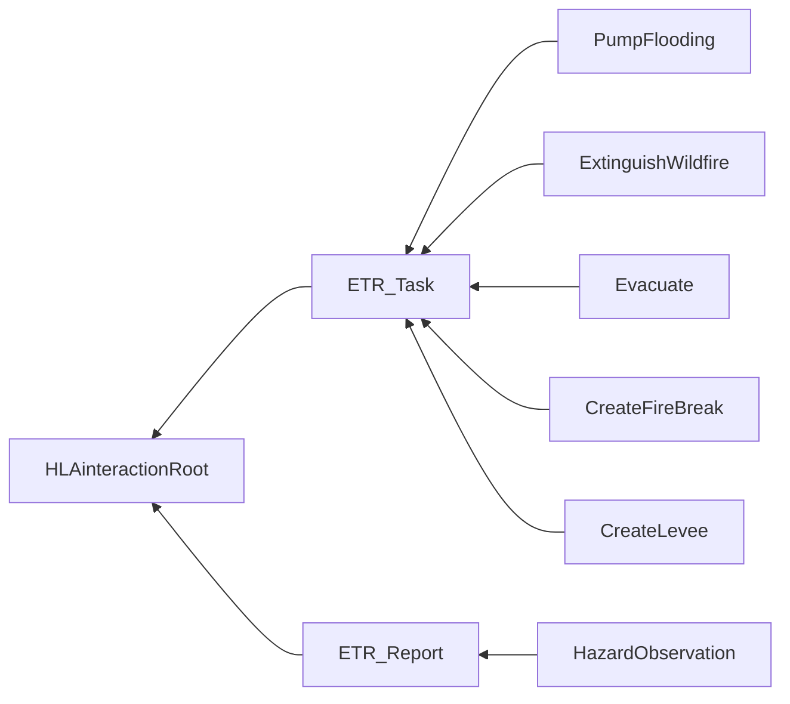

# NETN-DIM
|Version| Date| Dependencies|
|---|---|---|
|1.0|2023-04-18|RPR-SE, NETN-ETR|

The NATO Education and Training Network (NETN) Disaster Module (DIM) provides a standard interface for representing hazards, e.g. flooding and wildfire, in federated distributed simulation environments.

Hazards such as wildfire, flooding, earthquakes and landslides cause different effects in a synthetic environment and to the simulated entities. Furthermore, hazard observation reporting and activities to mitigate the effect of hazards are important aspects of simulations where hazards are part of the scenario.
        
In a federated distributed simulation, the NATO Education and Training Network Disaster Module (NETN-DIM) specifies how to model hazards and control activities to mitigate their effects. 
The specification is based on IEEE 1516 High Level Architecture (HLA) Object Model Template (OMT) and supports interoperability in a federated simulation (federation) based on HLA.

## Object Classes

Note that inherited and dependency attributes are not included in the description of object classes.

### DIM_HazardRegion

Use the `DIM_HazardRegion` object to represent a hazard in a synthetic environment.

|Attribute|Datatype|Semantics|
|---|---|---|
|Area|LocationStructArray|Required: Geographical boundary of the HazardRegion.|

### Flooding

Representation of a flooded area.

|Attribute|Datatype|Semantics|
|---|---|---|
|Level|MeterFloat32|Required: FloodingLevel represents the water level of the flooding relative to the Mean Sea Level (MSL).|
|LevelChange|LevelChangeMeterPerSecondFloat32|Optional: The water level change over time.|

### Wildfire

Use the `Wildfire` object to represent a wildfire that may spread.

|Attribute|Datatype|Semantics|
|---|---|---|
|FrontWidth|MeterFloat32|Required: Indicates the thickness of the actual fire ring surrounding a no longer burning region. The assumption is that a fire starts at one or more locations and then spreads in a circular shape with a fire front of a certain thickness and burnt land behind the front line. The Area attribute defines the outer boundary of the overall region, and the front of the flames is assumed to extend from the boundary into the region.|
|FrontVelocity|VelocityMeterPerSecondFloat32|Optional: The spread velocity of the front line. The Default = 0.|
|Temperature|TemperatureDegreeCelsiusFloat32|Optional: The temperature in the front line.|

### EarthquakeArea

Use the `EarhquakeArea` object to represent an area affected by an earthquake.

|Attribute|Datatype|Semantics|
|---|---|---|
|Magnitude|RichterScale|Required: Richter magnitude scale.|

### Landslide

Use the `Landslide` object to represent a landslide area covered by mud, snow or gravel.

|Attribute|Datatype|Semantics|
|---|---|---|
|Thickness|MeterFloat32|Required: Thickness in meter.|
|LandslideType|LandslideTypeEnum|Optional: The type of landslide material. Default = 0.|

### Levee

A levee is a wall/separator that protects an area from flooding.

### Firebreak

A firebreak is a corridor without any burning things. The firebreak should separate the burning part from the not burning part.

## Interaction Classes

Note that inherited and dependency parameters are not included in the description of interaction classes.

### PumpFlooding

Task an entity to start pumping water out of an area.

|Parameter|Datatype|Semantics|
|---|---|---|
|TaskParameters|PumpFloodingTaskStruct|Required: Task parameters.|

### ExtinguishWildfire

Task an entity to extinguish a wildfire.

|Parameter|Datatype|Semantics|
|---|---|---|
|TaskParameters|ExtinguishWildfireTaskStruct|Required: Task parameters.|

### Evacuate

A request for evacuation

|Parameter|Datatype|Semantics|
|---|---|---|
|TaskParameters|EvacuateTaskStruct|Required: Task parameters.|

### CreateFireBreak

Use the `CreateFireBreak` task to request an entity to build a firebreak.

|Parameter|Datatype|Semantics|
|---|---|---|
|TaskParameters|CreateFireBreakTaskStruct|Required: Task parameters.|

### CreateLevee

Use the `CreateLevee` task to request an entity to construct a levee.

|Parameter|Datatype|Semantics|
|---|---|---|
|TaskParameters|CreateLeveeTaskStruct|Required: Task parameters.|

### HazardObservation

Observation of a dangerous area.

|Parameter|Datatype|Semantics|
|---|---|---|
|Area|LocationStructArray|Required: The estimated area affected by the hazard.|
|HazardType|HazardTypeEnum|Required: The type of hazard observed.|

## Datatypes

Note that only datatypes defined in this FOM Module are listed below. Please refer to FOM Modules on which this module depends for other referenced datatypes.

### Overview
|Name|Semantics|
|---|---|
|CreateFireBreakTaskStruct|Task-specific data.|
|CreateLeveeTaskStruct|Task-specific data.|
|EvacuateProgressStruct|Task-specific data.|
|EvacuateTaskStruct|Task-specific data.|
|ExtinguishWildfireTaskStruct|Task-specific data.|
|HazardTypeEnum|Different types of hazards.|
|LandslideTypeEnum|The type of landslide material.|
|LevelChangeMeterPerSecondFloat32|Change of the water level over time.|
|PumpFloodingTaskStruct|Task-specific data.|
|RichterScale|Richter magnitude is measured in energy (ergs): M=log10 (A/A0), where A=amplitude on a seismograph, and A0=1/1,000 millimeters. Each increase of 1 in Richter magnitude represents a 31-fold increase in released energy.|
|TaskDefinitionVariantRecord|Variant record for task definition data.|
|TaskProgressVariantRecord|Variant record for task progress data.|
|TaskTypeEnum|Task types.|
        
### Simple Datatypes
|Name|Units|Semantics|
|---|---|---|
|LevelChangeMeterPerSecondFloat32|meter per second (m/s)|Change of the water level over time.|
|RichterScale|ergs|Richter magnitude is measured in energy (ergs): M=log10 (A/A0), where A=amplitude on a seismograph, and A0=1/1,000 millimeters. Each increase of 1 in Richter magnitude represents a 31-fold increase in released energy.|
        
### Enumerated Datatypes
|Name|Representation|Semantics|
|---|---|---|
|HazardTypeEnum|HLAinteger16BE|Different types of hazards.|
|LandslideTypeEnum|HLAinteger16BE|The type of landslide material.|
|TaskTypeEnum|HLAinteger32BE|Task types.|
        
### Fixed Record Datatypes
|Name|Fields|Semantics|
|---|---|---|
|CreateFireBreakTaskStruct|Duration|Task-specific data.|
|CreateLeveeTaskStruct|Duration|Task-specific data.|
|EvacuateProgressStruct|Amount, Time|Task-specific data.|
|EvacuateTaskStruct|Area, EntityType, Amount, Duration|Task-specific data.|
|ExtinguishWildfireTaskStruct|Wildfire, Duration|Task-specific data.|
|PumpFloodingTaskStruct|Flooding, Duration|Task-specific data.|
        
### Variant Record Datatypes
|Name|Discriminant (Datatype)|Alternatives|Semantics|
|---|---|---|---|
|TaskDefinitionVariantRecord|TaskType (TaskTypeEnum)|PumpFlooding, ExtinguishWildfire, Evacuate, CreateFireBreak, CreateLevee|Variant record for task definition data.|
|TaskProgressVariantRecord|TaskType (TaskTypeEnum)|DIM_Duration, DIM_Evacuate|Variant record for task progress data.|
    