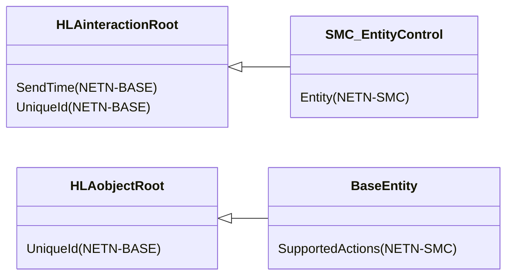
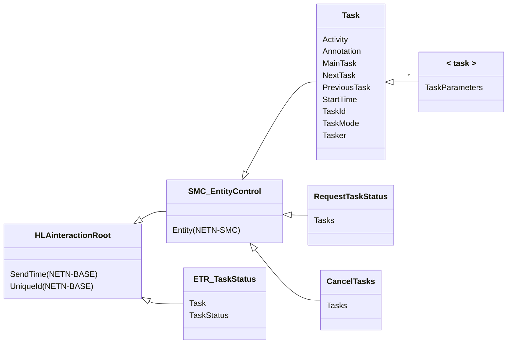
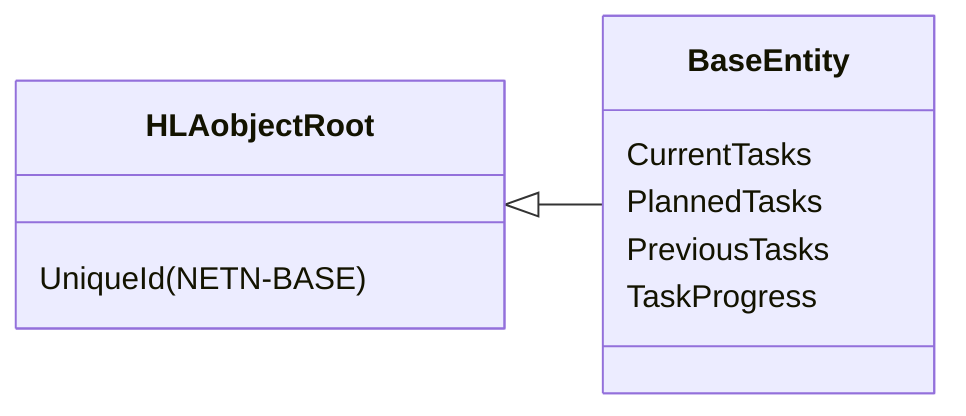
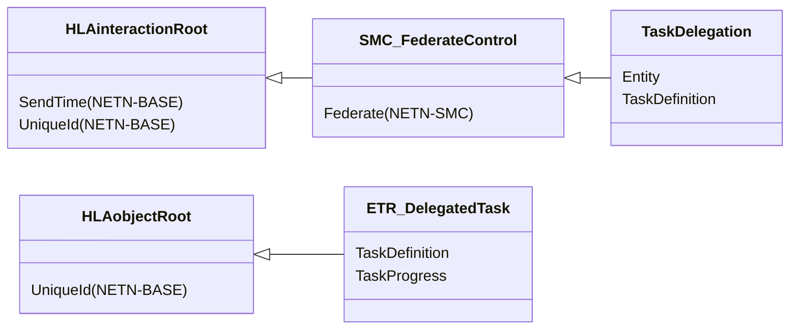
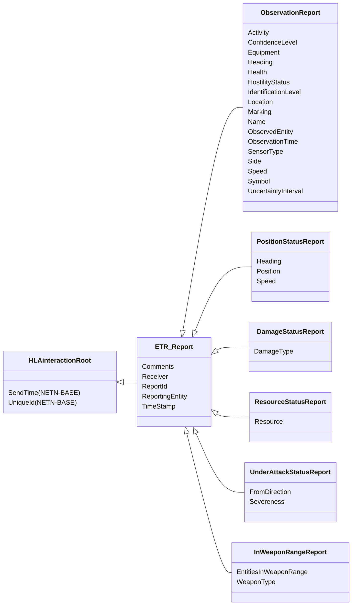
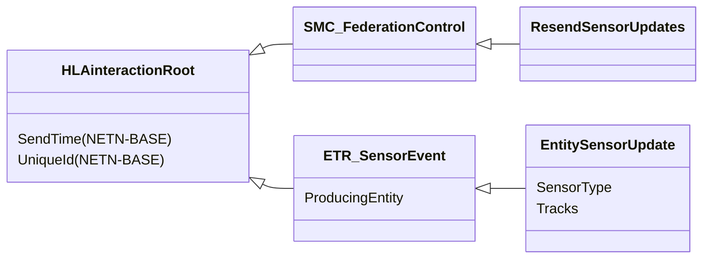
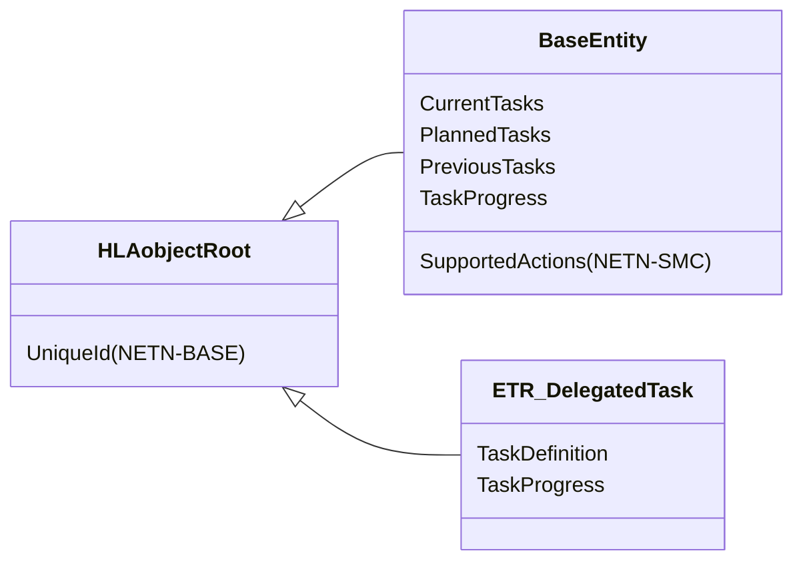

# NETN-ETR
|Version| Date| Dependencies|
|---|---|---|
|3.0 |2024-03-08|NETN-BASE, NETN-SMC|

The NATO Education and Training Network Entity Tasking and Reports Module (NETN-ETR) provides a standard interface for sending tasks to simulated entities represented in a federated distributed simulation. It defines interactions that can be interpreted and executed by simulators that model the behaviour of a tasked entity. The module also defines report interactions sent by simulated entities.

Based on the SMC_EntityControl pattern, the module defines a core set of tasks for simulated entities. Other NETN-FOM modules define additional tasks. The task definitions provided in NETN reflect the capabilities commonly found in Commercial-off-the-Shelf (COTS) Computer-Generated Forces (CGF) applications but are independent of any specific CGF.

A tasked entity can be either a physical entity (e.g., platform or lifeform) or an aggregate entity. A task definition does not specify in detail how a simulation models the execution of the task.

## Overview 
 
NETN-ETR depends on NETN-SMC and uses the `SMC_EntityControl` interaction class to direct tasks to specific entities. Available tasks are defined in the NETN-ETR module and published using the NETN-SMC `BaseEntity` attribute `SupportedActions`. 
 

 
## Tasking 
 
To send a task, use the interaction `Task` a subclass of the NETN-SMC `SMC_EntityControl` interaction. 

The `Task` interaction class is the base class for all tasks defined in NETN-ETR and other modules. 
 

 
The following tasks are defined in NETN-ETR: 
 
|Task|Description| 
|---|---| 
|MagicMove|Instructs the simulation entity to change location to the specified position and heading immediately. If attached, the entity is detached immediately just before the move task starts.| 
|MoveByRoute|Requesting a simulated entity to move given the specified route with a given speed for reaching each waypoint. The entity should align with the path from its current position to the first waypoint on the path using the speed set for the first waypoint in the route. When reaching the last waypoint, the speed is zero (0), and movement stops. If attached, the entity is detached immediately just before the move task starts.| 
|MoveInDirection|Tasking of an entity to move in a specified direction for a duration. If attached, the entity is detached immediately just before the move task starts.| 
|MoveIntoFormation|Tasking a simulated entity to move into the given formation on the given location with the given heading. If attached, the entity is detached immediately just before the move task starts.| 
|MoveToLocation|Request a simulated entity to move to a specified destination location. The entity aligns with the path from its current position to the nearest position or waypoint on the path. The entity leaves the path at a position or waypoint on the path closest to the destination. If attached, the entity is detached immediately just before the move task starts.| 
|FollowEntity|Tasking of an entity to follow another entity at a specified distance. If attached, the entity is detached immediately just before the move task starts.| 
|Patrol|Requesting a simulated entity to perform a patrol task. The tasked entity moves from its current position to the start of the patrol route and then moves according to the patrol route from its start point in the path through all waypoints. If attached, the entity is detached immediately just before the move task starts.| 
|ChangeHeading|Tasking of an entity to change heading.| 
|ChangeSpeed|Tasking of an entity to change speed.| 
|ChangeAltitude|Tasking of an entity to set move to a specified altitude.| 
|StopAtSideOfRoad|Requesting a simulated entity to stop at the side of the road. This task is only relevant for an entity moving along a road. The current move task is cancelled, and a new move task executes to a position at the side of the road (the simulator has to calculate this location). If attached, the entity is detached immediately just before the move task starts.| 
|Attach|Requesting a simulated entity to attach to (mount) the specified entity.| 
|Detach|Requesting a simulated entity to detach from a simulated entity.| 
|DirectFire|Tasking an entity to fire directed at a specified target entity.| 
|IndirectFire|Tasking an entity to fire directed at an area.| 
|Observe|Tasking of an entity to observe an area.| 
|OperateCheckpoint|Request an entity to operate a checkpoint. The tasked entity should be within the radius of the checkpoint object. If not, a separate move task should be issued first. The tasked entity activates an inactive checkpoint and operates the checkpoint for the specified duration.| 
|OperateObservationPost|Requests an entity to operate an observation post. The tasked unit should be within a given radius of the observation post. If not, a separate move task should be issued first. The tasked unit activates an inactive observation post and operates it for the specified duration.| 
|EnterFacility|Requesting a simulated entity to enter the specified facility (cultural feature). The tasked entity should be within a certain distance (tolerance specified in the federation agreements) of the facility location.| 
|ChangeRulesOfEngagement|Instructs the simulation entity to change its rules of engagement immediately.| 
|OtherActivity|Tasking of an entity to wait for a duration of time.| 
 
When sending a task the minimum required set of parameters is the `TaskId` and any `TaskParameters` associated with the specific task. All other parameters are optional with defined default values. 
 
Task status is provided using the `ETR_TaskStatus` interaction to indicate a change in status. Use the `RequestTaskStatus` interaction to request a resend of `ETR_TaskStatus` for a specific task. 
 
The `ETR_TaskStatus` interaction provides the following notifications regarding the task: 
 
* Accepted: the task is received and scheduled for execution 
* Refused: the task is not accepted for execution 
* Waiting: the task is waiting for execution 
* Executing: the task is running 
* Completed: the task has been executed successfully 
* Cancelled: the execution of the task has been explicitly terminated
* Error: the task execution has been terminated due to a modelling error 
 
Use the `CancelTasks` interaction to request an entity to terminate the execution of a scheduled or currently executing task. 
 
A task can be executed concurrently with other tasks or sequentially. The task parameters indicate the expected mode of task execution. Tasks are scheduled based on their start time and task execution mode. 
 
The execution of a task can start if: 
 
* For a non-concurrent task 
* No other non-concurrent task is executing 
* The task has the earliest `StartTime` parameter of all planned non-concurrent tasks 
* The task parameter `StartTime` is less than or equal to the current Scenario Time. 
* For a concurrent task 
* The task parameter `StartTime` is less than or equal to the current Scenario Time. 
 
## Planned Tasks and Progress 
 
The NETN-ETR module extends the RPR-FOM object class `BaseEntity` with optional attributes related to tasking. 
These include lists of planned, ongoing and completed tasks. In addition, the progress of ongoing tasks is provided as a separate attribute. 
 

 
This information is published in order to provide means for monitoring, recording and initializing the current state of all accepted tasks in the federation. 
 
## Task Delegation 
 
Normally, the federate with modelling responsibility performs the task simulation. A special mechanism allows temporary delegation of this responsibility to another federate.
 
Use the `TaskDelegation` interaction, based on the NETN-SMC `SMC_FederateControl` control action, to request a federate to perform a task on behalf of the requesting federate. 
 

 
If the task delegation is accepted, an `ETR_DelegatedTask` object is created and used to transfer information regarding the state of task execution. The federate with primary modelling responsibility still has the responsibility to perform all `ETR_TaskStatus` updates and to publish `TaskProgress` information. 
 
 
## Reporting 
 
NETN-ETR provides a way for simulated entities to send reports with information related to their state or the observed state of other simulated entities. A report relays perceived-truth data and can be generated using different combinations of sensor and information fusion models. Reports can be used by other simulation models or, for example, as report stimulation of C2 systems.
 

In particular, the `ObservationReport` is designed to allow mapping to the SISO-STD-019 C2SIM standard ontology for representing corresponding reports.

## Sensor Updates

Sensor models tracking entities can use NETN-ETR to send `EntitySensorUpdate` interactions with information regarding all current tracks produced by an entity using a specific type of sensor, see Figure 10. This information can be used to collect data as input or trigger for generating observation reports.

The sensor track data is usually only sent if a change occurs, which may cause an issue for late-joining federates. The NETN-ETR includes a NETN-SMC Federation Control Action to `ResendSensorUpdates`. Use this request to trigger the resending of all current tracks for all entities.

Normally track data is only sent if a change occurs. This may cause an issue for late joining federates. The NETN-ETR includes a NETN-SMC Federation Control Action to `ResendSensorUpdates`. Use this request to trigger a re-sending of all current tracks for all entities.

## Object Classes

### BaseEntity

A base class of aggregate and discrete scenario domain participants. The BaseEntity class is characterized by being located at a particular location in space and independently movable, if capable of movement at all. It specifically excludes elements normally considered to be a component of another element. The BaseEntity class is intended to be a container for common attributes for entities of this type. Since it lacks sufficient class specific attributes that are required for simulation purposes, federates cannot publish objects of this class. Certain simulation management federates, e.g. viewers, may subscribe to this class. Simulation federates will normally subscribe to one of the subclasses, to gain the extra information required to properly simulate the entity.

|Attribute|Datatype|Semantics|
|---|---|---|
|CurrentTasks|ArrayOfTaskDefinitions|Optional. An array of currently executing tasks.|
|PlannedTasks|ArrayOfTaskDefinitions|Optional. An array of all planned tasks.|
|PreviousTasks|ArrayOfTaskDefinitions|Optional. An array of completed or cancelled tasks.|
|TaskProgress|ArrayOfTaskProgress|Optional. An array of progress for current tasks.|
|SupportedActions (NETN-SMC)|EntityControlActions|Optional: Indicates what control actions are supported by an individual simulated entity.| 
|UniqueId (NETN-BASE)|UUID|Required. A unique identifier for the object. The Universally Unique Identifier (UUID) is generated or pre-defined.| 

### ETR_DelegatedTask

Object to represent a task and its execution progress when delegated to a federate application other than the one responsible for the tasked entity.

|Attribute|Datatype|Semantics|
|---|---|---|
|TaskDefinition|TaskDefinition|Required. Definition description of the task represented.|
|TaskProgress|TaskProgress|Required. Progress description of the task represented.|
|UniqueId (NETN-BASE)|UUID|Required. A unique identifier for the object. The Universally Unique Identifier (UUID) is generated or pre-defined.| 

## Interaction Classes

```mermaid
classDiagram 
direction LR
HLAinteractionRoot <|-- SMC_FederateControl
HLAinteractionRoot <|-- SMC_EntityControl
HLAinteractionRoot <|-- ETR_TaskStatus
HLAinteractionRoot <|-- ETR_Report
HLAinteractionRoot <|-- SMC_FederationControl
HLAinteractionRoot <|-- ETR_SensorEvent
HLAinteractionRoot : SendTime(NETN-BASE)
HLAinteractionRoot : UniqueId(NETN-BASE)
SMC_FederateControl <|-- TaskDelegation
SMC_FederateControl : Federate(NETN-SMC)
TaskDelegation : Entity
TaskDelegation : TaskDefinition
SMC_EntityControl <|-- Task
SMC_EntityControl <|-- RequestTaskStatus
SMC_EntityControl <|-- CancelTasks
SMC_EntityControl : Entity(NETN-SMC)
Task <|-- OtherActivity
Task <|-- DirectFire
Task <|-- IndirectFire
Task <|-- OperateCheckpoint
Task <|-- Observe
Task <|-- MoveToLocation
Task <|-- MoveIntoFormation
Task <|-- MoveInDirection
Task <|-- FollowEntity
Task <|-- Attach
Task <|-- Detach
Task <|-- MoveByRoute
Task <|-- ChangeSpeed
Task <|-- ChangeAltitude
Task <|-- ChangeHeading
Task <|-- Patrol
Task <|-- StopAtSideOfRoad
Task <|-- OperateObservationPost
Task <|-- EnterFacility
Task <|-- MagicMove
Task <|-- ChangeRulesOfEngagement
Task : Activity
Task : Annotation
Task : MainTask
Task : NextTask
Task : PreviousTask
Task : StartTime
Task : TaskId
Task : TaskMode
Task : Tasker
OtherActivity : TaskParameters
DirectFire : TaskParameters
IndirectFire : TaskParameters
OperateCheckpoint : TaskParameters
Observe : TaskParameters
MoveToLocation : TaskParameters
MoveIntoFormation : TaskParameters
MoveInDirection : TaskParameters
FollowEntity : TaskParameters
Attach : TaskParameters
MoveByRoute : TaskParameters
ChangeSpeed : TaskParameters
ChangeAltitude : TaskParameters
ChangeHeading : TaskParameters
Patrol : TaskParameters
OperateObservationPost : TaskParameters
EnterFacility : TaskParameters
MagicMove : TaskParameters
ChangeRulesOfEngagement : TaskParameters
RequestTaskStatus : Tasks
CancelTasks : Tasks
ETR_TaskStatus : Task
ETR_TaskStatus : TaskStatus
ETR_Report <|-- ObservationReport
ETR_Report <|-- PositionStatusReport
ETR_Report <|-- DamageStatusReport
ETR_Report <|-- ResourceStatusReport
ETR_Report <|-- UnderAttackStatusReport
ETR_Report <|-- InWeaponRangeReport
ETR_Report : Comments
ETR_Report : Receiver
ETR_Report : ReportId
ETR_Report : ReportingEntity
ETR_Report : TimeStamp
ObservationReport : Activity
ObservationReport : ConfidenceLevel
ObservationReport : Equipment
ObservationReport : Heading
ObservationReport : Health
ObservationReport : HostilityStatus
ObservationReport : IdentificationLevel
ObservationReport : Location
ObservationReport : Marking
ObservationReport : Name
ObservationReport : ObservationTime
ObservationReport : ObservedEntity
ObservationReport : SensorType
ObservationReport : Side
ObservationReport : Speed
ObservationReport : Symbol
ObservationReport : UncertaintyInterval
PositionStatusReport : Heading
PositionStatusReport : Position
PositionStatusReport : Speed
DamageStatusReport : DamageType
ResourceStatusReport : Resource
UnderAttackStatusReport : FromDirection
UnderAttackStatusReport : Severeness
InWeaponRangeReport : EntitiesInWeaponRange
InWeaponRangeReport : WeaponType
SMC_FederationControl <|-- ResendSensorUpdates
ETR_SensorEvent <|-- EntitySensorUpdate
ETR_SensorEvent : ProducingEntity
EntitySensorUpdate : SensorType
EntitySensorUpdate : Tracks
```

### TaskDelegation

Request a specific federate application to execute a task. If the delegated task is accepted, a `DelegatedTask` object is created in the federation to track the progress of task execution.

|Parameter|Datatype|Semantics|
|---|---|---|
|Entity|UUID|Required: The entity to perform the task.|
|TaskDefinition|TaskDefinition|Required. Definition of the task.|
|Federate (NETN-SMC)|FederateName|Required: The federate intended as the receiver of this control action.| 
|SendTime (NETN-BASE)|EpochTime|Optional: Scenario time when the interaction was sent. Default is interpreted as the receivers scenario time when the interaction is received. Required for all ETR related interactions.| 
|UniqueId (NETN-BASE)|UUID|Optional: A unique identifier for the interaction. Required for all ETR related interactions.| 

### Task

Requests a simulated entity to perform some task based on a task description. If accepted, the federate application modelling the behaviour will execute the task per task parameters and scheduling. A request task is acknowledged using a `TaskStatusUpdate` response interaction. Resending a `RequestTask` with the same `TaskId` as a previously sent interaction is equivalent to cancelling and sending a new task.

|Parameter|Datatype|Semantics|
|---|---|---|
|Activity|AggregateMissionEnum16|Optional. Specifies the activity for the entity that will execute the task. The default value is zero (0).|
|Annotation|HLAunicodeString|Optional. A general text describing information about this task. The annotation may, e.g. include the reason for the task and text describing the names of referenced entities.|
|MainTask|UUID|Optional. Provided to indicate that this task is a subtask related to a main task.|
|NextTask|UUID|Optional. Provided to indicate that the task will execute before the referenced task.|
|PreviousTask|UUID|Optional. Provided to indicate that the task will execute after the referenced task.|
|StartTime|EpochTime|Optional. The default value is the current `SendTime`.|
|TaskId|UUID|Required. Unique identifier for the task.|
|TaskMode|TaskModeEnum8|Optional. Determines the task mode. Default NonConcurrentMode|
|Tasker|UUID|Optional. Reference to the commander of the task. If missing, the commander is undefined.|
|Entity (NETN-SMC)|UUID|Required: Reference to a simulation entity for which the control action is intended. Required for all ETR related interactions.| 
|SendTime (NETN-BASE)|EpochTime|Optional: Scenario time when the interaction was sent. Default is interpreted as the receivers scenario time when the interaction is received. Required for all ETR related interactions.| 
|UniqueId (NETN-BASE)|UUID|Optional: A unique identifier for the interaction. Required for all ETR related interactions.| 

### OtherActivity

Tasking of an entity to wait for a duration of time.

|Parameter|Datatype|Semantics|
|---|---|---|
|Activity|AggregateMissionEnum16|Optional. Specifies the activity for the entity that will execute the task. The default value is zero (0).|
|Annotation|HLAunicodeString|Optional. A general text describing information about this task. The annotation may, e.g. include the reason for the task and text describing the names of referenced entities.|
|MainTask|UUID|Optional. Provided to indicate that this task is a subtask related to a main task.|
|NextTask|UUID|Optional. Provided to indicate that the task will execute before the referenced task.|
|PreviousTask|UUID|Optional. Provided to indicate that the task will execute after the referenced task.|
|StartTime|EpochTime|Optional. The default value is the current `SendTime`.|
|TaskId|UUID|Required. Unique identifier for the task.|
|TaskMode|TaskModeEnum8|Optional. Determines the task mode. Default NonConcurrentMode|
|TaskParameters|OtherActivityTaskStruct|Required: Task parameters.|
|Tasker|UUID|Optional. Reference to the commander of the task. If missing, the commander is undefined.|
|Entity (NETN-SMC)|UUID|Required: Reference to a simulation entity for which the control action is intended. Required for all ETR related interactions.| 
|SendTime (NETN-BASE)|EpochTime|Optional: Scenario time when the interaction was sent. Default is interpreted as the receivers scenario time when the interaction is received. Required for all ETR related interactions.| 
|UniqueId (NETN-BASE)|UUID|Optional: A unique identifier for the interaction. Required for all ETR related interactions.| 

### DirectFire

Tasking an entity to fire directed at a specified target entity.

|Parameter|Datatype|Semantics|
|---|---|---|
|Activity|AggregateMissionEnum16|Optional. Specifies the activity for the entity that will execute the task. The default value is zero (0).|
|Annotation|HLAunicodeString|Optional. A general text describing information about this task. The annotation may, e.g. include the reason for the task and text describing the names of referenced entities.|
|MainTask|UUID|Optional. Provided to indicate that this task is a subtask related to a main task.|
|NextTask|UUID|Optional. Provided to indicate that the task will execute before the referenced task.|
|PreviousTask|UUID|Optional. Provided to indicate that the task will execute after the referenced task.|
|StartTime|EpochTime|Optional. The default value is the current `SendTime`.|
|TaskId|UUID|Required. Unique identifier for the task.|
|TaskMode|TaskModeEnum8|Optional. Determines the task mode. Default NonConcurrentMode|
|TaskParameters|DirectFireTaskStruct|Required: Task parameters|
|Tasker|UUID|Optional. Reference to the commander of the task. If missing, the commander is undefined.|
|Entity (NETN-SMC)|UUID|Required: Reference to a simulation entity for which the control action is intended. Required for all ETR related interactions.| 
|SendTime (NETN-BASE)|EpochTime|Optional: Scenario time when the interaction was sent. Default is interpreted as the receivers scenario time when the interaction is received. Required for all ETR related interactions.| 
|UniqueId (NETN-BASE)|UUID|Optional: A unique identifier for the interaction. Required for all ETR related interactions.| 

### IndirectFire

Tasking an entity to fire directed at an area.

|Parameter|Datatype|Semantics|
|---|---|---|
|Activity|AggregateMissionEnum16|Optional. Specifies the activity for the entity that will execute the task. The default value is zero (0).|
|Annotation|HLAunicodeString|Optional. A general text describing information about this task. The annotation may, e.g. include the reason for the task and text describing the names of referenced entities.|
|MainTask|UUID|Optional. Provided to indicate that this task is a subtask related to a main task.|
|NextTask|UUID|Optional. Provided to indicate that the task will execute before the referenced task.|
|PreviousTask|UUID|Optional. Provided to indicate that the task will execute after the referenced task.|
|StartTime|EpochTime|Optional. The default value is the current `SendTime`.|
|TaskId|UUID|Required. Unique identifier for the task.|
|TaskMode|TaskModeEnum8|Optional. Determines the task mode. Default NonConcurrentMode|
|TaskParameters|IndirectFireTaskStruct|Required: Task parameters|
|Tasker|UUID|Optional. Reference to the commander of the task. If missing, the commander is undefined.|
|Entity (NETN-SMC)|UUID|Required: Reference to a simulation entity for which the control action is intended. Required for all ETR related interactions.| 
|SendTime (NETN-BASE)|EpochTime|Optional: Scenario time when the interaction was sent. Default is interpreted as the receivers scenario time when the interaction is received. Required for all ETR related interactions.| 
|UniqueId (NETN-BASE)|UUID|Optional: A unique identifier for the interaction. Required for all ETR related interactions.| 

### OperateCheckpoint

Request an entity to operate a checkpoint. The tasked entity should be within the radius of the checkpoint object. If not, a separate move task should be issued first. The tasked entity activates an inactive checkpoint and operates the checkpoint for the specified duration.

|Parameter|Datatype|Semantics|
|---|---|---|
|Activity|AggregateMissionEnum16|Optional. Specifies the activity for the entity that will execute the task. The default value is zero (0).|
|Annotation|HLAunicodeString|Optional. A general text describing information about this task. The annotation may, e.g. include the reason for the task and text describing the names of referenced entities.|
|MainTask|UUID|Optional. Provided to indicate that this task is a subtask related to a main task.|
|NextTask|UUID|Optional. Provided to indicate that the task will execute before the referenced task.|
|PreviousTask|UUID|Optional. Provided to indicate that the task will execute after the referenced task.|
|StartTime|EpochTime|Optional. The default value is the current `SendTime`.|
|TaskId|UUID|Required. Unique identifier for the task.|
|TaskMode|TaskModeEnum8|Optional. Determines the task mode. Default NonConcurrentMode|
|TaskParameters|OperateCheckpointTaskStruct|Required: Task parameters|
|Tasker|UUID|Optional. Reference to the commander of the task. If missing, the commander is undefined.|
|Entity (NETN-SMC)|UUID|Required: Reference to a simulation entity for which the control action is intended. Required for all ETR related interactions.| 
|SendTime (NETN-BASE)|EpochTime|Optional: Scenario time when the interaction was sent. Default is interpreted as the receivers scenario time when the interaction is received. Required for all ETR related interactions.| 
|UniqueId (NETN-BASE)|UUID|Optional: A unique identifier for the interaction. Required for all ETR related interactions.| 

### Observe

Tasking of an entity to observe an area.

|Parameter|Datatype|Semantics|
|---|---|---|
|Activity|AggregateMissionEnum16|Optional. Specifies the activity for the entity that will execute the task. The default value is zero (0).|
|Annotation|HLAunicodeString|Optional. A general text describing information about this task. The annotation may, e.g. include the reason for the task and text describing the names of referenced entities.|
|MainTask|UUID|Optional. Provided to indicate that this task is a subtask related to a main task.|
|NextTask|UUID|Optional. Provided to indicate that the task will execute before the referenced task.|
|PreviousTask|UUID|Optional. Provided to indicate that the task will execute after the referenced task.|
|StartTime|EpochTime|Optional. The default value is the current `SendTime`.|
|TaskId|UUID|Required. Unique identifier for the task.|
|TaskMode|TaskModeEnum8|Optional. Determines the task mode. Default NonConcurrentMode|
|TaskParameters|ObserveTaskStruct|Required: Task parameters|
|Tasker|UUID|Optional. Reference to the commander of the task. If missing, the commander is undefined.|
|Entity (NETN-SMC)|UUID|Required: Reference to a simulation entity for which the control action is intended. Required for all ETR related interactions.| 
|SendTime (NETN-BASE)|EpochTime|Optional: Scenario time when the interaction was sent. Default is interpreted as the receivers scenario time when the interaction is received. Required for all ETR related interactions.| 
|UniqueId (NETN-BASE)|UUID|Optional: A unique identifier for the interaction. Required for all ETR related interactions.| 

### MoveToLocation

Request a simulated entity to move to a specified destination location. The entity aligns with the path from its current position to the nearest position or waypoint on the path. The entity leaves the path at a position or waypoint on the path closest to the destination. If attached, the entity is detached immediately just before the move task starts.

|Parameter|Datatype|Semantics|
|---|---|---|
|Activity|AggregateMissionEnum16|Optional. Specifies the activity for the entity that will execute the task. The default value is zero (0).|
|Annotation|HLAunicodeString|Optional. A general text describing information about this task. The annotation may, e.g. include the reason for the task and text describing the names of referenced entities.|
|MainTask|UUID|Optional. Provided to indicate that this task is a subtask related to a main task.|
|NextTask|UUID|Optional. Provided to indicate that the task will execute before the referenced task.|
|PreviousTask|UUID|Optional. Provided to indicate that the task will execute after the referenced task.|
|StartTime|EpochTime|Optional. The default value is the current `SendTime`.|
|TaskId|UUID|Required. Unique identifier for the task.|
|TaskMode|TaskModeEnum8|Optional. Determines the task mode. Default NonConcurrentMode|
|TaskParameters|MoveToLocationTaskStruct|Required: Task parameters.|
|Tasker|UUID|Optional. Reference to the commander of the task. If missing, the commander is undefined.|
|Entity (NETN-SMC)|UUID|Required: Reference to a simulation entity for which the control action is intended. Required for all ETR related interactions.| 
|SendTime (NETN-BASE)|EpochTime|Optional: Scenario time when the interaction was sent. Default is interpreted as the receivers scenario time when the interaction is received. Required for all ETR related interactions.| 
|UniqueId (NETN-BASE)|UUID|Optional: A unique identifier for the interaction. Required for all ETR related interactions.| 

### MoveIntoFormation

Tasking a simulated entity to move into the given formation on the given location with the given heading. If attached, the entity is detached immediately just before the move task starts.

|Parameter|Datatype|Semantics|
|---|---|---|
|Activity|AggregateMissionEnum16|Optional. Specifies the activity for the entity that will execute the task. The default value is zero (0).|
|Annotation|HLAunicodeString|Optional. A general text describing information about this task. The annotation may, e.g. include the reason for the task and text describing the names of referenced entities.|
|MainTask|UUID|Optional. Provided to indicate that this task is a subtask related to a main task.|
|NextTask|UUID|Optional. Provided to indicate that the task will execute before the referenced task.|
|PreviousTask|UUID|Optional. Provided to indicate that the task will execute after the referenced task.|
|StartTime|EpochTime|Optional. The default value is the current `SendTime`.|
|TaskId|UUID|Required. Unique identifier for the task.|
|TaskMode|TaskModeEnum8|Optional. Determines the task mode. Default NonConcurrentMode|
|TaskParameters|MoveIntoFormationTaskStruct|Required: Task parameters.|
|Tasker|UUID|Optional. Reference to the commander of the task. If missing, the commander is undefined.|
|Entity (NETN-SMC)|UUID|Required: Reference to a simulation entity for which the control action is intended. Required for all ETR related interactions.| 
|SendTime (NETN-BASE)|EpochTime|Optional: Scenario time when the interaction was sent. Default is interpreted as the receivers scenario time when the interaction is received. Required for all ETR related interactions.| 
|UniqueId (NETN-BASE)|UUID|Optional: A unique identifier for the interaction. Required for all ETR related interactions.| 

### MoveInDirection

Tasking of an entity to move in a specified direction for a duration. If attached, the entity is detached immediately just before the move task starts.

|Parameter|Datatype|Semantics|
|---|---|---|
|Activity|AggregateMissionEnum16|Optional. Specifies the activity for the entity that will execute the task. The default value is zero (0).|
|Annotation|HLAunicodeString|Optional. A general text describing information about this task. The annotation may, e.g. include the reason for the task and text describing the names of referenced entities.|
|MainTask|UUID|Optional. Provided to indicate that this task is a subtask related to a main task.|
|NextTask|UUID|Optional. Provided to indicate that the task will execute before the referenced task.|
|PreviousTask|UUID|Optional. Provided to indicate that the task will execute after the referenced task.|
|StartTime|EpochTime|Optional. The default value is the current `SendTime`.|
|TaskId|UUID|Required. Unique identifier for the task.|
|TaskMode|TaskModeEnum8|Optional. Determines the task mode. Default NonConcurrentMode|
|TaskParameters|MoveInDirectionTaskStruct|Required: Task parameters.|
|Tasker|UUID|Optional. Reference to the commander of the task. If missing, the commander is undefined.|
|Entity (NETN-SMC)|UUID|Required: Reference to a simulation entity for which the control action is intended. Required for all ETR related interactions.| 
|SendTime (NETN-BASE)|EpochTime|Optional: Scenario time when the interaction was sent. Default is interpreted as the receivers scenario time when the interaction is received. Required for all ETR related interactions.| 
|UniqueId (NETN-BASE)|UUID|Optional: A unique identifier for the interaction. Required for all ETR related interactions.| 

### FollowEntity

Tasking of an entity to follow another entity at a specified distance. If attached, the entity is detached immediately just before the move task starts.

|Parameter|Datatype|Semantics|
|---|---|---|
|Activity|AggregateMissionEnum16|Optional. Specifies the activity for the entity that will execute the task. The default value is zero (0).|
|Annotation|HLAunicodeString|Optional. A general text describing information about this task. The annotation may, e.g. include the reason for the task and text describing the names of referenced entities.|
|MainTask|UUID|Optional. Provided to indicate that this task is a subtask related to a main task.|
|NextTask|UUID|Optional. Provided to indicate that the task will execute before the referenced task.|
|PreviousTask|UUID|Optional. Provided to indicate that the task will execute after the referenced task.|
|StartTime|EpochTime|Optional. The default value is the current `SendTime`.|
|TaskId|UUID|Required. Unique identifier for the task.|
|TaskMode|TaskModeEnum8|Optional. Determines the task mode. Default NonConcurrentMode|
|TaskParameters|FollowEntityTaskStruct|Required: Task parameters.|
|Tasker|UUID|Optional. Reference to the commander of the task. If missing, the commander is undefined.|
|Entity (NETN-SMC)|UUID|Required: Reference to a simulation entity for which the control action is intended. Required for all ETR related interactions.| 
|SendTime (NETN-BASE)|EpochTime|Optional: Scenario time when the interaction was sent. Default is interpreted as the receivers scenario time when the interaction is received. Required for all ETR related interactions.| 
|UniqueId (NETN-BASE)|UUID|Optional: A unique identifier for the interaction. Required for all ETR related interactions.| 

### Attach

Requesting a simulated entity to attach to (mount) the specified entity.

|Parameter|Datatype|Semantics|
|---|---|---|
|Activity|AggregateMissionEnum16|Optional. Specifies the activity for the entity that will execute the task. The default value is zero (0).|
|Annotation|HLAunicodeString|Optional. A general text describing information about this task. The annotation may, e.g. include the reason for the task and text describing the names of referenced entities.|
|MainTask|UUID|Optional. Provided to indicate that this task is a subtask related to a main task.|
|NextTask|UUID|Optional. Provided to indicate that the task will execute before the referenced task.|
|PreviousTask|UUID|Optional. Provided to indicate that the task will execute after the referenced task.|
|StartTime|EpochTime|Optional. The default value is the current `SendTime`.|
|TaskId|UUID|Required. Unique identifier for the task.|
|TaskMode|TaskModeEnum8|Optional. Determines the task mode. Default NonConcurrentMode|
|TaskParameters|AttachTaskStruct|Required: Task parameters|
|Tasker|UUID|Optional. Reference to the commander of the task. If missing, the commander is undefined.|
|Entity (NETN-SMC)|UUID|Required: Reference to a simulation entity for which the control action is intended. Required for all ETR related interactions.| 
|SendTime (NETN-BASE)|EpochTime|Optional: Scenario time when the interaction was sent. Default is interpreted as the receivers scenario time when the interaction is received. Required for all ETR related interactions.| 
|UniqueId (NETN-BASE)|UUID|Optional: A unique identifier for the interaction. Required for all ETR related interactions.| 

### Detach

Requesting a simulated entity to detach from a simulated entity.

|Parameter|Datatype|Semantics|
|---|---|---|
|Activity|AggregateMissionEnum16|Optional. Specifies the activity for the entity that will execute the task. The default value is zero (0).|
|Annotation|HLAunicodeString|Optional. A general text describing information about this task. The annotation may, e.g. include the reason for the task and text describing the names of referenced entities.|
|MainTask|UUID|Optional. Provided to indicate that this task is a subtask related to a main task.|
|NextTask|UUID|Optional. Provided to indicate that the task will execute before the referenced task.|
|PreviousTask|UUID|Optional. Provided to indicate that the task will execute after the referenced task.|
|StartTime|EpochTime|Optional. The default value is the current `SendTime`.|
|TaskId|UUID|Required. Unique identifier for the task.|
|TaskMode|TaskModeEnum8|Optional. Determines the task mode. Default NonConcurrentMode|
|Tasker|UUID|Optional. Reference to the commander of the task. If missing, the commander is undefined.|
|Entity (NETN-SMC)|UUID|Required: Reference to a simulation entity for which the control action is intended. Required for all ETR related interactions.| 
|SendTime (NETN-BASE)|EpochTime|Optional: Scenario time when the interaction was sent. Default is interpreted as the receivers scenario time when the interaction is received. Required for all ETR related interactions.| 
|UniqueId (NETN-BASE)|UUID|Optional: A unique identifier for the interaction. Required for all ETR related interactions.| 

### MoveByRoute

Requesting a simulated entity to move given the specified route with a given speed for reaching each waypoint. The entity should align with the path from its current position to the first waypoint on the path using the speed set for the first waypoint in the route. When reaching the last waypoint, the speed is zero (0), and movement stops. If attached, the entity is detached immediately just before the move task starts.

|Parameter|Datatype|Semantics|
|---|---|---|
|Activity|AggregateMissionEnum16|Optional. Specifies the activity for the entity that will execute the task. The default value is zero (0).|
|Annotation|HLAunicodeString|Optional. A general text describing information about this task. The annotation may, e.g. include the reason for the task and text describing the names of referenced entities.|
|MainTask|UUID|Optional. Provided to indicate that this task is a subtask related to a main task.|
|NextTask|UUID|Optional. Provided to indicate that the task will execute before the referenced task.|
|PreviousTask|UUID|Optional. Provided to indicate that the task will execute after the referenced task.|
|StartTime|EpochTime|Optional. The default value is the current `SendTime`.|
|TaskId|UUID|Required. Unique identifier for the task.|
|TaskMode|TaskModeEnum8|Optional. Determines the task mode. Default NonConcurrentMode|
|TaskParameters|MoveByRouteTaskStruct|Required: Task parameters.|
|Tasker|UUID|Optional. Reference to the commander of the task. If missing, the commander is undefined.|
|Entity (NETN-SMC)|UUID|Required: Reference to a simulation entity for which the control action is intended. Required for all ETR related interactions.| 
|SendTime (NETN-BASE)|EpochTime|Optional: Scenario time when the interaction was sent. Default is interpreted as the receivers scenario time when the interaction is received. Required for all ETR related interactions.| 
|UniqueId (NETN-BASE)|UUID|Optional: A unique identifier for the interaction. Required for all ETR related interactions.| 

### ChangeSpeed

Tasking of an entity to change speed.

|Parameter|Datatype|Semantics|
|---|---|---|
|Activity|AggregateMissionEnum16|Optional. Specifies the activity for the entity that will execute the task. The default value is zero (0).|
|Annotation|HLAunicodeString|Optional. A general text describing information about this task. The annotation may, e.g. include the reason for the task and text describing the names of referenced entities.|
|MainTask|UUID|Optional. Provided to indicate that this task is a subtask related to a main task.|
|NextTask|UUID|Optional. Provided to indicate that the task will execute before the referenced task.|
|PreviousTask|UUID|Optional. Provided to indicate that the task will execute after the referenced task.|
|StartTime|EpochTime|Optional. The default value is the current `SendTime`.|
|TaskId|UUID|Required. Unique identifier for the task.|
|TaskMode|TaskModeEnum8|Optional. Determines the task mode. Default NonConcurrentMode|
|TaskParameters|ChangeSpeedTaskStruct|Required: Task parameters.|
|Tasker|UUID|Optional. Reference to the commander of the task. If missing, the commander is undefined.|
|Entity (NETN-SMC)|UUID|Required: Reference to a simulation entity for which the control action is intended. Required for all ETR related interactions.| 
|SendTime (NETN-BASE)|EpochTime|Optional: Scenario time when the interaction was sent. Default is interpreted as the receivers scenario time when the interaction is received. Required for all ETR related interactions.| 
|UniqueId (NETN-BASE)|UUID|Optional: A unique identifier for the interaction. Required for all ETR related interactions.| 

### ChangeAltitude

Tasking of an entity to set move to a specified altitude.

|Parameter|Datatype|Semantics|
|---|---|---|
|Activity|AggregateMissionEnum16|Optional. Specifies the activity for the entity that will execute the task. The default value is zero (0).|
|Annotation|HLAunicodeString|Optional. A general text describing information about this task. The annotation may, e.g. include the reason for the task and text describing the names of referenced entities.|
|MainTask|UUID|Optional. Provided to indicate that this task is a subtask related to a main task.|
|NextTask|UUID|Optional. Provided to indicate that the task will execute before the referenced task.|
|PreviousTask|UUID|Optional. Provided to indicate that the task will execute after the referenced task.|
|StartTime|EpochTime|Optional. The default value is the current `SendTime`.|
|TaskId|UUID|Required. Unique identifier for the task.|
|TaskMode|TaskModeEnum8|Optional. Determines the task mode. Default NonConcurrentMode|
|TaskParameters|ChangeAltitudeTaskStruct|Required: Task parameters.|
|Tasker|UUID|Optional. Reference to the commander of the task. If missing, the commander is undefined.|
|Entity (NETN-SMC)|UUID|Required: Reference to a simulation entity for which the control action is intended. Required for all ETR related interactions.| 
|SendTime (NETN-BASE)|EpochTime|Optional: Scenario time when the interaction was sent. Default is interpreted as the receivers scenario time when the interaction is received. Required for all ETR related interactions.| 
|UniqueId (NETN-BASE)|UUID|Optional: A unique identifier for the interaction. Required for all ETR related interactions.| 

### ChangeHeading

Tasking of an entity to change heading.

|Parameter|Datatype|Semantics|
|---|---|---|
|Activity|AggregateMissionEnum16|Optional. Specifies the activity for the entity that will execute the task. The default value is zero (0).|
|Annotation|HLAunicodeString|Optional. A general text describing information about this task. The annotation may, e.g. include the reason for the task and text describing the names of referenced entities.|
|MainTask|UUID|Optional. Provided to indicate that this task is a subtask related to a main task.|
|NextTask|UUID|Optional. Provided to indicate that the task will execute before the referenced task.|
|PreviousTask|UUID|Optional. Provided to indicate that the task will execute after the referenced task.|
|StartTime|EpochTime|Optional. The default value is the current `SendTime`.|
|TaskId|UUID|Required. Unique identifier for the task.|
|TaskMode|TaskModeEnum8|Optional. Determines the task mode. Default NonConcurrentMode|
|TaskParameters|ChangeHeadingTaskStruct|Required: Task parameters.|
|Tasker|UUID|Optional. Reference to the commander of the task. If missing, the commander is undefined.|
|Entity (NETN-SMC)|UUID|Required: Reference to a simulation entity for which the control action is intended. Required for all ETR related interactions.| 
|SendTime (NETN-BASE)|EpochTime|Optional: Scenario time when the interaction was sent. Default is interpreted as the receivers scenario time when the interaction is received. Required for all ETR related interactions.| 
|UniqueId (NETN-BASE)|UUID|Optional: A unique identifier for the interaction. Required for all ETR related interactions.| 

### Patrol

Requesting a simulated entity to perform a patrol task. The tasked entity moves from its current position to the start of the patrol route and then moves according to the patrol route from its start point in the path through all waypoints. If attached, the entity is detached immediately just before the move task starts.

|Parameter|Datatype|Semantics|
|---|---|---|
|Activity|AggregateMissionEnum16|Optional. Specifies the activity for the entity that will execute the task. The default value is zero (0).|
|Annotation|HLAunicodeString|Optional. A general text describing information about this task. The annotation may, e.g. include the reason for the task and text describing the names of referenced entities.|
|MainTask|UUID|Optional. Provided to indicate that this task is a subtask related to a main task.|
|NextTask|UUID|Optional. Provided to indicate that the task will execute before the referenced task.|
|PreviousTask|UUID|Optional. Provided to indicate that the task will execute after the referenced task.|
|StartTime|EpochTime|Optional. The default value is the current `SendTime`.|
|TaskId|UUID|Required. Unique identifier for the task.|
|TaskMode|TaskModeEnum8|Optional. Determines the task mode. Default NonConcurrentMode|
|TaskParameters|PatrolTaskStruct|Required: Task parameters|
|Tasker|UUID|Optional. Reference to the commander of the task. If missing, the commander is undefined.|
|Entity (NETN-SMC)|UUID|Required: Reference to a simulation entity for which the control action is intended. Required for all ETR related interactions.| 
|SendTime (NETN-BASE)|EpochTime|Optional: Scenario time when the interaction was sent. Default is interpreted as the receivers scenario time when the interaction is received. Required for all ETR related interactions.| 
|UniqueId (NETN-BASE)|UUID|Optional: A unique identifier for the interaction. Required for all ETR related interactions.| 

### StopAtSideOfRoad

Requesting a simulated entity to stop at the side of the road. This task is only relevant for an entity moving along a road. The current move task is cancelled, and a new move task executes to a position at the side of the road (the simulator has to calculate this location). If attached, the entity is detached immediately just before the move task starts.

|Parameter|Datatype|Semantics|
|---|---|---|
|Activity|AggregateMissionEnum16|Optional. Specifies the activity for the entity that will execute the task. The default value is zero (0).|
|Annotation|HLAunicodeString|Optional. A general text describing information about this task. The annotation may, e.g. include the reason for the task and text describing the names of referenced entities.|
|MainTask|UUID|Optional. Provided to indicate that this task is a subtask related to a main task.|
|NextTask|UUID|Optional. Provided to indicate that the task will execute before the referenced task.|
|PreviousTask|UUID|Optional. Provided to indicate that the task will execute after the referenced task.|
|StartTime|EpochTime|Optional. The default value is the current `SendTime`.|
|TaskId|UUID|Required. Unique identifier for the task.|
|TaskMode|TaskModeEnum8|Optional. Determines the task mode. Default NonConcurrentMode|
|Tasker|UUID|Optional. Reference to the commander of the task. If missing, the commander is undefined.|
|Entity (NETN-SMC)|UUID|Required: Reference to a simulation entity for which the control action is intended. Required for all ETR related interactions.| 
|SendTime (NETN-BASE)|EpochTime|Optional: Scenario time when the interaction was sent. Default is interpreted as the receivers scenario time when the interaction is received. Required for all ETR related interactions.| 
|UniqueId (NETN-BASE)|UUID|Optional: A unique identifier for the interaction. Required for all ETR related interactions.| 

### OperateObservationPost

Requests an entity to operate an observation post. The tasked unit should be within in a given radius from the observation post. If not, a separate move task should be issued first. The tasked unit activates an inactive observation post and operates it for the specified duration.

|Parameter|Datatype|Semantics|
|---|---|---|
|Activity|AggregateMissionEnum16|Optional. Specifies the activity for the entity that will execute the task. The default value is zero (0).|
|Annotation|HLAunicodeString|Optional. A general text describing information about this task. The annotation may, e.g. include the reason for the task and text describing the names of referenced entities.|
|MainTask|UUID|Optional. Provided to indicate that this task is a subtask related to a main task.|
|NextTask|UUID|Optional. Provided to indicate that the task will execute before the referenced task.|
|PreviousTask|UUID|Optional. Provided to indicate that the task will execute after the referenced task.|
|StartTime|EpochTime|Optional. The default value is the current `SendTime`.|
|TaskId|UUID|Required. Unique identifier for the task.|
|TaskMode|TaskModeEnum8|Optional. Determines the task mode. Default NonConcurrentMode|
|TaskParameters|OperateObservationPostTaskStruct|Required: Task parameters|
|Tasker|UUID|Optional. Reference to the commander of the task. If missing, the commander is undefined.|
|Entity (NETN-SMC)|UUID|Required: Reference to a simulation entity for which the control action is intended. Required for all ETR related interactions.| 
|SendTime (NETN-BASE)|EpochTime|Optional: Scenario time when the interaction was sent. Default is interpreted as the receivers scenario time when the interaction is received. Required for all ETR related interactions.| 
|UniqueId (NETN-BASE)|UUID|Optional: A unique identifier for the interaction. Required for all ETR related interactions.| 

### EnterFacility

Requesting a simulated entity to enter the specified facility (cultural feature). The tasked entity should be within a certain distance (tolerance specified in the federation agreements) of the facility location to enter.

|Parameter|Datatype|Semantics|
|---|---|---|
|Activity|AggregateMissionEnum16|Optional. Specifies the activity for the entity that will execute the task. The default value is zero (0).|
|Annotation|HLAunicodeString|Optional. A general text describing information about this task. The annotation may, e.g. include the reason for the task and text describing the names of referenced entities.|
|MainTask|UUID|Optional. Provided to indicate that this task is a subtask related to a main task.|
|NextTask|UUID|Optional. Provided to indicate that the task will execute before the referenced task.|
|PreviousTask|UUID|Optional. Provided to indicate that the task will execute after the referenced task.|
|StartTime|EpochTime|Optional. The default value is the current `SendTime`.|
|TaskId|UUID|Required. Unique identifier for the task.|
|TaskMode|TaskModeEnum8|Optional. Determines the task mode. Default NonConcurrentMode|
|TaskParameters|AttachTaskStruct|Required: Task parameters|
|Tasker|UUID|Optional. Reference to the commander of the task. If missing, the commander is undefined.|
|Entity (NETN-SMC)|UUID|Required: Reference to a simulation entity for which the control action is intended. Required for all ETR related interactions.| 
|SendTime (NETN-BASE)|EpochTime|Optional: Scenario time when the interaction was sent. Default is interpreted as the receivers scenario time when the interaction is received. Required for all ETR related interactions.| 
|UniqueId (NETN-BASE)|UUID|Optional: A unique identifier for the interaction. Required for all ETR related interactions.| 

### MagicMove

Instructs the simulation entity to immediately change location to the specified position and heading. If attached, the entity is detached immediately just before the move task starts.

|Parameter|Datatype|Semantics|
|---|---|---|
|Activity|AggregateMissionEnum16|Optional. Specifies the activity for the entity that will execute the task. The default value is zero (0).|
|Annotation|HLAunicodeString|Optional. A general text describing information about this task. The annotation may, e.g. include the reason for the task and text describing the names of referenced entities.|
|MainTask|UUID|Optional. Provided to indicate that this task is a subtask related to a main task.|
|NextTask|UUID|Optional. Provided to indicate that the task will execute before the referenced task.|
|PreviousTask|UUID|Optional. Provided to indicate that the task will execute after the referenced task.|
|StartTime|EpochTime|Optional. The default value is the current `SendTime`.|
|TaskId|UUID|Required. Unique identifier for the task.|
|TaskMode|TaskModeEnum8|Optional. Determines the task mode. Default NonConcurrentMode|
|TaskParameters|MagicMoveTaskStruct|Required: Task parameters.|
|Tasker|UUID|Optional. Reference to the commander of the task. If missing, the commander is undefined.|
|Entity (NETN-SMC)|UUID|Required: Reference to a simulation entity for which the control action is intended. Required for all ETR related interactions.| 
|SendTime (NETN-BASE)|EpochTime|Optional: Scenario time when the interaction was sent. Default is interpreted as the receivers scenario time when the interaction is received. Required for all ETR related interactions.| 
|UniqueId (NETN-BASE)|UUID|Optional: A unique identifier for the interaction. Required for all ETR related interactions.| 

### ChangeRulesOfEngagement

Instructs the simulation entity to change its rules of engagement immediately.

|Parameter|Datatype|Semantics|
|---|---|---|
|Activity|AggregateMissionEnum16|Optional. Specifies the activity for the entity that will execute the task. The default value is zero (0).|
|Annotation|HLAunicodeString|Optional. A general text describing information about this task. The annotation may, e.g. include the reason for the task and text describing the names of referenced entities.|
|MainTask|UUID|Optional. Provided to indicate that this task is a subtask related to a main task.|
|NextTask|UUID|Optional. Provided to indicate that the task will execute before the referenced task.|
|PreviousTask|UUID|Optional. Provided to indicate that the task will execute after the referenced task.|
|StartTime|EpochTime|Optional. The default value is the current `SendTime`.|
|TaskId|UUID|Required. Unique identifier for the task.|
|TaskMode|TaskModeEnum8|Optional. Determines the task mode. Default NonConcurrentMode|
|TaskParameters|ChangeRulesOfEngagementTaskStruct|Required: Task parameters.|
|Tasker|UUID|Optional. Reference to the commander of the task. If missing, the commander is undefined.|

### RequestTaskStatus

Requests the federate application modelling the tasked entity to send a `TaskStatusUpdate` interaction for the specified tasks.

|Parameter|Datatype|Semantics|
|---|---|---|
|Tasks|ArrayOfUuid|Optional. Tasks for which status reports are requested. The default, if not provided or if the list of tasks is empty, the request refers to all tasks for the tasked entity.|
|Entity (NETN-SMC)|UUID|Required: Reference to a simulation entity for which the control action is intended. Required for all ETR related interactions.| 
|SendTime (NETN-BASE)|EpochTime|Optional: Scenario time when the interaction was sent. Default is interpreted as the receivers scenario time when the interaction is received. Required for all ETR related interactions.| 
|UniqueId (NETN-BASE)|UUID|Optional: A unique identifier for the interaction. Required for all ETR related interactions.| 

### CancelTasks

Request to cancel all one or more tasks.

|Parameter|Datatype|Semantics|
|---|---|---|
|Tasks|ArrayOfUuid|Required. Tasks to cancel. If no specific tasks are indicated, the default is to cancel all scheduled and ongoing tasks for the simulation entity.|
|Entity (NETN-SMC)|UUID|Required: Reference to a simulation entity for which the control action is intended. Required for all ETR related interactions.| 
|SendTime (NETN-BASE)|EpochTime|Optional: Scenario time when the interaction was sent. Default is interpreted as the receivers scenario time when the interaction is received. Required for all ETR related interactions.| 
|UniqueId (NETN-BASE)|UUID|Optional: A unique identifier for the interaction. Required for all ETR related interactions.| 

### ETR_TaskStatus

A management task report regarding the status of a specific task assigned to an entity. The inherited parameter `Time is required.`

|Parameter|Datatype|Semantics|
|---|---|---|
|Task|UUID|Required. Reference to the task associated with the report.|
|TaskStatus|TaskStatusEnum32|Required. The status of the task.|
|SendTime (NETN-BASE)|EpochTime|Optional: Scenario time when the interaction was sent. Default is interpreted as the receivers scenario time when the interaction is received. Required for all ETR related interactions.| 
|UniqueId (NETN-BASE)|UUID|Optional: A unique identifier for the interaction. Required for all ETR related interactions.| 

### ETR_Report

A base interaction class for more specialized report interaction classes. The inherited parameter `Time is required.`

|Parameter|Datatype|Semantics|
|---|---|---|
|Comments|HLAunicodeString|Optional. Any additional comments associated with the report.|
|Receiver|UUID|Optional: The indended receiver of the message if directed to a specific unit or simulated entity. If not provided, the report is modeled as broadcasted on the entity's default C2 or Battle Management System network.|
|ReportId|UUID|Required: Unique identifier for the report itself.|
|ReportingEntity|UUID|Required: The entity sending the report.|
|TimeStamp|EpochTime|Required: The time when the report was created.|
|SendTime (NETN-BASE)|EpochTime|Optional: Scenario time when the interaction was sent. Default is interpreted as the receivers scenario time when the interaction is received. Required for all ETR related interactions.| 
|UniqueId (NETN-BASE)|UUID|Optional: A unique identifier for the interaction. Required for all ETR related interactions.| 

### ObservationReport

Report on a unit's observation of a simulated entity. Based on SISO C2SIM standard ontology for representation of Observation Reports.

|Parameter|Datatype|Semantics|
|---|---|---|
|Activity|AggregateMissionEnum16|Optional: The current activity of the entity. (Fromm NETN-Base)  Default value: Moving (213)|
|Comments|HLAunicodeString|Optional. Any additional comments associated with the report.|
|ConfidenceLevel|Float64|Optional:|
|Equipment|ArrayOfObservedEquipment|Optional: Observed supplies and equipment.|
|Heading|DirectionDegreesFloat32|Optional: Observed heading of spotted entity.|
|Health|PercentFloat32|Optional: Observed strength of an entity expressed as a percentage of the perceived normal strength.|
|HostilityStatus|HostilityStatusCodeEnum32|Optional: Perceived hostility of the observed entity.|
|IdentificationLevel|IdentificationLevelEnum8|Optional. The identification level of spotted entities.|
|Location|LocationStruct|Optional: Observed location where the entity were spotted|
|Marking|HLAunicodeString|Optional: Observed marking on the entity.|
|Name|HLAunicodeString|Optional: Perceived name of the observed entity.|
|ObservationTime|EpochTime|Required: The time when the observation was made.|
|ObservedEntity|UUID|Required: The unique identifier of the observed entity|
|Receiver|UUID|Optional: The indended receiver of the message if directed to a specific unit or simulated entity. If not provided, the report is modeled as broadcasted on the entity's default C2 or Battle Management System network.|
|ReportId|UUID|Required: Unique identifier for the report itself.|
|ReportingEntity|UUID|Required: The entity sending the report.|
|SensorType|EntityTypeStruct|Optional: The type of sensor that is the primary source of the report.|
|Side|UUID|Optional: Perceived force identifier of the observed entity.|
|Speed|VelocityMeterPerSecondFloat32|Optional: Observed speed of the entity (m/s).|
|Symbol|SymbolIdentifier|Optional: Symbol identifier for the entity.|
|TimeStamp|EpochTime|Required: The time when the report was created.|
|UncertaintyInterval|Float64|Optional|
|SendTime (NETN-BASE)|EpochTime|Optional: Scenario time when the interaction was sent. Default is interpreted as the receivers scenario time when the interaction is received. Required for all ETR related interactions.| 
|UniqueId (NETN-BASE)|UUID|Optional: A unique identifier for the interaction. Required for all ETR related interactions.| 

### PositionStatusReport

Report on an entity's own position, speed, and heading.

|Parameter|Datatype|Semantics|
|---|---|---|
|Comments|HLAunicodeString|Optional. Any additional comments associated with the report.|
|Heading|DirectionDegreesFloat32|Required. Heading of the entity. [0,360). Default = 0. True North.|
|Position|LocationStruct|Required. Position of the entity at the specified time.|
|Receiver|UUID|Optional: The indended receiver of the message if directed to a specific unit or simulated entity. If not provided, the report is modeled as broadcasted on the entity's default C2 or Battle Management System network.|
|ReportId|UUID|Required: Unique identifier for the report itself.|
|ReportingEntity|UUID|Required: The entity sending the report.|
|Speed|VelocityMeterPerSecondFloat32|Required. Speed of the entity.|
|TimeStamp|EpochTime|Required: The time when the report was created.|
|SendTime (NETN-BASE)|EpochTime|Optional: Scenario time when the interaction was sent. Default is interpreted as the receivers scenario time when the interaction is received. Required for all ETR related interactions.| 
|UniqueId (NETN-BASE)|UUID|Optional: A unique identifier for the interaction. Required for all ETR related interactions.| 

### DamageStatusReport

Report on a unit's damage status.

|Parameter|Datatype|Semantics|
|---|---|---|
|Comments|HLAunicodeString|Optional. Any additional comments associated with the report.|
|DamageType|DamageStatusEnhancedEnum32|Required. Damage state of the reported entity.|
|Receiver|UUID|Optional: The indended receiver of the message if directed to a specific unit or simulated entity. If not provided, the report is modeled as broadcasted on the entity's default C2 or Battle Management System network.|
|ReportId|UUID|Required: Unique identifier for the report itself.|
|ReportingEntity|UUID|Required: The entity sending the report.|
|TimeStamp|EpochTime|Required: The time when the report was created.|
|SendTime (NETN-BASE)|EpochTime|Optional: Scenario time when the interaction was sent. Default is interpreted as the receivers scenario time when the interaction is received. Required for all ETR related interactions.| 
|UniqueId (NETN-BASE)|UUID|Optional: A unique identifier for the interaction. Required for all ETR related interactions.| 

### ResourceStatusReport

Report on a unit's remaining amount of resources.

|Parameter|Datatype|Semantics|
|---|---|---|
|Comments|HLAunicodeString|Optional. Any additional comments associated with the report.|
|Receiver|UUID|Optional: The indended receiver of the message if directed to a specific unit or simulated entity. If not provided, the report is modeled as broadcasted on the entity's default C2 or Battle Management System network.|
|ReportId|UUID|Required: Unique identifier for the report itself.|
|ReportingEntity|UUID|Required: The entity sending the report.|
|Resource|SupplyStatusStruct|Required. The type of resource and remaining quantity.|
|TimeStamp|EpochTime|Required: The time when the report was created.|
|SendTime (NETN-BASE)|EpochTime|Optional: Scenario time when the interaction was sent. Default is interpreted as the receivers scenario time when the interaction is received. Required for all ETR related interactions.| 
|UniqueId (NETN-BASE)|UUID|Optional: A unique identifier for the interaction. Required for all ETR related interactions.| 

### UnderAttackStatusReport

Report from a unit that it is under attack.

|Parameter|Datatype|Semantics|
|---|---|---|
|Comments|HLAunicodeString|Optional. Any additional comments associated with the report.|
|FromDirection|DirectionDegreesFloat32|Required. The direction to the attacking entity [0,360). Default = 0. True North.|
|Receiver|UUID|Optional: The indended receiver of the message if directed to a specific unit or simulated entity. If not provided, the report is modeled as broadcasted on the entity's default C2 or Battle Management System network.|
|ReportId|UUID|Required: Unique identifier for the report itself.|
|ReportingEntity|UUID|Required: The entity sending the report.|
|Severeness|AttackTypeEnum32|Required. Severeness of the attack upon the reporting entity.|
|TimeStamp|EpochTime|Required: The time when the report was created.|
|SendTime (NETN-BASE)|EpochTime|Optional: Scenario time when the interaction was sent. Default is interpreted as the receivers scenario time when the interaction is received. Required for all ETR related interactions.| 
|UniqueId (NETN-BASE)|UUID|Optional: A unique identifier for the interaction. Required for all ETR related interactions.| 

### InWeaponRangeReport

Report on a unit's ability to reach specific targets with its weapon systems.

|Parameter|Datatype|Semantics|
|---|---|---|
|Comments|HLAunicodeString|Optional. Any additional comments associated with the report.|
|EntitiesInWeaponRange|ArrayOfUuid|Required. Reference to entities in weapon range.|
|Receiver|UUID|Optional: The indended receiver of the message if directed to a specific unit or simulated entity. If not provided, the report is modeled as broadcasted on the entity's default C2 or Battle Management System network.|
|ReportId|UUID|Required: Unique identifier for the report itself.|
|ReportingEntity|UUID|Required: The entity sending the report.|
|TimeStamp|EpochTime|Required: The time when the report was created.|
|WeaponType|EntityTypeStruct|Required. The type of weapon that is in range.|
|SendTime (NETN-BASE)|EpochTime|Optional: Scenario time when the interaction was sent. Default is interpreted as the receivers scenario time when the interaction is received. Required for all ETR related interactions.| 
|UniqueId (NETN-BASE)|UUID|Optional: A unique identifier for the interaction. Required for all ETR related interactions.| 

### ResendSensorUpdates

Request all sensor services to resend their latest sensor updates.

### ETR_SensorEvent

A sensor event such as a detection, track or alarm.

|Parameter|Datatype|Semantics|
|---|---|---|
|ProducingEntity|UUID|Optional: Reference to an entity with a sensor producing the sensor event. Default is no specific entity referenced.|
|SendTime (NETN-BASE)|EpochTime|Optional: Scenario time when the interaction was sent. Default is interpreted as the receivers scenario time when the interaction is received. Required for all ETR related interactions.| 
|UniqueId (NETN-BASE)|UUID|Optional: A unique identifier for the interaction. Required for all ETR related interactions.| 

### EntitySensorUpdate

Report on a unit's awareness of spotted entities.

|Parameter|Datatype|Semantics|
|---|---|---|
|ProducingEntity|UUID|Optional: Reference to an entity with a sensor producing the sensor event. Default is no specific entity referenced.|
|SensorType|EntityTypeStruct|Required. The type of the sensor that detected the entities.|
|Tracks|ArrayOfTrack|Required. Spotted entities at the time specified in the parameter 'When'.|
|SendTime (NETN-BASE)|EpochTime|Optional: Scenario time when the interaction was sent. Default is interpreted as the receivers scenario time when the interaction is received. Required for all ETR related interactions.| 
|UniqueId (NETN-BASE)|UUID|Optional: A unique identifier for the interaction. Required for all ETR related interactions.| 

## Datatypes

Note that only datatypes defined in this FOM Module are listed below. Please refer to FOM Modules on which this module depends for other referenced datatypes.

### Overview
|Name|Semantics|
|---|---|
|ArrayOfDetectedEquipment|An array with spotted equipment at the spotted entity.|
|ArrayOfObservedEquipment|An array with spotted equipment at the spotted entity.|
|ArrayOfTaskDefinitions|Array containing task definitions.|
|ArrayOfTaskProgress|Array of task progress types.|
|ArrayOfTrack|A list of tracks representing an aggregate output from a sensor's detections.|
|ArrayOfWaypoints|Array of waypoints with location and the speed to the waypoint.|
|AttachTaskStruct|Task-specific data for tasks related to attach or associate one entity with another, e.g. mount a platform, embark on a ship, or to enter a facility.|
|AttackTypeEnum32|The kind of attack by the enemy.|
|ChangeAltitudeTaskStruct|Task-specific data for ChangeAltitude|
|ChangeHeadingTaskStruct|Task-specific data to turn to the specified heading.|
|ChangeRulesOfEngagementTaskStruct|Task-specific data for ChangeRulesOfEngagement.|
|ChangeSpeedTaskStruct|Task-specific data for ChangeSpeedTask task.|
|DetectedEquipment|Equipment at the spotted entity.|
|DirectFireTaskStruct|Task-specific data for direct fire.|
|ElapsedTimeProgress|Progress definition for tasks only needing elapsed time.|
|EmptyTaskStruct|No task parameters.|
|EntityControlActionEnum|Enumeration of Entity Control Actions. The datatype is expected to be extended in specific modules defining additional actions.|
|FederateControlActionEnum|Enumeration of Federate Control Actions. The datatype is expected to be extended in specific modules defining additional actions.|
|FireTaskProgress|Task progress data for Fire tasks.|
|FollowEntityTaskStruct|Task-specific data for FollowEntity|
|IdentificationLevelEnum8|The identification level of an object.|
|IndirectFireTaskStruct|Task-specific data for IndirectFire task.|
|MagicMoveTaskStruct|Task-specific data for MagicMove.|
|MoveByRouteTaskStruct|Task-specific data for MoveByRoute.|
|MoveInDirectionTaskStruct|Tasking of an entity to move in a specified direction for a given duration.|
|MoveIntoFormationTaskStruct|Initial movement speed.|
|MoveTaskProgress|Task progress data for all move tasks with a path. If the next waypoint index < the last waypoint index, it indicates the reverse movement along a route.|
|MoveToLocationTaskStruct|Task-specific data for MoveToLocation task.|
|MoveTypeEnum32|CrossCountry: move directly to the destination without considering the roads. OnlyRoads: stay on the roads to get to the closest point to the destination that is still on the road; RoadsAndCrossCountry: move to the destination by considering the roads; it is allowed to go off the road.|
|ObserveTaskStruct|Task-specific data for Observe task.|
|ObservedEquipment|Equipment at the observed entity.|
|OperateCheckpointTaskStruct|Task-specific data for OperateCheckpoint task.|
|OperateObservationPostTaskStruct|Task-specific data for OperateObservationPost task.|
|OtherActivityTaskStruct|Task-specific data for this task.|
|PatrolMoveTypeEnum32|Defines the movement during the execution of the patrol.|
|PatrolTaskProgress|Task progress data for PatrolRepeating tasks.|
|PatrolTaskStruct|Task-specific data for a Patrol task.|
|PatrolTypeEnum32|Other - The behaviour is federate application specific (e.g. wait for the next command). Circle - At the end of the route, move to the start point of the patrol route (the federate application determines the route). Reverse - Follow the patrol route in reverse order.|
|RoundStruct|Details of munition fired.|
|RulesOfEngagementEnum8|Rules of engagement for a simulated entity.|
|TaskDefinition|Fixed record to describe the definition of a task.|
|TaskDefinitionVariantRecord|Variant record for task definition data.|
|TaskModeEnum8|Specifies if task execution is in non-concurrent or concurrent mode.|
|TaskProgress|Fixed record to describe the progress of an executing task.|
|TaskProgressVariantRecord|Variant record for task progress data.|
|TaskStatusEnum32|The status of a task.|
|TrackStruct|Descripton of the observed entity. The symbol contains information about the spotted entity's relation to the spotter and details about the type and echelon at the spotted entity.|
|Waypoint|A location and the speed to reach that location.|
        
### Enumerated Datatypes
|Name|Representation|Semantics|
|---|---|---|
|AttackTypeEnum32|HLAinteger32BE|The kind of attack by the enemy.|
|EntityControlActionEnum|HLAinteger32BE|Enumeration of Entity Control Actions. The datatype is expected to be extended in specific modules defining additional actions.|
|FederateControlActionEnum|HLAinteger32BE|Enumeration of Federate Control Actions. The datatype is expected to be extended in specific modules defining additional actions.|
|IdentificationLevelEnum8|HLAoctet|The identification level of an object.|
|MoveTypeEnum32|HLAinteger32BE|CrossCountry: move directly to the destination without considering the roads. OnlyRoads: stay on the roads to get to the closest point to the destination that is still on the road; RoadsAndCrossCountry: move to the destination by considering the roads; it is allowed to go off the road.|
|PatrolMoveTypeEnum32|HLAinteger32BE|Defines the movement during the execution of the patrol.|
|PatrolTypeEnum32|HLAinteger32BE|Other - The behaviour is federate application specific (e.g. wait for the next command). Circle - At the end of the route, move to the start point of the patrol route (the federate application determines the route). Reverse - Follow the patrol route in reverse order.|
|RulesOfEngagementEnum8|HLAoctet|Rules of engagement for a simulated entity.|
|TaskModeEnum8|HLAoctet|Specifies if task execution is in non-concurrent or concurrent mode.|
|TaskStatusEnum32|HLAinteger32BE|The status of a task.|
        
### Array Datatypes
|Name|Element Datatype|Semantics|
|---|---|---|
|ArrayOfDetectedEquipment|DetectedEquipment|An array with spotted equipment at the spotted entity.|
|ArrayOfObservedEquipment|ObservedEquipment|An array with spotted equipment at the spotted entity.|
|ArrayOfTaskDefinitions|TaskDefinition|Array containing task definitions.|
|ArrayOfTaskProgress|TaskProgress|Array of task progress types.|
|ArrayOfTrack|TrackStruct|A list of tracks representing an aggregate output from a sensor's detections.|
|ArrayOfWaypoints|Waypoint|Array of waypoints with location and the speed to the waypoint.|
        
### Fixed Record Datatypes
|Name|Fields|Semantics|
|---|---|---|
|AttachTaskStruct|EntityId|Task-specific data for tasks related to attach or associate one entity with another, e.g. mount a platform, embark on a ship, or to enter a facility.|
|ChangeAltitudeTaskStruct|Altitude|Task-specific data for ChangeAltitude|
|ChangeHeadingTaskStruct|Heading|Task-specific data to turn to the specified heading.|
|ChangeRulesOfEngagementTaskStruct|RulesOfEngagement|Task-specific data for ChangeRulesOfEngagement.|
|ChangeSpeedTaskStruct|Speed|Task-specific data for ChangeSpeedTask task.|
|DetectedEquipment|Type, NumberOfEquipment|Equipment at the spotted entity.|
|DirectFireTaskStruct|Target, Duration, Round|Task-specific data for direct fire.|
|ElapsedTimeProgress|ElapsedTime|Progress definition for tasks only needing elapsed time.|
|EmptyTaskStruct||No task parameters.|
|FireTaskProgress|ElapsedTime, MunitionUsed|Task progress data for Fire tasks.|
|FollowEntityTaskStruct|FollowedEntity, Behind, Right, Above, Duration|Task-specific data for FollowEntity|
|IndirectFireTaskStruct|Area, Duration, Round|Task-specific data for IndirectFire task.|
|MagicMoveTaskStruct|Location, Heading|Task-specific data for MagicMove.|
|MoveByRouteTaskStruct|Route, MoveType|Task-specific data for MoveByRoute.|
|MoveInDirectionTaskStruct|Direction, Speed, Duration|Tasking of an entity to move in a specified direction for a given duration.|
|MoveIntoFormationTaskStruct|Formation, Location, Distance, Heading, Speed|Initial movement speed.|
|MoveTaskProgress|LastPassedWaypointIndex, NextWaypointIndex|Task progress data for all move tasks with a path. If the next waypoint index < the last waypoint index, it indicates the reverse movement along a route.|
|MoveToLocationTaskStruct|Location, Path, MoveType, Speed|Task-specific data for MoveToLocation task.|
|ObserveTaskStruct|ObservationArea|Task-specific data for Observe task.|
|ObservedEquipment|Type, NumberOfEquipment|Equipment at the observed entity.|
|OperateCheckpointTaskStruct|CheckpointId, Duration, DelayTime|Task-specific data for OperateCheckpoint task.|
|OperateObservationPostTaskStruct|ObserveTask, Duration, ObservationPostId|Task-specific data for OperateObservationPost task.|
|OtherActivityTaskStruct|Duration|Task-specific data for this task.|
|PatrolTaskProgress|PathProgress, ElapsedTime, IntervalElapsedTime|Task progress data for PatrolRepeating tasks.|
|PatrolTaskStruct|Path, PatrolType, MoveType, Duration, IntervalTime|Task-specific data for a Patrol task.|
|RoundStruct|WeaponType, MunitionType, QuantityFired, RateOfFire|Details of munition fired.|
|TaskDefinition|TaskId, TaskedEntity, Tasker, StartTime, Annotation, TaskMode, Activity, Status, TaskParameters, MainTask, PreviousTask, NextTask|Fixed record to describe the definition of a task.|
|TaskProgress|TaskId, LastUpdated, ExecutingFederateId, ETC, ProgressData|Fixed record to describe the progress of an executing task.|
|TrackStruct|Track, Entity, IdentificationLevel, Equipment, Location, Orientation, Speed, Activity, Symbol|Descripton of the observed entity. The symbol contains information about the spotted entity's relation to the spotter and details about the type and echelon at the spotted entity.|
|Waypoint|Location, Speed, SegmentMaxWidth|A location and the speed to reach that location.|
        
### Variant Record Datatypes
|Name|Discriminant (Datatype)|Alternatives|Semantics|
|---|---|---|---|
|TaskDefinitionVariantRecord|TaskType (EntityControlActionEnum)|NoTaskParameters, DirectFire, IndirectFire, FollowEntity, MoveInDirection, MoveIntoFormation, MoveToLocation, Attach, Observe, OperateCheckpoint, Patrol, ChangeAltitude, ChangeSpeed, ChangeHeading, OtherActivity, OperateObservationPost, ChangeRulesOfEngagement, MagicMove|Variant record for task definition data.|
|TaskProgressVariantRecord|TaskType (EntityControlActionEnum)|ElapsedTime, FireTask, MoveOnPath, Patrol|Variant record for task progress data.|
    