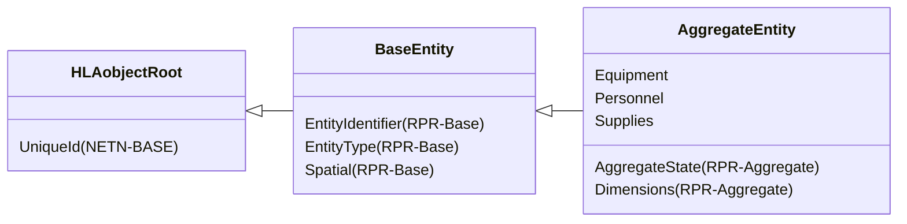
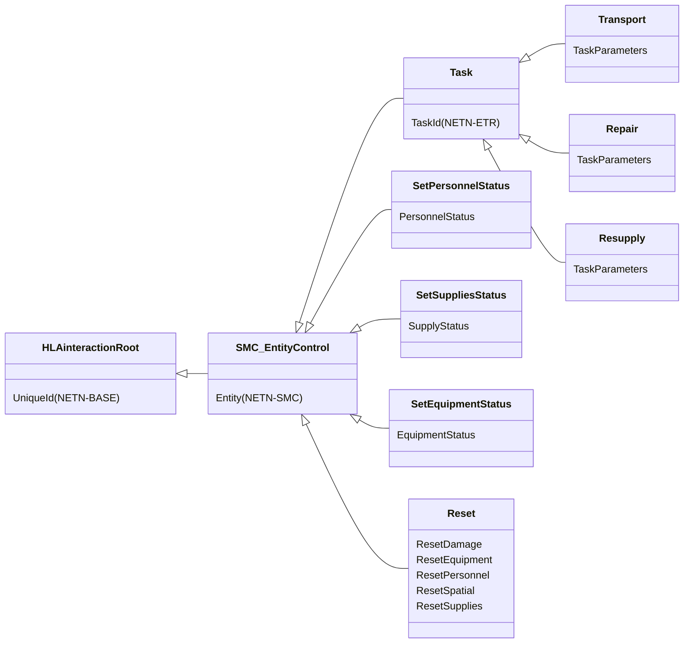
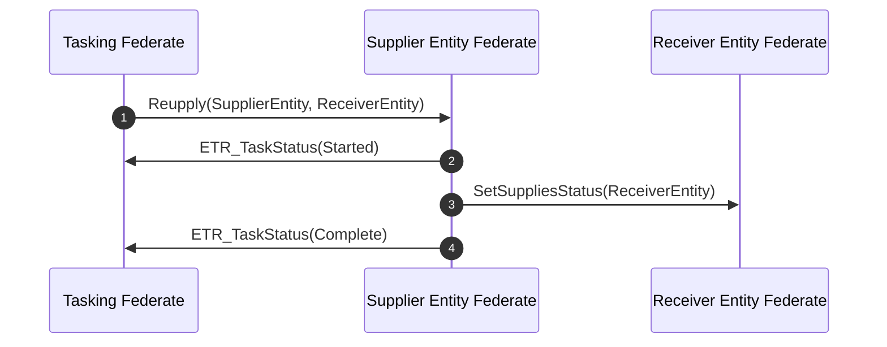
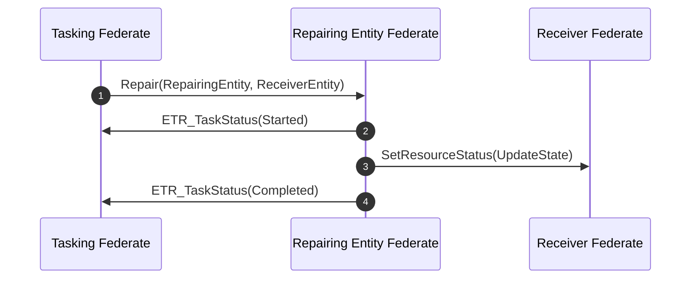
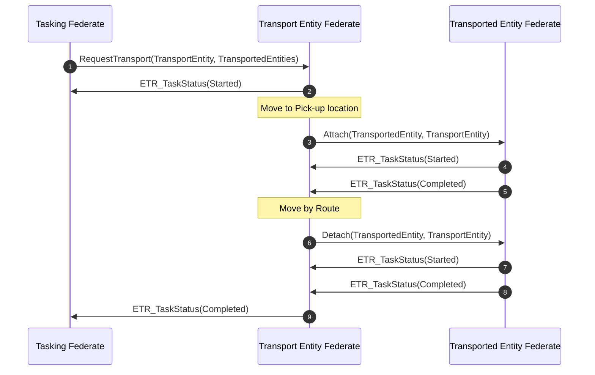

# NETN-LOG
|Version| Date| Dependencies|
|---|---|---|
|3.0|2024-03-10|NETN-BASE|

The NATO Education and Training Network Logistics Module (NETN-LOG) provides a standard interface for representing supplies, equipment and personnel when modelled as part of an aggregated entity. The module also includes support for logistics tasks in a federated distributed simulation.

Military logistics is the discipline of planning and carrying out the movement and maintenance of military forces, including storage, distribution, maintenance and transportation of supplies, equipment and personnel.

The NETN Logistics module covers the following tasks:    
* Resupply, e.g. refuelling aircraft at an airbase or in the air
* Repair, e.g. repair of damaged platforms in a facility
* Transport, e.g. transporting supplies from a specific pick-up point to an off-loading destination

## Overview 
 
The NETN-LOG modules extend the RPR-FOM `AggregateEntity` object class with attributes for `Supplies`, `Equipment` and `Personnel`. 
 

 
These optional attributes allow the sharing of ground-truth aggregated data related to the status of equipment, personnel, and supplies. 
 
The NETN-LOG modules also extend the NETN-SMC module to provide a set of `SMC_EntityControl` Actions. 
 

 
4.	Three control actions extend the NETN-ETR `Task` interaction and associated pattern to provide `Transport`, `Repair`, and `Resupply` tasks. 
 
Use the `SetPersonnelStatus`, `SetEquipmentStatus`, and `SetSuppliesStatus` to request an immediate change in the `Personnel`, `Equipment`, or `Supplies` attributes of a simulated `AggregateEntity`. 
 
Use the `Reset` control interaction to request an immediate revert of state to the last initialized value for the indicated aspects. The last initialized value is defined as the first value published by the current federate after applying one of the methods of initialization. 
 
 
### Transfer of Supplies 
 
Use the `Resupply` interaction to transfer supplies from one simulated entity (supplier) to another (receiver). The `Resupply` interaction uses the NETN-ETR tasking pattern, and the NETN-LOG modules extend task datatypes to include resupply task definitions. 
 
The transfer process is modelled by reducing the supplies of the supplier entity and attempting to set the increased supplies of the receiver entity using the `SetSuppliesStatus` entity control action. If both entities are modelled in the same federate, the `SetSuppliesStatus` is not required, and the supplies status can be changed directly. 

 
 

 
 
1. A Tasking Federate sends a `Resupply` task with references to the supplier and receiver entities. 
 
2. The Supplier Entity Federate sends an `ETR_TaskStatus` interaction to indicate the start of the transfer. 
 
3. During the transfer, update the state of the supplier entity continuously or once after the transfer. Use the `SetSuppliesStatus` interaction to request an update of supplies for the receiver entity. 
 
4. On completion, the Supplier Entity Federate sends an `ETR_TaskStatus` interaction to indicate task success or failure. 
 
The Supplies attribute of both the supplier and receiver `AggregateEntity` can be updated during the resupply task, and a final update must be provided when the resupply is completed. 
 
### Repair Task 
 
Use the Repair interaction to initiate a task for an entity to repair (Repairing Entity) another entity (Receiver Entity). 
 
Use the `SetEquipmentStatus` or the `SetPersonnelStatus` entity control interaction to model the repair process by attempting to set the receiver entity's resources status. If both entities are modelled in the same federate, the `SetEquipmentStatus` and the `SetPersonnelStatus` are not required, and the status can be changed directly. 
 
 

 
 
1. A Tasking Federate sends a `Repair` task referencing the repairing and receiver entities. 
 
2. The Repairing Entity Federate sends an `ETR_TaskStatus` interaction to indicate the start of the transfer. 
 
3. During the repair, either use the `SetEquipmentStatus` or `SetPersonnelStatus` interaction to request an update of a specific type of resource modelled for the receiver entity. 
 
4. On completion, the Repairing Entity Federate sends an `ETR_TaskStatus` interaction to indicate task success or failure. 
 
The `Equipment` or the `Personnel` attributes of the repaired `AggregateEntity` can be updated during the repair task, and a final update must be provided when the repair is completed. 
 
### Transport Task 
 
Use the `Transport` task to instruct a simulated entity (Transport Entity) to transport other simulated entities (Transported Entity) from a pick-up location to a destination. The transport task combines the `Attach`, `MoveByRoute`, and `Detach` tasks defined in the NETN-ETR module. 
 
The transport task consists of the following phases: 
 
1. Move to the pick-up location 
2. Embark/Mount/Load simulated entities by attaching them to the Transport Entity. 
3. Move according to a specified route to the destination. 
4. Disembark/Dismount/Unload simulated entities by detaching them from the Transport Entity. 

 
 

 
 
1. A Tasking Federate sends a `Transport` task referencing the transport and transported entities. Also, provide a route for the transport and an optional appointment to describe the location and time for pick-up. 
 
2. The Transport Entity Federate sends an `ETR_TaskStatus` interaction to indicate the start of the transport task. 
 
3. At the pick-up location, the Transport Entity Federate initiates a NETN-ETR `Mount` task for the transported entity to embark/mount on the transport. 
 
4. The Transported Entity Federate sends an `ETR_TaskStatus` interaction to indicate the start of the embarkation/mounting process. 
 
5. When the embarkation/mounting is complete, the Transported Entity Federate sends an `ETR_TaskStatus` interaction to indicate successful completion. Then, the transport entity conducts its movement according to the transport route. 
 
6. When at the final destination of the transport route, the Transport Entity Federate initiates a NETN-ETR `Dismount` task for the transported entity to disembark/dismount on the transport. 
 
7. The Transported Entity Federate sends an `ETR_TaskStatus` interaction to indicate the start of the disembarkation/dismounting process. 
 
8. When the disembarkation/dismounting is complete, the Transported Entity Federate sends an `ETR_TaskStatus` interaction to indicate successful completion. 
 
9. Finally, the Transport Entity Federate sends an `ETR_TaskStatus` to indicate whether the transport task has succeeded or failed. 
 
 
 
The transport task is rejected if the transport entity is unable to transport all specified simulated entities. An AggregatedEntity representation of a transported entity may require a NETN-MRM Disaggregate or Divide action to fit on the transport. 
 
A scenario can start with some entities already embarked on transport. Use the NETN-ENTITY `BaseEntity` attribute `HostEntity` to identify a potential transporting entity.

## Object Classes

### AggregateEntity

A group of one or more separate objects that operate together as part of an organization. These objects may be discrete, may be other aggregate objects, or may be a mixture of both.

|Attribute|Datatype|Semantics|
|---|---|---|
|Equipment|ArrayOfResourceStatus|Required. The total amount and status of equipment holdings represented by this entity.|
|Personnel|ArrayOfResourceStatus|Required. The total amount and status of all personnel holdings modelled by this entity.|
|Supplies|ArrayOfSupplyStatus|Required. The type and total quantities of supply holdings modelled by this entity.|
|AggregateState (RPR-Aggregate)|AggregateStateEnum8|An indicator of the extent of association of objects form an operating group.| 
|Dimensions (RPR-Aggregate)|DimensionStruct|The size of the area covered by the units in the aggregate.| 
|EntityIdentifier (RPR-Base)|EntityIdentifierStruct|The unique identifier for the entity instance.| 
|EntityType (RPR-Base)|EntityTypeStruct|The category of the entity.| 
|Spatial (RPR-Base)|SpatialVariantStruct|Spatial state stored in one variant record attribute.| 
|UniqueId (NETN-BASE)|UUID|Required. A unique identifier for the object. The Universally Unique Identifier (UUID) is generated or pre-defined.| 

## Interaction Classes

### Transport

Tasks a simulated entity (transporter entity) to transport another simulated entity (transported entity). Successful completion of the task means that (1) the transport and transported entity moves towards a specified pick-up point, (2) the transported entity mounts the transport, (3) the transport moves according to route and at the final waypoint (4) the transported entity dismounts the transport.

|Parameter|Datatype|Semantics|
|---|---|---|
|TaskParameters|TransportTaskStruct|Required: Task parameters|
|Entity (NETN-SMC)|UUID|Required: Reference to a simulation entity for which the control action is intended. Required for all ETR related interactions.| 
|TaskId (NETN-ETR)|UUID|Required. Unique identifier for the task.| 
|UniqueId (NETN-BASE)|UUID|Optional: A unique identifier for the interaction. Required for all ETR related interactions.| 

### Repair

Tasks a simulated entity to perform repair activity on another simulated entity (receiving). Successful completion of the task means that the damage state of the receiving entity is improved.

|Parameter|Datatype|Semantics|
|---|---|---|
|TaskParameters|RepairTaskStruct|Required: Task parameters|
|Entity (NETN-SMC)|UUID|Required: Reference to a simulation entity for which the control action is intended. Required for all ETR related interactions.| 
|TaskId (NETN-ETR)|UUID|Required. Unique identifier for the task.| 
|UniqueId (NETN-BASE)|UUID|Optional: A unique identifier for the interaction. Required for all ETR related interactions.| 

### Resupply

Tasks a simulated entity to resupply another simulated entity (receiving). Successful task completion means that supplies are reduced from the tasked entity and increased at the receiving entity.

|Parameter|Datatype|Semantics|
|---|---|---|
|TaskParameters|ResupplyTaskStruct|Required: Task parameters|
|Entity (NETN-SMC)|UUID|Required: Reference to a simulation entity for which the control action is intended. Required for all ETR related interactions.| 
|TaskId (NETN-ETR)|UUID|Required. Unique identifier for the task.| 
|UniqueId (NETN-BASE)|UUID|Optional: A unique identifier for the interaction. Required for all ETR related interactions.| 

### SetPersonnelStatus

Instruct federate with the primary responsibility of the specified simulated entity to update the model concerning its Personnel. Only applicable to AggregateEntity.

|Parameter|Datatype|Semantics|
|---|---|---|
|PersonnelStatus|ResourceStatusStruct|Required: Status of a specific type of personnel.|

### SetSuppliesStatus

Instruct federate with the primary responsibility of the specified simulated entity to update the model concerning its Supplies. Only applicable to AggregateEntity.

|Parameter|Datatype|Semantics|
|---|---|---|
|SupplyStatus|SupplyStatusStruct|Required: New quantity of a specific supply.|

### SetEquipmentStatus

Instruct federate with the primary responsibility of the specified simulated entity to update the model concerning its Equipment. Only applicable to AggregateEntity.

|Parameter|Datatype|Semantics|
|---|---|---|
|EquipmentStatus|ResourceStatusStruct|Required: Status of a specific type of equipment.|

### Transport

Tasks a simulated entity (transporter entity) to transport another simulated entity (transported entity). Successful completion of the task means that (1) the transport and transported entity moves towards a specified pick-up point, (2) the transported entity mounts the transport, (3) the transport moves according to route and at the final waypoint (4) the transported entity dismounts the transport.

|Parameter|Datatype|Semantics|
|---|---|---|
|TaskParameters|TransportTaskStruct|Required: Task parameters|
|Entity (NETN-SMC)|UUID|Required: Reference to a simulation entity for which the control action is intended. Required for all ETR related interactions.| 
|SendTime (NETN-BASE)|EpochTime|Optional: Scenario time when the interaction was sent. Default is interpreted as the receivers scenario time when the interaction is received. Required for all ETR related interactions.| 
|TaskId (NETN-ETR)|UUID|Required. Unique identifier for the task.| 
|UniqueId (NETN-BASE)|UUID|Optional: A unique identifier for the interaction. Required for all ETR related interactions.| 

### Repair

Tasks a simulated entity to perform repair activity on another simulated entity (receiving). Successful completion of the task means that the damage state of the receiving entity is improved.

|Parameter|Datatype|Semantics|
|---|---|---|
|TaskParameters|RepairTaskStruct|Required: Task parameters|
|Entity (NETN-SMC)|UUID|Required: Reference to a simulation entity for which the control action is intended. Required for all ETR related interactions.| 
|SendTime (NETN-BASE)|EpochTime|Optional: Scenario time when the interaction was sent. Default is interpreted as the receivers scenario time when the interaction is received. Required for all ETR related interactions.| 
|TaskId (NETN-ETR)|UUID|Required. Unique identifier for the task.| 
|UniqueId (NETN-BASE)|UUID|Optional: A unique identifier for the interaction. Required for all ETR related interactions.| 

### Resupply

Tasks a simulated entity to resupply another simulated entity (receiving). Successful task completion means that supplies are reduced from the tasked entity and increased at the receiving entity.

|Parameter|Datatype|Semantics|
|---|---|---|
|TaskParameters|ResupplyTaskStruct|Required: Task parameters|
|Entity (NETN-SMC)|UUID|Required: Reference to a simulation entity for which the control action is intended. Required for all ETR related interactions.| 
|SendTime (NETN-BASE)|EpochTime|Optional: Scenario time when the interaction was sent. Default is interpreted as the receivers scenario time when the interaction is received. Required for all ETR related interactions.| 
|TaskId (NETN-ETR)|UUID|Required. Unique identifier for the task.| 
|UniqueId (NETN-BASE)|UUID|Optional: A unique identifier for the interaction. Required for all ETR related interactions.| 

### SetResourceStatus

Instruct federate with the primary responsibility of the specified simulated entity to update the model concerning its Resources. Only applicable to AggregateEntity.

|Parameter|Datatype|Semantics|
|---|---|---|
|ResourceStatus|ResourceStatusStruct|Required: Status of a specific type of resource.|
|Entity (NETN-SMC)|UUID|Required: Reference to a simulation entity for which the control action is intended. Required for all ETR related interactions.| 
|SendTime (NETN-BASE)|EpochTime|Optional: Scenario time when the interaction was sent. Default is interpreted as the receivers scenario time when the interaction is received. Required for all ETR related interactions.| 
|UniqueId (NETN-BASE)|UUID|Optional: A unique identifier for the interaction. Required for all ETR related interactions.| 

### SetSupplies

Instruct federate with the primary responsibility of the specified simulated entity to update the model concerning its Supplies. Only applicable to AggregateEntity.

|Parameter|Datatype|Semantics|
|---|---|---|
|SupplyStatus|SupplyStatusStruct|Required: New quantity of a specific supply.|
|Entity (NETN-SMC)|UUID|Required: Reference to a simulation entity for which the control action is intended. Required for all ETR related interactions.| 
|SendTime (NETN-BASE)|EpochTime|Optional: Scenario time when the interaction was sent. Default is interpreted as the receivers scenario time when the interaction is received. Required for all ETR related interactions.| 
|UniqueId (NETN-BASE)|UUID|Optional: A unique identifier for the interaction. Required for all ETR related interactions.| 

### Reset

Request a reset of aspects of an entity's state to its last initialized value.

|Parameter|Datatype|Semantics|
|---|---|---|
|ResetDamage|HLAboolean|Optional: Indicate if damage state of the entity should be reset to last initialized value. Default is False.|
|ResetEquipment|HLAboolean|Optional: Indicate if equipment state of the entity should be reset to last initialized value. Default is False.|
|ResetPersonnel|HLAboolean|Optional: Indicate if personnel state of the entity should be reset to last initialized value. Default is False.|
|ResetSpatial|HLAboolean|Optional: Indicate if spatial state of the entity should be reset to last initialized value. Default is False.|
|ResetSupplies|HLAboolean|Optional: Indicate if supplies state of the entity should be reset to last initialized value. Default is False.|

## Datatypes

Note that only datatypes defined in this FOM Module are listed below. Please refer to FOM Modules on which this module depends for other referenced datatypes.

### Overview
|Name|Semantics|
|---|---|
|AppointmentStruct|Date and Time and Location of an appointment.|
|EntityControlActionEnum|Enumeration of Entity Control Actions. The datatype is expected to be extended in specific modules defining additional actions.|
|RepairTaskStruct|Task-specific data for Repair task. If receiving entity is a physical entity, the `ResourceType`, and `QuantityToRepair` fields are ignored.|
|RepairTypeEnum16|System repaired|
|ResupplyTaskStruct|Task-specific data for Resupply task.|
|TaskDefinitionVariantRecord|Variant record for task definition data.|
|TaskProgressVariantRecord|Variant record for task progress data.|
|TransportTaskStruct|Task-specific data for Transport task.|
        
### Enumerated Datatypes
|Name|Representation|Semantics|
|---|---|---|
|EntityControlActionEnum|HLAinteger32BE|Enumeration of Entity Control Actions. The datatype is expected to be extended in specific modules defining additional actions.|
|RepairTypeEnum16|RPRunsignedInteger16BE|System repaired|
        
### Array Datatypes
|Name|Element Datatype|Semantics|
|---|---|---|
        
### Fixed Record Datatypes
|Name|Fields|Semantics|
|---|---|---|
|AppointmentStruct|DateTime, Location|Date and Time and Location of an appointment.|
|RepairTaskStruct|ReceivingEntity, ResourceType, DamageState, QuatityToRepair, RepairType|Task-specific data for Repair task. If receiving entity is a physical entity, the `ResourceType`, and `QuantityToRepair` fields are ignored.|
|ResupplyTaskStruct|ReceivingEntity, Supplies|Task-specific data for Resupply task.|
|TransportTaskStruct|TransportedEntities, PickUp, Route|Task-specific data for Transport task.|
        
### Variant Record Datatypes
|Name|Discriminant (Datatype)|Alternatives|Semantics|
|---|---|---|---|
|TaskDefinitionVariantRecord|TaskType (EntityControlActionEnum)|Resupply, Repair, Transport|Variant record for task definition data.|
|TaskProgressVariantRecord|TaskType (EntityControlActionEnum)|LOG_ElapsedTime, LOG_Transport|Variant record for task progress data.|   