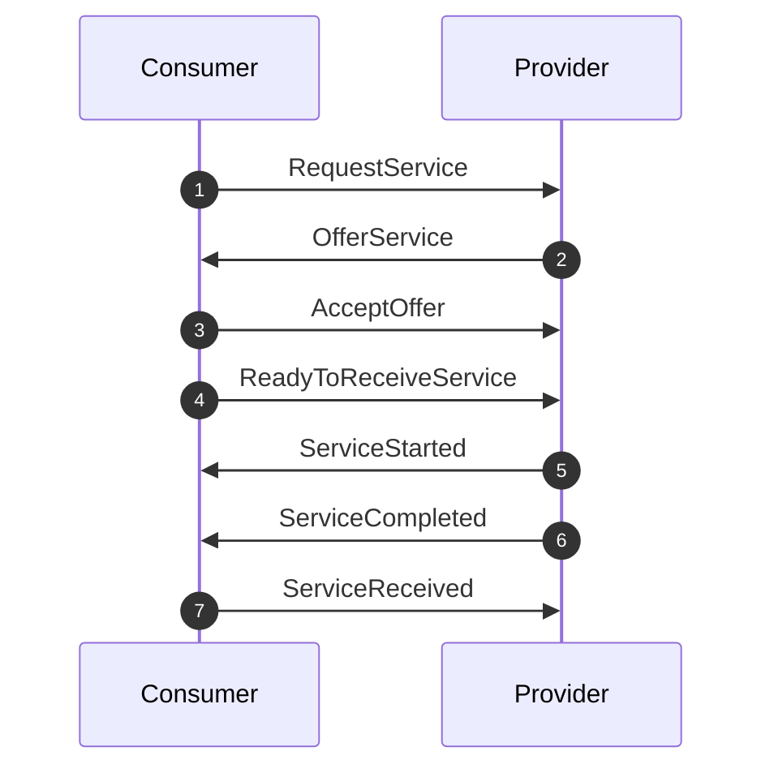
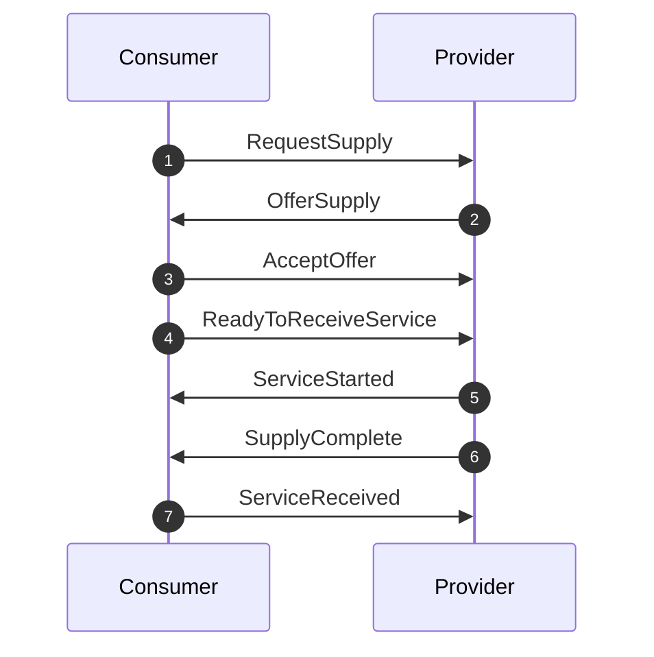
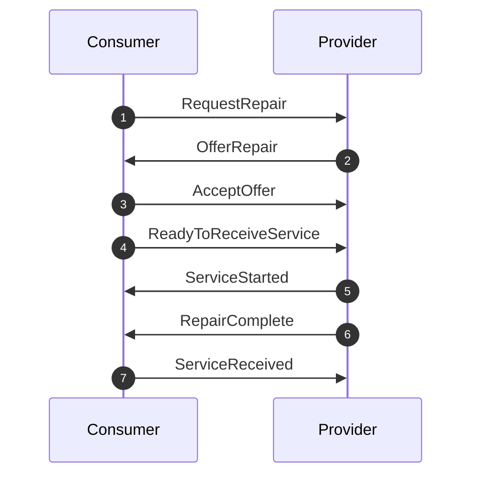
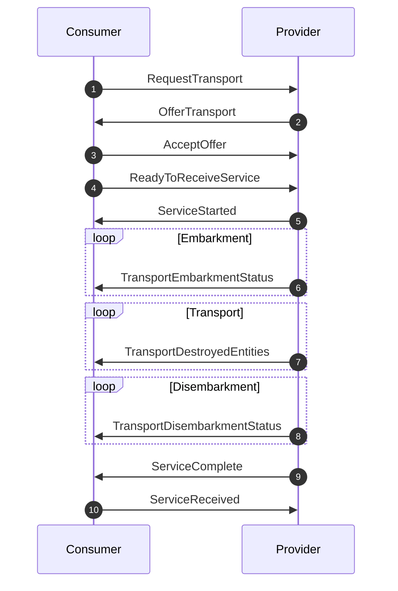
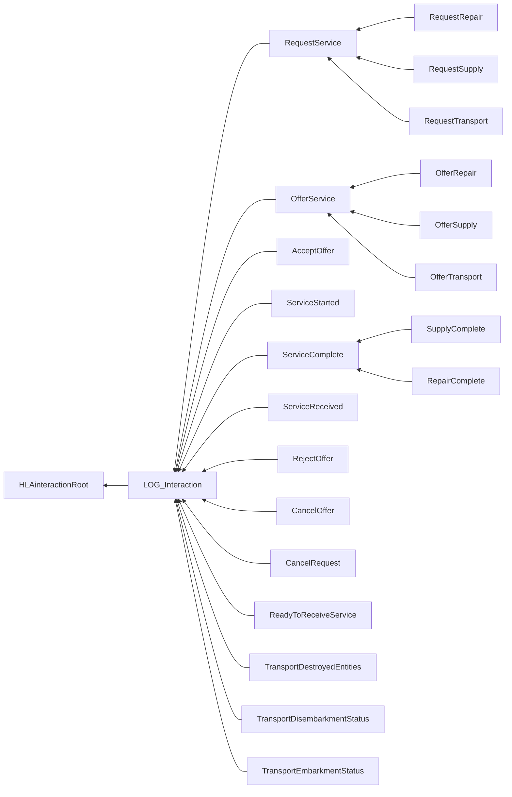

# NETN-LOG
|Version| Date| Dependencies|
|---|---|---|
|2.1|2023-03-25|NETN-BASE|

The NATO Education and Training Network (NETN) Logistics (LOG) Module provides a common standard interface for negotiation, delivery and acceptance of logistics services where service providers and consumers are represented in different systems in a federated distributed simulation.

Military logistics is the discipline of planning and carrying out the movement and maintenance of military forces including storage, distribution, maintenance and transportation of materiel.

The NATO Education and Training Network Logistics Module (NETN-LOG) is a specification of how to model logistics services in a federated distributed simulation. 
The specification is based on IEEE 1516 High Level Architecture (HLA) Object Model Template (OMT) and is primarily intended to support interoperability in a federated simulation (federation) based on HLA. A Federation Object Model (FOM) Module is used to specify how data is represented and exchanged in the federation. The NETN-LOG FOM module is available as an XML file for use in HLA-based federations.

The NETN Logistics module covers the following services:    
* Supply Service   
* Transport Service  
* Repair service     
        
Examples of use:    
* Refuelling of aircraft at an airbase or in the air   
* Transport of supplies between facilities   
* Repair of damaged platforms in a facility or by unit  
* Transport of units, platforms, and humans by train, ship, or aircraft   
* Embarkment and disembarkment of units on platforms

## Overview

Materiel is classified as:
* Consumable Supplies
    * Ammunition
    * Medical materiel
    * Spare parts
    * Fuel
    * Water
    * Food
* Non-consumable Entities
    * Platforms
    * Humans
    * Units
    * Equipment

The unit of consumable supplies includes the number of items, cubic meters for liquid bulk goods, and kilograms for solid bulk goods. The type of packaging, e.g. fuel in canisters or water in bottles, is not included. The SISO-REF-010 standard enumerates available kinds of supplies, and additional supply types can be defined and documented in federation-specific agreements.

## Logistics Service Pattern

All NETN-LOG services use a standard Logistics Service Pattern that includes negotiation, delivery, and acceptance of logistics services. Federates participating in the logistics service events are either Service Consumers or Service Providers. 

The pattern defines sequences of service events between federates as subclasses of the `LOG_Interaction` interaction class. Although the interaction pattern for different types of services may vary slightly, the basic principles and interaction sequences are the same. 

The interactions defined for the Logistics Service Pattern are extended by subclassing to provide more information for specific logistics services.

The logistics service pattern consists of three phases:

**Service Negotiation**

1. A consumer federate initiates service negotiation by sending a `RequestService` interaction. A unique `EventId` and a reference to a `ConsumerEntity` are required parameters. A reference to a specific `ProviderEntity` and a system wall-clock time for when offers are expected `RequestTimeOut` are optional.

    Requests for specific types of services are defined as subclasses to `RequestService` and include parameters for detailing the requirements of the request. These requests may consist of information about when, where and how the service should be delivered.
    
    If the time, specified in the `RequestTimeOut` parameter, pass, without an offer being received, the consumer shall cancel the service using a`CancelRequest` interaction. An `EventId` parameter is required and indicates which service to cancel. After the cancellation, the logistics service pattern ends.

2. Offers are sent by potential providers using an `OfferService` interaction with a required parameter `EventId` referencing the requested service and a unique `OfferId`. Using the optional parameter `OfferType`, the provider indicates if the offer matches the request, if the offer is modified, or if the provider is not able to make an offer. Optional parameters for `ProvidingEntity` and `OfferTimeOut` can be provided. 
    
    The provider can cancel an offer using a `CancelOffer` interaction until the offer is accepted. The required parameters are the `EventId` and `OfferId`.

5. The consumer accepts an offer using an `AcceptOffer` interaction or rejects an offer from a provider using `RejectOffer`. 

    Both consumer and provider can cancel the service before service delivery has started using `CancelRequest` with `EventId` and an optional `Reason` parameter. If cancelled, the logistics pattern will also terminate.

**Service Delivery**

4.  The consumer sends a `ReadyToReceiveService` interaction with an `EventId` parameter to indicate readiness to start receiving the service. I.e., all necessary preparations are in place to allow the `ConsumingEntity` to get the service.

5. The provider sends a `ServiceStarted` interaction with the `EventId` parameter to indicate that the delivery of the requested service has started. All preparations and a `ReadyToReceiveService` notification from the consumer must be complete beginning the service delivery. 

    Both consumer and provider can cancel the service during service delivery using `CancelRequest` with `RequestId` and an optional `Reason` parameter. Cancellation during delivery will cause the logistics pattern to continue with Service Acceptance immediately even if not all of the agreed service is delivered.

**Service Acceptance**

6. On service completion or cancellation, the provider sends a `ServiceComplete` interaction with any additional parameters specifying the completeness of the delivery, e.g. if only part of a service was delivered.

7. On acceptance of service delivery, the consumer sends a `ServiceReceived` interaction.

### Transfer of Supplies

Federates can have the capability to provide or store supplies. These offered services can involve the transfer of materiel between a `ConsumerEntity` and `ProviderEntity` modelled in two different federates. The transfer of supplies can differ in terms of the flow of materiel between consumer and provider. 

The supply service is based on the general Logistics Services Pattern but with some adaptations.

1. The consumer sends a `RequestSupply` interaction to request supplies, including the amount and type of supplies as a `SuppliesData` parameter. An optional parameter `StartAppointment` specifies when and where to start the service delivery. The `TransferDirection` parameter indicates if the transfer of supplies flows from consumer to provider or from provider to consumer.

2. An `OfferSupply` interaction is used by potential providers to offer supplies. The `SuppliesData` parameter specifies the amount and type of supplies included in the offer. The provider can also specify an alternate `StartAppointment` in the offer.

3. The consumer accepts an offer using `AcceptOffer` or rejects an offer from a provider using `RejectOffer`.

4. The `ReadyToReceiveService` interaction is used by a consumer to indicate that supply delivery can start. 

5. The `ServiceStarted` interaction is sent by the provider to notify that the transfer of supplies has started. 
    If a `CancelRequest` occurs during the delivery of supply services, the actual amounts transferred can be less than agreed.

6. The provider sends a `SupplyComplete` interaction when the transfer of supplies is completed or after cancellation. The actual amount of supplies transferred is provided as `SuppliesData` and should, in the typical case, be the same amounts as agreed in the offer. 

7. The consumer sends a `ServiceReceived` interaction as a response to a `SupplyComplete` from the provider. 

### Repair

Simulation of repair of non-consumable materiel is possible. E.g. tow-trucks move damaged platforms to a maintenance facility for repair, or a unit capable of providing repair services can move to the location of a damaged platform to deliver repair services.

1. The consumer sends a `RequestRepair` interaction to request repair service, including the materiel to be repaired and the type of repair as the `RepairData` parameter. An optional parameter `StartAppointment` specifies when and where to start the service delivery.

2. Potential providers of repair services send `OfferRepair` interactions. The `RepairData` parameter specifies the materiel and the type of repair included in the offer. The provider can also specify an alternate `StartAppointment` in the offer.

3. The consumer accepts an offer using `AcceptOffer` or rejects an offer from a provider using `RejectOffer`.

4. The `ReadyToReceiveService` interaction is used by a consumer to indicate that repairs can start. 

5. The `ServiceStarted` interaction is sent by the provider to notify that the repair has begun. 
    If a `CancelRequest` occurs during the delivery of repair services, the completed repairs can be different from what was agreed.

6. On completion or cancellation, the service provider sends a `RepairComplete` interaction. The completed repairs are provided as `RepairData` and should, in the typical case, be the same as agreed in the offer. 

7. The consumer sends a `ServiceReceived` interaction as a response to a `RepairComplete` from the provider. 

### Transport

A logistics transport service is useful when there is a need to move non-consumable entities such as platforms, units, humans or other battlefield objects using means of transportation simulated in another federated system.

The transport service consists of the following phases in which the change of control over the entities differs:

* Embarkment is the process of mounting, loading and storing entities in, e.g. a truck or an aggregate unit. Embarkment transfers control over the entities from the service consumer to the transport service provider.

* Transport is the process of the transport moving entities from the point of departure to their destination. The provider of the transport service has control over the entities during transport. If required, the change of control over the entities can include a Transfer of Modelling Responsibility (NETN TMR).

* Disembarkment is the process of dismounting or unloading entities. Control over materiel is transferred from the transport service provider back to the service consumer. 

Negotiation, delivery, and acceptance of transport service are part of the Logistics Service Pattern:

1. To request a transport, the consumer sends a `RequestTransport` interaction that includes `TransportData` information specifying the entities to transport. The `StartAppointment` provides information on when and where the embarkment will start. If the `EndAppointment` is provided, the service includes the transport between the specified Start and End locations and subsequent disembarkment of specified entities.

2. An `OfferTransport` message is used by potential service providers to make an offer for transport. The offer includes information regarding which of the requested entities are part of the transportation and when it will take place. The offered `TransportData` information can potentially differ from the requested `TransportData`. The offer also includes `Transporters` - a list of entities that will conduct the transport.

3. The consumer accepts an offer using `AcceptOffer` or rejects an offer from a provider using `RejectOffer`.

4. If a `StartAppointment` exists, all entities to be transported must be at the agreed embarkment location before sending a `ReadyToReceiveService` message. If no `StartAppointment` exists, the consumer can send a `ReadyToReceiveService` immediately.

5. The delivery of the transport service starts when the provider sends a `ServiceStarted` message. 

6. During embarkment, the Provider informs the service consumer about the progress using `TransportEmbarkmentStatus` interactions identifying which entities are embarked on which transport.

7. During transport, the provider can inform the consumer about entities lost or destroyed using the `TransportDestroyedEntities` interaction. The `Status` attribute of embarked entities is `Inactive` during transport.

8. During disembarkment, the provider sends `TransportDisembarkmentStatus` interactions to inform the consumer which entities have disembarked from which transport. The location of disembarked entities should be the location of `EndAppointment` and `Status` is set to `Active`.

9. The provider sends a `ServiceComplete` interaction after transport is complete and after any disembarkment of entities. 

10. The consumer sends a `ServiceReceived` as a response to the `ServiceComplete` interaction.

If either consumer or provider sends a `CancelRequest`, before `ReadyToReceiveService` and `ServiceStarted`, then the transport service delivery will not start, and all involved entities remain in their current state.

Sending a `CancelRequest` interaction during delivery of the service, but before starting to disembark, results in all entities already embarked or partially embarked remaining on the transport. Initiate a new transport service to continue embarking, or to perform transport and disembarkment with the already embarked entities.

Sending a `CancelRequest` during delivery of the service, after starting to disembark, all entities not already disembarked or partially disembarked remain on the transport. It is possible to initiate a new transport service with only an `EndAppointment` and list of the remaining entities to disembark.

#### Bridgehead

If an `Aggregate` entity is too large for transport, e.g. size of a unit requires multiple transporting entities, then the service consumer may require that the unit is divided before requesting transport, e.g. using the NETN-MRM FOM Module divide pattern. A divided entity can be transported and re-merged with an `Aggregate` entity that represents a bridgehead on the disembarkment location.

#### Initial Transport State

A scenario can start with some entities already embarked on transports. The attribute `EmbeddedUnitList` of transporting entities identifies which units are already embarked by referencing their UniqueId (UUID). Scenario initialization includes publishing embarked units, and their `Status` attribute set to `Inactive`.

## Interaction Classes

Note that inherited and dependency parameters are not included in the description of interaction classes.

### LOG_Interaction

Base class for all NETN Logistics Pattern Service Transactions.

|Parameter|Datatype|Semantics|
|---|---|---|
|EventId|UUID|Required: Unique identifier for the requested service related to the event.|

### RequestService

A consumer federate initiates service negotiation using `RequestService`. A unique `EventId` and a reference to a `ConsumerEntity` are required parameters. A reference to a specific `ProviderEntity` and a system wall-clock time for when offers are expected `RequestTimeOut` are optional. 
Requests for specific types of services are defined as subclasses to `RequestService` and include parameters for detailing the requirements of the request. This may include information on when, where and how the service should be delivered.

|Parameter|Datatype|Semantics|
|---|---|---|
|ConsumerEntity|UUID|Required: Unique identifier for a simulated entity that is the intended receiver of service|
|ProviderEntity|UUID|Optional: Unique identifier of a simulated entity intended to perform the service. If not provided, the entity performing the service is considered unknown.|
|RequestTimeOut|EpochTimeSecInt64|Optional: Wallclock time. The timeout time is in seconds after 1 January 1970.|
|StartAppointment|AppointmentStruct|Optional: The time and location of the start of the service delivery.|

### RequestRepair

Sent by the consumer when a repair is needed. Specifies entity and type of repair

|Parameter|Datatype|Semantics|
|---|---|---|
|RepairData|ArrayOfRepairStruct|Required: List of all requested repairs.|

### RequestSupply

The consumer sends a `RequestSupply` interaction to request supplies. The amount and type of supplies are specified in the required `SuppliesData` parameter. The required `TransferDirection` parameter indicates whether supplies are transferred from the Consumer to the Provider or from the Provider to the Consumer.

|Parameter|Datatype|Semantics|
|---|---|---|
|SuppliesData|SupplyStructArray|Required: List of type and quantity of supplies requested.|
|TransferDirection|TransferDirectionEnum32|Required: Indicates if the transfer of supplies is from Consumer to Provider or from Provider to Consumer.|

### RequestTransport

A request for a Transport service. 
Use a RequestTransport interaction to initiate a transport, embarkment or disembarkment of a platform.

|Parameter|Datatype|Semantics|
|---|---|---|
|TransportData|ArrayOfUuid|Required: Entities to be transported.|
|EndAppointment|AppointmentStruct|Optional: Location and time for disembarkment.|

### OfferService

The OfferService is a response to a RequestService. Subclasses of this interaction for specific types of offers contain a more detailed description of the offer. This information may include when, where, and how the service can be delivered.

|Parameter|Datatype|Semantics|
|---|---|---|
|OfferId|UUID|Required: Unique offer identifier.|
|ProviderEntity|UUID|Required: Unique identifier of a simulated entity intended to perform the service. If not provided, the entity performing the service is considered unknown.|
|OfferType|OfferTypeEnum32|Optional: Specifies if the offer is Negative (no Offer), Positive (Complete as requested) or Modified (not the same as requested).|
|OfferTimeOut|EpochTimeSecInt64|Optional: The system wallclock time (in seconds after 1 January 1970) when the offer stops being valid. If not provided, the offer valid until otherwise specified.|
|StartAppointment|AppointmentStruct|Optional: Time and location of the start of service delivery.|

### OfferRepair

Is sent by a federate simulating the service-providing entity in response to a RequestRepair interaction.

|Parameter|Datatype|Semantics|
|---|---|---|
|RepairData|ArrayOfRepairStruct|Required: List of the type of repairs offered. May be different from the list of requested repairs. List of all offered repairs if `isOffering` = true otherwise Undefined|

### OfferSupply

Used by a supply service provider to indicate which of the requested materiel (amount and type) can be offered. In this request, the consumer decides whether the loading is done by the provider or by the consumer.

|Parameter|Datatype|Semantics|
|---|---|---|
|SuppliesData|SupplyStructArray|Required: List of type and quantity of supplies offered. May be different from the list of requested supplies. All offered supplies if `isOffering` = true otherwise Undefined|

### OfferTransport

An Offer for Transport support. The OfferTransport interaction shall be sent by the service-providing federate in response to a RequestTransport interaction.

|Parameter|Datatype|Semantics|
|---|---|---|
|TransportData|ArrayOfUuid|Required: Entities to be transported.|
|EndAppointment|AppointmentStruct|Optional: Location and time for disembarkment.|
|Transporters|ArrayOfUuid|Optional: Platform list with transporters|

### AcceptOffer

Use the AcceptOffer interaction to accept an offer received in an OfferService interaction.

|Parameter|Datatype|Semantics|
|---|---|---|
|OfferId|UUID|Required: Unique offer identifier.|

### ServiceStarted

Issued by a service provider to inform about the start of service delivery. The time of service delivery start may be significantly later than receiving an indication from the consumer that the service delivery can start.

### ServiceComplete

Used by a service-providing entity to inform the service-consuming entity that the service has been delivered.

### SupplyComplete

This interaction is sent by the provider when the supply is delivered to the consumer

|Parameter|Datatype|Semantics|
|---|---|---|
|SuppliesData|SupplyStructArray|Required: The number of supplies, by type, that were transferred from provider to consumer.|

### RepairComplete

This interaction is sent by the provider when the repair service is delivered to the consumer

|Parameter|Datatype|Semantics|
|---|---|---|
|RepairData|ArrayOfRepairStruct|Required: List of the type of repairs done. May be different from the list of requested repairs.|

### ServiceReceived

Used by a service-consuming entity to inform the service-providing entity that the service has been delivered.

### RejectOffer

Used to reject an offer made by a service-providing entity as indicated in an OfferService interaction. By issuing a RejectOffer interaction the service-consuming entity informs the providing entity that the offer has been rejected.

|Parameter|Datatype|Semantics|
|---|---|---|
|Reason|HLAASCIIstring|Optional: Allows informing about the reason for the cancellation.|

### CancelOffer

Used by the provider to cancel an already made offer before it has been accepted. Used if the OfferTimeOut has passed.

|Parameter|Datatype|Semantics|
|---|---|---|
|OfferId|UUID|Required: Reference to the cancelled offer.|

### CancelRequest

Used by either a service-consuming entity or a service-providing entity to inform about early termination of the service delivery or in some cases termination of the service request before delivery has begun.

|Parameter|Datatype|Semantics|
|---|---|---|
|Reason|HLAASCIIstring|Allows informing about the reason for the cancellation.|

### ReadyToReceiveService

Issued by a service consumer to indicate that service delivery can start. The time of service delivery may be significantly later than indicating ready for service delivery.

### TransportDestroyedEntities

Used by a service provider to update information on the state of entities under transport.

|Parameter|Datatype|Semantics|
|---|---|---|
|DestroyedObjects|ArrayOfUuid|Required: Identifies the objects that have been destroyed during transport.|

### TransportDisembarkmentStatus

Is sent by the service provider federate, to inform the service consumer of the disembarkment state, after the ServiceStarted interaction

|Parameter|Datatype|Semantics|
|---|---|---|
|DisembarkedObjects|ArrayOfUuid|Required: References to disembarked entities. Updated during disembarkment.|
|TransportUnitIdentifier|UUID|Required: UUID of the entity performing the transport.|

### TransportEmbarkmentStatus

Is sent by the service provider federate, to inform the service consumer of the embarkment state, after the ServiceStarted interaction

|Parameter|Datatype|Semantics|
|---|---|---|
|EmbarkedObjects|ArrayOfUuid|Required: List of entities currently embarked. Updated during embarkment.|
|TransportUnitIdentifier|UUID|Required: Refers to the entity providing the transport.|

## Datatypes

Note that only datatypes defined in this FOM Module are listed below. Please refer to FOM Modules on which this module depends for other referenced datatypes.

### Overview
|Name|Semantics|
|---|---|
|AppointmentStruct|Date ; Time and Location of an appointment. When date and time is set to zero (0), implies no date-time specification|
|ArrayOfRepairStruct|List of repair descriptions (equipment and type of repairs).|
|ArrayOfRepairTypeEnum|List of repair types|
|OfferTypeEnum32|Type of the offer (With restriction, positive, negative)|
|RepairStruct|Repairs associated with a specific materiel|
|RepairTypeEnum16|System repaired|
|TransferDirectionEnum32|Indicates the direction of flow of material or supplies during service delivery.|
        
### Enumerated Datatypes
|Name|Representation|Semantics|
|---|---|---|
|OfferTypeEnum32|HLAinteger32BE|Type of the offer (With restriction, positive, negative)|
|RepairTypeEnum16|RPRunsignedInteger16BE|System repaired|
|TransferDirectionEnum32|HLAinteger32BE|Indicates the direction of flow of material or supplies during service delivery.|
        
### Array Datatypes
|Name|Element Datatype|Semantics|
|---|---|---|
|ArrayOfRepairStruct|RepairStruct|List of repair descriptions (equipment and type of repairs).|
|ArrayOfRepairTypeEnum|RepairTypeEnum16|List of repair types|
        
### Fixed Record Datatypes
|Name|Fields|Semantics|
|---|---|---|
|AppointmentStruct|DateTime, Location|Date ; Time and Location of an appointment. When date and time is set to zero (0), implies no date-time specification|
|RepairStruct|MaterielId, Repairs|Repairs associated with a specific materiel|
    
