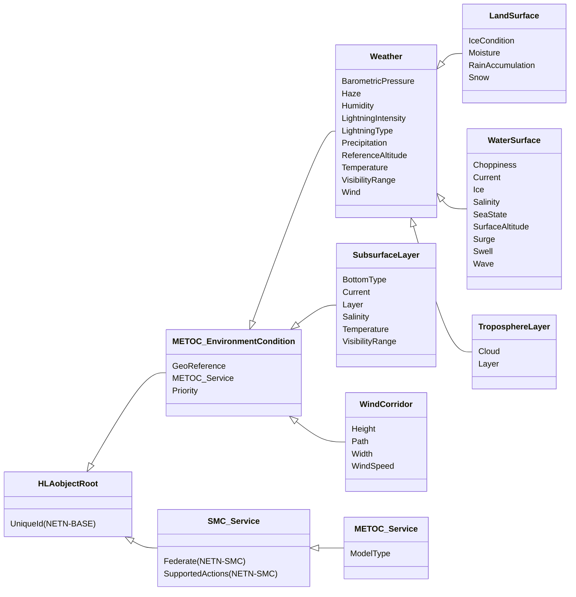
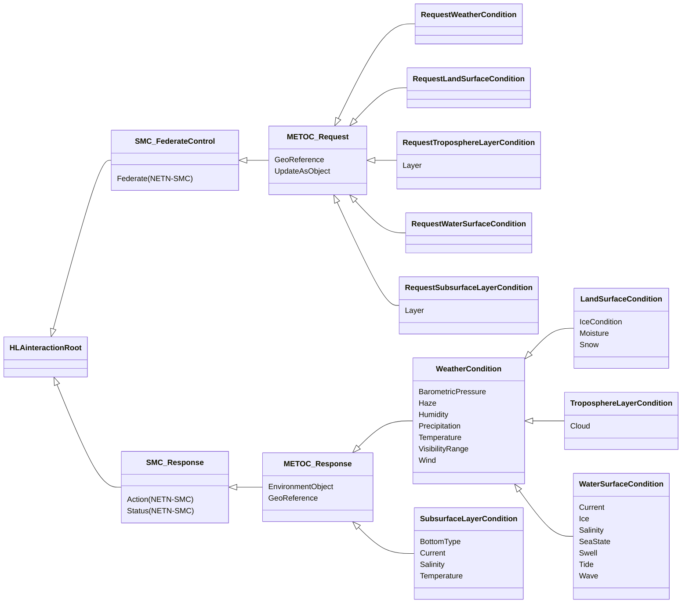

# NETN-METOC
|Version| Date| Dependencies|
|---|---|---|
|2.0|2024-03-10|NETN-BASE|

The purpose of the NATO Education and Training Network Meteorological and Oceanographic Module (NETN-METOC) is to provide a standard way to exchange data related to environmental conditions, including weather and the primary effects of weather on terrain and water surfaces in the atmosphere and subsurface water conditions.

NETN-METOC provides a reference model that represents a common core subset of METOC-related aspects and allows the module's extension to incorporate additional detail if required.

## Overview 

 Current environmental conditions impact simulations such as platforms and sensors on the ground, sea, underwater and in the air. A correlated representation of these conditions is vital to meeting interoperability and model requirements in a federated distributed simulation.
 
 NETN-METOC represents environmental conditions for surfaces, layers, and corridors. 

* Surface conditions do not have a volume and only represent the conditions directly related to the surface of a piece of terrain or water. 
    * Land Surface Conditions
    * Water Surface Conditions
* Layer conditions represent a volume of water or air with height/depth from surface and layer thickness. 
    * Tropospheric Layer Conditions
    * Water Layer Conditions
    * Subsurface Layer
* Wind Corridor models wind speed conditions concerning a specified path.
 

Environment condition data are published as objects using the classes defined in the NETN-METOC FOM module. In addition, or as an alternative method, interactions can be used to request data from a METOC service.

 
### Environment Condition
 
Environment Conditions can be modelled as objects related to global conditions, explicit locations, or other simulated entities and objects in the synthetic environment.

Since multiple overlapping Environment Condition objects may exist, subscribing federates should apply the following merging rules to calculate the resulting environment conditions.
* Wind Speed, Wind Direction, Precipitation Intensity, Temperature, Humidity, Barometric Pressure, Snow Depth, and Snow Density are calculated as the average in the overlapping Environment Condition objects.
* Visibility is calculated as the minimum visibility distance of the overlapping Environment Condition objects.
* Conflicting precipitation types are resolved according to the following precedence: Snow, Hail, Rain, and No Precipitation. For example, if there is one overlapping Environment Condition object with Snow, the result is always Snow.
* The average density should be used for the same haze type. Multiple overlapping Environment Condition objects with different Haze types can exist.
* Moisture is calculated as the highest enumerated value, making the resulting value the one with the most moisture.
* The land surface ice condition is calculated as the highest enumerated value making the resulting value the one with the most severe ice condition.

 
 
### Service 

The NETN-METOC module also supports requesting environmental condition data from a server or service provider. 

A METOC Service publishes its supported actions and the type of data provided using the METOC_Service object class. The type of data is one of the following:
* Simulated
* Real-Historical
* Live
* Standard model

To request environment condition data from a METOC service, the NETN-METOC offers two methods.
* Pull - uses a Request and Response pattern based on NETN-SMC.
* Push - uses the same Request pattern as the pull method but with the feature that the information is provided as continuous updates of Environment Condition objects published by the METOC service provided.

One or both methods may be suitable depending on federation design and agreements.

## Object Classes

### METOC_EnvironmentCondition

Root class for all types of environment condition objects. 
 
The `GeoReference` attribute defines the region where the EnvironmentCondition applies. 
 
If `GeoReference` is a geographical area, and the subclass in question has a surface (water/land), the environmental condition applies only within that area of the surface. 
 
If `GeoReference` is a geographical area, and the environmental condition defines a Layer attribute, it applies only within the volume bounded by the layer and the body described by projecting each point of the area along a line through the centre of the Earth. 
 
If `GeoReference` is an `RPREntityReference`, a NETNEntityReference or a GMLFeatureReference, the environment condition applies only to the immediate vicinity of the referenced entity/feature and any layer attribute is ignored. 
 
If not provided, the environment condition is considered global, only restricted by the semantics of its particular subclass.

|Attribute|Datatype|Semantics|
|---|---|---|
|GeoReference|GeoReferenceVariant|Optional. A geographical location, region, feature or simulated object.|
|METOC_Service|FederateName|Optional: Reference to the METOC service that generated this Environment Condition.|
|Priority|UnsignedInteger16|Optional: Indication of priority when calculating overlapping environment conditions of the same type. If Overlapping environment conditions of the same type, e.g., TroposphereLayer, exists, then the environment condition with the highest priority takes precedence. If multiple environment conditions with the same highest condition exists, use the NETN-METOC merging rules.|

### Weather

The `Weather` object class represents typical weather-related attributes such as temperature, wind and precipitation but also details regarding barometric pressure, humidity, visual range and haze conditions.

|Attribute|Datatype|Semantics|
|---|---|---|
|BarometricPressure|AtmosphericPressureFloat32|Optional. The barometric pressure in millibar or hectopascal (1 mbar = 1hPa) in the region/location at the specified reference altitude. Barometric pressure for specific altitudes are calculated using the International Standard Atmosphere (ISA) model. Default is 1013.25 hPa (standard pressure at sea level).|
|GeoReference|GeoReferenceVariant|Optional. A geographical location, region, feature or simulated object.|
|Haze|HazeStruct|Optional. Current Haze-type and density in the region/location specified by the Environment Condition. The default is No Haze. Use the average density for overlapping regions/locations with the same haze type.|
|Humidity|PercentFloat32|Optional. The humidity in the region/location. The default is 75% (Normal value). Use the average humidity if overlapping regions/locations exist.|
|LightningIntensity|LightningIntensity32|Optional: The intesity of lightning. Default = 0.|
|LightningType|LightningTypeEnum8|Optional: Level of lightning present. Default 0 = No lightning.|
|METOC_Service|FederateName|Optional: Reference to the METOC service that generated this Environment Condition.|
|Precipitation|PrecipitationStruct|Optional. Current precipitation type and intensity in the region/location. The default is No Precipitation. Use the average intensity of overlapping weather regions/locations. Resolve conflicting precipitation types according to the following precedence: Snow, Hail, Rain, and No Precipitation. E.g. If there is one overlapping environment condition with Snow, the result is always Snow.|
|Priority|UnsignedInteger16|Optional: Indication of priority when calculating overlapping environment conditions of the same type. If Overlapping environment conditions of the same type, e.g., TroposphereLayer, exists, then the environment condition with the highest priority takes precedence. If multiple environment conditions with the same highest condition exists, use the NETN-METOC merging rules.|
|ReferenceAltitude|AltitudeMeterFloat64|Optional: The altitude/depth at which pressure and temperature values are calculated.|
|Temperature|TemperatureDegreeCelsiusFloat32|Optional. The temperature in the region/location at the specified reference altitude. Temperature for specific altitudes is calculated using the International Standard Atmosphere (ISA) model. Default = 0.|
|VisibilityRange|MeterFloat32|Optional. The distance at which the human eye in the region/location can discern an object or light. Use the minimum distance if overlapping regions/locations exist.|
|Wind|WindStruct|Optional. Wind speed and direction in the region/location. Use the average wind speed if overlapping weather regions/locations exist.|

### LandSurface

The environmental conditions related to a land surface include inherited attributes such as temperature, wind and precipitation and add additional detail regarding the land surface's snow, moisture, and ice conditions.

|Attribute|Datatype|Semantics|
|---|---|---|
|BarometricPressure|AtmosphericPressureFloat32|Optional. The barometric pressure in millibar or hectopascal (1 mbar = 1hPa) in the region/location at the specified reference altitude. Barometric pressure for specific altitudes are calculated using the International Standard Atmosphere (ISA) model. Default is 1013.25 hPa (standard pressure at sea level).|
|GeoReference|GeoReferenceVariant|Optional. A geographical location, region, feature or simulated object.|
|Haze|HazeStruct|Optional. Current Haze-type and density in the region/location specified by the Environment Condition. The default is No Haze. Use the average density for overlapping regions/locations with the same haze type.|
|Humidity|PercentFloat32|Optional. The humidity in the region/location. The default is 75% (Normal value). Use the average humidity if overlapping regions/locations exist.|
|IceCondition|RoadIceConditionEnum16|Optional. Surface ice condition in the region/location. The default is no ice. Use the highest enumerated value (most severe ice condition) if overlapping regions/locations exist.|
|LightningIntensity|LightningIntensity32|Optional: The intesity of lightning. Default = 0.|
|LightningType|LightningTypeEnum8|Optional: Level of lightning present. Default 0 = No lightning.|
|METOC_Service|FederateName|Optional: Reference to the METOC service that generated this Environment Condition.|
|Moisture|SurfaceMoistureEnum16|Optional. Surface moisture in the region/location. The default is 0 (Dry). Use the highest enumerated value (most moisture) if overlapping regions/locations exist.|
|Precipitation|PrecipitationStruct|Optional. Current precipitation type and intensity in the region/location. The default is No Precipitation. Use the average intensity of overlapping weather regions/locations. Resolve conflicting precipitation types according to the following precedence: Snow, Hail, Rain, and No Precipitation. E.g. If there is one overlapping environment condition with Snow, the result is always Snow.|
|Priority|UnsignedInteger16|Optional: Indication of priority when calculating overlapping environment conditions of the same type. If Overlapping environment conditions of the same type, e.g., TroposphereLayer, exists, then the environment condition with the highest priority takes precedence. If multiple environment conditions with the same highest condition exists, use the NETN-METOC merging rules.|
|RainAccumulation|MeterFloat32|Optional: Accumulated amount of rain on land surface.|
|ReferenceAltitude|AltitudeMeterFloat64|Optional: The altitude/depth at which pressure and temperature values are calculated.|
|Snow|SnowStruct|Optional. Current snow depth and density in the region/location. The default is no snow. Use the average snow depth and density if overlapping regions/locations exist.|
|Temperature|TemperatureDegreeCelsiusFloat32|Optional. The temperature in the region/location at the specified reference altitude. Temperature for specific altitudes is calculated using the International Standard Atmosphere (ISA) model. Default = 0.|
|VisibilityRange|MeterFloat32|Optional. The distance at which the human eye in the region/location can discern an object or light. Use the minimum distance if overlapping regions/locations exist.|
|Wind|WindStruct|Optional. Wind speed and direction in the region/location. Use the average wind speed if overlapping weather regions/locations exist.|

### WaterSurface

The `WaterSurface` object specifies the sea surface condition in the specified region.

|Attribute|Datatype|Semantics|
|---|---|---|
|BarometricPressure|AtmosphericPressureFloat32|Optional. The barometric pressure in millibar or hectopascal (1 mbar = 1hPa) in the region/location at the specified reference altitude. Barometric pressure for specific altitudes are calculated using the International Standard Atmosphere (ISA) model. Default is 1013.25 hPa (standard pressure at sea level).|
|Choppiness|PercentFloat32|Optional: A degree of choppiness of the water surface ranging from 0% = no choppiness to 100% = max choppy. Default = 0.|
|Current|CurrentStruct|Optional. Current on the water surface. The default is no current. Ignored if the surface has 100% Ice coverage. Use the average current direction and speed if overlapping regions/locations exist.|
|GeoReference|GeoReferenceVariant|Optional. A geographical location, region, feature or simulated object.|
|Haze|HazeStruct|Optional. Current Haze-type and density in the region/location specified by the Environment Condition. The default is No Haze. Use the average density for overlapping regions/locations with the same haze type.|
|Humidity|PercentFloat32|Optional. The humidity in the region/location. The default is 75% (Normal value). Use the average humidity if overlapping regions/locations exist.|
|Ice|IceStruct|Optional. Ice condition on the surface. The default is no ice. Use the latest updated value if overlapping regions/locations exist.|
|LightningIntensity|LightningIntensity32|Optional: The intesity of lightning. Default = 0.|
|LightningType|LightningTypeEnum8|Optional: Level of lightning present. Default 0 = No lightning.|
|METOC_Service|FederateName|Optional: Reference to the METOC service that generated this Environment Condition.|
|Precipitation|PrecipitationStruct|Optional. Current precipitation type and intensity in the region/location. The default is No Precipitation. Use the average intensity of overlapping weather regions/locations. Resolve conflicting precipitation types according to the following precedence: Snow, Hail, Rain, and No Precipitation. E.g. If there is one overlapping environment condition with Snow, the result is always Snow.|
|Priority|UnsignedInteger16|Optional: Indication of priority when calculating overlapping environment conditions of the same type. If Overlapping environment conditions of the same type, e.g., TroposphereLayer, exists, then the environment condition with the highest priority takes precedence. If multiple environment conditions with the same highest condition exists, use the NETN-METOC merging rules.|
|ReferenceAltitude|AltitudeMeterFloat64|Optional: The altitude/depth at which pressure and temperature values are calculated.|
|Salinity|PercentFloat32|Optional. The salinity of seawater on the practical salinity scale 1978 (PSS-78). The default value is 35 (equivalent to 35 parts per thousand). Use the average salinity if overlapping regions/locations.|
|SeaState|SeaStateEnum16|Optional. State of the sea surface. The default is Calm_glassy. Use the last updated value if overlapping regions/locations exist.|
|SurfaceAltitude|MeterFloat32|Optional. The altitude of a water surface relative to MSL. The default is 0.|
|Surge|MeterFloat32|Optional. Change in the normal altitude of the surface due to tide, surge, drought, flooding etc. Default = 0.|
|Swell|WaveStruct|Optional. Swell of the body of water. The default is no Swell. Ignored if the surface has 100% Ice coverage. Use the latest updated value if overlapping regions/locations exist.|
|Temperature|TemperatureDegreeCelsiusFloat32|Optional. The temperature in the region/location at the specified reference altitude. Temperature for specific altitudes is calculated using the International Standard Atmosphere (ISA) model. Default = 0.|
|VisibilityRange|MeterFloat32|Optional. The distance at which the human eye in the region/location can discern an object or light. Use the minimum distance if overlapping regions/locations exist.|
|Wave|WaveStruct|Optional. Waves on the water's surface. The default is no waves. Ignored if the surface has 100% Ice coverage. Use the latest updated value if overlapping regions/locations exist.|
|Wind|WindStruct|Optional. Wind speed and direction in the region/location. Use the average wind speed if overlapping weather regions/locations exist.|

### TroposphereLayer

The `TroposphereLayer` associates weather and cloud coverage with a specific layer in the troposphere.

|Attribute|Datatype|Semantics|
|---|---|---|
|BarometricPressure|AtmosphericPressureFloat32|Optional. The barometric pressure in millibar or hectopascal (1 mbar = 1hPa) in the region/location at the specified reference altitude. Barometric pressure for specific altitudes are calculated using the International Standard Atmosphere (ISA) model. Default is 1013.25 hPa (standard pressure at sea level).|
|Cloud|CloudStruct|Optional. Data about Clouds in the Atmospheric layer. The default is no clouds. Use the latest updated value if overlapping layers exist.|
|GeoReference|GeoReferenceVariant|Optional. A geographical location, region, feature or simulated object.|
|Haze|HazeStruct|Optional. Current Haze-type and density in the region/location specified by the Environment Condition. The default is No Haze. Use the average density for overlapping regions/locations with the same haze type.|
|Humidity|PercentFloat32|Optional. The humidity in the region/location. The default is 75% (Normal value). Use the average humidity if overlapping regions/locations exist.|
|Layer|LayerStruct|Optional. The volume of the atmosphere extends from a base altitude and upwards (see LayerStruct). Ignore any portion of the layer extending below sea level. The default is a mean sea level base and an infinite layer thickness.|
|LightningIntensity|LightningIntensity32|Optional: The intesity of lightning. Default = 0.|
|LightningType|LightningTypeEnum8|Optional: Level of lightning present. Default 0 = No lightning.|
|METOC_Service|FederateName|Optional: Reference to the METOC service that generated this Environment Condition.|
|Precipitation|PrecipitationStruct|Optional. Current precipitation type and intensity in the region/location. The default is No Precipitation. Use the average intensity of overlapping weather regions/locations. Resolve conflicting precipitation types according to the following precedence: Snow, Hail, Rain, and No Precipitation. E.g. If there is one overlapping environment condition with Snow, the result is always Snow.|
|Priority|UnsignedInteger16|Optional: Indication of priority when calculating overlapping environment conditions of the same type. If Overlapping environment conditions of the same type, e.g., TroposphereLayer, exists, then the environment condition with the highest priority takes precedence. If multiple environment conditions with the same highest condition exists, use the NETN-METOC merging rules.|
|ReferenceAltitude|AltitudeMeterFloat64|Optional: The altitude/depth at which pressure and temperature values are calculated.|
|Temperature|TemperatureDegreeCelsiusFloat32|Optional. The temperature in the region/location at the specified reference altitude. Temperature for specific altitudes is calculated using the International Standard Atmosphere (ISA) model. Default = 0.|
|VisibilityRange|MeterFloat32|Optional. The distance at which the human eye in the region/location can discern an object or light. Use the minimum distance if overlapping regions/locations exist.|
|Wind|WindStruct|Optional. Wind speed and direction in the region/location. Use the average wind speed if overlapping weather regions/locations exist.|

### SubsurfaceLayer

The environmental condition of a subsurface water layer.

|Attribute|Datatype|Semantics|
|---|---|---|
|BottomType|SedimentTypeEnum32|Optional. Type of sediment on the sea floor. The default is `NoSediment`. Use the latest if overlapping layers exist.|
|Current|CurrentStruct|Optional. Describes current in the water layer. The default is no current. Use the average current direction and speed if overlapping layers exist.|
|GeoReference|GeoReferenceVariant|Optional. A geographical location, region, feature or simulated object.|
|Layer|LayerStruct|Optional. A body of water extends upwards from a (negative) base altitude (see LayerStruct). Ignore any portion of the layer extending above sea level. The default value is the volume between the sea floor and the surface.|
|METOC_Service|FederateName|Optional: Reference to the METOC service that generated this Environment Condition.|
|Priority|UnsignedInteger16|Optional: Indication of priority when calculating overlapping environment conditions of the same type. If Overlapping environment conditions of the same type, e.g., TroposphereLayer, exists, then the environment condition with the highest priority takes precedence. If multiple environment conditions with the same highest condition exists, use the NETN-METOC merging rules.|
|Salinity|SalinityFloat32|Optional. The salinity of seawater on the practical salinity scale 1978 (PSS-78). The default value is 35 (equivalent to 35 parts per thousand). Use the average salinity if overlapping layers exist.|
|Temperature|TemperatureDegreeCelsiusFloat32|Optional. The temperature at the base altitude of the subsurface layer. Default = 0.|
|VisibilityRange|MeterFloat32|Optional. The distance at which the human eye in the region/location can discern an object or light. Use the minimum distance if overlapping regions/locations exist.|

### WindCorridor

Represents a specific wind related environment condition expressed as wind speed in a specified corridor.

|Attribute|Datatype|Semantics|
|---|---|---|
|GeoReference|GeoReferenceVariant|Optional. A geographical location, region, feature or simulated object.|
|Height|MeterFloat32|Required. The height of the corridor centered on the geodetic path.|
|METOC_Service|FederateName|Optional: Reference to the METOC service that generated this Environment Condition.|
|Path|GeodeticPath|Required. The path of the corridor.|
|Priority|UnsignedInteger16|Optional: Indication of priority when calculating overlapping environment conditions of the same type. If Overlapping environment conditions of the same type, e.g., TroposphereLayer, exists, then the environment condition with the highest priority takes precedence. If multiple environment conditions with the same highest condition exists, use the NETN-METOC merging rules.|
|Width|MeterFloat32|Required: The width of the corridor centered on the geodetic path.|
|WindSpeed|VelocityMeterPerSecondFloat32|Required. Wind speed in the direction of the wind corridor along a geodetic path.|

### METOC_Service

The available METOC services are objects in the federation.

|Attribute|Datatype|Semantics|
|---|---|---|
|ModelType|EnvironmentConditionModelTypeEnum32|Required. Type of METOC model provided by the service. Specifies whether the service delivers Simulated, Real (Historical), Live (Current) or Standard model data.|
|Federate (NETN-SMC)|FederateName|Required. Required: The federate providing the service.| 
|SupportedActions (NETN-SMC)|FederateControlActions|Required. Required: Indicates which SMC control actions are supported by the referenced federate.| 
|UniqueId (NETN-BASE)|UUID|Required. A unique identifier for the object. The Universally Unique Identifier (UUID) is generated or pre-defined.| 

## Interaction Classes

### METOC_Request

A request to a specified METOC Service to provide METOC data for a specific geographical reference. The request can result in either a response interaction including the requested data or registration of an EnvironmentCondition object for continuous updates.

|Parameter|Datatype|Semantics|
|---|---|---|
|GeoReference|GeoReferenceVariant|Optional. Geographical reference. If not provided, the request is for a global environmental condition.|
|UpdateAsObject|HLAboolean|Optional. Indicates if the service is requested to represent the environmental condition as an EnvironmentCondition object instance. The default is False.|

### RequestWeatherCondition

Request for general weather data.

|Parameter|Datatype|Semantics|
|---|---|---|
|GeoReference|GeoReferenceVariant|Optional. Geographical reference. If not provided, the request is for a global environmental condition.|
|UpdateAsObject|HLAboolean|Optional. Indicates if the service is requested to represent the environmental condition as an EnvironmentCondition object instance. The default is False.|

### RequestLandSurfaceCondition

Request for land surface condition data.

|Parameter|Datatype|Semantics|
|---|---|---|
|GeoReference|GeoReferenceVariant|Optional. Geographical reference. If not provided, the request is for a global environmental condition.|
|UpdateAsObject|HLAboolean|Optional. Indicates if the service is requested to represent the environmental condition as an EnvironmentCondition object instance. The default is False.|

### RequestTroposphereLayerCondition

Request for tropospheric environment condition data.

|Parameter|Datatype|Semantics|
|---|---|---|
|GeoReference|GeoReferenceVariant|Optional. Geographical reference. If not provided, the request is for a global environmental condition.|
|Layer|LayerStruct|Optional. A description of a layer for the request of layered conditions troposphere environment condition. Default is the entire volume of air in the identified layer.|
|UpdateAsObject|HLAboolean|Optional. Indicates if the service is requested to represent the environmental condition as an EnvironmentCondition object instance. The default is False.|

### RequestWaterSurfaceCondition

Request for water surface condition data.

|Parameter|Datatype|Semantics|
|---|---|---|
|GeoReference|GeoReferenceVariant|Optional. Geographical reference. If not provided, the request is for a global environmental condition.|
|UpdateAsObject|HLAboolean|Optional. Indicates if the service is requested to represent the environmental condition as an EnvironmentCondition object instance. The default is False.|

### RequestSubsurfaceLayerCondition

Request for sub-surface condition data.

|Parameter|Datatype|Semantics|
|---|---|---|
|GeoReference|GeoReferenceVariant|Optional. Geographical reference. If not provided, the request is for a global environmental condition.|
|Layer|LayerStruct|Optional. A description of a layer for the request of layered subsurface environment conditions. Default is the entire body of water in the identified layer.|
|UpdateAsObject|HLAboolean|Optional. Indicates if the service is requested to represent the environmental condition as an EnvironmentCondition object instance. The default is False.|

### METOC_Response

A response to a request for METOC data.

|Parameter|Datatype|Semantics|
|---|---|---|
|EnvironmentObject|UUID|Optional. Reference to an existing environment condition if the corresponding request includes UpdateAsObject set to true.|
|GeoReference|GeoReferenceVariant|GeoReferenceVariant|Optional. Geographical reference. The default is global.|

### WeatherCondition

Response with the general weather condition data.

|Parameter|Datatype|Semantics|
|---|---|---|
|BarometricPressure|AtmosphericPressureFloat32|Optional. The average barometric pressure in millibar or hectopascal (1 mbar = 1hPa) in the region/location.|
|EnvironmentObject|UUID|Optional. Reference to an existing environment condition if the corresponding request includes UpdateAsObject set to true.|
|GeoReference|GeoReferenceVariant|GeoReferenceVariant|Optional. Geographical reference. The default is global.|
|Haze|HazeStruct|Optional. The average haze density in the region/location,|
|Humidity|PercentFloat32|Optional. The average humidity in the region/location.|
|Precipitation|PrecipitationStruct|Optional. The average precipitation intensity in the region/location.|
|Temperature|TemperatureDegreeCelsiusFloat32|Optional. The average temperature in the region/location.|
|VisibilityRange|MeterFloat32|Optional. The average distance at which the human eye in the region/location discerns an object or light.|
|Wind|WindStruct|Optional. The average wind speed and direction in the region/location.|

### LandSurfaceCondition

Response with the condition for the land surface.

|Parameter|Datatype|Semantics|
|---|---|---|
|BarometricPressure|AtmosphericPressureFloat32|Optional. The average barometric pressure in millibar or hectopascal (1 mbar = 1hPa) in the region/location.|
|EnvironmentObject|UUID|Optional. Reference to an existing environment condition if the corresponding request includes UpdateAsObject set to true.|
|GeoReference|GeoReferenceVariant|GeoReferenceVariant|Optional. Geographical reference. The default is global.|
|Haze|HazeStruct|Optional. The average haze density in the region/location,|
|Humidity|PercentFloat32|Optional. The average humidity in the region/location.|
|IceCondition|RoadIceConditionEnum16|Optional. The most severe ice conditions in the region/location.|
|Moisture|SurfaceMoistureEnum16|Optional. Maximum surface moisture in the region/location.|
|Precipitation|PrecipitationStruct|Optional. The average precipitation intensity in the region/location.|
|Snow|SnowStruct|Optional. Average snow depth and density in the region/location.|
|Temperature|TemperatureDegreeCelsiusFloat32|Optional. The average temperature in the region/location.|
|VisibilityRange|MeterFloat32|Optional. The average distance at which the human eye in the region/location discerns an object or light.|
|Wind|WindStruct|Optional. The average wind speed and direction in the region/location.|

### TroposphereLayerCondition

Response specifying the environmental condition in a volume of air.

|Parameter|Datatype|Semantics|
|---|---|---|
|BarometricPressure|AtmosphericPressureFloat32|Optional. The average barometric pressure in millibar or hectopascal (1 mbar = 1hPa) in the region/location.|
|Cloud|CloudStruct|Optional. Cloud cover.|
|EnvironmentObject|UUID|Optional. Reference to an existing environment condition if the corresponding request includes UpdateAsObject set to true.|
|GeoReference|GeoReferenceVariant|GeoReferenceVariant|Optional. Geographical reference. The default is global.|
|Haze|HazeStruct|Optional. The average haze density in the region/location,|
|Humidity|PercentFloat32|Optional. The average humidity in the region/location.|
|Precipitation|PrecipitationStruct|Optional. The average precipitation intensity in the region/location.|
|Temperature|TemperatureDegreeCelsiusFloat32|Optional. The average temperature in the region/location.|
|VisibilityRange|MeterFloat32|Optional. The average distance at which the human eye in the region/location discerns an object or light.|
|Wind|WindStruct|Optional. The average wind speed and direction in the region/location.|

### WaterSurfaceCondition

Response specifying the environmental condition in a volume of air.

|Parameter|Datatype|Semantics|
|---|---|---|
|BarometricPressure|AtmosphericPressureFloat32|Optional. The average barometric pressure in millibar or hectopascal (1 mbar = 1hPa) in the region/location.|
|Current|CurrentStruct|Optional. Surface water Current direction and speed. N/A if Ice|
|EnvironmentObject|UUID|Optional. Reference to an existing environment condition if the corresponding request includes UpdateAsObject set to true.|
|GeoReference|GeoReferenceVariant|GeoReferenceVariant|Optional. Geographical reference. The default is global.|
|Haze|HazeStruct|Optional. The average haze density in the region/location,|
|Humidity|PercentFloat32|Optional. The average humidity in the region/location.|
|Ice|IceStruct|Optional. Ice conditions on the water surface.|
|Precipitation|PrecipitationStruct|Optional. The average precipitation intensity in the region/location.|
|Salinity|PercentFloat32|Optional. Salinity in the surface water.|
|SeaState|SeaStateEnum16|Optional. Sea state data.|
|Swell|WaveStruct|Optional. Surface water Swell data. N/A if Ice|
|Temperature|TemperatureDegreeCelsiusFloat32|Optional. The average temperature in the region/location.|
|Tide|MeterFloat32|Optional. The height relative to the MSL.|
|VisibilityRange|MeterFloat32|Optional. The average distance at which the human eye in the region/location discerns an object or light.|
|Wave|WaveStruct|Optional. Surface Wave data. N/A if Ice|
|Wind|WindStruct|Optional. The average wind speed and direction in the region/location.|

### SubsurfaceLayerCondition

Response specifying the subsurface body of water condition data.

|Parameter|Datatype|Semantics|
|---|---|---|
|BottomType|SedimentTypeEnum32|Optional. The type of sediment on the sea floor. The default is 0 (NoSediment).|
|Current|CurrentStruct|Optional. The average current direction and speed in the body of water.|
|EnvironmentObject|UUID|Optional. Reference to an existing environment condition if the corresponding request includes UpdateAsObject set to true.|
|GeoReference|GeoReferenceVariant|GeoReferenceVariant|Optional. Geographical reference. The default is global.|
|Salinity|SalinityFloat32|Optional. The average salinity in the body of water.|
|Temperature|TemperatureDegreeCelsiusFloat32|Optional. The average temperature in the body of water.|

## Datatypes

Note that only datatypes defined in this FOM Module are listed below. Please refer to FOM Modules on which this module depends for other referenced datatypes.

### Overview
|Name|Semantics|
|---|---|
|AtmosphericPressureFloat32|Pressure measured in Millibar or Hecto Pascal. 1 mbar = 1 hPa|
|CloudStruct|The cloud layer type, coverage and density.|
|CloudTypeEnum32|Classification of different types of clouds.|
|CurrentStruct|Water current direction and speed.|
|EnvironmentConditionModelTypeEnum32|Type of weather model used by a METOC service.|
|FederateControlActionEnum|Enumeration of Federate Control Actions. The datatype is expected to be extended in specific modules defining additional actions.|
|GMLidentifier|GML Feature ID.|
|GeoLocationTypeEnum32|Specifies different ways to reference geographical locations.|
|GeoReferenceVariant|The area affected by an environmental condition can be expressed as: * a location on the Earth's surface represented by a Point, * an area on the Earth's surface, represented by a Quadrangle, GeodeticPolygon, or GeodeticCircle, order * a reference to some other object/data.|
|HazeStruct|Type and density of haze material.|
|HazeTypeEnum32|Type of visibility obstruction.|
|IceStruct|Ice type, thickness and coverage on water surface.|
|IceTypeEnum16|Type of Ice.|
|LayerStruct|A layer of the Earth's environment expressed as a base altitude and a thickness.|
|LightningIntensity32|Intensity of lighning measured in flashes per hour.|
|LightningTypeEnum8|Types of lightning. Cloud to Ground (CG) positive or negative, Cloud to Air (CA), Ground to Cloud (GC), Intra Cloud (IC), Between Cloud to Cloud (CC).|
|PrecipitationIntensityFloat32|Light rain — when the precipitation rate is < 2.5 mm (0.098 in) per hour. Moderate rain — when the precipitation rate is between 2.5 mm (0.098 in) - 7.6 mm (0.30 in) or 10 mm (0.39 in) per hour. Heavy rain — when the precipitation rate is > 7.6 mm (0.30 in) per hour, or between 10 mm (0.39 in) and 50 mm (2.0 in) per hour. Violent rain — when the precipitation rate is > 50 mm (2.0 in) per hour.|
|PrecipitationStruct|Type and intensity of precipitation.|
|PrecipitationTypeEnum32|Type of precipitation.|
|RoadIceConditionEnum16|Ice condition for roads.|
|SalinityFloat32|Practical Salinity Unit (PSU) measured in g/kg.|
|SeaStateEnum16|State of the sea measured in Douglas Sea Scale.|
|SedimentTypeEnum32|The type of sediment on the sea floor.|
|SnowStruct|Depth and density of snow cover.|
|SurfaceMoistureEnum16|Road surface wetness or soil moisture.|
|WaveStruct|Water surface wave conditions and direction.|
|WindStruct|Wind direction and speeds.|
        
### Simple Datatypes
|Name|Units|Semantics|
|---|---|---|
|AtmosphericPressureFloat32|hPa|Pressure measured in Millibar or Hecto Pascal. 1 mbar = 1 hPa|
|LightningIntensity32|flash/hour|Intensity of lighning measured in flashes per hour.|
|PrecipitationIntensityFloat32|mm/hour|Light rain — when the precipitation rate is < 2.5 mm (0.098 in) per hour. Moderate rain — when the precipitation rate is between 2.5 mm (0.098 in) - 7.6 mm (0.30 in) or 10 mm (0.39 in) per hour. Heavy rain — when the precipitation rate is > 7.6 mm (0.30 in) per hour, or between 10 mm (0.39 in) and 50 mm (2.0 in) per hour. Violent rain — when the precipitation rate is > 50 mm (2.0 in) per hour.|
|SalinityFloat32|PSU|Practical Salinity Unit (PSU) measured in g/kg.|
        
### Enumerated Datatypes
|Name|Representation|Semantics|
|---|---|---|
|CloudTypeEnum32|HLAinteger32BE|Classification of different types of clouds.|
|EnvironmentConditionModelTypeEnum32|HLAinteger32BE|Type of weather model used by a METOC service.|
|FederateControlActionEnum|HLAinteger32BE|Enumeration of Federate Control Actions. The datatype is expected to be extended in specific modules defining additional actions.|
|GeoLocationTypeEnum32|HLAinteger32BE|Specifies different ways to reference geographical locations.|
|HazeTypeEnum32|HLAinteger32BE|Type of visibility obstruction.|
|IceTypeEnum16|HLAinteger16BE|Type of Ice.|
|LightningTypeEnum8|HLAinteger32BE|Types of lightning. Cloud to Ground (CG) positive or negative, Cloud to Air (CA), Ground to Cloud (GC), Intra Cloud (IC), Between Cloud to Cloud (CC).|
|PrecipitationTypeEnum32|HLAinteger32BE|Type of precipitation.|
|RoadIceConditionEnum16|HLAinteger16BE|Ice condition for roads.|
|SeaStateEnum16|HLAinteger16BE|State of the sea measured in Douglas Sea Scale.|
|SedimentTypeEnum32|HLAinteger32BE|The type of sediment on the sea floor.|
|SurfaceMoistureEnum16|HLAinteger16BE|Road surface wetness or soil moisture.|
        
### Array Datatypes
|Name|Element Datatype|Semantics|
|---|---|---|
|GMLidentifier|HLAunicodeChar|GML Feature ID.|
        
### Fixed Record Datatypes
|Name|Fields|Semantics|
|---|---|---|
|CloudStruct|Type, Coverage, Density|The cloud layer type, coverage and density.|
|CurrentStruct|Direction, Speed|Water current direction and speed.|
|HazeStruct|Type, Density|Type and density of haze material.|
|IceStruct|Type, Thickness, Coverage|Ice type, thickness and coverage on water surface.|
|LayerStruct|Base, Thickness|A layer of the Earth's environment expressed as a base altitude and a thickness.|
|PrecipitationStruct|Type, Intensity|Type and intensity of precipitation.|
|SnowStruct|Depth, Density, MinimumAltitude, RoadAccumulation|Depth and density of snow cover.|
|WaveStruct|Length, Height, Period, Direction|Water surface wave conditions and direction.|
|WindStruct|Direction, HorizontalSpeed, VerticalSpeed|Wind direction and speeds.|
        
### Variant Record Datatypes
|Name|Discriminant (Datatype)|Alternatives|Semantics|
|---|---|---|---|
|GeoReferenceVariant|GeoReferenceType (GeoLocationTypeEnum32)|GeodeticLocation, GeodeticCircle, GeodeticQuadrangle, GeodeticPolygon, UUID, RPREntityReference, GMLFeatureReference|The area affected by an environmental condition can be expressed as: * a location on the Earth's surface represented by a Point, * an area on the Earth's surface, represented by a Quadrangle, GeodeticPolygon, or GeodeticCircle, order * a reference to some other object/data.|
    