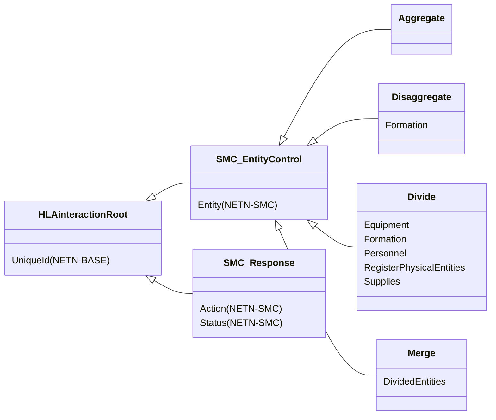
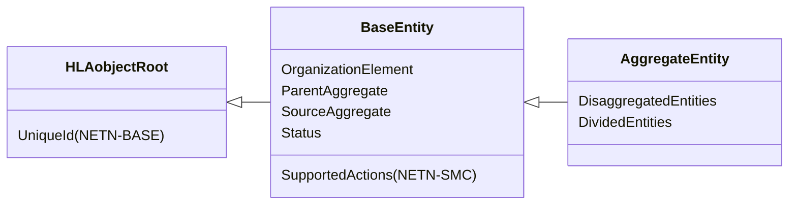
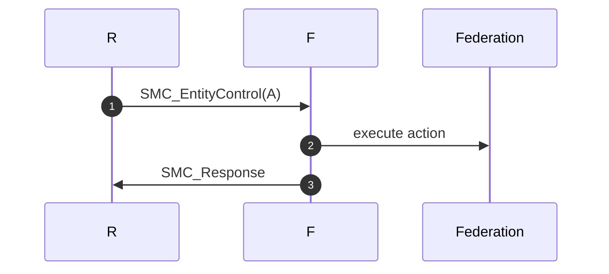
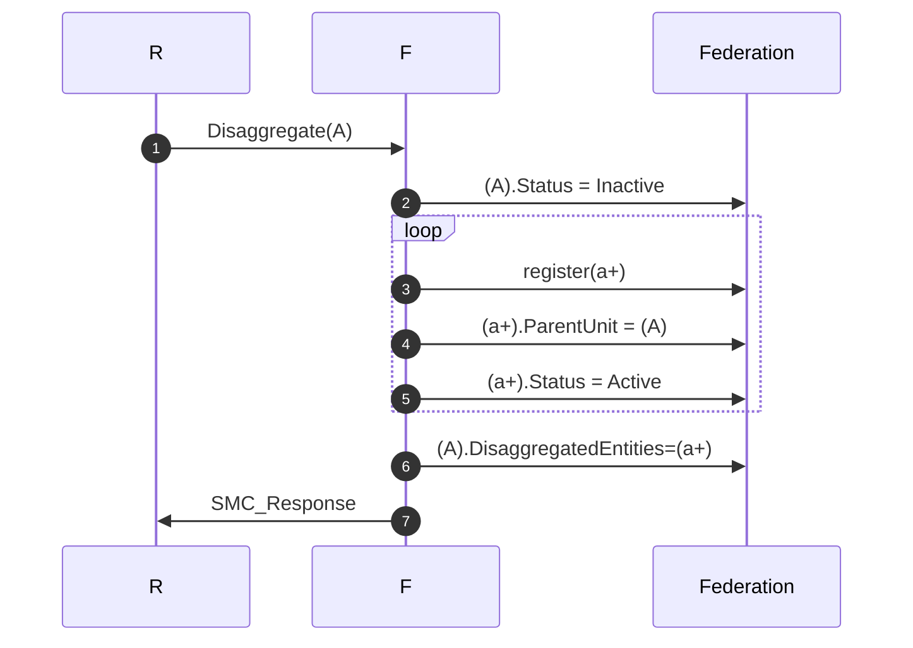
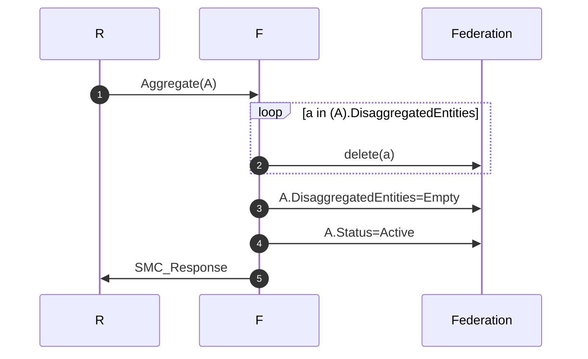
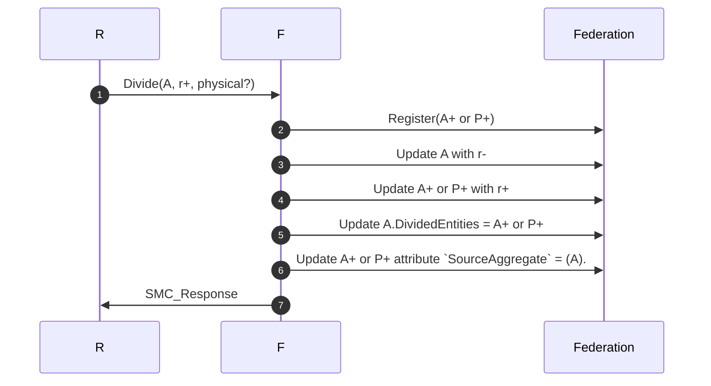
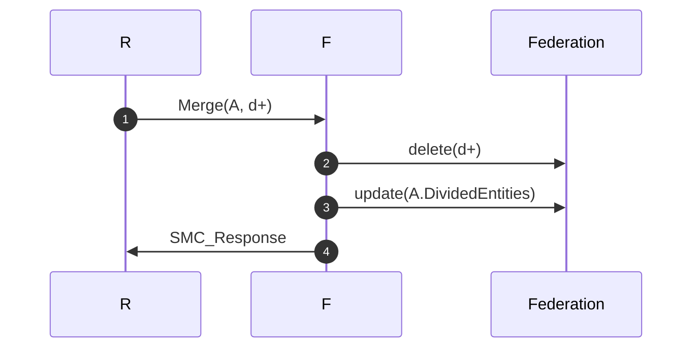

# NETN-MRM
|Version| Date| Dependencies|
|---|---|---|
|3.0|2024-03-10|NETN-BASE, NETN-SMC, NETN-ORG|

The NATO Education and Training Network Multi-Resolution Modelling (NETN-MRM) module supports federations with entities represented at multiple resolution levels.

Models of real-world objects, processes and phenomena are used to create a synthetic representation suitable for the simulation. Entities can be represented as individual objects or as part of an aggregated object. Entity representation can change during the simulation and switch between different levels of aggregation and individual physical entities.  

The NETN-MRM module specifies aggregation, disaggregation, division and merging of aggregate entities.

NETN-MRM covers the following cases: 
* Aggregation of subunits into a representation of their parent unit
* Disaggregation of a unit representation into subunits
* Division of unit into subunits or physical entities
* Merging of previously divided entities into a unit

## Overview 
 
NETN-MRM extends the RPR-FOM `BaseEntity` and `AggregateEntity` object classes and defines NETN-SMC entity control interactions to trigger aggregation, disaggregation, division, and merge actions for simulated aggregated entities. 
 

 
Implementing these MRM actions relies on knowledge of units' structure, organization, and equipment defined by NETN-ORG. 
 
A NETN-ORG `Unit` can be represented in the federation as:
* a single `AggregateEntity` object or
* a collection of multiple `AggregateEntity` or `PhysicalEntity` objects. 

 

 
The representation of units in the federation can change during runtime. Use the MRM control actions to request aggregation or disaggregation or to split the entity by dividing holdings among multiple aggregate and physical entity objects.
 
## General Pattern 
 
All NETN-MRM entity control actions use the same pattern based on the NETN-SMC entity control pattern where a federate (R) request and `SMC_EntityContol` action for an `AggregateEntity` (A). The federate (F) with primary modelling responsibility of (A) executes the action and responds using `SMC_Response` to (R).
 

 

Use the `BaseEntity` attribute `SupportedActions` to check the simulation entity's support before sending a NETN-MRM entity control action.

 
## Disaggregation 
 
A federate application (F) can perform disaggregation of an `AggregateEntity` (A) under the following conditions: 
 
* (F) has the primary modelling responsibility of (A).
* The `Status` attribute of (A) is `Active`.
* (A) is not divided, i.e. the `DividedEntities` attribute of (A) is empty.
* The  `OrganizationElement` attribute of (A) refers to an existing NETN-ORG `Unit` object (U).
* (U) has one or more subunits.

 

|Step|Description|
|---|---|
|1| Request federate (R) sends a `Disaggregate` action to (A). (F) has the primary modelling responsibility of (A) and processes the action.|
|2| (F) updates the `Status` attribute of (A) to `Inactive`.|
|3| If the `OrganizationElement` attribute of (A) references a NETN-ORG `Unit` (U), then instances of `AggregateEntity` (a+) are registered for each NETN-ORG `Unit` (u+) where the (u+) attribute `SuperiorUnit` refers to (U). |
|4|(F) updates the initial attribute values for (a+), including the `ParentUnit` attribute set to refer to (A). |
|5|(F) updates the `Status` attributes of (a+) to `Active`. |
|6|(F) updates the `DisaggregatedEntities` attribute of (A) to reference (a+)|
|7|(F) sends a `SMC_Response` to (R) with the `Status` parameter set to `Success`|

 
After performing disaggregation, the following is true: 
 
* (A).Status = Inactive
* (a+) exists for all subunits of (U). 
* (a+).`OrganizationElement` refers to the corresponding (u+)
* (a+).Status = Active
* (a+).`ParentAggregate` = (A)
* (A).`DisaggregsatedEntities` = (a+) 
 
If a (u+), i.e, subunit, has one or more associated NETN-ORG `Equipment` objects (e+), then these are represented in the federation as `PhysicalEntity` objects (p+). After disaggregation, the following is true:

* (p+).`OrganizationElement` refers to the corresponding (e+)
* (p+).`Status` = Active
* (p+).`ParentAggregate` = (A)

 
Disaggregation always constitutes a complete disaggregation of all subunits and associated equipment into active `AggregateEntity` or `PhysicalEntity` objects. The disaggregated `AggregateEntity` remains registered as `Inactive` in the federation. 
 
 
## Aggregation 
 
Aggregation of a simulated `AggregateEntity` always constitutes a complete aggregation of all entities referenced by the `DisaggregatedEnties` attribute. 
 
A federate application (F) can perform aggregation of an `AggregateEntity` (A) under the following conditions: 
 
* (F) has the primary modelling responsibility of (A).
* The Status attribute of (A) is `Inactive`.
* The `DisaggregatedEntities` attribute of (A) references all disaggregated entities (a+).
* (a+).`DisaggregatedEntities` is empty, i.e. none of the disaggregated entities is further disaggregated.
* (a+).`DividedEntities` is empty, i.e. none of the disaggregated entities is divided.

 
 

 

|Step|Description|
|---|---|
|1| Request federate (R) sends an `Aggregate` action to (A). (F) has the primary modelling responsibility of (A) and processes the action.|
|2| (F) deletes all (A).`DisaggregatedEntities` |
|3| (F) updates (A).`DisaggregatedEntities` = `Empty`. |
|4| (F) updates (A).`Status` = `Active`. |
|5| (F) sends a `SMC_Response` to (R) with the `Status` parameter set to `Success` |

## Division 
 
Division of an `AggregateEntity` temporarily allocates some specific resources to another `AggregateEntity` or into one or more `Platform` and `Lifeform` objects. 
 
A federate application (F) can perform the division of an `AggregateEntity` (A) under the following conditions: 

* (F) has the primary modelling responsibility of (A).
* The `Status` attribute of (A) is `Active`. 
* The `AggregateEntity` is not disaggregated, i.e. the (A).`DisaggregatedEntities` attribute must be empty. 

 
 

|Step|Description|
|---|---|
|1| Request federate (R) sends a `Divide` action to (A). (F) has the primary modelling responsibility of (A) and processes the action. The action includes a list of resources to divide (r+) and an indication if the result should be a new `AggregateEntity` (A+) holding the divided resources or individual `PhysicalEntity` objects representing equipment or personnel (P+).|
|2| (F) registers A+ or P+|
|3| (F) updates A with the reduced holdings (r-)|
|4| (F) updates A+ or P+ with the divided holdings (r+)|
|5| (F) updates A.`DividedEntities` to reference A+ or P+|
|6| (F) updates A+ or P+ attribute `SourceAggregate` to refer to (A).
|7| (F) sends a `SMC_Response` to (R) with the `Status` parameter set to `Success` |

After performing division, the following is true:

* (A+) or (P+) exists with `SourceAggregate` attribute referencing (A)
* (A).`DividedEntities` references (A+) or (P+)

 
## Merging 

A federate application (F) can perform merging of an `AggregateEntity` (A) with one of its divided entities under the following conditions:
 
* (F) has the primary modelling responsibility of (A).
* The `Status` attribute of (A) is `Active`. 
* The `AggregateEntity` has been divided, i.e. the (A).`DividedEntities` must contain at least one element. 
 
 

|Step|Description|
|---|---|
|1| Request federate (R) sends a `Merge` action indicating that the `AggregateEntity` (A) and the divided entities (d+) should merge. (F) has the primary modelling responsibility of (A) and processes the action. |
|2| (F) deletes all divided entities (d+) from the federation. |
|3| (F) updates (A).`DividedEntities` to exclude (d+) |
|4| (F) sends a `SMC_Response` to (R) with the `Status` parameter set to `Success` |

 
After merging, (A) represents all previously divided entities  (d+).

## Object Classes

### BaseEntity

A base class of aggregate and discrete scenario domain participants. The BaseEntity class is characterized by being located at a particular location in space and independently movable, if capable of movement at all. It specifically excludes elements normally considered to be a component of another element. The BaseEntity class is intended to be a container for common attributes for entities of this type. Since it lacks sufficient class specific attributes that are required for simulation purposes, federates cannot publish objects of this class. Certain simulation management federates, e.g. viewers, may subscribe to this class. Simulation federates will normally subscribe to one of the subclasses, to gain the extra information required to properly simulate the entity.

|Attribute|Datatype|Semantics|
|---|---|---|
|OrganizationElement|UUID|Optional: Reference to an existing NETN-ORG  organization element, e.g. a `Unit` or `Equipment` represented by this simulation entity. The default value is no related organization element, i.e. all zeros.|
|ParentAggregate|UUID|Optional. If this simulation entity results from a disaggregation, this attribute refers to the disaggregated `AggregateEntity`. The default value is no reference, i.e. all zeros.|
|SourceAggregate|UUID|Optional. Reference to an active `AggregateEnity` instance which is the source of a NETN-MRM division. The default value is all zeros representing no source AggregateEntity.|
|Status|ActiveStatusEnum8|Optional. Indicates if this entity is currently being simulated or not. During an inactive state, the attribute values may not reflect accurate or current values. All attributes are updated to represent the current status of the object instance before setting the state to Active. The default is `Active`.|
|SupportedActions (NETN-SMC)|EntityControlActions|Optional: Indicates what control actions are supported by an individual simulated entity.| 
|UniqueId (NETN-BASE)|UUID|Required. A unique identifier for the object. The Universally Unique Identifier (UUID) is generated or pre-defined.| 

### AggregateEntity

A group of one or more separate objects that operate together as part of an organization. These objects may be discrete, may be other aggregate objects, or may be a mixture of both.

|Attribute|Datatype|Semantics|
|---|---|---|
|DisaggregatedEntities|ArrayOfUuid|Optional. Reference to the disaggregated entities after disaggregation of this `AggregateEntity`. Each element should refer to an existing entity in the federation. The `Status` of this `AggregateEntity` shall be inactive if disaggregated entities exist.||
|DividedEntities|ArrayOfUuid|Optional. Reference to other aggregate or physical entities divided from the `AggregateEntity` to represent specific subsets of holdings.|
|OrganizationElement|UUID|Optional: Reference to an existing NETN-ORG  organization element, e.g. a `Unit` or `Equipment` represented by this simulation entity. The default value is no related organization element, i.e. all zeros.|
|ParentAggregate|UUID|Optional. If this simulation entity results from a disaggregation, this attribute refers to the disaggregated `AggregateEntity`. The default value is no reference, i.e. all zeros.|
|SourceAggregate|UUID|Optional. Reference to an active `AggregateEnity` instance which is the source of a NETN-MRM division. The default value is all zeros representing no source AggregateEntity.|
|Status|ActiveStatusEnum8|Optional. Indicates if this entity is currently being simulated or not. During an inactive state, the attribute values may not reflect accurate or current values. All attributes are updated to represent the current status of the object instance before setting the state to Active. The default is `Active`.|

## Interaction Classes

### Aggregate

Instructs a federate application modelling the `AggregateEntity` to perform aggregation of the `DisaggregatedEntities`.

### Disaggregate

Instructs a federate application to disaggregate the indicated `AggregateEntity`.

|Parameter|Datatype|Semantics|
|---|---|---|
|Formation|FormationStruct|The formation of the disaggregated units.|

### Divide

Instructs a federate application to divide the `AggregateEntity` into multiple simulated entities.

|Parameter|Datatype|Semantics|
|---|---|---|
|Equipment|ArrayOfResourceStatus|Optional. Amount of equipment of different type and health status to be divided.|
|Formation|FormationStruct|The formation of the divided units.|
|Personnel|ArrayOfResourceStatus|Optional. Amount of personnel of different type and health status to be divided.|
|RegisterPhysicalEntities|HLAboolean|Optional. If true, all Equipment of type Platform and Lifeform are published as individual objects in the federation.|
|Supplies|ArrayOfSupplyStatus|Optional. Amount of supplies to divide.|

### Merge

Instructs a federate application to merge an `AggregateEntity` with divided entities.

|Parameter|Datatype|Semantics|
|---|---|---|
|DividedEntities|ArrayOfUuid|Required. A subset of identifiers from the DividedEntities attribute of the referenced AggregateEntity. The set of identifiers indicates which divided entities to merge with the AggregateEntity.|

### SMC_Response

The response indicates whether the related action was accepted or rejected/failed by a federate. A single response per sent action is expected.

## Datatypes

Note that only datatypes defined in this FOM Module are listed below. Please refer to FOM Modules on which this module depends for other referenced datatypes.

### Overview
|Name|Semantics|
|---|---|
|EntityControlActionEnum|Enumeration of Entity Control Actions. The datatype is expected to be extended in specific modules defining additional actions.|
        
### Enumerated Datatypes
|Name|Representation|Semantics|
|---|---|---|
|EntityControlActionEnum|HLAinteger32BE|Enumeration of Entity Control Actions. The datatype is expected to be extended in specific modules defining additional actions.|
    