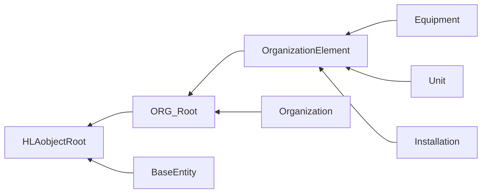

# NETN-ORG
|Version| Date| Dependencies|
|---|---|---|
|2.0|2023-10-28|NETN-BASE|

The NATO Education and Training Organization (NETN-ORG) module provides a standard way to represent organizations in the simulation scenario and their relationships and structure. The relationships include unit command structure, relationships between organizations, unit equipment, and installations.

Simulation of elements of an organization requires knowledge of the intra-organizational relationship, e.g. superior, subordinate, and iter-organizational relationships with other organizations, e.g. friendly or hostile. The NETN-ORG supports initialization and organizations' dynamic change of this information.

The specification is based on IEEE 1516 High Level Architecture (HLA) Object Model Template (OMT) and supports interoperability in a federated simulation (federation) based on HLA. In addition to the FOM Module, a file-based data storage and interchange format is defined based on SISO-STD-007-2008 Military Scenario Definition Language (MSDL). The NETN-ORG XML schema defines elements to capture units, equipment items, relationships, and initial modelling responsibilities.

Use the NETN-ORG information to: * initialize simulated entities * perform disaggregation, aggregation, divide and merge actions using NETN-MRM * change organizational relationships * capture simulated unit and equipment state as snapshots

## Overview 
 
Use the NETN-ORG FOM module to represent organizations and their internal structure, relationships, associated units, equipment, and installations. 
 
Dynamic organizational changes may include new and or rearranged unit structure or changes in the relationships with other organizations. 
 
In a simulation, not all units, equipment and installations have a corresponding simulation entity in the federation. Which elements to represent as simulated entities are determined by the current modelling responsibility described in NETN-TMR and dynamic changes in the level of aggregation described in NETN-MRM. 
 
The NETN-ORG organization elements are the basis for the initialization of simulated entities, e.g. `PhysicalEntitiy` or `AggregateEntity` objects. Therefore, updates of NETN-ORG objects should be considered a re-initialization of any associate simulation entity. E.g. updating the `Unit` attribute `Holdings` should be reflected in an `AggregateEntity` representing the unit.

## Object Classes

Note that inherited and dependency attributes are not included in the description of object classes.

### ORG_Root

The object class for all NETN-ORG object classes

|Attribute|Datatype|Semantics|
|---|---|---|
|Name|HLAunicodeString|Required. A unique name.|

### OrganizationElement

An object class for all NETN-ORG organizational elements

|Attribute|Datatype|Semantics|
|---|---|---|
|Organization|UUID|Required: A reference to the organization the element is affiliated with.|
|EntityType|EntityTypeStruct|Required. SISO-REF-010 code for entity type definitions. If unknown, use 0.0.0.0.0.0.0.|
|Symbol|SymbolStruct|Required. Initial symbol identifier and amplification data for this element. May contain wildcard characters * for undefined fields.|
|Location|GeodeticPoint|Optional. The geographic location of the element. Required if no `HostUnit` is provided. This represents the initial location in the scenario unless otherwise modelled in the simulation.|
|HostUnit|UUID|Optional. A reference to a unit or equipment controlling the movement or operating an installation. E.g. a unit embarked on a transport, or a helicopter on a ship. The default value is all zeros, indicating that the unit is not embarked in or mounted on any other unit or equipment. Not applicable to `Installation`.|

### Equipment

An equipment represents individual physical items defined specifically and apart from any holdings defined for the `HoldingUnit`. Equipment includes platforms, munition and sensors object.

|Attribute|Datatype|Semantics|
|---|---|---|
|HoldingUnit|UUID|Optional: A reference to the unit to which this equipment belongs. The default is that the equipment does not belong to a specific unit.|

### Unit

A unit represents an element at a specified level in the organization. An organizational unit can contain subunits and can belong to a superior unit. A unit consists of equipment, personnel and supplies; these holdings can belong directly to the unit or indirectly as a holding of a subunit.

|Attribute|Datatype|Semantics|
|---|---|---|
|AggregateUnit|UUID|Optional: A reference to another unit (aggregate) within the organization for which this unit is a subunit.  The default value is all zeros (no aggregate unit).|
|HigherHeadquarters|UUID|Optional. A reference to a unit representing the superior headquarters. The default value is all zeros (no higher headquarters).|
|Echelon|EchelonEnum32|Optional. Symbol modifier identifying the command level. Default NONE.|
|IsHq|HLAboolean|Optional. Indicate whether the unit has a command function, e.g. if it is an HQ or not. The default is FALSE, no HQ.|
|Holdings|ArrayOfHoldings|Optional. A set of holdings defined for this unit in addition to holdings defined for all subunits and any specific `Equipment` objects with this unit as `HoldingUnit . The default is an empty list.`|
|Formation|FormationStruct|Optional. Formation of this unit.|

### Installation

Installations are facilities, e.g. harbours, airfields, or engineering objects, e.g. minefields.

|Attribute|Datatype|Semantics|
|---|---|---|
|UnitInCommand|UUID|Optional: A reference to a unit in charge of this installation. The default is that no specific unit is in charge of the installation.|

### Organization

An organization have relationships with other organizations. Units belonging to different organizations have the same relationship as the organizations they belong to. However, the relationships between organizations can be asymmetrical, e.g. Side A can be hostile to B while B is neutral to A. Furthermore, the relation may change during a federation execution.

|Attribute|Datatype|Semantics|
|---|---|---|
|Hostility|ArrayOfRelations|Optional. The relations with other organizations. The federation agreements specify default relationship.|
|ForceIdentifier|ForceIdentifierEnum|Required: A force identifier indicate a special relationship with an organization in the scenario designated as the default perspective of the scenario. The force identifier applies to all simulated entities representing an organizational element belonging to the organization and is a required attribute for all `PhysicalEntity` and `AggregateEntity` objects in the federation.|
|CountryCode|Integer32|Optional: Numerical country code based on ISO 3166-1 numeric. The numeric codes 900 to 999 can be user-assigned in the federation agreement.|

### BaseEntity

A base class of aggregate and discrete scenario domain participants. The BaseEntity class is characterized by being located at a particular location in space and independently movable, if capable of movement at all. It specifically excludes elements normally considered to be a component of another element. The BaseEntity class is intended to be a container for common attributes for entities of this type. Since it lacks sufficient class specific attributes that are required for simulation purposes, federates cannot publish objects of this class. Certain simulation management federates, e.g. viewers, may subscribe to this class. Simulation federates will normally subscribe to one of the subclasses, to gain the extra information required to properly simulate the entity.

|Attribute|Datatype|Semantics|
|---|---|---|
|Organization|UUID|Optional: The organization in the scenario this entity belongs to.|

## Datatypes

Note that only datatypes defined in this FOM Module are listed below. Please refer to FOM Modules on which this module depends for other referenced datatypes.

### Overview
|Name|Semantics|
|---|---|
|AirFormationTypeEnum32|Air formation|
|ArrayOfHoldings|Sequence of holdings.|
|ArrayOfRelations|Sequence of relations.|
|ForceIdentifierEnum|RPR-FOM Force Identifier enumeration.|
|FormationDataStruct|Struct for enumerated choice for the type of formation being Ground, Air, Surface or Subsurface.|
|FormationLocationTypeEnum32|Enumerated choice for the method to correlate formation to location as the centre of mass or lead element.|
|FormationStruct|The formation of this unit.|
|FormationTypeEnum32|Enumerated choice for the type of formation being Ground, Air, Surface or Subsurface.|
|GroundFormationTypeEnum32|Specifies the formations for ground units.|
|Holding|Static and dynamic data about the holding. The `EntityType` determines if the holding is a platform, munition, lifeform, supplies etc.|
|Relation|The specific value that represents the perceived hostility status.|
|SubsurfaceFormationTypeEnum32|Subsurface formation|
|SurfaceFormationTypeEnum32|Surface formation|
        
### Enumerated Datatypes
|Name|Representation|Semantics|
|---|---|---|
|AirFormationTypeEnum32|HLAinteger32BE|Air formation|
|ForceIdentifierEnum|RPRunsignedInteger8BE|RPR-FOM Force Identifier enumeration.|
|FormationLocationTypeEnum32|HLAinteger32BE|Enumerated choice for the method to correlate formation to location as the centre of mass or lead element.|
|FormationTypeEnum32|HLAinteger32BE|Enumerated choice for the type of formation being Ground, Air, Surface or Subsurface.|
|GroundFormationTypeEnum32|HLAinteger32BE|Specifies the formations for ground units.|
|SubsurfaceFormationTypeEnum32|HLAinteger32BE|Subsurface formation|
|SurfaceFormationTypeEnum32|HLAinteger32BE|Surface formation|
        
### Array Datatypes
|Name|Element Datatype|Semantics|
|---|---|---|
|ArrayOfHoldings|Holding|Sequence of holdings.|
|ArrayOfRelations|Relation|Sequence of relations.|
        
### Fixed Record Datatypes
|Name|Fields|Semantics|
|---|---|---|
|FormationStruct|FormationLocationType, FormationSpacing, FormationOrientation, FormationData|The formation of this unit.|
|Holding|Name, RequiredOnHandQuantity, OnHandQuantity, OperationalCount, EntityType|Static and dynamic data about the holding. The `EntityType` determines if the holding is a platform, munition, lifeform, supplies etc.|
|Relation|Affiliate, Relationship|The specific value that represents the perceived hostility status.|
        
### Variant Record Datatypes
|Name|Discriminant (Datatype)|Alternatives|Semantics|
|---|---|---|---|
|FormationDataStruct|Domain (FormationTypeEnum32)|Ground, Air, Surface, Subsurface|Struct for enumerated choice for the type of formation being Ground, Air, Surface or Subsurface.|
    