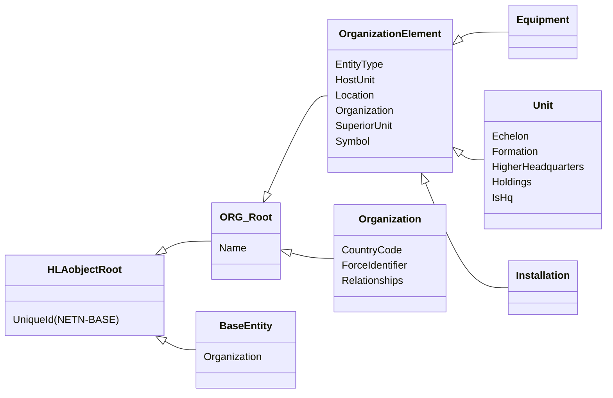
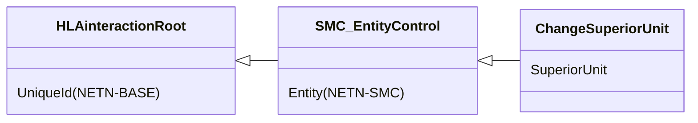
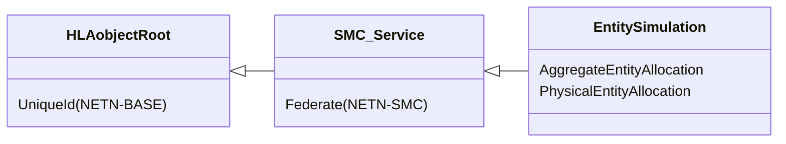
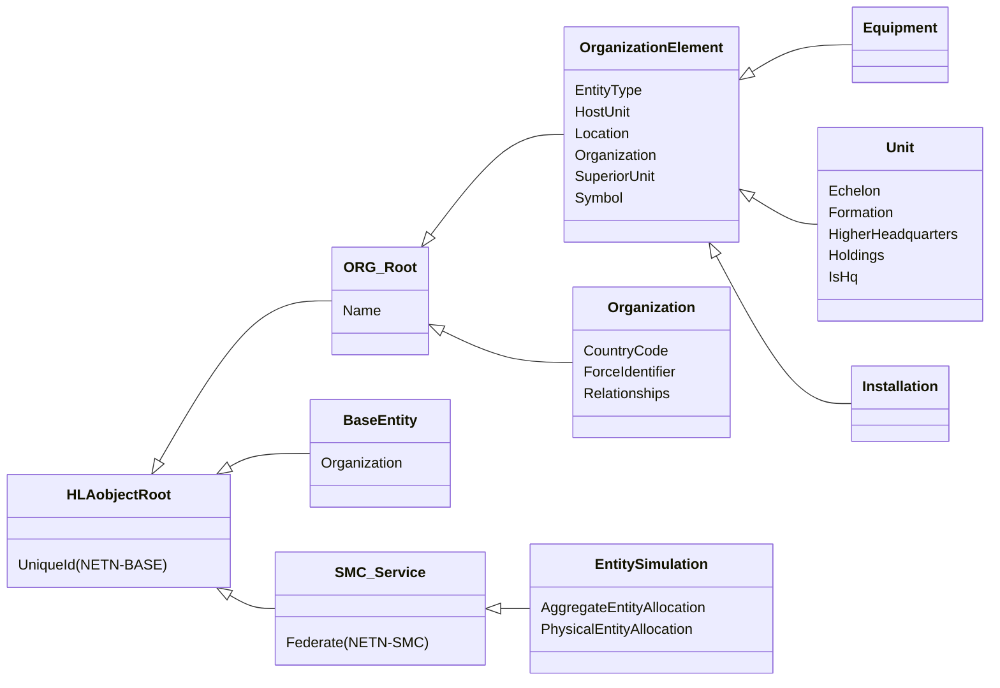

# NETN-ORG
|Version| Date| Dependencies|
|---|---|---|
|2.0|2024-03-07|NETN-BASE|

The NATO Education and Training Organization (NETN-ORG) module provides a standard way to represent organizations in the simulation scenario and their relationships and structure. The relationships include unit command structure, relationships between organizations, unit equipment, and installations.

Simulating organizational elements requires knowledge of intra-organizational relationships, e.g., superior, subordinate, and inter-organizational relationships with other organizations, e.g., friendly or hostile. The NETN-ORG supports initialization and organizations' dynamic change of this information.

Use the NETN-ORG information to: 
* initialize simulated entities 
* perform disaggregation, aggregation, divide and merge actions using NETN-MRM 
* change organizational relationships 
* capture simulated unit and equipment state as snapshots

## Overview 
 
Use the NETN-ORG FOM module to represent organizations and their internal structure, relationships, associated units, equipment, and installations. 
 
Dynamic organizational changes may include new or rearranged unit structures or changes in the relationships with other organizations. 
 
In a simulation, not all units, equipment and installations have a corresponding simulation entity in the federation. Which elements to represent as simulated entities are determined by the current modelling responsibility described in NETN-TMR and dynamic changes in the level of aggregation described in NETN-MRM. 
 
The NETN-ORG organization elements are the basis for initializing simulated entities, e.g., `PhysicalEntitiy` or `AggregateEntity` objects. Therefore, updates of NETN-ORG objects should be considered a re-initialization of any associated simulation entity. For example, updating the `Unit` attribute `Holdings` could be reflected in an `AggregateEntity`.
 
## Organization 
 
In NETN-ORG, an `Organization` is a representation used to: 
1. group elements of the organization 
2. define relationships between different organizations 
 
All `BaseEntity` objects are associated with a specific `Organization`.The required RPR-FOM attribute `ForceIdentifier` can be derived from the referenced organization and the corresponding `Organization` attribute `ForceIdentifier`. 
 
 
 

 
Each `Organization` is defined by a structure of `OrganizationElement` objects. Each `OrganizationElement` object is related to its `Organization` and its `SuperiorUnit`, if any. There are three (3) subtypes of `OrganizationElement`: 
 
1. `Unit` represents an element at a specified level in the organization. An organizational unit can contain subunits and can belong to a superior unit. A unit consists of equipment, personnel and supplies; these holdings can belong directly to the unit or indirectly as a holding of a subunit. 
2. `Equipment` represents individual physical items explicitly defined and apart from any holdings defined for the `HostUnit`. Equipment includes platforms, munition and sensor objects. 
3. `Installation` are facilities, e.g. harbours, airfields, or engineering objects, e.g. minefields.

To request a change of `SuperiorUnit`, use the NETN-SMC entity control action `ChangeSuperiorUnit`.

 
## Allocation to Federates 
 
The NETN-ORG can also be used to provide the initial allocation of responsibility to a federate for what `Equipment` is represented as a `PhysicalEntity` and what `Unit` is represented as an `AggregateEntity`. The NETN-SMC object class `SMC_Service` is subclassed with the `EntitySimulation` class that for each instance can publish the allocation of initial modelling responsibility. 
 

## Object Classes

### ORG_Root

The object class for all NETN-ORG object classes

|Attribute|Datatype|Semantics|
|---|---|---|
|Name|HLAunicodeString|Required. A unique name.|

### OrganizationElement

An object class for all NETN-ORG organizational elements

|Attribute|Datatype|Semantics|
|---|---|---|
|EntityType|EntityTypeStruct|Required. SISO-REF-010 code for entity type definitions. If unknown, use 0.0.0.0.0.0.0.|
|HostUnit|UUID|Optional. A reference to a unit or equipment controlling the movement or operating an installation. E.g. a unit embarked on a transport, or a helicopter on a ship. The default value is all zeros, indicating that the unit is not embarked in or mounted on any other unit or equipment. Not applicable to `Installation`.|
|Location|GeodeticPoint|Optional. The geographic location of the element. Required if no `HostUnit` is provided. This represents the initial location in the scenario unless otherwise modelled in the simulation.|
|Name|HLAunicodeString|Required. A unique name.|
|Organization|UUID|Required: A reference to the organization the element is affiliated with.|
|SuperiorUnit|UUID|Required: A reference to a unit within the organization for which this element is a subunit/equipment or controlled installation.  The default value is all zeros (no aggregate unit).|
|Symbol|SymbolStruct|Required. Initial symbol identifier and amplification data for this element. In NETN-ORG the symbol identifier acts as a template and may contain wildcard characters '*' to indicate undefined elements of the symbol code.|

### Equipment

An equipment represents individual physical items defined specifically and apart from any holdings defined for the `HostUnit`. Equipment includes platforms, munition and sensors object.

|Attribute|Datatype|Semantics|
|---|---|---|
|EntityType|EntityTypeStruct|Required. SISO-REF-010 code for entity type definitions. If unknown, use 0.0.0.0.0.0.0.|
|HostUnit|UUID|Optional. A reference to a unit or equipment controlling the movement or operating an installation. E.g. a unit embarked on a transport, or a helicopter on a ship. The default value is all zeros, indicating that the unit is not embarked in or mounted on any other unit or equipment. Not applicable to `Installation`.|
|Location|GeodeticPoint|Optional. The geographic location of the element. Required if no `HostUnit` is provided. This represents the initial location in the scenario unless otherwise modelled in the simulation.|
|Name|HLAunicodeString|Required. A unique name.|
|Organization|UUID|Required: A reference to the organization the element is affiliated with.|
|SuperiorUnit|UUID|Required: A reference to a unit within the organization for which this element is a subunit/equipment or controlled installation.  The default value is all zeros (no aggregate unit).|
|Symbol|SymbolStruct|Required. Initial symbol identifier and amplification data for this element. In NETN-ORG the symbol identifier acts as a template and may contain wildcard characters '*' to indicate undefined elements of the symbol code.|

### Unit

A unit represents an element at a specified level in the organization. An organizational unit can contain subunits and can belong to a superior unit. A unit consists of equipment, personnel and supplies; these holdings can belong directly to the unit or indirectly as a holding of a subunit.

|Attribute|Datatype|Semantics|
|---|---|---|
|Echelon|EchelonEnum32|Optional. Symbol modifier identifying the command level. Default NONE.|
|EntityType|EntityTypeStruct|Required. SISO-REF-010 code for entity type definitions. If unknown, use 0.0.0.0.0.0.0.|
|Formation|FormationStruct|Optional. Formation of this unit.|
|HigherHeadquarters|UUID|Optional. A reference to a unit representing the superior headquarters. The default value is all zeros (no higher headquarters).|
|Holdings|ArrayOfHoldings|Optional. A set of holdings defined for this unit in addition to holdings defined for all subunits and any specific `Equipment` objects with this unit as `HoldingUnit . The default is an empty list.`|
|HostUnit|UUID|Optional. A reference to a unit or equipment controlling the movement or operating an installation. E.g. a unit embarked on a transport, or a helicopter on a ship. The default value is all zeros, indicating that the unit is not embarked in or mounted on any other unit or equipment. Not applicable to `Installation`.|
|IsHq|HLAboolean|Optional. Indicate whether the unit has a command function, e.g. if it is an HQ or not. The default is FALSE, no HQ.|
|Location|GeodeticPoint|Optional. The geographic location of the element. Required if no `HostUnit` is provided. This represents the initial location in the scenario unless otherwise modelled in the simulation.|
|Name|HLAunicodeString|Required. A unique name.|
|Organization|UUID|Required: A reference to the organization the element is affiliated with.|
|SuperiorUnit|UUID|Required: A reference to a unit within the organization for which this element is a subunit/equipment or controlled installation.  The default value is all zeros (no aggregate unit).|
|Symbol|SymbolStruct|Required. Initial symbol identifier and amplification data for this element. In NETN-ORG the symbol identifier acts as a template and may contain wildcard characters '*' to indicate undefined elements of the symbol code.|

### Installation

Installations are facilities, e.g. harbours, airfields, or engineering objects, e.g. minefields.

|Attribute|Datatype|Semantics|
|---|---|---|
|EntityType|EntityTypeStruct|Required. SISO-REF-010 code for entity type definitions. If unknown, use 0.0.0.0.0.0.0.|
|HostUnit|UUID|Optional. A reference to a unit or equipment controlling the movement or operating an installation. E.g. a unit embarked on a transport, or a helicopter on a ship. The default value is all zeros, indicating that the unit is not embarked in or mounted on any other unit or equipment. Not applicable to `Installation`.|
|Location|GeodeticPoint|Optional. The geographic location of the element. Required if no `HostUnit` is provided. This represents the initial location in the scenario unless otherwise modelled in the simulation.|
|Name|HLAunicodeString|Required. A unique name.|
|Organization|UUID|Required: A reference to the organization the element is affiliated with.|
|SuperiorUnit|UUID|Required: A reference to a unit within the organization for which this element is a subunit/equipment or controlled installation.  The default value is all zeros (no aggregate unit).|
|Symbol|SymbolStruct|Required. Initial symbol identifier and amplification data for this element. In NETN-ORG the symbol identifier acts as a template and may contain wildcard characters '*' to indicate undefined elements of the symbol code.|

### Organization

An organization have relationships with other organizations. Units belonging to different organizations have the same relationship as the organizations they belong to. However, the relationships between organizations can be asymmetrical, e.g. Side A can be hostile to B while B is neutral to A. Furthermore, the relation may change during a federation execution.

|Attribute|Datatype|Semantics|
|---|---|---|
|CountryCode|Integer32|Optional: Numerical country code based on ISO 3166-1 numeric. The numeric codes 900 to 999 can be user-assigned in the federation agreement.|
|ForceIdentifier|ForceIdentifierEnum|Required: A force identifier indicate a special relationship with an organization in the scenario designated as the default perspective of the scenario. The force identifier applies to all simulated entities representing an organizational element belonging to the organization and is a required attribute for all `PhysicalEntity` and `AggregateEntity` objects in the federation.|
|Name|HLAunicodeString|Required. A unique name.|
|Relationships|ArrayOfRelationship|Optional. The relations with other organizations. The federation agreements specify default relationship.|

### BaseEntity

A base class of aggregate and discrete scenario domain participants. The BaseEntity class is characterized by being located at a particular location in space and independently movable, if capable of movement at all. It specifically excludes elements normally considered to be a component of another element. The BaseEntity class is intended to be a container for common attributes for entities of this type. Since it lacks sufficient class specific attributes that are required for simulation purposes, federates cannot publish objects of this class. Certain simulation management federates, e.g. viewers, may subscribe to this class. Simulation federates will normally subscribe to one of the subclasses, to gain the extra information required to properly simulate the entity.

|Attribute|Datatype|Semantics|
|---|---|---|
|Organization|UUID|Optional: The organization in the scenario this entity belongs to.|
|UniqueId (NETN-BASE)|UUID|Required. A unique identifier for the object. The Universally Unique Identifier (UUID) is generated or pre-defined.| 

### EntitySimulation

A service providing modelling responsibility for aggregate and/or physical entities.

|Attribute|Datatype|Semantics|
|---|---|---|
|AggregateEntityAllocation|ArrayOfUuid|Optional. The organization Unit elements for which the federate has the responsibility of modelling corresponding Aggregate Entities.  The default is an empty list.|
|PhysicalEntityAllocation|ArrayOfUuid|Optional. The the organization Equipment or Installation elements for which the federate has the responsibility of simulating a Physical Entity.  The default is an empty list.|

## Interaction Classes

### ChangeSuperiorUnit

Request a change in the organizational structure. The federate with the primary responsibility of the referenced entity (OrganizationElement) should if possible update the `SuperiorUnit` relationship.

|Parameter|Datatype|Semantics|
|---|---|---|
|SuperiorUnit|UUID|Required: Reference to a Unit for which the referenced entity (OrganizationElement) is requested to relate to as a subunit/equipment.|

## Datatypes

Note that only datatypes defined in this FOM Module are listed below. Please refer to FOM Modules on which this module depends for other referenced datatypes.

### Overview
|Name|Semantics|
|---|---|
|AirFormationTypeEnum32|Air formation|
|ArrayOfHoldings|Sequence of holdings.|
|ArrayOfRelationship|Sequence of relations.|
|EntityControlActionEnum|Enumeration of Entity Control Actions. The datatype is expected to be extended in specific modules defining additional actions.|
|ForceIdentifierEnum|RPR-FOM Force Identifier enumeration.|
|FormationDataStruct|Struct for enumerated choice for the type of formation being Ground, Air, Surface or Subsurface.|
|FormationLocationTypeEnum32|Enumerated choice for the method to correlate formation to location as the centre of mass or lead element.|
|FormationStruct|The formation of this unit.|
|FormationTypeEnum32|Enumerated choice for the type of formation being Ground, Air, Surface or Subsurface.|
|GroundFormationTypeEnum32|Specifies the formations for ground units.|
|Holding|Static and dynamic data about the holding. The `EntityType` determines if the holding is a platform, munition, lifeform, supplies etc.|
|Relation|The specific value that represents the perceived hostility status.|
|SubsurfaceFormationTypeEnum32|Subsurface formation|
|SurfaceFormationTypeEnum32|Surface formation|
        
### Enumerated Datatypes
|Name|Representation|Semantics|
|---|---|---|
|AirFormationTypeEnum32|HLAinteger32BE|Air formation|
|EntityControlActionEnum|HLAinteger32BE|Enumeration of Entity Control Actions. The datatype is expected to be extended in specific modules defining additional actions.|
|ForceIdentifierEnum|RPRunsignedInteger8BE|RPR-FOM Force Identifier enumeration.|
|FormationLocationTypeEnum32|HLAinteger32BE|Enumerated choice for the method to correlate formation to location as the centre of mass or lead element.|
|FormationTypeEnum32|HLAinteger32BE|Enumerated choice for the type of formation being Ground, Air, Surface or Subsurface.|
|GroundFormationTypeEnum32|HLAinteger32BE|Specifies the formations for ground units.|
|SubsurfaceFormationTypeEnum32|HLAinteger32BE|Subsurface formation|
|SurfaceFormationTypeEnum32|HLAinteger32BE|Surface formation|
        
### Array Datatypes
|Name|Element Datatype|Semantics|
|---|---|---|
|ArrayOfHoldings|Holding|Sequence of holdings.|
|ArrayOfRelationship|Relation|Sequence of relations.|
        
### Fixed Record Datatypes
|Name|Fields|Semantics|
|---|---|---|
|FormationStruct|FormationLocationType, FormationSpacing, FormationOrientation, FormationData|The formation of this unit.|
|Holding|Name, RequiredOnHandQuantity, OnHandQuantity, OperationalCount, EntityType|Static and dynamic data about the holding. The `EntityType` determines if the holding is a platform, munition, lifeform, supplies etc.|
|Relation|RelatedOrganization, Relationship|The specific value that represents the perceived hostility status.|
        
### Variant Record Datatypes
|Name|Discriminant (Datatype)|Alternatives|Semantics|
|---|---|---|---|
|FormationDataStruct|Domain (FormationTypeEnum32)|Ground, Air, Surface, Subsurface|Struct for enumerated choice for the type of formation being Ground, Air, Surface or Subsurface.|
    