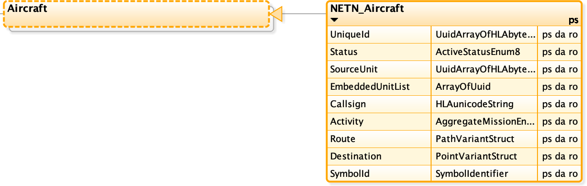
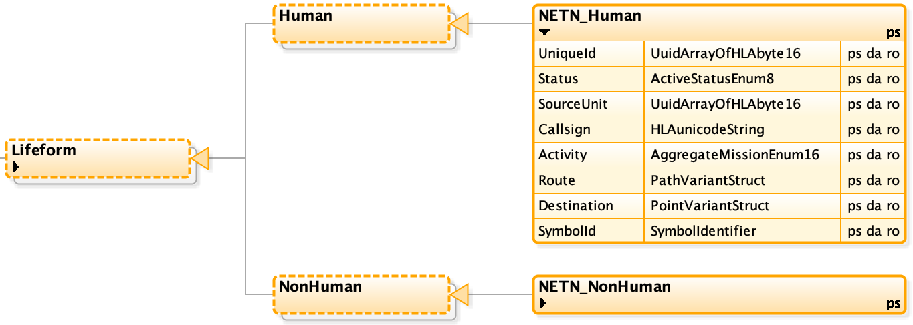
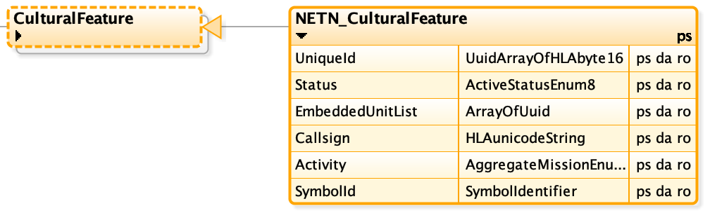
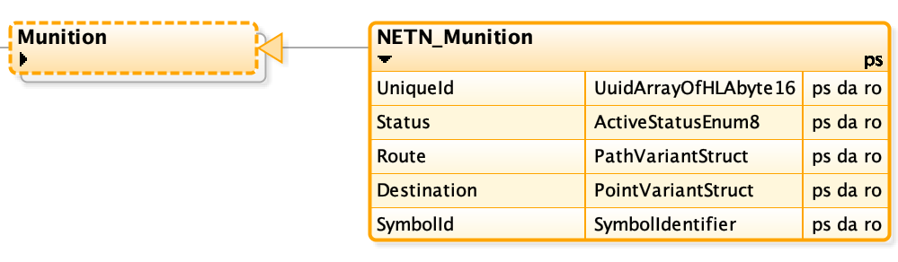

The NATO Education and Training Network (NETN) Physical FOM Module.

Copyright (C) 2020 NATO/OTAN.
This work is licensed under a [Creative Commons Attribution-NoDerivatives 4.0 International License](LICENCE.md).

## Introduction

The NETN FAFD representation of physical entities such as platforms extends the [SISO-STD-001-2015 standard RPR-FOM v2.0](https://www.sisostds.org/). The NETN FOM Module extends the RPR-FOM object classes representing physical entities with sub classes which include additional attributes, e.g. unique identification of simulated entities.

For compatibility reasons, NETN federates, that implement NETN extensions of RPR-FOM Physical Entities, are also required to support RPR-FOM v2.0.

### Purpose

The NETN-Physical FOM Module provides a standard interface for the representation of Physical Entities in a federated distributed simulation. The module extends the existing RPR-FOM v2.0 standard with subclasses and additional attributes to allow additional information to be associated with simulated physical entities.

### Scope

All RPR-FOM Physical Entity object classes have been extended with additional attributes to support NETN based federation. It includes a unique identifier that provides better support for initialization, NETN-TMR and other advanced design patterns requiring unique pre-defined identifiers for simulated entities. NETN federations still allow pure RPR-FOM based federates in the federation but with limited ability to interoperate in some NETN design aspects. 

Figure: Platform, Lifeform, Munition and CulturalFeature extensions to RPR-FOM

## Unique Entity Identification

### Entity Identification in the RTI
In HLA, the RTI uses a handle of the data type ObjectInstanceHandle to identify instances in RTIambassador and FederateAmbassador services. Every object instance in a federation execution receives a unique handle when it is registered. The object instance has a unique name, either specified by the registering federate or generated by the RTI. The instance handle does not persist between different federation executions or if an object is removed and then re-registered. 

The instance name is unique in a federation execution but, if generated by the RTI, not guaranteed to remain the same in subsequent federation executions. Object instances with auto-generated handles and names get new values if their owning federate leaves and later re-joins a federation execution.

### Entity Identification in the RPR FOM

The RPR-FOM use the attribute `BaseEntity.EntityIdentifier` for unique entity identification. Some RPR-FOM interactions also use the object instance name. 

The attributes `PhysicalEntity.Marking` is used by some applications to identify instances in a federation execution by name. However, these attributes are limited in length and not guaranteed to be unique — the attribute `PhysicalEntity.Marking` has a limit of 11 characters and the attribute `AggregateEntity.AggregateMarking` is limited to 31 characters.

When a federate resigns and re-enters a federation execution, the value of the attribute `BaseEntity.EntityIdentifier` may change. If the federate responsible for modelling the entity changes, then entities do not get the same unique identifier. Specifying pre-defined values for the attribute `EntityIdentifier` in a scenario file is possible, but not recommended.

### Entity Identification in the NETN FOM

The identification property, as defined in MSDL (Military Scenario Definition Language), is used in the NETN FOM to identify simulated entities uniquely. It uses the definition of UUID from ISO/IEC 11578:1996 (and ISO/IEC 9834-8:2005). The UUID consists of an array with 16 bytes and has a standardized printable format that consists of 32 ASCII characters (0-9, a-f) and four hyphens on predetermined places, e.g. 550e8400-e29b-41d4-a716-446655440000.

It is possible to provide the value of the attribute `UniqueId` for entity identification in an MSDL file defining an ORBAT where each element gets a unique UUID.

UUIDs specified in a federation scenario file, e.g. MSDL, shall be used regardless of which federate has the current modelling responsibility. If a federate resigns and re-joins a federation, the entities get the same unique identities that they previously had. Using the same unique identifier allows for traceability in- and between federation executions. Entities specified in a scenario file can remain unregistered in the federation and still be referenced by UUID in other attributes or interactions. Entities not pre-defined in scenario files can be assigned a generated UUID.

## Platforms Entities

NETN-Physical extends all RPR-FOM Platform object classes with subclasses and the same set of additional attributes.

Figure: NETN Extensions to RPR-FOM Platform object classes

|Attribute|Description|
|---|---|
|UniqueId|**Required.** A unique identifier for the object. The Universally Unique Identifier (UUID) is either generated or defined as part of scenario initialization, e.g. using NETN-ORG MSDL data for defining specific platforms as equipment assigned to units.|
|Status|**Required.** Indicate if this aggregate unit currently is being simulated or not. E.g. units mounted or embarked on transports can be set to inactive. During an inactive state, the attribute values may not reflect an accurate, current value. Therefore, any subscribing federate can ignore inactive units. All attributes must be updated to represent the current status of the instance before setting the state to Active.|
|SourceUnit|**Optional.** Reference to an active NETN_Aggregate instance, the source of a NETN-MRM division. If not published, merging is not supported. The default value is 0000000000000000 representing no source unit.|
|EmbeddedUnitList|**Optional.** Reference to platforms or lifeforms embarked on this platform. If not published, transport of embedded units is not supported. Entities are referenced by UUID. E.g. when soldiers are transported in a NETN Physical entity, then references (UUIDs) to these soldier instances are added to the EmbeddedUnitList for the entity. When a soldier disembarks from the transporter, the reference (UUID) to that soldier is removed from the EmbeddedUnitList. The default value is an empty list.|
|Callsign|**Required.** A callsign used to address the unit. Callsigns should be unique in the context in which they are used but not required to be globally unique.|
|Activity|**Optional.** The current activity of the platform. The activity may differ from the mission due to casualties, readiness, and other reasons. The default value is 0 (Other activity).|
|Route|**Optional.** The current path of movement.|
|Destination|**Optional.** The current destination of movement.|
|SymbolId|**Optional.** A symbol identifier represented as a string.|

## Lifeform Entities

NETN_Physical extends all RPR-FOM Lifeform object classes with subclasses and the same set of additional attributes.

Figure: NETN Extensions to RPR-FOM Lifeform object classes

|Attribute|Description|
|---|---|
|UniqueId|**Required.** A unique identifier for the object. The Universally Unique Identifier (UUID) is either generated or defined as part of scenario initialization, e.g. using NETN-ORG MSDL data for defining specific platforms as equipment assigned to units.|
|Status|**Required.** Indicate if this aggregate unit currently is being simulated or not. E.g. units mounted or embarked on transports can be set to inactive. During an inactive state, the attribute values may not reflect an accurate, current value. Therefore, any subscribing federate can ignore inactive units. All attributes must be updated to represent the current status of the instance before setting the state to Active.|
|SourceUnit|**Optional.** Reference to an active NETN_Aggregate instance, the source of a NETN-MRM division. If not published, merging is not supported. The default value is 00000000-0000-0000-0000-000000000000 (UUID with all zeros) representing no source unit.|
|Callsign|**Required.** A callsign used to address the unit. Callsigns should be unique in the context in which they are used but not required to be globally unique.|
|Activity|**Optional.** The current activity of the platform. The activity may differ from the mission due to casualties, readiness, and other reasons. The default value is 0 (Other activity).|
|Route|**Optional.** The current path of movement.|
|Destination|**Optional.** The current destination of movement.|
|SymbolId|**Optional.** A symbol identifier represented as a string.|

## Cultural Features

NETN-Physical extends the RPR-FOM `CulturalFeature` object classes with a subclass and a set of additional attributes.

Figure: NETN Extension to RPR-FOM CulturalFeature object class

|Attribute|Description|
|---|---|
|UniqueId|**Required.** A unique identifier for the object. The Universally Unique Identifier (UUID) is either generated or defined as part of scenario initialization, e.g. using NETN-ORG MSDL data for defining specific platforms as equipment assigned to units.|
|Status|**Required.** Indicate if this aggregate unit currently is being simulated or not. E.g. units mounted or embarked on transports can be set to inactive. During an inactive state, the attribute values may not reflect an accurate, current value. Therefore, any subscribing federate can ignore inactive units. All attributes must be updated to represent the current status of the instance before setting the state to Active.|
|EmbeddedUnitList|**Optional.** Reference to units, platforms or lifeforms embedded in this CulturalFeature. The default value is an empty list.|
|Callsign|**Required.** A callsign used to address the unit. Callsigns should be unique in the context in which they are used but not required to be globally unique.|
|Activity|**Optional.** The current activity of the platform. The activity may differ from the mission due to casualties, readiness, and other reasons. The default value is 0 (Other activity).|
|SymbolId|**Optional.** A symbol identifier represented as a string.|

## Munition Entities

NETN-Physical extends the RPR-FOM `Munition` object class with a subclass and a set of additional attributes.

Figure: NETN Extension to RPR-FOM Munition object class

|Attribute|Description|
|---|---|
|UniqueId|**Required.** A unique identifier for the object. The Universally Unique Identifier (UUID) is either generated or defined as part of scenario initialization, e.g. using NETN-ORG MSDL data for defining specific platforms as equipment assigned to units.|
|Status|**Required.** Indicate if this aggregate unit currently is being simulated or not. E.g. units mounted or embarked on transports can be set to inactive. During an inactive state, the attribute values may not reflect an accurate, current value. Therefore, any subscribing federate can ignore inactive units. All attributes must be updated to represent the current status of the instance before setting the state to Active.|
|Route|**Optional.** The current path of movement.|
|Destination|**Optional.** The current destination of movement.|
|SymbolId|**Optional.** A symbol identifier represented as a string.|

