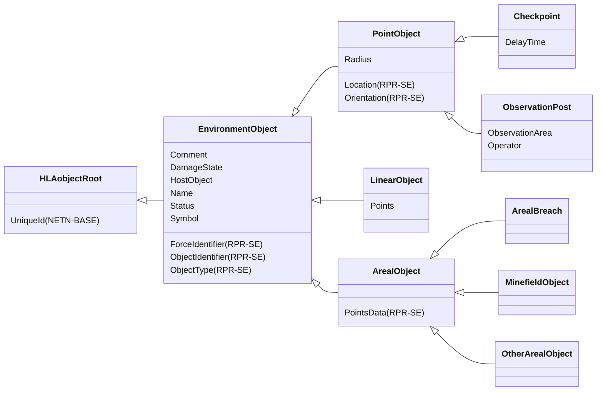
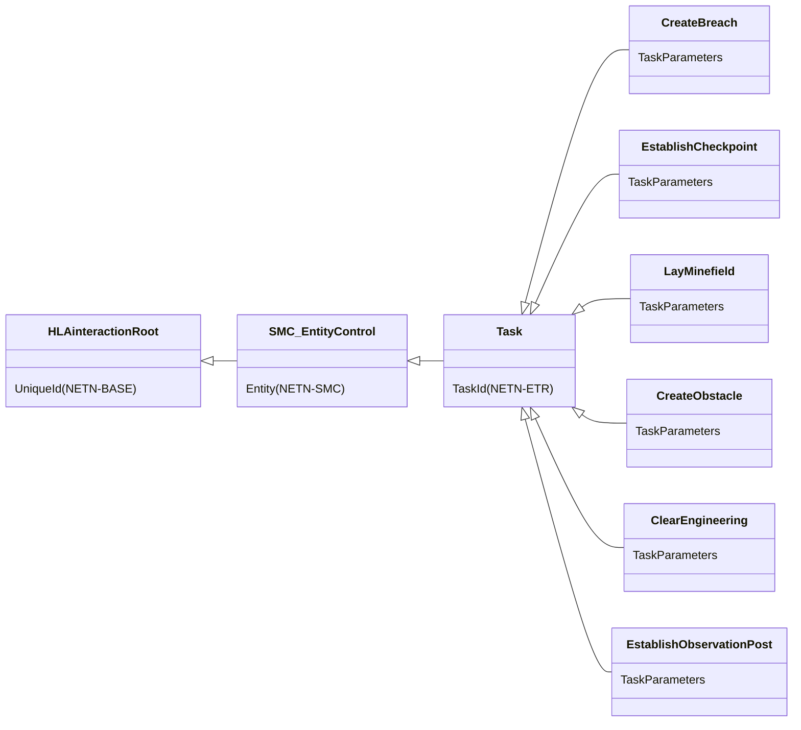

# NETN-SE
|Version| Date| Dependencies|
|---|---|---|
|2.0|2024-03-10|RPR-SE, NETN-ETR, NETN-BASE|

The NATO Education and Training Network Synthetic Environment module (NETN-SE) provides a standard way to exchange simulation data for objects in the synthetic environment other than simulated entities such as `Platform` or `AggregateEntity` objects.

## Overview 
 
The NETN-SE module extends the RPR-SE module by defining: 
* Checkpoints 
* Observation posts 
* Minefields 
* Generic Obstacles (OtherArealObject) 
* Areal Breaches 
 
The NETN-SE module also provides extended NETN-ETR tasks related to engineering activities. 
 

## Object Classes

### EnvironmentObject

A base class of environment point, linear, or areal object classes.

|Attribute|Datatype|Semantics|
|---|---|---|
|Comment|HLAunicodeString|Optional. A descriptive text comment.|
|DamageState|DamageStatusEnhancedEnum32|Optional. The damage state of an EnvironmentObject. The default value is 0 (NoDamage).|
|HostObject|UUID|Optional. Reference to the host object. Required when using Breach/Burst objects.|
|Name|HLAunicodeString|Optional. A name of the EnvironmentObject.|
|Status|ActiveStatusEnum8|Optional. Specifies if the EnvironmentObject is considered active in the simulation. An inactive object should not affect other simulation models. The default value is 1 (Active).|
|Symbol|SymbolStruct|Optional. A symbol identifier.|
|ForceIdentifier (RPR-SE)|ForceIdentifierEnum8|Identifies the force that created or modified this EnvironmentObject instance| 
|ObjectIdentifier (RPR-SE)|EntityIdentifierStruct|Identifies this EnvironmentObject instance (point, linear or areal)| 
|ObjectType (RPR-SE)|EnvironmentObjectTypeStruct|Identifies the type of this EnvironmentObject instance| 
|UniqueId (NETN-BASE)|UUID|Required. A unique identifier for the object. The Universally Unique Identifier (UUID) is generated or pre-defined.| 

### PointObject

A synthetic environment object that is geometrically anchored to the terrain with a single point.

|Attribute|Datatype|Semantics|
|---|---|---|
|Comment|HLAunicodeString|Optional. A descriptive text comment.|
|DamageState|DamageStatusEnhancedEnum32|Optional. The damage state of an EnvironmentObject. The default value is 0 (NoDamage).|
|HostObject|UUID|Optional. Reference to the host object. Required when using Breach/Burst objects.|
|Name|HLAunicodeString|Optional. A name of the EnvironmentObject.|
|Radius|MeterFloat64|Optional. The radius of the point object.|
|Status|ActiveStatusEnum8|Optional. Specifies if the EnvironmentObject is considered active in the simulation. An inactive object should not affect other simulation models. The default value is 1 (Active).|
|Symbol|SymbolStruct|Optional. A symbol identifier.|
|ForceIdentifier (RPR-SE)|ForceIdentifierEnum8|Identifies the force that created or modified this EnvironmentObject instance| 
|Location (RPR-SE)|WorldLocationStruct|Specifies the location of the object based on x, y and z coordinates| 
|ObjectIdentifier (RPR-SE)|EntityIdentifierStruct|Identifies this EnvironmentObject instance (point, linear or areal)| 
|ObjectType (RPR-SE)|EnvironmentObjectTypeStruct|Identifies the type of this EnvironmentObject instance| 
|Orientation (RPR-SE)|OrientationStruct|Specifies the angles of rotation around the coordinate axis between the object's attitude and the reference coordinate system axes ; these are calculated as the Tait-Bryan Euler angles, specifying the successive rotations needed to transform from the world coordinate system to the object coordinate system| 
|UniqueId (NETN-BASE)|UUID|Required. A unique identifier for the object. The Universally Unique Identifier (UUID) is generated or pre-defined.| 

### Checkpoint

A CheckPoint defines a location where simulated entities' ground movement should stop and wait a specified time before continuing their route.

|Attribute|Datatype|Semantics|
|---|---|---|
|Comment|HLAunicodeString|Optional. A descriptive text comment.|
|DamageState|DamageStatusEnhancedEnum32|Optional. The damage state of an EnvironmentObject. The default value is 0 (NoDamage).|
|DelayTime|TimeMillisecondInt64|Required. The time that an entity shall wait at the checkpoint before passing. The time is a nominal value; models can use this for modifying delay time for different types of entities, e.g. add or subtract a value or multiply with a factor dependent on the simulation entity type.|
|HostObject|UUID|Optional. Reference to the host object. Required when using Breach/Burst objects.|
|Name|HLAunicodeString|Optional. A name of the EnvironmentObject.|
|Radius|MeterFloat64|Optional. The radius of the point object.|
|Status|ActiveStatusEnum8|Optional. Specifies if the EnvironmentObject is considered active in the simulation. An inactive object should not affect other simulation models. The default value is 1 (Active).|
|Symbol|SymbolStruct|Optional. A symbol identifier.|

### ObservationPost

A ObservationPost defines a location where a simulated entity can observe an area.

|Attribute|Datatype|Semantics|
|---|---|---|
|Comment|HLAunicodeString|Optional. A descriptive text comment.|
|DamageState|DamageStatusEnhancedEnum32|Optional. The damage state of an EnvironmentObject. The default value is 0 (NoDamage).|
|HostObject|UUID|Optional. Reference to the host object. Required when using Breach/Burst objects.|
|Name|HLAunicodeString|Optional. A name of the EnvironmentObject.|
|ObservationArea|WorldLocationStructLengthlessArray|Optional. The area to be observed.|
|Operator|UUID|Required. Reference to the unit operating this observation post.|
|Radius|MeterFloat64|Optional. The radius of the point object.|
|Status|ActiveStatusEnum8|Optional. Specifies if the EnvironmentObject is considered active in the simulation. An inactive object should not affect other simulation models. The default value is 1 (Active).|
|Symbol|SymbolStruct|Optional. A symbol identifier.|

### LinearObject

A synthetic environment object that has size and an orientation and is geometrically anchored to the terrain with one point.

|Attribute|Datatype|Semantics|
|---|---|---|
|Comment|HLAunicodeString|Optional. A descriptive text comment.|
|DamageState|DamageStatusEnhancedEnum32|Optional. The damage state of an EnvironmentObject. The default value is 0 (NoDamage).|
|HostObject|UUID|Optional. Reference to the host object. Required when using Breach/Burst objects.|
|Name|HLAunicodeString|Optional. A name of the EnvironmentObject.|
|Points|LocationStructArray|Required. A path with at least 2 locations.|
|Status|ActiveStatusEnum8|Optional. Specifies if the EnvironmentObject is considered active in the simulation. An inactive object should not affect other simulation models. The default value is 1 (Active).|
|Symbol|SymbolStruct|Optional. A symbol identifier.|

### ArealBreach

A cleared area within an obstacle allows simulated entities to move through the obstacle.

|Attribute|Datatype|Semantics|
|---|---|---|
|Comment|HLAunicodeString|Optional. A descriptive text comment.|
|DamageState|DamageStatusEnhancedEnum32|Optional. The damage state of an EnvironmentObject. The default value is 0 (NoDamage).|
|HostObject|UUID|Optional. Reference to the host object. Required when using Breach/Burst objects.|
|Name|HLAunicodeString|Optional. A name of the EnvironmentObject.|
|Status|ActiveStatusEnum8|Optional. Specifies if the EnvironmentObject is considered active in the simulation. An inactive object should not affect other simulation models. The default value is 1 (Active).|
|Symbol|SymbolStruct|Optional. A symbol identifier.|

### MinefieldObject

A mine, mine weapon, mine row, mine strip, mine lane, mine marker or minefield, defined as an areal environment object.

|Attribute|Datatype|Semantics|
|---|---|---|
|Comment|HLAunicodeString|Optional. A descriptive text comment.|
|DamageState|DamageStatusEnhancedEnum32|Optional. The damage state of an EnvironmentObject. The default value is 0 (NoDamage).|
|HostObject|UUID|Optional. Reference to the host object. Required when using Breach/Burst objects.|
|Name|HLAunicodeString|Optional. A name of the EnvironmentObject.|
|Status|ActiveStatusEnum8|Optional. Specifies if the EnvironmentObject is considered active in the simulation. An inactive object should not affect other simulation models. The default value is 1 (Active).|
|Symbol|SymbolStruct|Optional. A symbol identifier.|

### OtherArealObject

Areal objects other than Minefield objects.

|Attribute|Datatype|Semantics|
|---|---|---|
|Comment|HLAunicodeString|Optional. A descriptive text comment.|
|DamageState|DamageStatusEnhancedEnum32|Optional. The damage state of an EnvironmentObject. The default value is 0 (NoDamage).|
|HostObject|UUID|Optional. Reference to the host object. Required when using Breach/Burst objects.|
|Name|HLAunicodeString|Optional. A name of the EnvironmentObject.|
|Status|ActiveStatusEnum8|Optional. Specifies if the EnvironmentObject is considered active in the simulation. An inactive object should not affect other simulation models. The default value is 1 (Active).|
|Symbol|SymbolStruct|Optional. A symbol identifier.|

## Interaction Classes

### CreateBreach

Requests a simulated entity to create a breach or passage on a breachable engineering object.

|Parameter|Datatype|Semantics|
|---|---|---|
|TaskParameters|CreateBreachTaskStruct|Required: Task parameters.|
|Entity (NETN-SMC)|UUID|Required: Reference to a simulation entity for which the control action is intended. Required for all ETR related interactions.| 
|TaskId (NETN-ETR)|UUID|Required. Unique identifier for the task.| 
|UniqueId (NETN-BASE)|UUID|Optional: A unique identifier for the interaction. Required for all ETR related interactions.| 

### EstablishCheckpoint

Requests a simulated entity to establish a checkpoint.

|Parameter|Datatype|Semantics|
|---|---|---|
|TaskParameters|EstablishCheckpointTaskStruct|Required: Task parameters.|
|Entity (NETN-SMC)|UUID|Required: Reference to a simulation entity for which the control action is intended. Required for all ETR related interactions.| 
|TaskId (NETN-ETR)|UUID|Required. Unique identifier for the task.| 
|UniqueId (NETN-BASE)|UUID|Optional: A unique identifier for the interaction. Required for all ETR related interactions.| 

### LayMinefield

Requests a simulated entity to lay a minefield within a specified area and amount of mines.

|Parameter|Datatype|Semantics|
|---|---|---|
|TaskParameters|LayMinefieldTaskStruct|Required: Task parameters.|
|Entity (NETN-SMC)|UUID|Required: Reference to a simulation entity for which the control action is intended. Required for all ETR related interactions.| 
|TaskId (NETN-ETR)|UUID|Required. Unique identifier for the task.| 
|UniqueId (NETN-BASE)|UUID|Optional: A unique identifier for the interaction. Required for all ETR related interactions.| 

### CreateObstacle

Requests a simulated entity to create an obstacle within the given area. The tasked entity should be within a certain distance (tolerance specified in the federation agreement) of one of the points of the geometry.

|Parameter|Datatype|Semantics|
|---|---|---|
|TaskParameters|CreateObstacleTaskStruct|Required: Task parameters.|
|Entity (NETN-SMC)|UUID|Required: Reference to a simulation entity for which the control action is intended. Required for all ETR related interactions.| 
|TaskId (NETN-ETR)|UUID|Required. Unique identifier for the task.| 
|UniqueId (NETN-BASE)|UUID|Optional: A unique identifier for the interaction. Required for all ETR related interactions.| 

### ClearEngineering

Requests a simulated entity to clear/remove an engineering object. The clearing activity's duration may depend on the entity's model.

|Parameter|Datatype|Semantics|
|---|---|---|
|TaskParameters|ClearEngineeringTaskStruct|Required: Task parameters.|
|Entity (NETN-SMC)|UUID|Required: Reference to a simulation entity for which the control action is intended. Required for all ETR related interactions.| 
|TaskId (NETN-ETR)|UUID|Required. Unique identifier for the task.| 
|UniqueId (NETN-BASE)|UUID|Optional: A unique identifier for the interaction. Required for all ETR related interactions.| 

### EstablishObservationPost

Requests a simulated entity to establish a observation post.

|Parameter|Datatype|Semantics|
|---|---|---|
|TaskParameters|EstablishObservationPostTaskStruct|Required. Task parameters.|

## Datatypes

Note that only datatypes defined in this FOM Module are listed below. Please refer to FOM Modules on which this module depends for other referenced datatypes.

### Overview
|Name|Semantics|
|---|---|
|ClearEngineeringTaskStruct|Task parameters.|
|CreateBreachTaskStruct|Task parameters.|
|CreateObstacleTaskStruct|Task parameters.|
|EngineeringTaskStruct|Task parameters.|
|EntityControlActionEnum|Enumeration of Entity Control Actions. The datatype is expected to be extended in specific modules defining additional actions.|
|EstablishCheckpointTaskStruct|Task parameters.|
|EstablishObservationPostTaskStruct|Task parameters.|
|LayMinefieldTaskStruct|Task parameters.|
|TaskDefinitionVariantRecord|Variant record for task definition data.|
|TaskProgressVariantRecord|Variant record for task progress data.|
        
### Enumerated Datatypes
|Name|Representation|Semantics|
|---|---|---|
|EntityControlActionEnum|HLAinteger32BE|Enumeration of Entity Control Actions. The datatype is expected to be extended in specific modules defining additional actions.|
        
### Fixed Record Datatypes
|Name|Fields|Semantics|
|---|---|---|
|ClearEngineeringTaskStruct|EngineeringObjectId, Duration|Task parameters.|
|CreateBreachTaskStruct|EngineeringTask, EngineeringObject, Area|Task parameters.|
|CreateObstacleTaskStruct|EngineeringTask, Area|Task parameters.|
|EngineeringTaskStruct|EngineeringObjectId, Name, Duration|Task parameters.|
|EstablishCheckpointTaskStruct|EngineeringTask, Location, Radius, DelayTime|Task parameters.|
|EstablishObservationPostTaskStruct|EngineeringTask, Location|Task parameters.|
|LayMinefieldTaskStruct|EngineeringTask, MineType, MineCount, Area|Task parameters.|
        
### Variant Record Datatypes
|Name|Discriminant (Datatype)|Alternatives|Semantics|
|---|---|---|---|
|TaskDefinitionVariantRecord|TaskType (EntityControlActionEnum)|ClearEngineering, LayMinefield, CreateBreach, EstablishCheckpoint, CreateObstacle, EstablishObservationPost|Variant record for task definition data.|
|TaskProgressVariantRecord|TaskType (EntityControlActionEnum)|ElapsedEngineeringTime|Variant record for task progress data.|
    