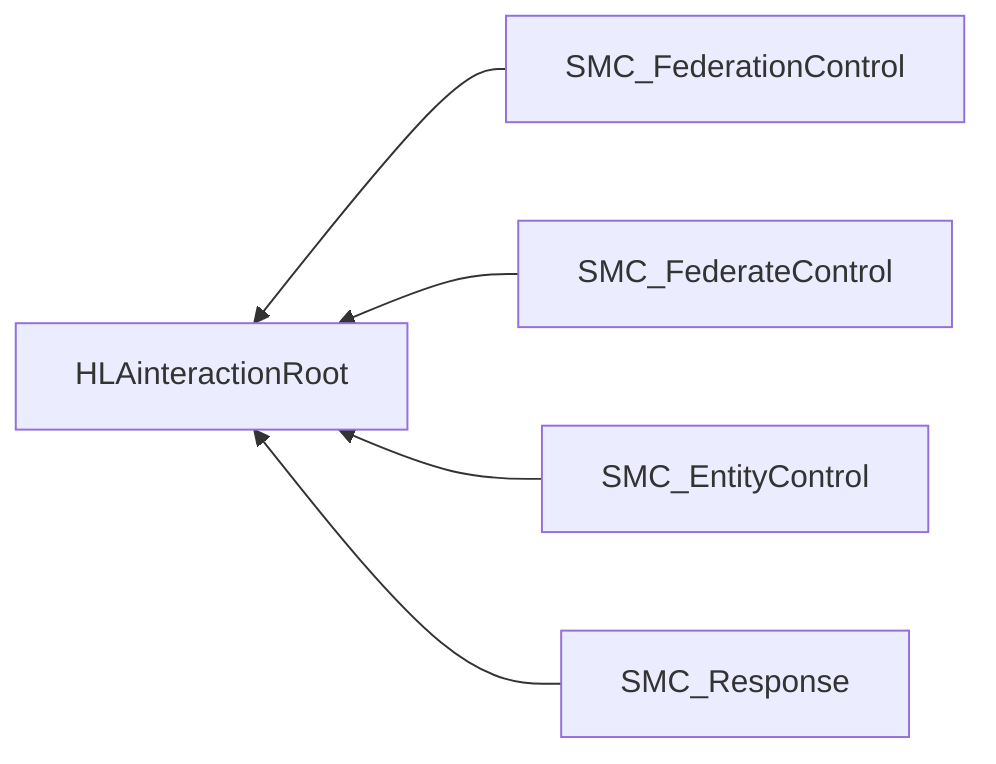

# NETN-SMC
|Version| Date| Dependencies|
|---|---|---|
|1.0|2023-11-18|NETN-BASE|

The NATO Education and Training Service Management and Control (NETN-SMC) module provides a standard way to send control actions to a federated simulation. The control actions are interactions targeting the federation, an individual federate or an individual simulated entity.

In a federated distributed simulation, the participating systems (federates) provide services to model the synthetic environment. The services use information published in the federation as input and provides data updates and interactions as output. Use control actions to change or trigger service behaviour.

The NETN-SMC FOM module provide base classes for object and interactions to control and describe services in the federation. The provided control action classes are neither publishable nor subscribable but provide the basis for subclassing in other FOM modules.

## Overview
This module provides base classes for sending control actions affecting the federation. Direct the control action by using three different methods.

* Use the `SMC_FederationControl` for control actions intended for all federates.
* Use `SMC_FederateControl` for control actions intended for a known federate
* Use `SMC_EntityControl` for control actions intended for a federate with the modelling responsibility for the entity.

In the case of `SMC_FederateControl` and `SMC_EntityControl`, the receiving federate shall respond to the action using a `SMC_Response` interaction to indicate success or failure to accept or achieve the action.

Federates supporting NETN-SMC control interactions shall publish one or more `SMC_Service` objects in the federation. The `SMC_Service` object class and any subclass defined in other modules define the services provided by the federate. In addition, the `SMC_Service` object class defines a set of supported `FederateControlActions`. The `FederateControlActionEnum` datatype enumerates available types of federate control actions and allows for extension in other modules.

The `BaseEntity` object class is extended with a list of supported `EntityControlActions`. The `EntityControlActionEnum` datatype enumerates available types of entity control actions and allows for extension in other modules.

Before sending an `SMC_FederateControl`, use the `SMC_Service` object attribute `SupportedActions` to determine if the referenced federate supports the action.

Before sending an `SMC_EntityControl`, use the `NETN-SMC BaseEntity` object attribute `SupportedActions` to determine if the referenced entity supports the action.

The standard Request-Response pattern involves a TaskingFederate sending a `SMC_EntityControl` or `SMC_FederateControl` interaction.
The referenced federate or the federate responsible for modelling the entity replies using the `SMC_Response` interaction, indicating whether the requested tasking is accepted and successful.
 
```mermaid 
sequenceDiagram 
autonumber
TaskingFederate->>EntityFederate:SMC_EntityControl(entity) 
EntityFederate->>TaskingFederate:SMC_Response(true/false) 
```` 


            


## Object Classes

Note that inherited and dependency attributes are not included in the description of object classes.

```mermaid
graph RL
SMC_Service-->HLAobjectRoot
BaseEntity-->HLAobjectRoot
```

### SMC_Service

Represents a service provided by the referenced federate with additional information regarding supported control actions.

|Attribute|Datatype|Semantics|
|---|---|---|
|Federate|FederateName|Required: The federate providing the service.|
|SupportedActions|FederateControlActions|Required: Indicates which SMC control actions are supported by the referenced federate.|

### BaseEntity

A base class of aggregate and discrete scenario domain participants. The BaseEntity class is characterized by being located at a particular location in space and independently movable, if capable of movement at all. It specifically excludes elements normally considered to be a component of another element. The BaseEntity class is intended to be a container for common attributes for entities of this type. Since it lacks sufficient class specific attributes that are required for simulation purposes, federates cannot publish objects of this class. Certain simulation management federates, e.g. viewers, may subscribe to this class. Simulation federates will normally subscribe to one of the subclasses, to gain the extra information required to properly simulate the entity.

|Attribute|Datatype|Semantics|
|---|---|---|
|SupportedActions|EntityControlActions|Optional: Indicates what control actions are supported by an individual simulated entity.|

## Interaction Classes

Note that inherited and dependency parameters are not included in the description of interaction classes.



### SMC_FederationControl

Base class for all control actions applicable to all federates in the federation. The inherited NETN-BASE `UniqueId` parameter is used to match this interaction with a corresponding `SMC_Response`.


### SMC_FederateControl

Base class for all control actions directed to a specific federate. The inherited NETN-BASE `UniqueId` parameter is used to match this interaction with a corresponding `SMC_Response`. Before sending this interaction, use the `SMC_Service` object attribute `SupportedActions` to determine if the referenced federate supports the action.

|Parameter|Datatype|Semantics|
|---|---|---|
|Federate|FederateName|Required: The federate intended as the receiver of this control action.|

### SMC_EntityControl

Control action intended for a federate with primary modelling responsibility for the referenced entity. The inherited NETN-BASE `UniqueId` parameter is used to match this interaction with a corresponding `SMC_Response`. Before sending this interaction, use the NETN-SMC `BaseEntity` object attribute `SupportedActions` to determine if the referenced entity supports the action.

|Parameter|Datatype|Semantics|
|---|---|---|
|Entity|UUID|Reference to a simulation entity for which the control action is intended.|

### SMC_Response

The response provides an indication if the related action was accepted or rejected/failed by a federate. A single response per sent action is expected.

|Parameter|Datatype|Semantics|
|---|---|---|
|Action|UUID|Required: Reference to the control action this is a response to. The reference corresponds to the NETN-BASE `UniqueId` parameter of the control action interaction.|
|Status|HLAboolean|Required: Indicates success or failure of a corresponding control action.|

## Datatypes

Note that only datatypes defined in this FOM Module are listed below. Please refer to FOM Modules on which this module depends for other referenced datatypes.

### Overview
|Name|Semantics|
|---|---|
|EntityControlActionEnum|Control actions for entities.|
|EntityControlActions|A set of control actions relevant to individual entities in the simulation.|
|FederateControlActionEnum|SMC Control action enumeration.|
|FederateControlActions|A set of control actions for the federate implementing the service.|
        
### Enumerated Datatypes
|Name|Representation|Semantics|
|---|---|---|
|EntityControlActionEnum|HLAinteger32BE|Control actions for entities.|
|FederateControlActionEnum|HLAinteger32BE|SMC Control action enumeration.|
        
### Array Datatypes
|Name|Element Datatype|Semantics|
|---|---|---|
|EntityControlActions|EntityControlActionEnum|A set of control actions relevant to individual entities in the simulation.|
|FederateControlActions|FederateControlActionEnum|A set of control actions for the federate implementing the service.|
    